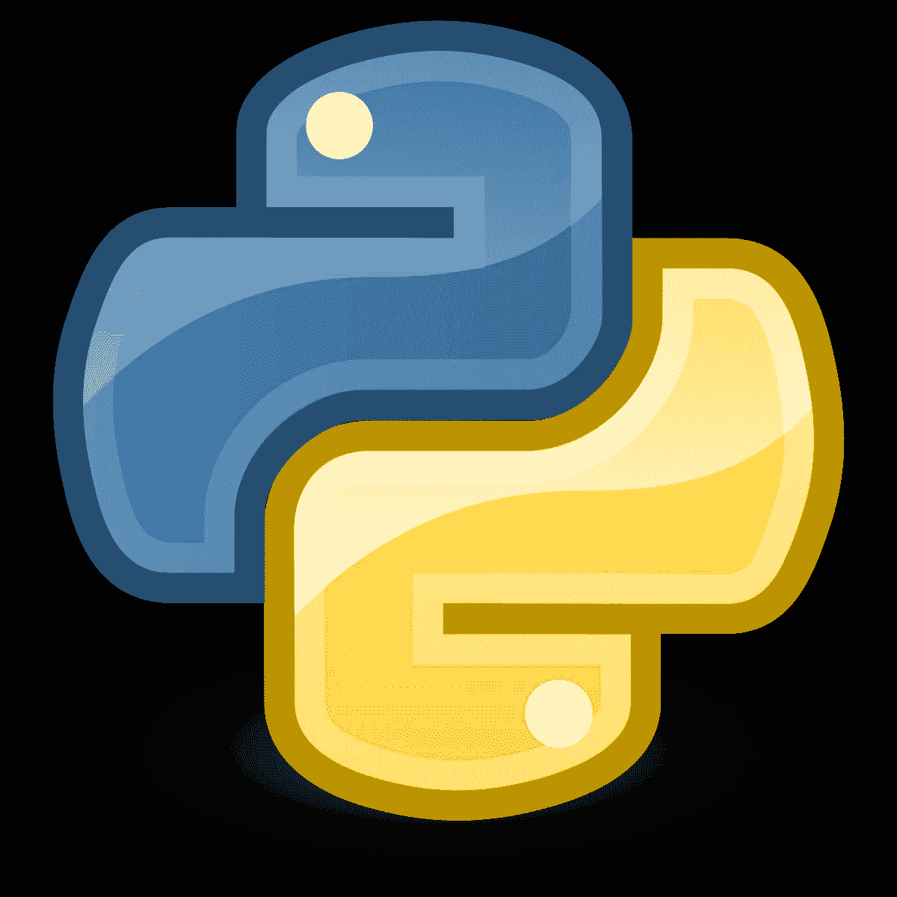

# Python 3.9 有什么新特性？

> 原文：<https://medium.com/analytics-vidhya/what-is-new-in-python-3-9-1a3e23d74f25?source=collection_archive---------8----------------------->

## 在这里，我们将看到 Python 3.9 的一些有趣的特性



> Python 是一种解释型的高级通用编程语言。由吉多·范·罗苏姆创建并于 1991 年首次发布，Python 的设计理念强调代码可读性，并显著使用了重要的空白。
> 
> 最近，Python 发布了最新版本 Python 3.9，其中包含了一些最令人期待的变化，这些变化肯定会支持所有用户。

# PEP 584 —向字典中添加联合运算符

这个 PEP 建议在内置的 dict 类中增加 merge (|)和 update (|=)操作符。

在这个 PEP 被接受后，决定也为[和其他几个标准库映射](https://bugs.python.org/issue36144)实现新的操作符。

当前合并两个字典的方法有几个缺点:

## [字典更新](https://www.python.org/dev/peps/pep-0584/#id13)

d1.update(d2)就地修改 d1。e = D1 . copy()；e.update(d2)不是表达式，需要一个临时变量。

## [{**d1，**d2}](https://www.python.org/dev/peps/pep-0584/#id14)

Dict 拆包看起来很丑，不容易被发现。很少有人在第一次看到它的时候能够猜出它的意思，或者认为它是合并两个字典的“显而易见的方法”。

{**d1，**d2}忽略映射的类型，总是返回一个 dict。type(d1)({**d1，**d2})对于具有不兼容 __init__ 方法的 dict 子类(如 defaultdict)失败。

# PEP 585 —标准集合中的类型提示泛型

由 PEPs 484、526、544、560 和 563 定义的静态类型是在现有 Python 运行时之上增量构建的，并且受现有语法和运行时行为的约束。这导致了由于泛型(例如类型化)而在类型化模块中存在重复的集合层次结构。列表和内置列表)。

这个 PEP 建议在类型模块中当前可用的所有标准集合中启用对泛型语法的支持。

这一改变消除了类型模块中并行类型层次结构的必要性，使用户更容易注释他们的程序，也使教师更容易教授 Python。

泛型(名词)-可以参数化的类型，通常是容器。也称为*参数型*或*类属型*。比如:dict。

参数化类属模型(parameterized generic )-提供了容器元素的预期类型的类属模型的特定实例。也称为*参数化类型*。比如:dict[str，int]。

包括类型检查器和 linters 在内的工具必须适应将标准集合识别为泛型。

在源代码层面，新描述的功能需要 Python 3.9。对于仅限于类型注释的用例，具有“注释”未来导入的 Python 文件(从 Python 3.7 开始可用)可以参数化标准集合，包括内置。重申一下，这取决于外部工具是否理解这是有效的。

# 从 Python 3.7 开始，当使用 from __future__ import 注释时，函数和变量注释可以直接参数化标准集合。示例:

```
from __future__ import annotationsdef find(haystack: dict[str, list[int]]) -> int:
    ...
```

在 [PEP 585](https://www.python.org/dev/peps/pep-0585) 之前，这种语法的用处是有限的，因为像 Mypy 这样的外部工具不能将标准集合识别为泛型。此外，类型化的某些特性(如类型别名或类型转换)需要将类型放在注释之外的运行时上下文中。虽然这些相对来说不如类型注释常见，但允许在所有上下文中使用相同的类型语法是很重要的。

# PEP 614——放松对装饰者的语法限制

> Python 目前要求所有的 decorators 都由一个带点的名称组成，后面可以有一个单独的调用。这个 PEP 建议去除这些限制，允许 decorators 是任何有效的表达式。当装饰者第一次被引入时， [Guido 描述了](https://mail.python.org/archives/list/python-dev@python.org/message/P3JD24UFFPZUUDANOAI6GZAPIGY4CVK7)限制他们语法的动机是一种偏好，而不是一种技术需求。

虽然这些限制在实践中很少遇到， [BPO 问题](https://bugs.python.org/issue19660)和[邮件列表帖子](https://mail.python.org/archives/list/python-ideas@python.org/thread/UQOCJH3KOPBP7P3AVNS3OYBGZPR3V2WO/#CAOXYF4GV76AFJNCYSYMQTBM7CIPPH5M)这些年来不断出现，要求删除它们。[最近的一个](https://mail.python.org/archives/list/python-ideas@python.org/thread/WOWD4P323DYDIGUQVWMESDWUG6QOW4MP)(这是[促成了这个提议](https://mail.python.org/archives/list/python-ideas@python.org/message/FKE7ZFGUDCU5WVOE2QTD5XGMCNCOMETV))包含了一个使用 PyQt5 库的很好的代码示例，如果现有的限制被放宽，它将变得更可读、更习惯和更易维护。略有修改:

```
buttons = [QPushButton(f'Button {i}') for i in range(10)]# Do stuff with the list of buttons...@buttons[0].clicked.connect
def spam():
    ...@buttons[1].clicked.connect
def eggs():
    ...# Do stuff with the list of buttons...
```

目前，这些装饰必须重写为类似于:

```
button_0 = buttons[0]@button_0.clicked.connect
def spam():
    ...button_1 = buttons[1]@button_1.clicked.connect
def eggs():
    ...
```

此外，当前的语法已经足够宽松，将更复杂的修饰表达式拼凑在一起是微不足道的。因此，当前的限制非但没有像预期的那样禁止任意复杂的表达式，反而让它们变得更加丑陋和低效:

```
# Identity function hack:def _(x):
    return x@_(buttons[0].clicked.connect)
def spam():
    ...# eval hack:@eval("buttons[1].clicked.connect")
def eggs():
    ...
```

# PEP 616 —删除前缀和后缀的字符串方法

这是一个向 Python 的各种 string 对象的 API 添加两个新方法 removeprefix()和 removesuffix()的提议。这些方法将(分别)从字符串中删除前缀或后缀(如果存在的话)，并将被添加到 Unicode str 对象、二进制 bytes 和 bytearray 对象以及 collections.UserString 中。

# [基本原理](https://www.python.org/dev/peps/pep-0616/#id16)

关于 Python-Ideas[【2】](https://www.python.org/dev/peps/pep-0616/#pyid)[【3】](https://www.python.org/dev/peps/pep-0616/#id10)、Python-Dev[【4】](https://www.python.org/dev/peps/pep-0616/#id11)[【5】](https://www.python.org/dev/peps/pep-0616/#id12)[【6】](https://www.python.org/dev/peps/pep-0616/#id13)[【7】](https://www.python.org/dev/peps/pep-0616/#id14)、Bug 追踪器以及 stack overflow[【8】](https://www.python.org/dev/peps/pep-0616/#confusion)已经出现了多次问题，与用户对现有 str.lstrip 和 str.rstrip 方法的困惑有关。这些用户通常期望 removeprefix 和 removesuffix 的行为，但是他们惊讶地发现 lstrip 的参数被解释为一组字符，而不是子字符串。这个反复出现的问题证明了这些方法是有用的。新方法允许用户更清晰地重定向到所需的行为。

作为这些方法有用性的另一个证明，Python-Ideas[【2】](https://www.python.org/dev/peps/pep-0616/#pyid)上的几个用户经常报告在他们的代码中包含类似的功能以提高生产率。该实现经常包含关于空字符串处理的细微错误，因此一个经过良好测试的内置方法将会很有用。

创建所需行为的现有解决方案是要么实现下面的[规范](https://www.python.org/dev/peps/pep-0616/#specification)中的方法，要么使用表达式 re.sub('^' + re.escape(前缀)，“”，s)中的正则表达式，后者不易被发现，需要模块导入，导致代码可读性较差。

# [规格](https://www.python.org/dev/peps/pep-0616/#id17)

内置的 str 类将获得两个新方法，当 type(self)是 type(prefix)是 type(suffix)是 str 时，这两个方法的行为如下:

```
def removeprefix(self: str, prefix: str, /) -> str:
    if self.startswith(prefix):
        return self[len(prefix):]
    else:
        return self[:]def removesuffix(self: str, suffix: str, /) -> str:
    # suffix='' should not call self[:-0].
    if suffix and self.endswith(suffix):
        return self[:-len(suffix)]
    else:
        return self[:]
```

当参数是 str 子类的实例时，方法应该表现得好像这些参数首先被强制为基本 str 对象，并且返回值应该总是基本 str。

具有相应语义的方法将被添加到 builtin bytes 和 bytearray 对象中。如果 b 是 bytes 或 bytearray 对象，那么 b.removeprefix()和 b.removesuffix()将接受任何类似 bytes 的对象作为参数。这两个方法也将被添加到集合中。UserString，具有类似的行为。

# [来自 Python 标准库的激励示例](https://www.python.org/dev/peps/pep-0616/#id18)

下面的示例演示了建议的方法如何使代码具有以下一项或多项特性:

1.  不太脆弱:
2.  代码不依赖于用户来计算文字的长度。
3.  更高性能:
4.  该代码既不需要调用 Python 内置的 len 函数，也不需要调用更昂贵的 str.replace()方法。
5.  更具描述性:
6.  与传统的字符串切片方法相反，这些方法为代码可读性提供了更高级别的 API。

# [find_recursionlimit.py](https://www.python.org/dev/peps/pep-0616/#id19)

*   当前:

```
if test_func_name.startswith("test_"):
    print(test_func_name[5:])
else:
    print(test_func_name)
```

*   改进:

```
print(test_func_name.removeprefix("test_"))
```

# [deccheck.py](https://www.python.org/dev/peps/pep-0616/#id20)

这是一个有趣的案例，因为作者选择在只打算删除前缀的情况下使用 str.replace 方法。

*   当前:

```
if funcname.startswith("context."):
    self.funcname = funcname.replace("context.", "")
    self.contextfunc = True
else:
    self.funcname = funcname
    self.contextfunc = False
```

*   改进:

```
if funcname.startswith("context."):
    self.funcname = funcname.removeprefix("context.")
    self.contextfunc = True
else:
    self.funcname = funcname
    self.contextfunc = False
```

*   可以说进一步改善了:

```
self.contextfunc = funcname.startswith("context.")
self.funcname = funcname.removeprefix("context.")
```

# [cookiejar.py](https://www.python.org/dev/peps/pep-0616/#id21)

*   当前:

def strip _ quotes(text):if text . starts with(“”):text = text[1:]if text . ends with(“”):text = text[:-1]返回文本

*   改进:

```
def strip_quotes(text): return text.removeprefix(‘“‘).removesuffix(‘“‘)
```

# [test _ current _ futures . py](https://www.python.org/dev/peps/pep-0616/#id22)

在下面的示例中，代码的含义略有变化，但在上下文中，它的行为是相同的。

*   当前:

```
if name.endswith(('Mixin', 'Tests')):
    return name[:-5]
elif name.endswith('Test'):
    return name[:-4]
else:
    return name
```

*   改进:

```
return (name.removesuffix('Mixin')
            .removesuffix('Tests')
            .removesuffix('Test'))
```

# PEP 593 —灵活的函数和变量注释

这个 PEP 引入了一种机制，用任意元数据扩展来自 [PEP 484](https://www.python.org/dev/peps/pep-0484) 的类型注释。 [PEP 484](https://www.python.org/dev/peps/pep-0484) 为 [PEP 3107](https://www.python.org/dev/peps/pep-3107) 中引入的注释提供了标准语义。PEP 484 是说明性的，但它是大多数注释消费者事实上的标准；在许多静态检查的代码库中，类型注释被广泛使用，它们有效地排挤了任何其他形式的注释。鉴于类型注释的流行，在 [PEP 3107](https://www.python.org/dev/peps/pep-3107) (数据库映射，外语桥)中描述的一些注释用例目前并不现实。此外，类型注释的标准化排除了仅由特定类型检查器支持的高级特性。

这个 PEP 向类型模块添加了一个带注释的类型，用特定于上下文的元数据修饰现有的类型。具体来说，可以通过 typehint Annotated[T，x]用元数据 x 对类型 T 进行注释。这些元数据既可以用于静态分析，也可以在运行时使用。如果库(或工具)遇到 type hint annoted[T，x]并且没有用于元数据 x 的特殊逻辑，它应该忽略它并简单地将类型视为 T。与当前存在于类型化模块中的 no_type_check 功能不同，no _ type _ check 功能完全禁用对函数或类的类型检查注释，带注释的类型允许 T 的静态类型检查(例如，通过 mypy [[mypy]](https://www.python.org/dev/peps/pep-0593/#mypy) 或 Pyre[【Pyre】](https://www.python.org/dev/peps/pep-0593/#pyre)，它们可以安全地忽略 x)以及对内部 x 的运行时访问这种类型的引入将解决更广泛的 Python 社区感兴趣的各种用例。

这最初是在打字 github 中作为问题 600 [【问题-600】](https://www.python.org/dev/peps/pep-0593/#issue-600)提出的，然后在 Python ideas[【Python-ideas】](https://www.python.org/dev/peps/pep-0593/#python-ideas)中进行了讨论。

# [结合注释的运行时和静态使用](https://www.python.org/dev/peps/pep-0593/#id15)

库在运行时利用类型化注释(例如:dataclasses)是一个新兴趋势；拥有用外部数据扩展类型化注释的能力对这些库来说将是一大福音。

下面是一个假设模块如何利用注释来读取 c 结构的例子:

```
UnsignedShort = Annotated[int, struct2.ctype('H')]
SignedChar = Annotated[int, struct2.ctype('b')]class Student(struct2.Packed):
    # mypy typechecks 'name' field as 'str'
    name: Annotated[str, struct2.ctype("<10s")]
    serialnum: UnsignedShort
    school: SignedChar# 'unpack' only uses the metadata within the type annotations
Student.unpack(record)
# Student(name=b'raymond   ', serialnum=4658, school=264)
```

# [降低开发新类型构造的障碍](https://www.python.org/dev/peps/pep-0593/#id16)

通常，当添加新类型时，开发人员需要将该类型上传到类型模块，并更改 mypy、py charm[【py charm】](https://www.python.org/dev/peps/pep-0593/#pycharm)、Pyre、pytype[【pytype】](https://www.python.org/dev/peps/pep-0593/#pytype)等。这在处理使用这些类型的开源代码时尤其重要，因为如果没有额外的逻辑，代码不会立即移植到其他开发人员的工具。因此，在代码库中开发和尝试新类型的成本很高。理想情况下，作者应该能够以一种允许适度降级的方式引入新类型(例如:当客户端没有定制的 mypy 插件[【mypy-plugin】](https://www.python.org/dev/peps/pep-0593/#mypy-plugin))，这将降低开发的障碍，并确保某种程度的向后兼容性。

例如，假设一个作者想在 Python 中添加对标记联合[【tagged-union】](https://www.python.org/dev/peps/pep-0593/#tagged-union)的支持。一种方法是用 Python 注释 typed dict[【typed-dict】](https://www.python.org/dev/peps/pep-0593/#typed-dict)，这样只允许设置一个字段:

```
Currency = Annotated[
    TypedDict('Currency', {'dollars': float, 'pounds': float}, total=False),
    TaggedUnion,
]
```

这是一个有点麻烦的语法，但它允许我们重复这个概念验证，并让使用类型检查器(或其他工具)但还不支持这个特性的人在带有标记联合的代码库中工作。作者可以很容易地测试这个提议，并在尝试将标记的联合上游到 typing、mypy 等之前解决这些问题。此外，不支持解析 TaggedUnion 注释的工具仍然能够将 Currency 视为 TypedDict，这仍然是一个非常接近的近似值(稍微不太严格)。

# [规格](https://www.python.org/dev/peps/pep-0593/#id17)

# [语法](https://www.python.org/dev/peps/pep-0593/#id18)

Annotated 是用一个类型和一个表示注释的任意 Python 值列表来参数化的。下面是语法的具体细节:

*   批注的第一个参数必须是有效的类型
*   支持多种类型的批注(批注支持可变参数):

annoted[int，ValueRange(3，10)，ctype("char")]

必须用至少两个参数调用 Annotated(Annotated[int]无效)

注释的顺序保持不变，这对于相等性检查很重要:

Annotated[int，ValueRange(3，10)，ctype("char")]！= annoted[int，ctype("char ")，ValueRange(3，10) ]

*   嵌套的批注类型是扁平的，元数据从最里面的批注开始排序:
*   Annotated[Annotated[int，ValueRange(3，10)]，ctype("char")] == Annotated[ int，ValueRange(3，10)，ctype("char")]

不会删除重复的注释:

*   annoted[int，ValueRange(3，10)]！= annoted[int，ValueRange(3，10)，ValueRange(3，10) ]

批注可以与嵌套别名和通用别名一起使用:

type var T =…Vec = Annotated[List[Tuple[T，T]]，MaxLen(10)]V = Vec[int]V = = Annotated[List[Tuple[int，int]]，MaxLen(10)]

# [消费注释](https://www.python.org/dev/peps/pep-0593/#id19)

最终，如何解释注释(如果有的话)是遇到注释类型的工具或库的责任。遇到带注释类型的工具或库可以扫描注释以确定它们是否是感兴趣的(例如，使用 isinstance())。

**未知的注释:**当一个工具或库不支持注释或遇到一个未知的注释时，它应该忽略它，把带注释的类型当作底层类型。例如，当遇到不是针对 name 的注释的 struct2.ctype 的实例的注释时(例如，Annotated[str，' foo '，struct2.ctype(" < 10s")])，unpack 方法应该忽略它。

**命名空间注释:**命名空间对于注释来说是不需要的，因为注释使用的类充当了一个命名空间。

**多个注释:**由使用注释的工具来决定是否允许客户机在一个类型上有多个注释，以及如何合并这些注释。

由于带注释的类型允许您将相同(或不同)类型的几个注释放在任何节点上，使用这些注释的工具或库负责处理潜在的重复。例如，如果您正在进行值域分析，您可能允许这样做:

```
T1 = Annotated[int, ValueRange(-10, 5)]
T2 = Annotated[T1, ValueRange(-20, 3)]
```

展平嵌套注释，这转化为:

```
T2 = Annotated[int, ValueRange(-10, 5), ValueRange(-20, 3)]
```

# [与 get_type_hints()的交互](https://www.python.org/dev/peps/pep-0593/#id20)

typing.get_type_hints()将采用一个新的参数 include_extras，该参数默认为 False 以保持向后兼容性。当 include_extras 为 False 时，将从返回值中去除额外的注释。否则，注释将原封不动地返回:

```
@struct2.packed
class Student(NamedTuple):
    name: Annotated[str, struct.ctype("<10s")]get_type_hints(Student) == {'name': str}
get_type_hints(Student, include_extras=False) == {'name': str}
get_type_hints(Student, include_extras=True) == {
    'name': Annotated[str, struct.ctype("<10s")]
}
```

# [别名&对冗长的担忧](https://www.python.org/dev/peps/pep-0593/#id21)

写作打字。到处注释可能会非常冗长；幸运的是，别名注释的能力意味着在实践中我们不期望客户必须编写大量样板代码:

```
T = TypeVar('T')
Const = Annotated[T, my_annotations.CONST]Class C:
    def const_method(self: Const[List[int]]) -> int:
        ...
```

# 结束注释

> **这篇文章的重点是收集&随着 Python 3.9 的发布，一些重要的新变化的概念。最后但并非最不重要的是，我们仍然可以在 3.9 版本中运行以前版本 3.x 的 Python 代码。在 Python 3.9 发布后，我试图找出一些主要的新特性。**