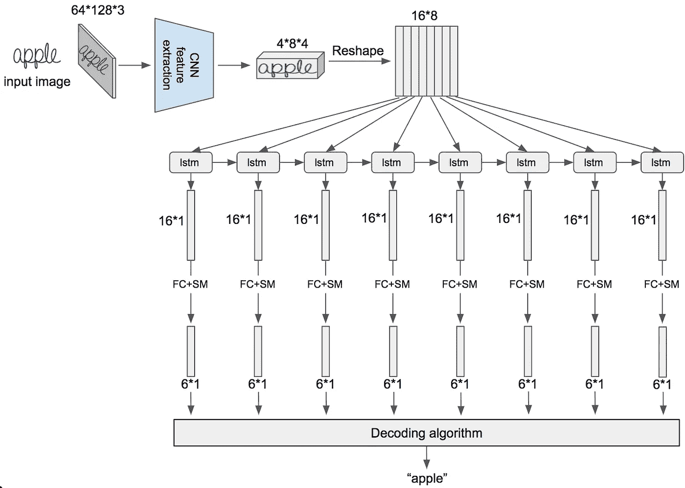

# 什么是光学字符识别(OCR)？

> 原文：<https://medium.com/analytics-vidhya/what-is-ocr-f67c9ab218bf?source=collection_archive---------9----------------------->

你有没有尝试过通过银行的应用程序以电子方式存入支票？在这样做的时候，你通常会被指示将手机悬停在支票的正面和背面，直到你的手机决定拍摄照片的最佳角度。使用这些照片，银行可以识别出你存了多少钱，钱是从哪个账户来的，来自谁，最重要的是，你不用去银行，节省了时间。但这是什么样的魔法？

这是通过 OCR 或光学字符识别完成的。OCR 是允许计算机识别图像中的文字并提取该文字的技术。电子存款只是它的众多用途之一。其他一些用途包括在酒店登记入住、电表读数和文本编辑器。

但是 OCR 到底是怎么工作的呢？有各种各样的 OCR 模型，一些比另一些更先进，但原则上每个字符都与字符数据库进行比较。选择数据库中与正在读取的字符最相似的字符。更高级的 OCR 模型不仅将字符作为一个整体来看，而且特定的属性(如曲率)允许它们区分看起来相似的字符，如“1”(数字 1)或“L”(小写 L)。最后，模型可能会使用拼写检查器或字典来检查返回的单词是否有意义。

现在，让我们来了解一下这个过程的一些具体细节。OCR 模型对图像做的第一件事是预处理。根据型号的不同，这可能是很多不同的事情，但本质上是对图像进行更改，使其尽可能易于阅读。预处理的一些例子是旋转文本、拉直文本、去除任何背景图像、使背景尽可能地白以及使文本变暗(如果它还不是暗的话)。

完成此操作后，OCR 开始识别每个字符的过程，有不同的方法来完成此操作。一种方法是模式识别。其工作原理是首先识别黑色像素行，中间是白色像素行。然后，通过查看白色像素列之间的黑色像素，以同样的方式查看单个字符。

每个字符都被转换成二进制矩阵，其中白色像素为 0，黑色像素为 1。使用距离公式，测量矩阵中心和最远像素之间的距离。这用作创建圆的半径，并将圆分成不同的子部分，每个子部分与字符数据库进行比较，以获得最匹配的字符。

## Python 库

谷歌有自己的开源 OCR 引擎，名为 Tesseract，能够识别 100 多种语言。也可以训练它识别其他语言。通过使用 python-tesseract 库，可以在 Python 中使用这个引擎，Python-tessera CT 库是 Google 的 OCR 引擎的包装器。关于这个库的更多信息可以在这里找到:

 [## 宇宙魔方

### Python-tesseract 是 Google 的 Tesseract-OCR 的 Python 包装器

pypi.org](https://pypi.org/project/pytesseract/) 

## OCR 和深度学习

上述方法是执行 OCR 的传统方式。但是随着计算机科学和机器学习的进步，现在已经可以用深度学习来做 OCR 了。OCR 模型现在可以被训练识别字符。然而，即使是深度学习也存在挑战，因为不同的字体、语言以及糟糕的笔迹导致了各种各样的字符。有不同的深度学习方法来处理这个问题，包括 EAST 和 CRNN。这些方法可以用 Tensorflow 和 Keras 之类的工具实现。这张图片是 OCR 通过深度学习完成的高级示例。

LSTM 是 RNN(循环神经网络),代表长期短期记忆

在上面的例子中，LSTM 代表长短期记忆。LSTM 是一种人工递归神经网络，具有反馈连接，不仅可以处理单个数据点，还可以处理数据序列(语音和视频)。下面的图表概述了如何在 OCR 模型中使用它。

OCR 深度学习概述

每个条形是一个概率向量，选择最可能的字符

## 摘要

简而言之，OCR 是计算机科学/机器学习的另一个非常酷的应用，它使日常生活变得更容易。它已经存在了相当一段时间，但机器学习的最新进展使它更加准确。

## 资源

以下资源对这篇文章的写作非常有帮助。

 [## OCR 简介

### 如何以及为什么将深度学习应用于光学字符识别

towardsdatascience.com](https://towardsdatascience.com/a-gentle-introduction-to-ocr-ee1469a201aa)