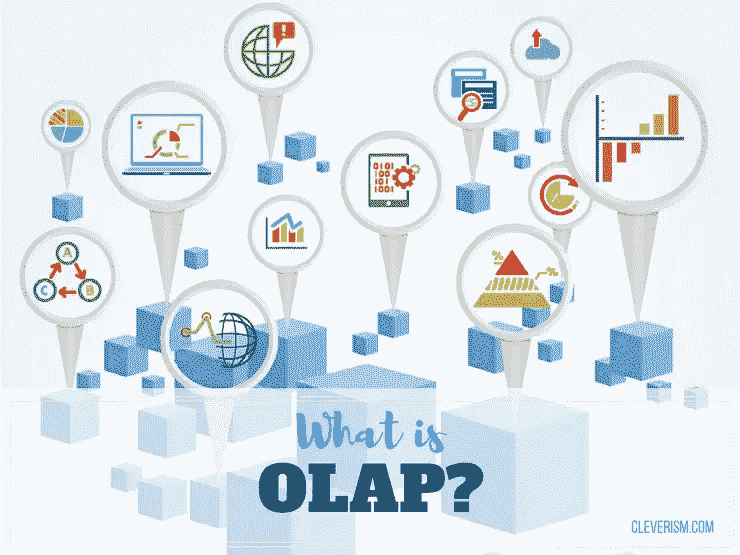
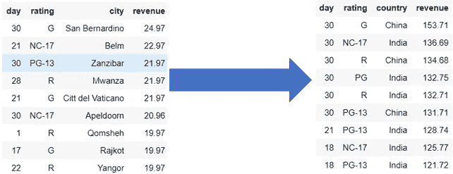
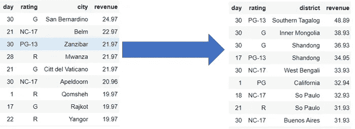
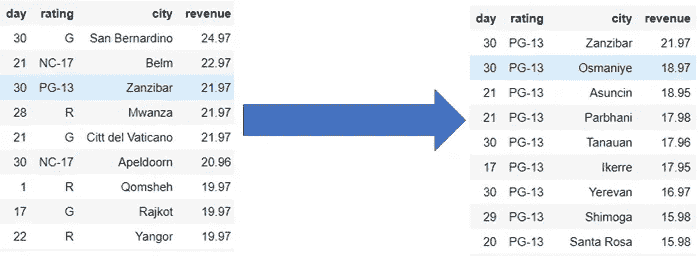
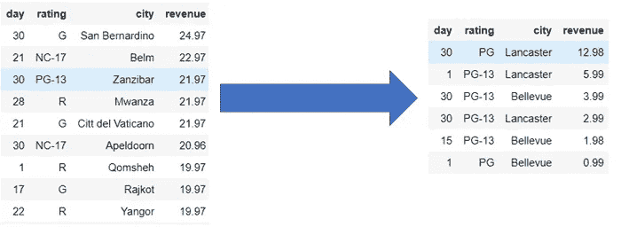
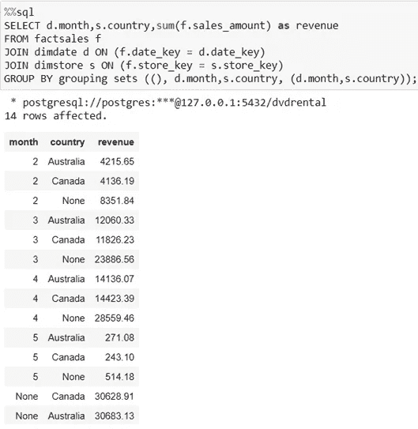
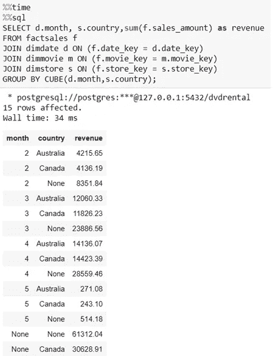
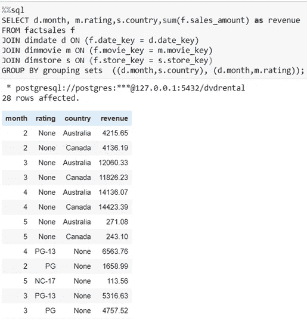
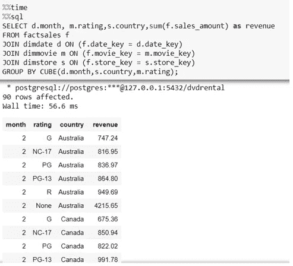

# 什么是 OLAP 和 OLAP 运营

> 原文：<https://medium.com/analytics-vidhya/what-is-olap-olap-operations-abfb3d770240?source=collection_archive---------20----------------------->

OLAP 的意思是**在线分析处理**。这是一类允许用户同时分析来自多个数据库的信息的软件。它还使分析师能够从不同的角度提取和查看业务数据。分析师经常需要对数据进行分组、聚合和连接，借助 OLAP，可以对数据进行预先计算和预先聚合，从而加快分析速度。

主要目标是数据分析，而不是数据处理。

**OLAP 的例子:**

OLAP 的用途如下:

*   一个公司可能将他们九月份的移动电话销售与十月份的销售进行比较，然后将这些结果与可能存储在单独的数据库中的另一个位置进行比较。
*   亚马逊分析顾客的购买行为，以提供一个个性化的主页，展示顾客可能感兴趣的产品。
*   OLAP 数据库被分成一个或多个立方体。多维数据集的设计使得创建和查看报告变得很容易。

# **OLAP 的基本分析操作:**

OLAP 的四种基本分析操作类型是:

1.卷起

2.向下钻取

3.限幅

4.菱形装饰

# **上卷:**

可以通过两种方式执行卷起操作

1.缩小尺寸

2.爬上概念层次。概念层次是根据事物的顺序或级别对其进行分组的系统。

示例:

我有一个三维列的表，最后一列是值。

对于汇总，我们需要将聚合级别提高到一个大的分组。

在这里，我在城市的维度上“升级”。因此，在这个聚合过程中，数据位置层次从城市向上移动到国家。

# **下钻:**

在向下钻取中，数据被分割成更小的部分。这与汇总过程相反。这可以通过以下方式实现:

1.向下移动概念层次

2.增加维度

示例:

我有一个三维列的表，最后一列是值。

对于向下钻取，我们需要将一个维度分解到更低的级别。

在这里，我在城市维度上“拆分级别”。因此，在这个聚合过程中，数据位置层次结构从城市向下移动到地区。

# **切片:**

在 Slice 中，选择一个维度，并创建一个新的子多维数据集。

切片是将立方体的维度减少一个，例如将三维减少到二维，将其中一个维度固定为单个值。

示例:

我有一个包含三个维度列的表，最后一列是值。

对于切片，我们需要将一个维度缩减为一个立方体。

这里，我为一个维度指定了一个特定的值，并用它来限制表。我指定了“等级= PG-13”的值，所以我们可以忽略等级列，现在表中只有两个维度。

# **划片:**

这个操作类似于切片。骰子的不同之处在于，您可以选择两个或多个维度，从而创建一个子立方体。

切割是指为两个或多个维度创建维度相同但值较少的子多维数据集。

示例:

我有一个三维列的表，最后一列是值。

对于切片，我们需要将两个或更多维的值减少到立方体中。

这里，我为所有三个维度指定了特定的值，并用它来限制表。我指定了“等级= PG-13 和 PG”、“城市=贝尔维尤和兰开斯特”、“日期= 1 和 15 和 30”的值。

# **对多维数据集中的集合进行分组:**

计算一个多维数据集中所有可能的分类汇总，尤其是那些多维数据，可能是一个相当密集的过程。如果你不需要所有的小计，这可能意味着相当大的浪费。

如果我们只需要几个级别的小计，我们可以使用“分组集”表达式，并准确指定我们需要的分组集，这样我们就不必计算整个立方体。

经常发生的情况是，对于三个维度，您想要聚集一个事实:

*   无(总计)
*   然后是第一维度
*   然后到了 2 号
*   然后到了第三天
*   然后到了 1 号和 2 号
*   然后到了第二次和第三次
*   然后到了 1 号和 3 号
*   然后是第一、第二和第三次

因为这很常见，而且在所有情况下，我们都在遍历所有的事实表，所以有一个更聪明的方法可以使用 SQL 分组语句“GROUPING SETS”

示例:

如果我需要**总收入，按月，按国家，按月&国家全部用“分组集”**

如果我们在这个查询中使用 cube 而不是 grouping set，我们可以得到相同的结果，因为在 grouping set 中，我们只使用两个维度进行分组，并且我们包括所有的组合，在 cube 中，我们还可以一次得到不同长度的所有组合。

但是，如果我们需要对**的总收入、【按月&按国家】和【按月&评级】全部用“分组集”**一次性完成

通过多维数据集分组:

所以我们可以看到，两个输出是不同的。在分组集中，我们只能得到 28 行，但是在立方体分组中，我们可以得到 90 行，因为在立方体中，我们可以得到所有三个维度的所有组合。而在分组集合中，我们只得到我们在查询中提到的组合。因此，如果我们需要更少层次的分类汇总，这是使用分组集的主要用例。

# 总结:

OLAP 是使跨国数据对决策有用和可理解的一种方式。

代码和 Jupyter 笔记本在我的[**Git 资源库**](https://github.com/SapanShah177/OLAP-Operation.git) **上有。**

您可以使用以下参考资料来了解更多信息:

*   《OLAP 魔方》(作者安托万·钱比勒)
*   OLAP 在《聪明主义》杂志上的文章。
*   [OLAP 运营](https://www.geeksforgeeks.org/olap-operations-in-dbms/)在 GeeksForGeeks。
*   [什么是真正实用的 OLAP？](https://www.datasciencecentral.com/profiles/blogs/what-is-real-olap-for-practical-use-1)(丁发帖)