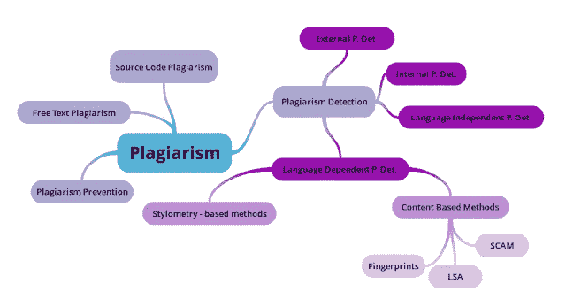

# 什么是抄袭检测？

> 原文：<https://medium.com/analytics-vidhya/what-is-plagiarism-detection-795bd149f04d?source=collection_archive---------1----------------------->

由于不断增加的电子内容和容易访问万维网，学术、研究、新闻和文学中的剽窃已经成为一个主要问题。但你知道什么是抄袭，如何防止或检测抄袭吗？如果你是大学生或内容作者，这篇文章会对你有用。

# 什么是抄袭？

抄袭思维导图——作者图表

事实上，很难给“剽窃”一词下一个精确的定义，但是根据韦氏词典词典，剽窃的简单含义是“使用他人的语言或思想，就好像是你自己的语言或思想一样”。抄袭还包括:

1.  把别人的作品当成自己的上交。
2.  抄袭他人的文字或想法而不注明出处。
3.  没有把引用放在引号里。
4.  提供关于引用来源的不正确信息。
5.  改变单词，但抄袭原文的句子结构而不注明出处。
6.  从一个来源复制如此多的单词或想法，以至于它构成了你作品的大部分，不管你是否注明出处。

有两种主要的方法可以用来减少剽窃。

1.  防止抄袭:
    惩罚套路和抄袭退税解释程序。需要很长时间来实施。但会产生长期的积极影响。
2.  抄袭检测:
    包括人工方法和软件工具。易于实施，但具有短暂的积极效果。

# 抄袭检测

抄袭检测可以手动完成，也可以使用自动化流程。自动化过程非常类似于自然语言处理、视觉识别和生物识别过程。这些都有模式识别的基础。自动化过程不会给出 100%的准确性。因此仍然需要人工检查。

# 内部抄袭检测

在没有潜在原始文本的情况下，在文档中查找抄袭的段落。也称为内在抄袭检测。

# 外部抄袭检测

外部剽窃检测包括将可疑的剽窃文档与潜在的原始文档进行比较。

# 源代码中的抄袭检测

检测源代码中的抄袭比自然语言抄袭检测相对容易。因为编程语言中单词之间既没有歧义，也没有干扰。但是在自然语言中，每个单词都可能有很多同义词和不同的意思。一些剽窃检测方法是独立于语言的，一些是依赖于语言的。

# 自然语言中的抄袭检测

检测书面文件中的剽窃。这种方法可以分为两类，即与语言无关的抄袭检测和与语言相关的抄袭检测。

# 独立于语言的剽窃检测

独立于语言的方法是基于评估所有语言共有的文本特征。例如特殊字符的数量和句子的平均长度。解释技术可以用来误导语言无关的系统。

# 语言相关抄袭检测

这些方法基于对特定于一种语言的文本特征的评估。例如统计特定语言中特定单词的频率。语言相关的抄袭检测比语言无关的抄袭检测更有效。

# 基于笔形测量的方法

风格测量法是一种用于作者归属的统计方法。这些方法受作者归属方法的启发，基本上包括对作者的写作风格进行分类，以识别相似性。它是基于每个作者都有独特风格的假设。可以通过使用同一文档内的因素，或者通过比较同一作者的两个文档来分析写作风格。这是通过将文档分成像段落和句子这样的部分来实现的。然后提取并分析风格特征。主要的语言风格学特征是在字符级操作的文本统计(逗号、问号、单词长度等的数量)。

*   句法特征在句子层面上衡量写作风格(句子长度、虚词的使用等)。).
*   句法特征在句子层面上衡量写作风格(句子长度、虚词的使用等)。).
*   封闭类单词集，用于统计特殊单词(停用词、外来词、“困难”词等的数量。).
*   反映文本结构的结构特征(段落长度、章节长度等)。).
*   使用这些特征，可以导出公式来识别作者的写作风格。基于风格学的方法可以用于内部和外部剽窃检测。

# 基于内容的方法

根据逻辑结构分析文本的规格并发现相似之处。基于内容的方法只能用于外部抄袭检测。

## 指纹技术

指纹是通过散列文档子集创建的一组整数，代表其关键内容。该方法包括通过比较两个文档的指纹来测量它们的相似性。生成指纹的技术主要基于 k-gram(k-gram 是长度为 k 的连续子串),它是大多数指纹方法的基础。

## **潜在语义分析(LSA)**

在这种技术中，意思相近的单词被认为是在一起出现的。构造一个矩阵，其中行代表单词，列代表文档。每个文档只包含所有单词的子集。奇异值分解(SVD)是一种实数或复数矩阵的因式分解方法，用于减少列数，同时保持行之间的相似结构。由于矩阵的稀疏性，这种分解非常耗时。通过取任意两行形成的两个向量之间的夹角的余弦来比较单词。接近 1 的值表示非常相似的单词，而接近 0 的值表示非常不相似的单词。

## **斯坦福复制分析机制(SCAM)**

这是基于注册拷贝检测方案。文档在存储库中注册，然后与预先注册的文档进行比较。拷贝检测服务器的体系结构由一个存储库和一个分块器组成。文档的分块将文档分解成句子、单词或重叠的句子。文件在注册前会被分块。在与预先注册的文件进行比较之前，新文件必须被分块到相同的单元。倒排索引存储用于对注册文档块进行排序。块的每个条目都是指向该块出现的文档(发布)的指针。每个帖子有两个部分:文档名及其相关的块出现次数。一个小的组块单元增加了发现文档间相似性的概率。SCAM 中的组块单元是一个单词。使用相对频率模型(RFM)来比较文档，该模型主要包括计算在两个文档中以相同频率出现的一组单词。

# **用于 PL 检测的自然语言处理和机器学习**

NLP 用于预处理阶段，如句子分割、标记化、停用词去除、标点符号去除、同义词替换、词干提取、数字替换、标点符号去除等。用于识别抄袭的文本。这些预处理技术提高了抄袭检测算法的准确性和效率。并且还可以通过机器学习方法以有效的方式解决剽窃检测。有一些正在进行的研究使用 ML 和神经网络以及深度学习来完成这项任务。

# **流行的抄袭检测软件工具。**

检测剽窃并不是一个新的研究领域。已经开发了各种方法来处理源代码和自然语言剽窃检测。

plagiarism.org 和 turnitin.com 是解决网络剽窃的流行工具。Glatt 剽窃服务公司提供了一种基于用户端软件的方法来防止和检测剽窃。关于这些技术的更多细节，你可以在这里找到。

有许多软件工具可以用来检测剽窃，但大多数都不流行，因为它们的准确性较低。到目前为止，用于剽窃检测的方法仅限于非常肤浅的水平。所以剽窃检测技术仍然需要发展。

参考资料:

[https://www . researchgate . net/publication/272853366 _ Detection _ of _ 抄袭 _in_Arabic_Documents](https://www.researchgate.net/publication/272853366_Detection_of_Plagiarism_in_Arabic_Documents)

[https://www . researchgate . net/publication/242783426 _ Using _ Natural _ Language _ Processing _ for _ Automatic _ Detection _ of _ parlization](https://www.researchgate.net/publication/242783426_Using_Natural_Language_Processing_for_Automatic_Detection_of_Plagiarism)

[https://cs . Stanford . edu/people/eroberts/cs 201/projects/honor-code/tech . htm](https://cs.stanford.edu/people/eroberts/cs201/projects/honor-code/tech.htm)