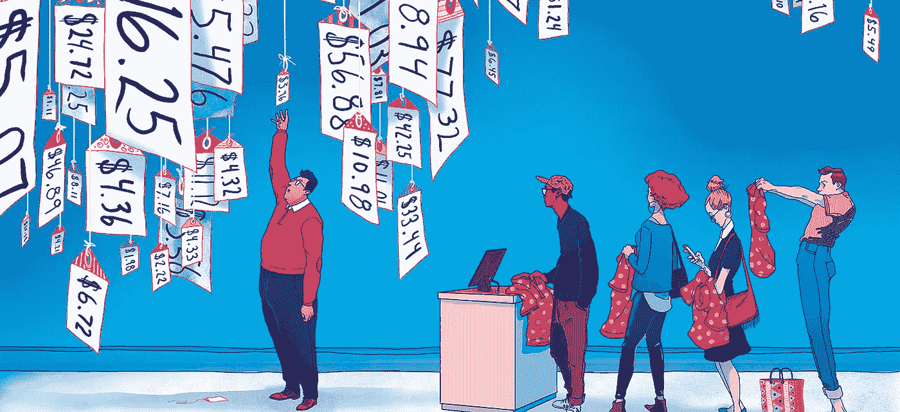
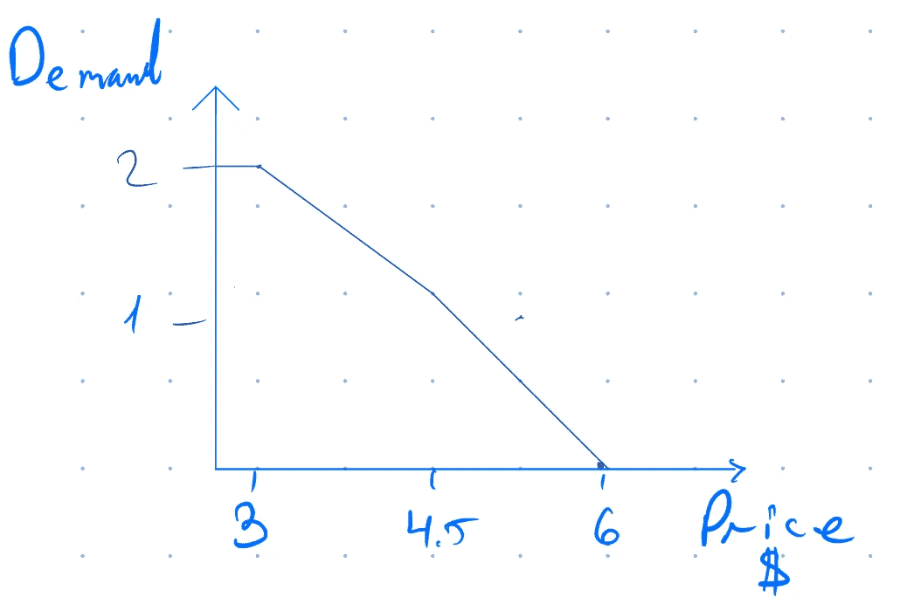
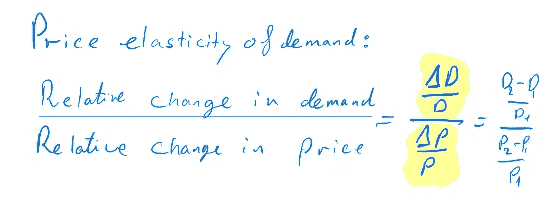
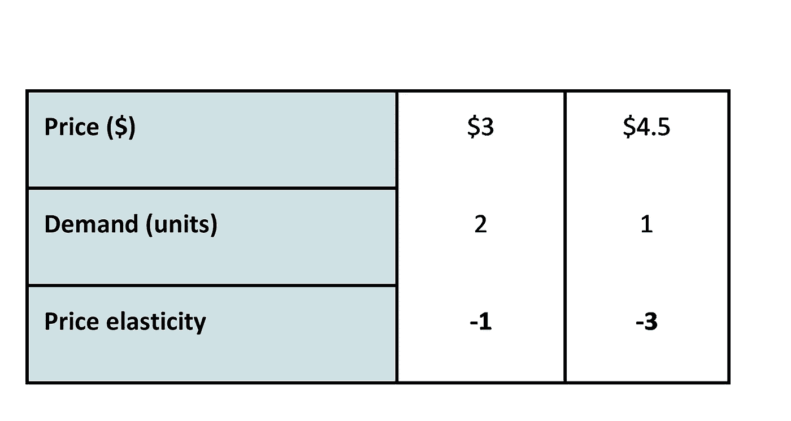
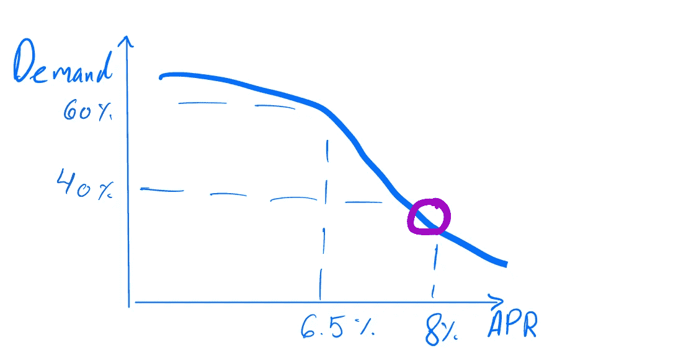
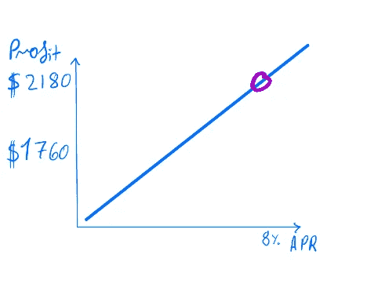
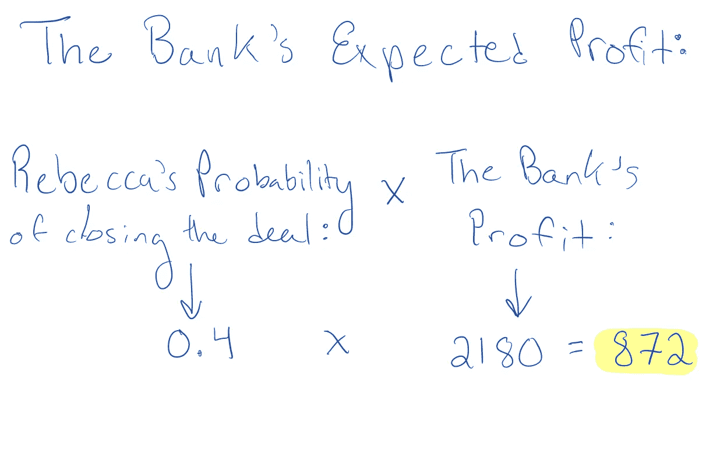
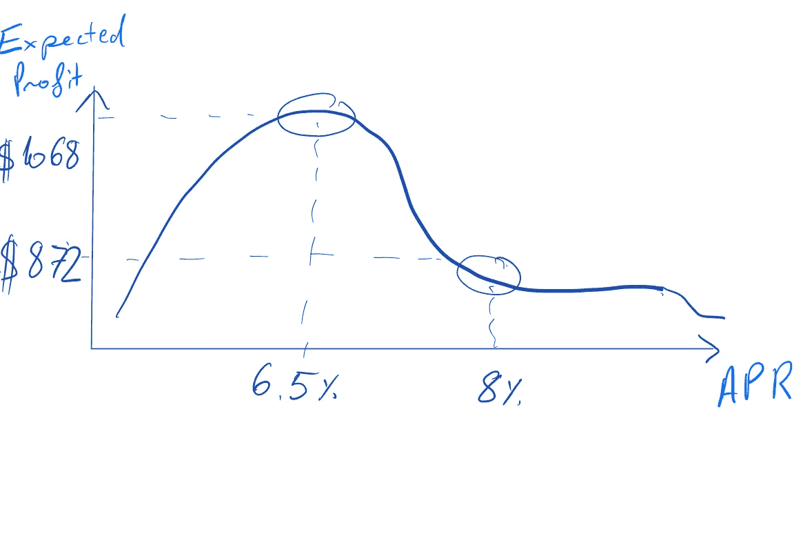
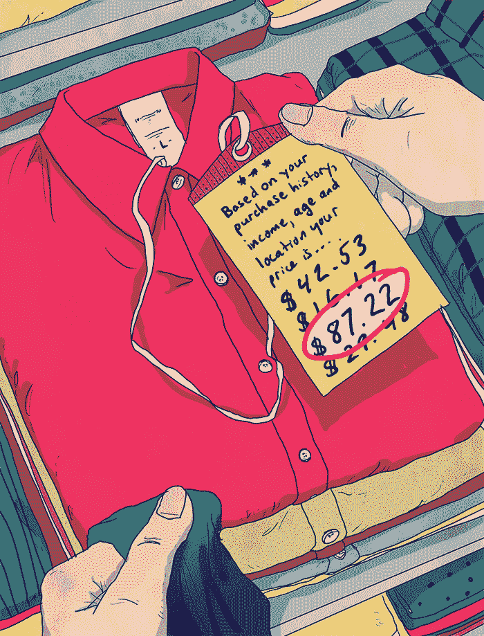

# 什么是价格弹性，价格优化是如何工作的？

> 原文：<https://medium.com/analytics-vidhya/what-is-price-elasticity-and-how-does-price-optimization-work-2004c99e397c?source=collection_archive---------9----------------------->

你有没有想过产品价格是如何确定的？大公司(如 Hotel.com、亚马逊或美国航空公司)如何为他们的产品确定合适的价格？无论该产品是机票、保险单还是贷款。公司必须使用价格优化，作为定价过程的重要工具。

致谢:迈克尔·拜尔斯

为了更好地理解价格优化，我们首先需要理解微观经济学的一个核心概念:*价格弹性*。

# 什么是价格弹性？

随着价格的上涨，你对橙汁的需求会减少。如果我们绘制这种行为，趋势将如下所示:

图中每一点购买橙汁的价格弹性都不同。

可以使用以下公式计算:

我们可以看到，价格为 3 美元时的价格弹性为-1。那么，价格每上涨 1%，需求就会下降 1%。4.5 美元的价格是-3。那么，价格每上涨 1%，需求就会下降 3%。

# 从需求的价格弹性中我们能理解什么？

当客户具有高价格弹性时，他们对价格的变化非常敏感。因此，如果我们能够确定价格，我们会瞄准绝对价格弹性较低的领域。在我们的例子中:大约 3 美元。基于价格弹性和其他因素，我们可以建立一个需求模型来估计购买该产品的概率。既然我们已经掌握了什么是价格弹性，我们就有了一个坚实的基础来深入研究*价格优化* …

# 什么是价格优化？

价格优化将有助于我们了解为了使给定产品的利润最大化，应该收取多少费用。

# 价格优化基于两个因素:

1.**行为因素**也称为基于“价格弹性”的需求模型，即客户对价格变化的敏感度。

2.**盈利能力因素:**在给定的价格下，公司可以从销售该产品中获得多少潜在利润。

让我们看看下面的例子:丽贝卡 30 岁了，她想贷款 10，000 美元来更换她的汽车。她四处寻找不同的银行贷款，最后选定了当地的分行。

丽贝卡的需求与 4 月

上图表示 Rebecca 对贷款价格(APR)变化的需求变化。我们观察到，随着贷款价格的上升，她的需求以不同的速度下降；这种需求的相对变化代表了她的价格弹性。

银行的利润对利润

该图显示了贷款价格(APR)变化导致的银行利润变化。银行的利润随着 4 月份的每一次增长而增长。

回到我们的故事，银行最初提供的是一笔年利率为 8 %的贷款，为期十年。如果 Rebecca 完成这笔交易，银行将获得 2180 美元的利润(在上图中:紫色圆圈代表初始报价)。

我们可以观察到这两个因素之间存在权衡:一方面，随着年利率的提高，Rebecca 完成交易的可能性降低，但另一方面，随着利率的提高，银行的预期利润也会增加。

# 我们如何解决这种权衡？

首先，银行将 Rebeca 的需求价格弹性评估为 8% APR。她的价格弹性被认为非常高[-5]，**，换句话说，她不可能接受贷款。因此，银行决定降低贷款价格。但是他们应该降低多少价格呢？**

银行将制定其**预期利润**。银行将通过将丽贝卡完成交易的概率乘以银行利润来实现这一点。

如果银行想从 Rebecca 那里获得最大利润，最好向她提供 6.5 %的低利率贷款，而不是 8%。

银行的预期利润与年利率

**如果银行向她提供 6.5%的贷款，她完成交易的概率会上升，银行的利润会从 2180 美元减少到 1760 美元，但银行的预期利润会从 872 美元增加到 1068 美元。**

现在银行需要重复这个过程，计算每个客户的预期利润。因此，对于一些客户，银行将提高年利率，而对于其他客户，银行将降低年利率，正如我们在丽贝卡的案例中看到的那样。

**如果银行建立一个稳健的“需求模型”,它将增加利润。**

# 总结:

*   需求弹性衡量你的客户对价格的敏感程度。
*   建议将价格设定在需求价格弹性绝对值较低的地方，因为消费者对价格变化不太敏感。
*   价格优化是一种基于整个客户组合需求价格弹性的技术。
*   使用价格优化可以增加你的利润和你的业务转换率。
*   成功的价格优化的必要条件是拥有不同价格弹性行为的客户；所以，你可以多收费，抬高总利润，对于别人，给个折扣，提高整体转化率。

