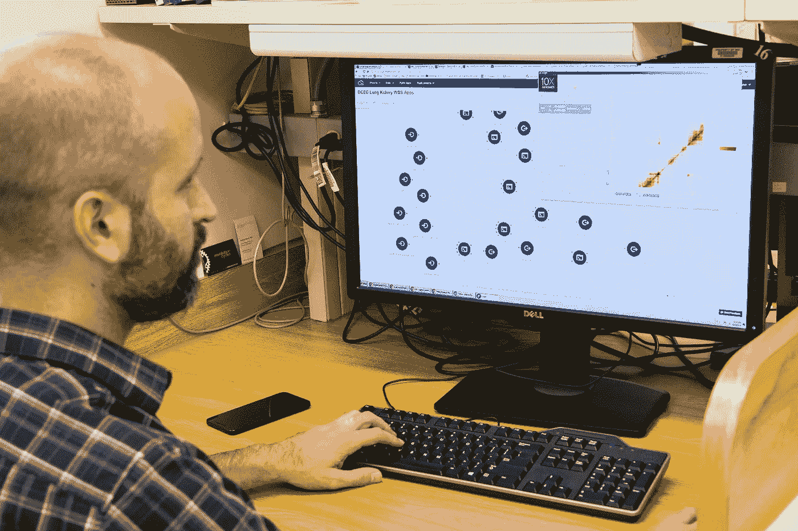
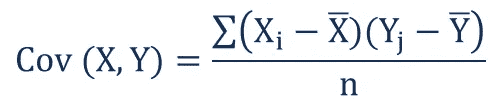
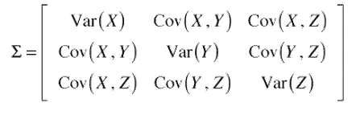
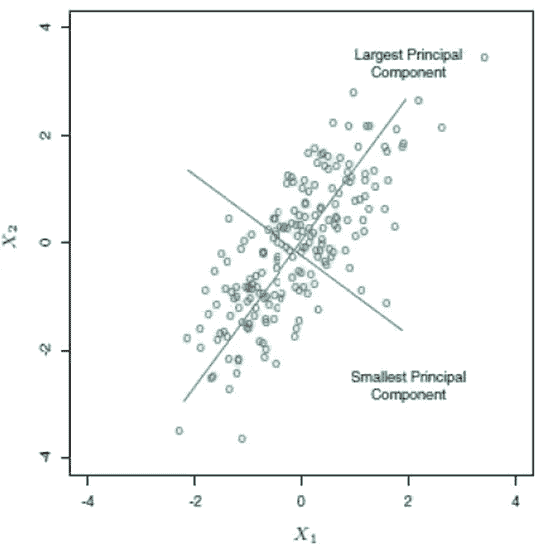
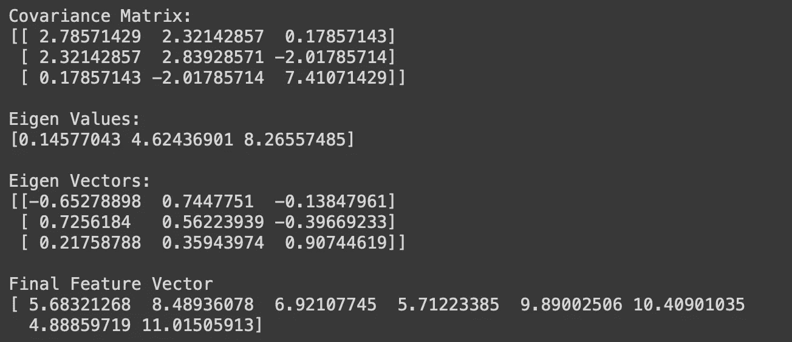

# 解释:主成分分析(PCA)

> 原文：<https://medium.com/analytics-vidhya/what-is-principal-component-analysis-cf880cf95a0c?source=collection_archive---------8----------------------->

曾经在训练一个模型的时候有一堆特性，但是不知道哪一个是最适合的？在那个时候，你可能遇到过主成分分析，简称 PCA。

> 您可能会损失一些准确性和信息，但它确实为您简化了过程。

[国家癌症研究所](https://unsplash.com/@nci?utm_source=unsplash&utm_medium=referral&utm_content=creditCopyText)在 [Unsplash](https://unsplash.com/s/photos/analysis?utm_source=unsplash&utm_medium=referral&utm_content=creditCopyText) 上拍摄的照片

## 什么是主成分分析？

简单来说，PCA 是一种**降维技术**。如果您正在处理一个包含多个要素的庞大数据集的项目，您可能希望减少其中的一些要素。毕竟，并不是所有的都是必需的，它们可能会不必要地增加您的模型的培训成本。

你会意识到，通过减少特征的数量，你可能会损失一些准确性和信息，但它确实为你简化了过程。因此，从根本上说，PCA 将帮助您减少训练特征的数量，但仍然为您保留尽可能多的信息。

## 涉及的步骤:

1.  数据集的标准化
2.  协方差矩阵的计算
3.  计算特征值和特征向量
4.  挑选顶部的“n”个特征向量(对应于最高的特征值)
5.  数据集的转换

## 1.数据的标准化

为什么这是必要的？好吧，如果你有两个特征，一个在 0 到 5 之间，另一个在 0 到 100 之间，那么后者将支配较小的值，不是吗？这就是为什么我们需要将所有数据标准化，平均值为 0，方差为 1。

## 2.计算协方差矩阵

来源:[企业金融研究所](https://corporatefinanceinstitute.com/resources/knowledge/finance/covariance/)

协方差是两个给定变量之间关系的度量。它衡量两个变量与其平均值的差异程度。它可以让我们了解这两个变量之间的关系。

来源:[栈交换](https://math.stackexchange.com/questions/885410/covariance-matrix-of-various-x-y-z-cartesian-coordinates)

由于(X，Y)的协方差与(Y，X)的协方差相同，所以形成的协方差矩阵是上三角矩阵。此外，对角线元素实际上是所考虑变量的方差。

从(X，Y)的协方差中，我们可以知道基于它们的值它们是如何相关的。如果协方差为正，则变量正相关，即它们一起减少或增加。然而，如果协方差为负，则其中一个增加，而另一个减少，反之亦然。在前一种情况下，变量是正相关的，而在后一种情况下，变量是负相关的。

## 3.特征值和特征向量的计算

特征向量和特征值帮助我们从协方差矩阵中确定数据的**主成分**。在我们开始计算值和向量之前，我们需要理解什么是主成分。

主成分是一个特征向量，它是数据集原始特征的线性组合。就其本质而言，它是一条最能代表数据的线。因此，主成分分析将帮助我们识别这些向量，我们只需要挑选前几个向量，因为它们包含了大部分信息。

来源: [TIBCO](https://docs.tibco.com/pub/sfire-dsc/6.5.0/doc/html/TIB_sfire-dsc_user-guide/GUID-BF34695C-47FD-44CA-9002-8A3FA69FB4E0.html)

由我们来决定我们想要在最终数据集中包含多少主成分。把所有主要成分加起来，我们就会回到起点。注意，这些主要成分没有任何意义；它们只是旧功能的组合。

## 4.形成我们新的特征矩阵

基于顶部特征值，我们挑选相应的特征向量。这些向量将构成我们新的特征矩阵。

选择最大的主成分

## 5.转换数据集

瞧啊。上面获得的特征矩阵用作后面阶段的新数据集。

## 最终代码

既然我们已经讨论了主成分分析中涉及的每个步骤，让我们在一个样本数据集上尝试一下。

**问题:**数据集有 3 个特征，每个特征从 1 到 10 不等。我们需要*把这个压缩成一个* ***单个*** *特征向量*。注:由于范围是一致的，我们可以暂时省略标准化程序。

我希望大家在跳到下面的代码之前先尝试一下。祝你好运！

好了，一旦完成了，是时候坐下来看看结果了！

**回答**:

希望您在学习 PCA 的过程中过得愉快！