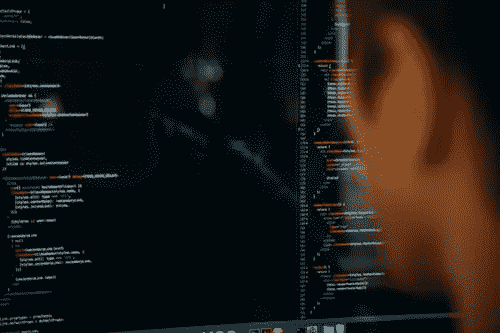

# python 是什么？

> 原文：<https://medium.com/analytics-vidhya/what-is-python-d64059c65231?source=collection_archive---------15----------------------->

## **Python**

Python 是一种面向对象的高级编程语言。python 的主要特点是它带有动态语义。当它的高级内置数据结构与动态类型和动态绑定相结合时，它们使它非常适合快速应用程序开发。此外，它还可以用作脚本语言或粘合语言，将现有组件连接在一起。

但是不用担心！Python 很容易！

> Python 是“你还能读懂的最强大的语言”。
> 
> 保罗·迪布瓦

Python 是一种解释型语言。由于其语法可读性更高，与其他计算机语言相比，python 被认为是一种非常简单的语言。

## 学习 Python 的优势

> " Python 有充分的理由成为发展最快的主流编程语言。"

**任何类型程序员的易用性**

正如我前面提到的，Python 是最容易学习的编程语言之一。开始使用 Python 不需要任何编程经验。这种简单背后的原因是 python 有非常简单的语法和编码规则，对任何用户来说都非常清楚。

**丰富的在线学习资源**

当谈到从一开始就自己学习一些东西时，大多数时候找到好的学习资源真的很有挑战性。幸运的是， [**官方 Python 文档**](https://docs.python.org/3/) 让你了解关于 PYTHON 语言的一切，并且它还提供了一个文档丰富的教程，使你更容易入门。

**开源库**

python 可以使用许多开源库来扩展其功能。此外，安装它们也没什么大不了的，因为您必须从终端运行一个简单的命令:

演示: *pip 安装[库名]*

**许多领先的公司都在使用 Python**

Python 不仅仅是为了休闲编程。许多受欢迎的领先公司都在使用它。比如 Google、Instagram、Spotify 这样的大公司，也是用 Python 进行开发的。

> “Python 从一开始就是 Google 的重要组成部分，并且随着系统的成长和发展而保持不变。如今，数十名谷歌工程师使用 Python，我们正在寻找更多掌握这种语言的人。”
> 
> ——彼得·诺维格，谷歌公司搜索质量总监

## 我们在哪里使用 Python？

> “我让学生们在我们的本科和研究生语义 Web 课程中学习 Python。为什么？因为基本上没有其他东西有这么大的灵活性和这么多的网络库”
> 
> -詹姆斯·亨德勒教授。【马里兰大学】

Python 编程是通用的，几乎应用于所有领域，包括:

*   数据科学
*   科学和数学计算
*   Web 开发
*   金融和贸易
*   系统自动化和管理
*   电脑图形图像
*   基本游戏开发
*   安全性和渗透测试
*   通用和特定应用程序脚本
*   制图和地理(地理信息系统软件)

现在是学习 Python 的时候了！开始吧！好好干！在你的指尖有如此多的资源等着帮助你！