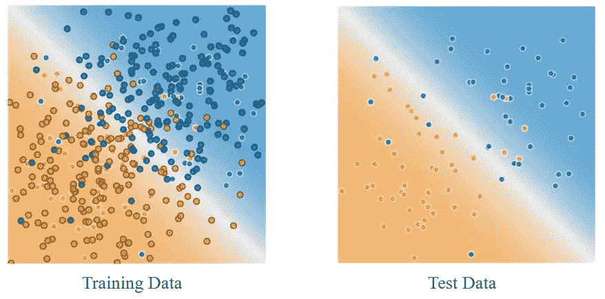
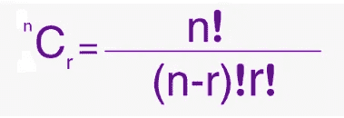
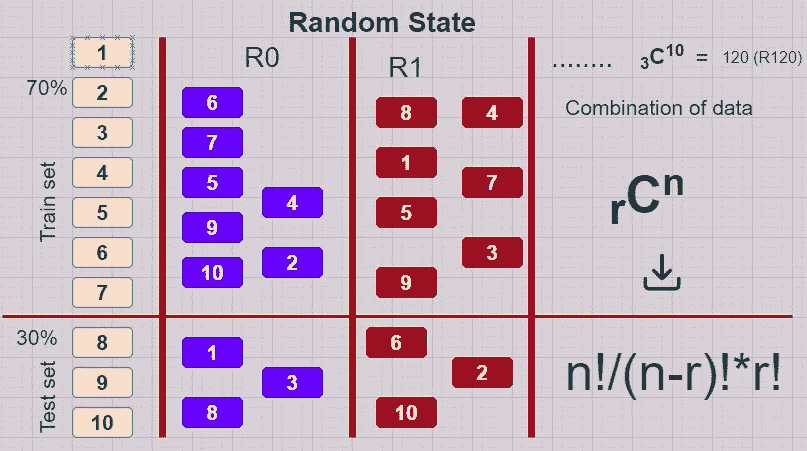

# 机器学习中的随机状态是什么？

> 原文：<https://medium.com/analytics-vidhya/what-is-random-state-in-machine-learning-84c1c9dffaad?source=collection_archive---------2----------------------->

[图来自](https://developers.google.com/machine-learning/crash-course/training-and-test-sets/splitting-data)

> *要预测任何新数据，你的模型必须先经过训练。因此，将数据集分成一定比例的训练集和一定比例的测试集非常重要。* **因此，为了不在数据预测中带来偏差，在任何数据集中随机洗牌都是必要的**。

***让我给你举一个偏见的例子！*** 假设，你有一个房价的文件，上面六行是班加罗尔的价格，下面六行是普通房子的价格。然后如果不洗牌数据，直接把 70%用于训练，30%用于测试。那么这里就有偏见**。*怎么样！你可能想知道，对吗？🤔🤔让我们看看怎么做。这里，上面 70%的训练数据将来自班加罗尔价格，即您训练模型，并且您正在测试模型的正常房价的下面 30%。那么你能想象你的模型会预测正确的输出吗？😂😊*** 因此，定义一个随机状态是必要的。

# 让我们想象一下，

让我们看看数据。假设你有[1，2，3，4，5，6，7，8，9，10]这样的数据集，你想用 70%的数据来训练你的模型，用 30%的数据来测试你的模型。

[组合公式](https://byjus.com/combination-formula/)

然后机器算法把你的 10 个数据混洗成 70 %的训练集和 30%的测试集。为此，将有 120 个随机洗牌数据集的组合，如下图 2 所示。所以，你可以选择任意数量的 random_state 到你的模型中。总是不可能知道你可能的随机状态的组合。*所以，选择(0 或 1 或 2 或 3)，random_state=0 或 1 或 2 或 3* ***这样的初学者数字状态总是没问题的。***

如果指定 random_state=n，那么机器总是针对特定的随机状态“n”测试模型。

> **为了更直观地将数据拆分成测试和训练集，Github:**[**https://Github . com/Aryal-Shanta/Splitting _ data _ in _ Machine _ Learning**](https://github.com/Aryal-Shanta/Splitting_data_in_Machine_Learning)

这是一个随机状态的简单例子，

图 2:组合后数据随机洗牌