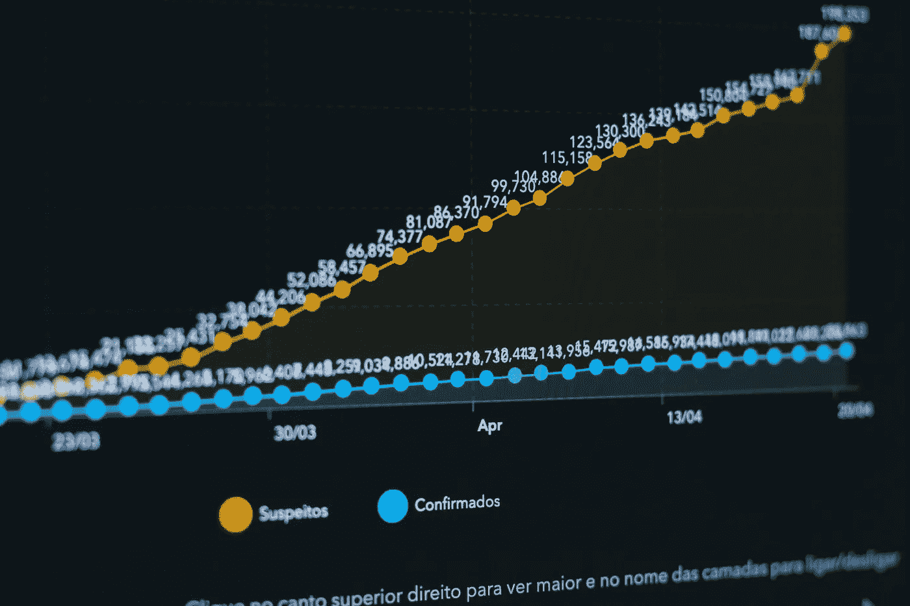
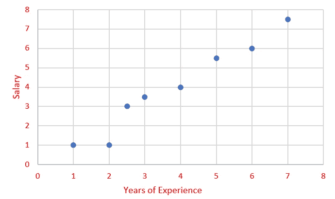
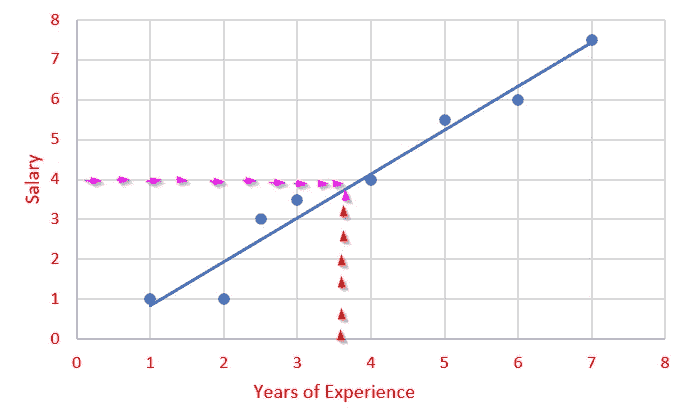
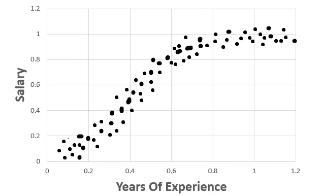
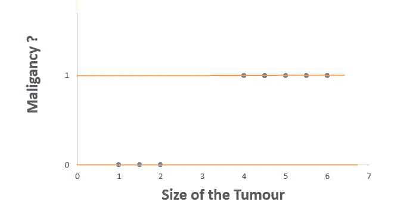

# 什么是 ML 意义上的回归？

> 原文：<https://medium.com/analytics-vidhya/what-is-regression-in-terms-of-ml-8368d2063fc1?source=collection_archive---------12----------------------->

我不会给你回归和分类的两行定义。

在下定义之前，让我们看看现实世界中的问题，并讨论我们可以做些什么来解决这些问题。如果您仍然希望先了解定义/摘要，请跳到结论部分。

让我们考虑一下，我们有 150 名雇员的年资和薪水的数据。

我们需要编写一个模型，它可以帮助我们通过学习我们手头的数据(150 名员工的数据)，根据一名员工多年的经验来预测他的工资。

让我们忘记模型和编程，看看数据。

我们有两个变量——经验年限和薪水。

可视化数据的一个好方法是图表！让我们开始吧。

好吧！现在我们已经绘制出来了。

这里我们可以观察到数据有一个趋势。当工作经验增加时，薪水也会增加。

通过使用这种趋势，我们可以在下图中绘制一条趋势线。

现在我们知道了数据的趋势，我们可以在一定程度上绘制思维导图，并预测特定经历的薪酬。

假设现在你想预测一个新雇员的工资，他的经验是 3.5。

请注意，我在上图中绘制了红色虚线和粉红色虚线，其中提到您可以使用趋势线预测 3.5 年的工资。4!

这种预测方式属于**回归**。

> **回归**是利用历史数据，根据输入值预测输出值的问题。

预言是如何发生的？

在给定的数据中，我们有一些优势。它们是什么？

A **优势 1:** 经验和薪水之间有一个趋势。于是，我们做了一个趋势线，预测了工资。即使所有的点都不在趋势线上，我们也可以确定一些好的置信水平。

这种基于趋势直线预测产量的方法称为线性回归。

> **线性回归**是一种线性方法，通过拟合直线(即线性)来模拟两个或多个变量之间的关系，从而预测给定输入数据的输出。

由于趋势是一条直线，我们将使用直线的方程来找到输出(y)值。

直线方程:y = mx + c

如果有不同的趋势呢？

考虑下图。

在这些数据中，趋势是不同的，看起来曲线比直线更适合。但是仍然有一种趋势。

这种回归属于非线性回归。

对于不同类型的非线性曲线，方程会发生变化。

我没有在这里给出方程，因为我不想吓到回归算法的新手。

如果有兴趣阅读更多关于非线性回归算法的内容，请访问 Jim Frost 的[这一页](https://statisticsbyjim.com/regression/difference-between-linear-nonlinear-regression-models/)。

> **非线性回归**是一种回归分析，其中模型由一个函数拟合，该函数是模型参数的非线性组合。

一 **优势数 2:** 与因果关系的相关性

没有趋势怎么办？

当没有趋势时，这意味着两个变量之间没有关系。因此，我们不能根据输入变量来预测输出。

这种关系可以通过两个变量 X & Y 之间的相关系数来确定。

对于最高相关系数，输出更准确。

好吧！如果我们得到的数据显示两个变量之间有很好的相关系数，但在现实世界中却不是这样，该怎么办？

这就是我们可能被数字忽悠的地方。

曾经我的朋友用一个例子很好的解释了这一点。考虑一下我们需要根据房屋主人的年龄来预测房价的问题。同样不幸的是，数据显示正相关系数为 0.9。

但是我们知道这不可能是真的。在这种情况下，如果我们用这两个变量做一个模型，结果将是失败的。

我们都知道房价，它主要取决于房子的大小、位置、设施和房龄等。但是人们为什么要在乎房子主人的年龄呢？

房子的大小、位置、物业中可用的设施将在定价中占一定比例。

> 只有当存在**相关性和因果关系**时，我们才能应用**回归**分析。

A **优点 3:** 数据连续。

在我们的例子中，薪水是一个连续的数据。

考虑到我们有一个肿瘤检测患者的数据，并且检查的结果是恶性还是非恶性。

在这些数据中，如果我们将其绘制成散点图，它将变成如上图所示。因为如果你看到因变量(或者 Y 轴值)，它就不是连续的。它是离散的—值为“是”或“否”。

有了这些数据，我们就不能得到一个有直线或曲线的图形。这种类型的分析属于分类，因为我们只是将我们的输出分为两类。

> **分类是预测离散(分类)输出值的问题。**
> 
> **回归是预测连续(数值/定量)输出值的问题。**

现在该总结一下我们在这里讨论的内容了。

# **结论:**

回归是使用历史数据根据输入值预测输出值的过程。

要执行回归:

= >数据应该是连续的。

= >输入和输出变量应该有相关性和因果关系。

分类是预测离散(分类)输出值的过程。

如果你对回归这个名字的由来感到好奇，请查看[这一页](https://blog.minitab.com/blog/statistics-and-quality-data-analysis/so-why-is-it-called-regression-anyway)。了解一点我们正在做的事情的历史真的很有趣。不是吗？

## 您还希望:

1.  [**线性回归**](https://devskrol.com/category/machine-learning/linear-regression/)
2.  [**逻辑回归**](https://devskrol.com/category/machine-learning/logistic-regression/)
3.  [**决策树**](https://devskrol.com/2020/07/25/decision-tree/)
4.  [**随机森林是如何运作的？—为什么我们需要随机森林？**](https://devskrol.com/2020/07/26/random-forest-how-random-forest-works/)
5.  [**营养不良—广义—营养过剩**](https://devskrol.com/2020/07/19/underfitted-generalized-overfitted/)
6.  [**过拟合—偏差—方差—正则化**](https://devskrol.com/2020/07/19/overfitting-bias-variance-regularization/)

**感谢:**

[*https://statistics byjim . com/regression/difference-between-linear-nonlinear-regression-models/*](https://statisticsbyjim.com/regression/difference-between-linear-nonlinear-regression-models/)

[*https://machine learning mastery . com/class ification-vs-regression-in-machine-learning/#:~:text = A % 20 class ification % 20 algorithm % 20 may % 20 predict，form % 20 of % 20 an % 20 integer % 20 quantity。*](https://machinelearningmastery.com/classification-versus-regression-in-machine-learning/#:~:text=A%20classification%20algorithm%20may%20predict,form%20of%20an%20integer%20quantity.)

[*https://blog . minitab . com/blog/statistics-and-quality-data-analysis/so-why-it-called-regression-anyway*](https://blog.minitab.com/blog/statistics-and-quality-data-analysis/so-why-is-it-called-regression-anyway)