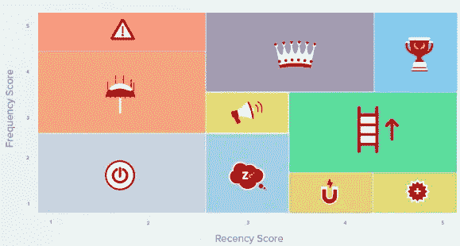
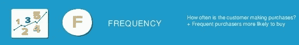
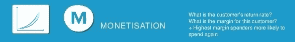

# 什么是 RFM？我们为什么要这样做？我们应该怎么做？

> 原文：<https://medium.com/analytics-vidhya/what-is-rfm-why-should-we-do-how-should-we-do-d0f09d7de5b5?source=collection_archive---------21----------------------->

客户细分表

**RFM** 是一种用于分析[客户](https://en.wikipedia.org/wiki/Customer)价值的方法。它通常用于[数据库营销](https://en.wikipedia.org/wiki/Database_marketing)和[直接营销](https://en.wikipedia.org/wiki/Direct_marketing)，并在[零售](https://en.wikipedia.org/wiki/Retail)和专业服务行业受到特别关注。

RFM 代表三个维度:

*   **R** ecency — *客户最近购买了什么？*
*   频率—他们多久购买一次？
*   他们花了多少钱？

# 了解新近性、频率、货币价值(RFM)

最近、频率、货币价值(RFM)的概念被认为可以追溯到 Jan Roelf Bult 和 Tom Wansbeek 的一篇文章，“直邮的最佳选择”，发表在 1995 年的一期《营销科学》上。RFM 分析经常支持营销格言“80%的业务来自 20%的客户”

让我们更仔细地看看每个 RFM 因素是如何工作的，以及公司如何在此基础上制定战略。

# 崭新

顾客在一家公司购买的次数越多，他或她就越有可能在以后的购买中继续记住这家公司和品牌。与几个月甚至更长时间没有从该企业购买的客户相比，与最近的客户进行未来交易的可能性可以说更高。

此类信息可用于提醒最近的客户尽快重访该企业，以继续满足他们的购买需求。为了不忽视流失的顾客，可以进行营销努力来提醒他们自从上次交易以来已经有一段时间了，同时向他们提供激励来重新点燃他们的顾客。

# 频率

客户的交易频率可能会受到产品类型、购买价格以及补货或替换需求等因素的影响。如果购买周期可以预测，例如当顾客需要购买新的食品时，营销工作可以针对提醒他们在鸡蛋或牛奶等物品耗尽时访问该企业。

# 币值

货币化(货币)

货币价值来源于客户在交易过程中对企业支出的获利能力。一种自然的倾向是更加重视鼓励那些花钱最多的顾客继续这样做。虽然这可以在营销和客户服务方面产生更好的投资回报，但它也有疏远客户的风险，这些客户一直很稳定，但每次交易都没有花那么多钱。

这三个 RFM 因素可用于合理预测客户再次与公司做生意或再次捐赠的可能性(或不太可能)。

# **我们有 RFM 所需的基本信息。那么我们如何应用它们呢？**

为此，我用 Python 和 Kaggle 创建了这个笔记本。

我们将在本笔记本中使用真实的超市数据。

> 【https://archive.ics.uci.edu/ml/datasets/Online+Retail+II 
> 
> 该在线零售 II 数据集包含 2009 年 1 月 12 日至 2011 年 9 月 12 日之间英国注册的无店铺在线零售发生的所有交易。该公司主要销售独特的各种场合的礼品。这家公司的许多客户都是批发商。

你可以从下面的 Kaggle 链接获得这个项目的所有解释。

> [https://www.kaggle.com/ibrahimyildiz/customer-segmentation](https://www.kaggle.com/ibrahimyildiz/customer-segmentation)

你也可以在下面的 GitHub 链接中找到一个不同的例子。

> [https://github.com/ibrahimYldzz/Rfm-Customer-Segmentation](https://github.com/ibrahimYldzz/Rfm-Customer-Segmentation)

这篇文章是我的第一篇文章。我试着尽可能多地告诉你。我希望它有帮助。感谢您的阅读:)

# 参考

*   [https://www . investopedia . com/terms/r/RFM-recency-frequency-monetary-value . ASP](https://www.investopedia.com/terms/r/rfm-recency-frequency-monetary-value.asp)
*   [https://en . Wikipedia . org/wiki/RFM _(市场研究)](https://en.wikipedia.org/wiki/RFM_(market_research))
*   [https://clevertap.com/blog/rfm-analysis/](https://clevertap.com/blog/rfm-analysis/)