# 递归神经网络——完整而深入

> 原文：<https://medium.com/analytics-vidhya/what-is-rnn-a157d903a88?source=collection_archive---------6----------------------->

# 什么是 RNN？

递归神经网络是一种深度学习神经网络，它记住输入序列，将其存储在记忆状态/细胞状态中，并预测未来的单词/句子。

# ***为什么是 RNN？***

RNNs 可以很好地处理序列形式的输入。举个例子，考虑一下，***我喜欢吃冰淇淋。我最喜欢的是巧克力 _ _ _ _***。

对于人类来说，用 ***冰淇淋*** *，*这个词来填空是显而易见的，但是机器要理解上下文，记住句子中前面的词，才能预测后面的词。这就是 rnn 有用的地方。

***应用* :** —语音识别(谷歌语音搜索)、机器翻译(谷歌翻译)、时间序列预测、销售预测等。

# ***RNN 的建筑和工作***

让我们考虑 x11、x12、x13 作为输入，O1、O2、O3 分别作为隐藏层 1、2 和 3 的输出。输入在不同的时间间隔被发送到网络，所以假设 x11 在时间 t1、x12 @ t2 和 x13 @ t3 被发送到隐藏层 1。

此外，让我们假设权重在前向传播中是相同的。

输出 O3 取决于 O2，O2 又取决于 O1，如下所示。

O1 = f(x11*w) →其中 w 为重量，f 为[激活函数](https://tejasta.medium.com/activation-functions-in-neural-networks-69197497bd1d)。

O2 = f(O1+x12*w)

O3 = f (O2 + x13*w)

最后，O3 的输出是 ŷ指示的实际输出

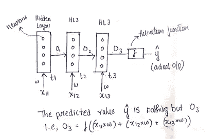

简单 RNN 的建筑和工作

现在，损失函数将被计算为(y-ŷ)^2.)目标是将 [**损失函数**](https://towardsdatascience.com/common-loss-functions-in-machine-learning-46af0ffc4d23) 减少到我们得到 y = ŷ的点，以便达到全局最小值，该全局最小值建立了必须添加到网络中的适当权重。这是通过使用**优化器**调整权重在反向传播中实现的。

***链式微分法则*** 在反向传播中的应用举例:

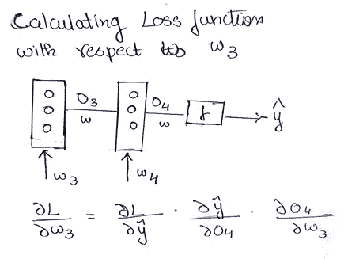

微分链式法则

# ***双向 RNN***

例子:****我肚子 ____ 饿了，今天午饭我一口气能吃 3 个大披萨****。所以，忘记机器吧，人类不读完整个句子就无法预测合适的单词。在这种情况下，我们利用双向递归神经网络，它不仅提供来自过去的信息，还保存来自未来的信息。

双向 RNN 的概念是耦合*两个具有相同输入的隐藏层并产生输出*。发明在于，我们为感兴趣的特定隐藏层获得的输出将具有来自过去和未来的信息。参见下面的架构，

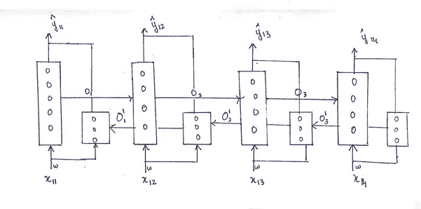

双向 RNN 架构

为了清楚起见，为了预测 ŷ13 的产量，我们有 O1，O2(从正向)，还有 O|3(从反向)。双 RNN 的缺点是速度慢。

# **RNN 的弊端**—

1.**消失渐变问题**——这发生在我们使用某些激活函数的时候。因此，在反向传播期间，从一层到另一层的权重更新将非常小，并且在某一点上，必须添加的新权重将变得等于旧权重，因此没有变化，并且训练网络是困难的。

2.**爆炸梯度问题** —在这种情况下，权重更新是如此之大，以至于网络无法从训练数据中学习，因此永远无法达到全局最小值。

因此， **LSTM(长短期记忆)**和 **GRU(门控循环单位)**效果更好。

# *LSTM——长短期记忆*

LSTMs 解决了消失梯度问题。

LSTMs 具有两种状态，即隐藏状态和小区状态，如同只具有隐藏状态的 rnn 一样。

当上下文变化时，LSTMs 会忘记一些不重要的信息，因此即使对于长句也非常有效，但 RNN 不是这样的。

# *LSTM 的建筑和工作*

LSTM 的主要组成部分是-

1.存储单元

2.输入门

3.忘记大门

4.输出门

下面是 LSTM 的结构。让我们来了解一下操作

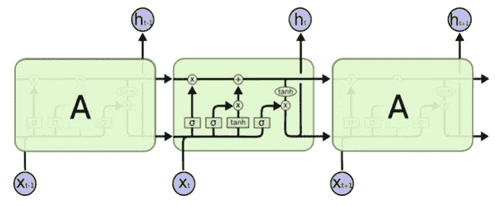

LSTM 建筑

1.  **忘记大门**

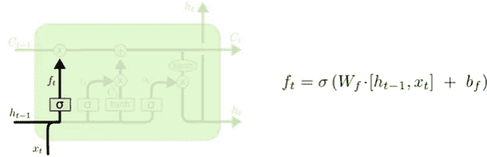

忘记大门

这里，输入 ht-1 和 xt 被传递到 sigmoid 激活函数，该函数输出 0 和 1 之间的值。0 表示**完全忘记**，1 表示**完全保留信息**。我们使用 sigmoid 函数作为门。

注:bf 是偏差，Wf 是两个输入的综合权重。

2.**输入门**

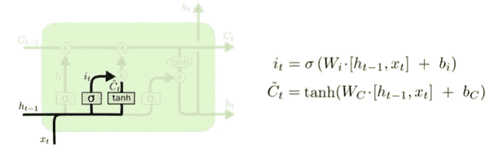

输入门

这一阶段的动机是识别新信息并添加到单元状态中。这分两步完成。

**步骤 1** :根据输入 ht-1 和 xt，s 形层输出一个介于 0 和 1 之间的值。如上图所示。同时，这些输入将被传递到 tanh 层，该层输出-1 和 1 之间的值，并为输入创建向量。

**步骤 2:** 将 s 形层和 tanh 层的输出相乘

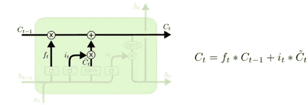

更新单元状态

现在，单元状态从 Ct-1(先前的 LSTM 单元输出)更新为 Ct(当前的 LSTM 单元输出)，如上所述。

3 **。输出门**

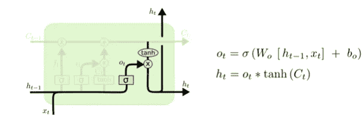

输出门

首先，单元状态通过 tanh 函数传递，同时我们将输入 ht-1 和 xt 发送到 sigmoid 函数层。然后发生乘法，并且 **ht** 是该存储单元的输出，并且被传递到下一个单元。

# *门控循环单元*

为了更快的计算和更少的内存消耗，使用了 gru。当精度是关键时，LSTMs 表现更好。gru 没有细胞状态，只有隐藏状态。

# ***GRU 的建筑和做工***

GRU 的主要组成部分是-

1.更新门(z)

2.复位门(rt)

下图代表 GRU

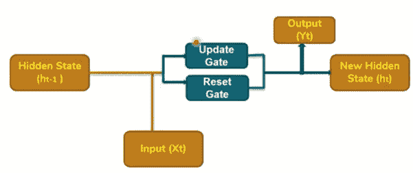

门控循环单元框图

1.  **更新门** —必须向前传递的信息量

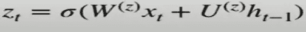

其中，W(z)是与 xt 相关的权重，U(z)是与来自前一状态(ht-1)的输入相关的权重，σ是 sigmoid 激活函数。

输出 zt 将在 0 和 1 之间，基于此信息将被传递。

**2。重置门** —确定要忘记的信息量

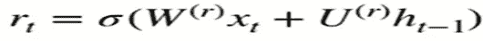

其中，W(r)是与 xt 相关的权重，U(r)是与来自前一状态(ht-1)的输入相关的权重，σ是 sigmoid 激活函数。

基于将被遗忘的信息，输出 rt 将在 0 和 1 之间。

现在，重要的一步是在网络中添加一个叫做复位门的存储元件。该重置门提取重要信息或关键点，并赋值= 1，其余所有句子将赋值= 0

数学上我们计算如下:

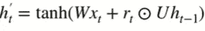

最后，我们使用下面的公式

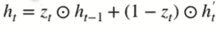

使用这个公式，我们计算将被传递到后续单元的 ht 的当前状态。

# *序列到序列学习*

序列到序列学习背后的思想是，以一种语言接收的输入数据被转换成另一种语言。例如:英语→索马里语。

序列到序列学习的类型

1.序列到序列—输出等于输入的数量。

2.序列到向量——对于“n”个输入，给出一个输出

3.向量到序列—1 个输入接收“n”个输出

4.向量到向量-针对单个输入接收单个输出

下图总结了上述 4 种学习方法的架构

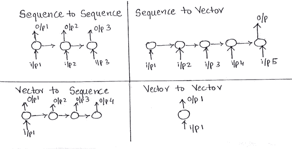

序列-序列学习的 4 种方法

# *编码器—解码器/ Sutskever 神经机器翻译模型*

输入序列和输出序列的长度并不总是相同的。例子—

编解码器的应用实例

在上面的翻译中，我们看到，在英语中我们有 3 个字符，但在索马里，它是 2 个字符。在这种情况下，使用编码器和解码器。

# *编码器-解码器的架构和工作方式*

编码器是由 LSTM 或 GRU 单元组成的输入网络，解码器是由 LSTM 或 GRU 单元组成的输出网络。

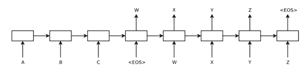

编码器-解码器架构

**编码器** —我们将 A、B、C 字输入到编码器网络，我们得到一个概括了输入信息的上下文向量‘w’。

注意:当网络点击<eos>时，它停止进程。</eos>

**解码器** —上下文向量“w”被发送到解码器网络，如上图所示。对于解码器网络的每个输入，我们得到输出(X，Y，Z)。

解码器网络的最终输出与输入序列进行比较，并计算损失函数。在反向传播中使用优化器将该损失函数减少到点*实际结果=预测结果*。

**编码器和解码器的缺点—** 上下文向量概括了整个输入序列，但不是输入序列中的所有单词都有价值包括在摘要中。这可以通过使用基于注意力的模型来克服。

# *注意力模式*

概念——想象你正在听一场演讲，在演讲结束时，你不会记住演讲者所说的每一句话，但你会记住演讲的要点或摘要。这就是注意力模型的概念。

# *注意力模型的架构和工作方式*

我们在编码器和解码器之间有一个神经网络。神经网络的输出将是解码器的输入。在这一点上，我们还必须理解，神经网络的输出将是在它接收的输入中具有最大注意力或焦点的输出，或者是对预测重要的词。

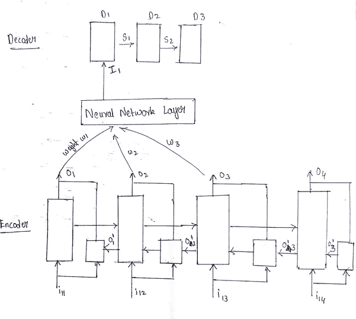

基于注意力模型的体系结构

要学习高级概念，请参考下面链接的精彩文章-

**变形金刚**——[http://jalammar.github.io/illustrated-transformer/](http://jalammar.github.io/illustrated-transformer/)v

**伯特**——[http://jalammar . github . io/a-visual-guide-to-use-BERT-first-time/](http://jalammar.github.io/a-visual-guide-to-using-bert-for-the-first-time/)

**GTP 3**—[http://jalammar . github . io/how-gp T3-works-visualizations-animations/](http://jalammar.github.io/how-gpt3-works-visualizations-animations/)

**致谢**

1.  https://www.youtube.com/user/krishnaik06/featured 的克里斯·纳伊克
2.  [https://colah.github.io/posts/2015-08-Understanding-LSTMs/](https://colah.github.io/posts/2015-08-Understanding-LSTMs/)
3.  施拉姆·瓦苏德万—[https://www.youtube.com/channel/UCma2b1uVLajAq9nHSEJh9HQ](https://www.youtube.com/channel/UCma2b1uVLajAq9nHSEJh9HQ)
4.  序列对序列学习-[https://papers . nips . cc/paper/2014/file/a 14 AC 55 a4 f 27472 C5 d 894 EC 1c 3c 743d 2-paper . pdf](https://papers.nips.cc/paper/2014/file/a14ac55a4f27472c5d894ec1c3c743d2-Paper.pdf)

通过以下方式联系我—

电子邮件—tejasta@gmail.com

领英—【https://www.linkedin.com/in/tejasta/ 

感谢阅读！