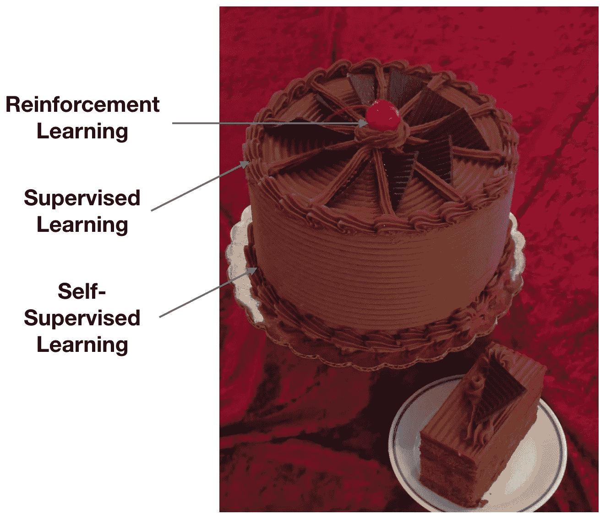
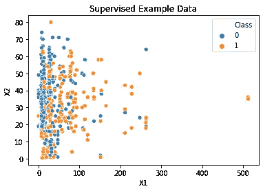
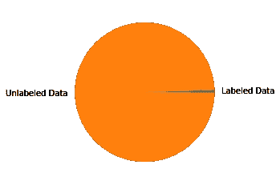
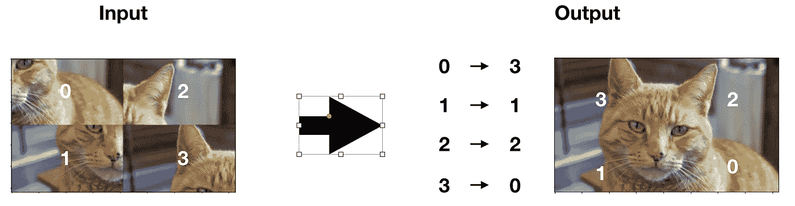
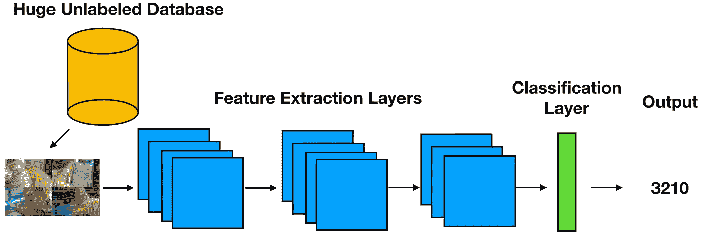
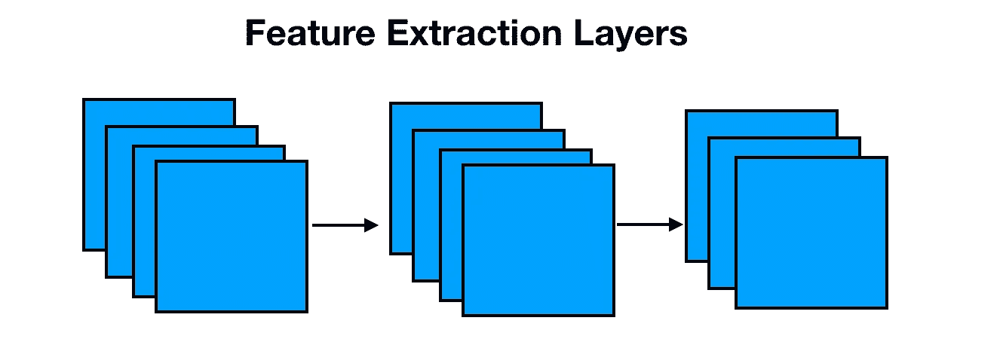
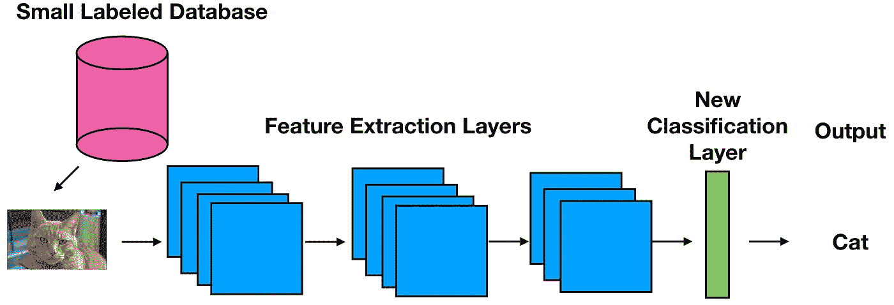

# 什么是计算机视觉中的自我监督学习？简单介绍一下。

> 原文：<https://medium.com/analytics-vidhya/what-is-self-supervised-learning-in-computer-vision-a-simple-introduction-def3302d883d?source=collection_archive---------5----------------------->

“如果智能是一块蛋糕，那么蛋糕的大部分是自我监督学习，蛋糕上的糖衣是监督学习，蛋糕上的樱桃是强化学习(RL)。”——Yann le Cun 脸书 AI 负责人

如果你想看一个简单的自我监督学习的例子，用代码， [**看看我的另一篇文章。**](/@larsvagnes/self-supervised-learning-for-image-classification-263e320fff07?sk=30731cabf21e91846b9c0d85d25092c2)

最近，自监督学习已经成为机器学习领域的一个热门话题，该领域的几位巨头(如 Hinton 和 Yann LeCun)都在宣传它的重要性。在这篇文章中，我将尝试定义自我监督学习，解释我们为什么使用它，并给你一个(极其)简单的例子来说明它在实践中的应用。

首先，我们需要定义一些术语:

*   监督学习
*   自我监督学习
*   借口和下游任务

# 监督学习

典型的监督学习示例可以从上面的示例数据中得到解释。在这种情况下，我们正在处理二元分类问题，其中目标是基于特征向量 X =(x1，x2)将数据样本分类到类 0 或类 1。

监督学习设置的一个例子是，我们建立一个机器学习模型，通过预测给定 X，p(y=0|X)的 0 类概率，学习如何将样本分类为 0 类或 1 类，然后惩罚犯错误的系统。简而言之，这就是监督学习。

**监督学习的一个关键隐含特征是，标记的数据对是由人类注释生成的(想象人类在图像中发现猫或狗)**。这限制了可以为特定任务生成的数据量，并且由于数据是性能的最重要限制因素之一，这是一个问题。标记数据只占所有数据的一小部分。如果我们只使用我们的标签数据集，我们会留下很多东西。

我们如何解决这个问题？进入自我监督学习。

# 自我监督学习

自我监督学习是在一项任务上训练一个 ml 系统的概念，在这项任务中，我们可以自动生成输入和目标对(X，y)**，从而放弃人为数据标记的整个问题。**

**自我监督学习仍然是监督学习，所以我们所说的关于监督学习的一切仍然适用，唯一的区别是我们正在解决的任务和我们的标记数据对是如何生成的。**

**在自我监督学习范例中，我们希望找到一些方法来生成我们的标记数据对，而不涉及任何人，我们希望机器来做这件事。如果我们认为我们的系统由数据生成算法和学习算法组成，它会生成“自己的标记数据”，因此我们称之为自我监督。但是我们如何找到一个这样的数据生成算法呢？我们需要决定一个相关的借口任务。**

# **借口和下游任务**

*   **在计算机视觉中，借口任务是这样设计的任务，即被训练来解决它们的网络将学习可以容易地适应其他下游任务的视觉特征。**
*   ****下游是一个典型的具有真实世界应用程序和人工注释数据的任务。****

**有许多不同种类的借口任务。最简单的方法通常涉及输入数据的增强，然后训练网络来学习应用了什么增强，示例包括旋转、颜色去除等等。这样，我们可以自动生成输入和所选任务的解决方案。**

****它在实践中是如何运作的？**这里有一个非常简单的例子，使用解谜作为借口任务:**

**我们正在处理图像，我们的下游任务是图像分类，我们希望将图像分类到正确的类别(狗、猫、马等)。**

**然而，我们只有 1000 个标记图像，这对我们的神经网络来说是太少的样本，无法很好地概括。**

**我们将使用自我监督学习，让神经网络在我们对目标分类任务进行微调之前，首先学习图像的一些一般特征，而不是启动新的标记工作，并雇用人类来完成标记新图像的单调乏味的任务。**

**计算机视觉中借口任务(或辅助任务)的一个例子是解谜。**

****

**自我监督拼图设置**

**这里的希望是，为了学习如何解决这些类型的难题，我们的神经网络需要学习我们用作自我监督数据集的图像分布的一些一般特征，并且这些特征可以适用于我们的下游任务。如果我们在下游任务上微调我们的神经网络，例如物体分类，那么我们希望看到一些学习转移。**

****

**自我监督学习设置示例**

**既然我们已经训练了一个在托词任务中表现良好的神经网络，我们真正感兴趣的是特征提取层。这是较低层次和更多任务无关的特性将驻留的地方，我们将把它们用于我们的下游任务。**

****

**要素提取图层**

**将移植的特征提取层与任务相关的最终层相结合，我们得到我们的目标模型。**

****

**下游任务监督学习设置**

**就是这样！**

**现在你对自我监督学习及其效用有了初步的了解。**

**总之，我们可以使用自我监督学习来克服我们在给定任务中缺乏标记数据的问题。我们选择了一个借口任务，这样我们就有了一个可以生成标记数据对的算法。然后，我们用大量数据在这个托词任务上预先训练我们的模型，希望它学习的特征可以转移到我们的下游任务，令人惊讶的是，它经常这样做！一句话，自我监督学习用更少的人工标注数据获得了良好的性能。**

# ****延伸阅读****

*   **[扬尼克·基尔彻解释 simclrv 的视频](https://www.youtube.com/watch?v=2lkUNDZld-4) 2**
*   **[杰里米·霍华德对计算机视觉中自我监督学习的分解](https://www.fast.ai/2020/01/13/self_supervised/)**
*   **[自我监督的视觉特征学习](https://arxiv.org/pdf/1902.06162.pdf)**

****谢谢！****