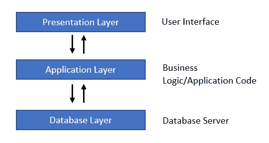
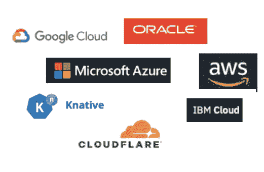

# 什么是无服务器计算？

> 原文：<https://medium.com/analytics-vidhya/what-is-serverless-computing-b65037759746?source=collection_archive---------26----------------------->

> 初学者指南

马尔科·布拉泽维奇在 [Unsplash](https://unsplash.com/s/photos/technology?utm_source=unsplash&utm_medium=referral&utm_content=creditCopyText) 上的照片

**无服务器计算是如何出现的？**

在开发 web 应用程序的早期阶段，开发人员必须使用他们自己的物理硬件来运行服务器。这是非常麻烦和昂贵的。此外，只有具有这种需求的人才能开发 web 应用程序。但是后来一项名为云计算的新技术被引入。这使得服务器无需绑定到物理硬件就可以移植。在这里，开发人员可以根据他们的需求远程租用服务器。通常，开发商和公司过度购买服务器单元，以确保系统在流量情况下不会出现故障，并确保超出的活动不会破坏系统。因此，一些已经付费的租用服务器空间被浪费了。作为一种解决方案，云供应商引入了无服务器计算，开发者可以在使用的基础上购买服务器服务。简单地说，你只需为你使用的东西付费。

**无服务器计算与传统计算的对比**

**什么是传统计算？**

传统计算通常遵循三层架构。

三层架构

在实施应用程序之前，我们必须通过创建或设置服务器、安装必要的操作系统和必要的软件来构建环境或基础架构。此外，在应用程序的整个生命周期中，我们必须在管理软件和硬件的同时关注它们的升级。此外，我们必须确保应用程序的高可用性、可伸缩性和容错性。这些都增加了管理应用程序的额外成本。好吧，管理所有这些资源而不是开发应用程序是非常麻烦和昂贵的。即使您没有使用全部创建的容量，您也必须向服务器支付高额费用。如果您创建了一个 100GB 的服务器，并且只使用了其中的 80GB，那么无论您是否使用它，您都必须为所有的 100GB 付费。真是浪费……

嗯，无服务器计算是所有这些麻烦的解决方案。

**什么是无服务器计算？**

*“构建和运行应用程序，无需考虑服务器。”*

无服务器计算将开发人员从管理基础设施(服务器、操作系统、软件或硬件)中解放出来。这意味着开发人员不需要担心服务器管理的底层细节。服务供应商自动管理和扩展为您运行代码所需的基础设施。

*“按使用付费”*

因此，开发者可以使用这些服务，并且只为他们使用的服务付费。

尽管我们觉得无服务器这个名字意味着“没有服务器”，但是服务器仍然在运行代码。名称“无服务器”仅仅意味着与基础设施管理相关的任务对开发人员来说是不可见的。有了这个概念，开发人员可以将他们宝贵的时间花在更关注业务逻辑和交付更有价值的产品上，而不是花在管理基础设施上。

**无服务器计算的优势**

1.  无需基础设施管理:无需管理任何服务器、操作系统、软件或硬件。只需关注应用程序逻辑。
2.  动态可扩展性:无服务器应用程序可以自动扩展，或者您只需点击几下鼠标就可以选择所需的容量。无需创建任何专门的可扩展架构。
3.  没有闲置容量:您只需为您使用的容量付费。无需为未使用的容量付费，这也提高了成本效率。
4.  高可用性和容错性:默认情况下，无服务器计算机应用程序具有高可用性和容错性。因此，你不再需要担心他们，供应商会处理好的。
5.  更快的上市时间:由于开发人员从管理基础设施中解脱出来，他们可以更专注于应用程序开发，并在更短的时间内交付产品。

*高可用性*——系统或系统组件在期望的长时间内持续运行的能力

*容错*-尽管存在系统或硬件故障，计算机应用程序仍能继续正常运行的能力

**无服务器的使用案例**

1.  web/移动应用程序和后端。
2.  数据处理
3.  持续集成和持续部署(CI 和 CD)
4.  多语言应用程序
5.  处理事件和 Saas
6.  事件流
7.  图像和视频处理

**无服务器厂商**

1.  自动气象站λ
2.  微软 Azure
3.  谷歌云平台
4.  IBM 云功能
5.  有创造力的
6.  神谕

一些无服务器供应商

**无服务器计算的缺点**

1.  安全问题:由于第三方 API 的使用，安全成为一个问题。许多客户使用无服务器功能，这带来了许多安全问题，如 DDoS 攻击、不安全的第三方依赖、功能事件数据注入等。
2.  调试困难:在不增加额外工具(记录无服务器功能的第三方工具)的情况下，调试一个无服务器功能既麻烦又费时。
3.  供应商锁定:从一个无服务器平台迁移到另一个平台非常困难。一个平台中的 API 可能在另一个平台中不可用。在迁移的情况下，可能需要重写代码。
4.  实现的缺点:在无服务器应用程序中测试是困难和麻烦的。还可能存在与部署、版本和打包相关的问题

这只是无服务器计算的初学者指南。希望这能让你对无服务器计算有一个大致的了解，还有很多东西需要学习。

干杯，祝你好运！！！！