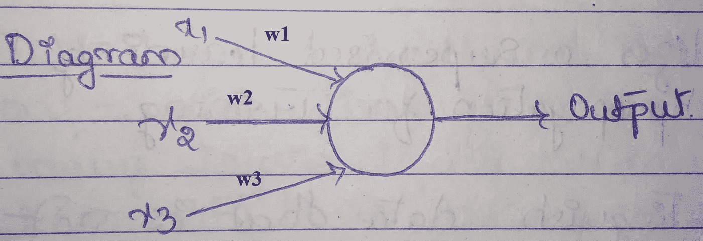
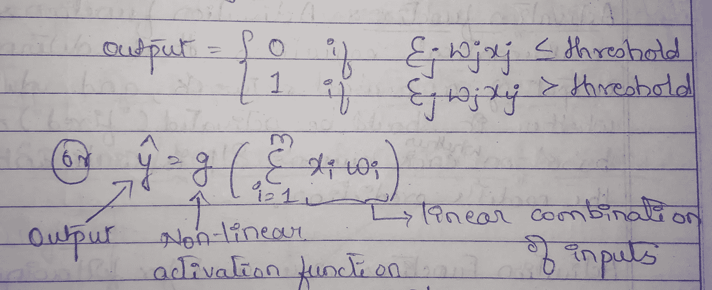
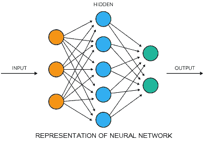
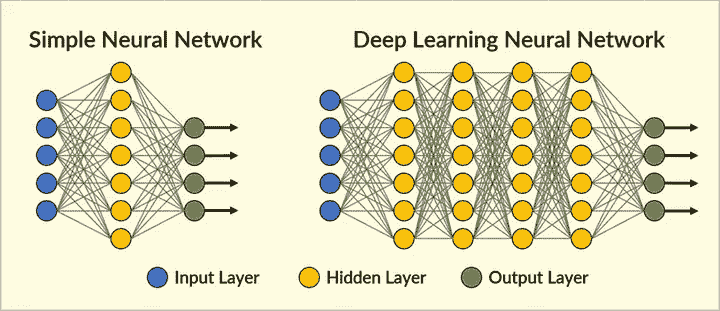

# 深度神经网络中有什么东西是如此的深？

> 原文：<https://medium.com/analytics-vidhya/what-is-so-deep-in-a-deep-neural-network-9516ba4b855?source=collection_archive---------36----------------------->

里卡多·佩拉蒂在 [Unsplash](https://unsplash.com?utm_source=medium&utm_medium=referral) 上拍摄的照片

如果你想知道为什么在深度神经网络中使用“深度”这个词，那么这就是你要找的正确的帖子。

当我在攻读人工智能技术硕士学位时，我有一个名为**深度神经网络**的课题。题目中的深字，是让我和你分享这篇文章的原因。

我想从基础开始，因为我想让我的帖子对所有试图获得深度神经网络知识的新手开放。

如果你来自生物学背景，你知道神经元如何工作，那么理解神经网络如何工作对你来说是一件容易的事情，因为神经网络的概念是基于我们大脑中神经元的工作方式。

首先:

# 什么是感知器？

感知器是神经网络的基本单元(简而言之，感知器的组合构成了一个完整的神经网络)。这些感知器接受加权输入，对其进行处理，并能够进行二进制分类(0 或 1)。感知器接受几个输入并产生一个输出。它是存在于人脑中的生物神经元的简单模型。

这是感知器的样子:

上图显示了一个感知器，它有 3 个输入，分别命名为 x1、x2、x3，还有一个神经元单元，它可以生成一个输出值(在二进制分类的情况下，输出可能是 0 或 1、猫或狗、是或否等；).

> 记住**感知器**也被称为**节点**

数学上，我们将感知器的输出表示为:

感知器里有什么:

来源:https://www . anhvnn . WordPress . com 2018 01 16 深度学习神经网络

感知器的内部分为两部分:

1.  求和部分:其中输入 x1、x2、x3……xn 和重量 w1、w2、w3……wn 分别相乘，并将所有相乘的值相加[权重的值实际上决定了输入对输出的实际贡献]。
2.  激活函数:激活函数用于消除数据中存在的线性。有几个激活功能用于执行该操作。我将在接下来的文章中分享更多关于激活功能的信息，因为简单介绍激活功能对这篇文章的最终目标没有太大帮助。
3.  输出:如图所示，相乘后的输入、权重和偏差通过激活函数，最终生成输出。

现在继续前进，

# 什么是人工神经网络？

人工神经网络是由彼此部分/完全连接的神经元组成的网络。这是一个简单的人工神经网络的样子:

来源:[https://www . psychz . net/client/kb/en/what-is-a-neural-network . html](https://www.psychz.net/client/kb/en/what-is-a-neural-network.html)

神经网络基本上由三个重要的组件/层组成，即:

1.  输入层:输入通过这些神经元输入到网络中。
2.  隐藏层:这些层存在于输入层和输出层之间。
3.  输出层:最末端是输出层，根据需求提供输出。

正如您在图像(神经网络的表示)中看到的，圆形组件是网络中所谓的节点/神经元。每个节点都有输入进来，对相乘的分量[(权重 X 输入)+偏差]求和，然后通过激活函数。此外，该值再次被传递到下一层中的另一个神经元，并且再次重复该循环，直到它到达最后一层。

基本上，神经网络的目标是学习权重和偏差，以获得期望的输出。

现在我们知道了感知器/节点和神经网络，让我们看看(a)简单神经网络(b)深度神经网络

下面显示的一个简单的图表可以帮助我们理解是什么使一个简单的神经网络变成一个深度神经网络。

来源:[https://www . securityinfowatch . com/video-monitoring/video-analytics/article/21069937/deep-learning-to-rescue](https://www.securityinfowatch.com/video-surveillance/video-analytics/article/21069937/deep-learning-to-the-rescue)

一个简单的神经网络在其网络中几乎没有 2-3 个隐藏层，而在深度学习神经网络中，大约有 150 多个隐藏层。那是巨大的，不是吗？

# 这就是为什么在深度神经网络中存在*DEEP*这个名字。

深度神经网络可以很好地处理大量数据。在训练过程中，你在网络中输入的数据越多，网络从数据中学到的就越多。

# 这就是为什么专家说“深度学习算法随着数据而扩展”，这意味着准确性可能会随着输入网络的数据量的增加而增加。

深度神经网络是一个有趣的概念。知道这些网络如何出色地适应和学习给定的数据是疯狂的。

如果你有一个巨大的数据，例如 10，000 张狗和猫的图像，那么下次你想训练你的网络来识别图像中的狗/猫，你应该考虑在深度神经网络上开发模型。

如果你想训练一个简单的人工神经网络，那么你可能想看看这篇文章“[机器可以学习和预测吗？—使用 Pytorch 为 Iris 数据集训练深度神经网络。](/analytics-vidhya/can-machines-learn-and-predict-training-a-deep-neural-network-using-pytorch-for-iris-data-set-5fd8cb803fc4?source=friends_link&sk=afd12675840b8e606e4b028086d59809)

欢迎通过 [LinkedIn](https://www.linkedin.com/in/arnold-sachith-98752a141/) 、 [Instagram](https://www.instagram.com/arnoldsachith/) 或[脸书](https://www.facebook.com/arnold.sachith)与我联系。

朝着你的目标不断深入思考:)

干杯

阿诺德·萨希特