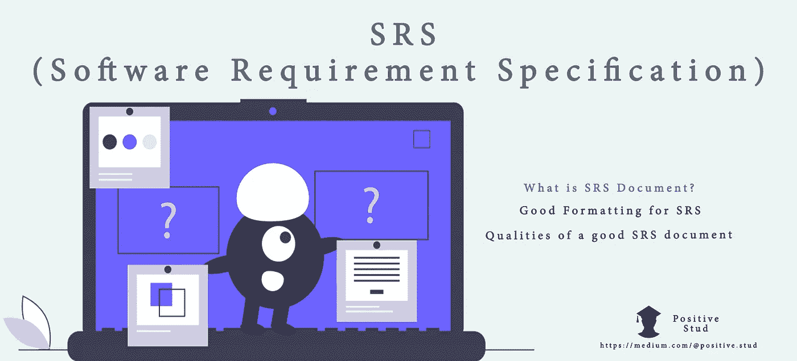

# 什么是 SRS(软件需求规格说明)文档及其需求？

> 原文：<https://medium.com/analytics-vidhya/what-is-srs-software-requirement-specification-document-and-its-requirements-b57bf87bb868?source=collection_archive---------1----------------------->

> 软件需求规格说明

开发团队用精确的规格构建正确的产品，软件需求规格(SRS)使您能够为产品开发打下基础。