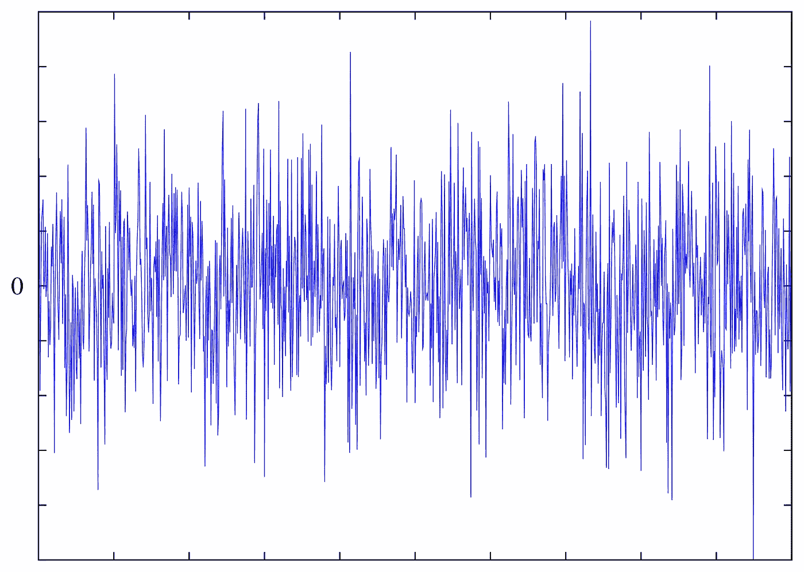

# 什么是平稳性？

> 原文：<https://medium.com/analytics-vidhya/what-is-stationarity-8f16cdfa7e5f?source=collection_archive---------9----------------------->

杰克·希尔斯在 [Unsplash](https://unsplash.com?utm_source=medium&utm_medium=referral) 上的照片

平稳性在时间序列分析中起着非常重要的作用。当我们在不同时间对某一参数有大量的观察结果时，我们自然希望将它们全部用于预测或分类模型等。但是通常我们的数据还没有准备好进行分析，因为它被认为是不稳定的。

但是这到底是什么意思呢？嗯，平稳性在数学上可以定义为一些随机过程的度量，其中描述这个过程的累积分布函数不依赖于时间参数。更准确地说，当过程累积分布函数对时间的偏导数总是等于零时，该过程被认为是**严格平稳、强平稳**或**严格意义上的平稳**。

听起来确实很复杂。毫不奇怪，事实也证明，这种情况在现实生活中很少出现。严格平稳性需要所有分布参数(通常称为矩)，如方差、期望值等。-永远不要依赖时间。还有其他类型的平稳性(称之为平稳性扩展)，例如:

*   **一阶平稳性**时间序列具有恒定的平均值，而方差等其他统计数据会随时间变化
*   **二阶平稳性**(通常称为*弱平稳性*)，其中均值、方差和自协方差不随时间变化。这可能是现实生活中最常见的情况

那么如果自然界中很少出现平稳性，我们如何确定我们的数据是否平稳呢？通常，很难判断数据是否符合平稳性，我们需要使用特定的测试来确定它是否符合平稳性，如下所示:

*   ***单位根*** 检验(**增广迪基-富勒**检验，**齐沃特-安德鲁斯**检验)
*   普雷斯特利-苏巴-拉奥试验
*   **基于小波的**测试
*   **运行顺序图**

除了作为 *A/B 测试*的最佳实践范例的**增强 Dickey-Fuller(或 ADF)** 测试之外，上述所有测试都很少见。通过尝试这样的测试，我们试图确定该过程是否是高度可信的平稳过程。换句话说，我们的时间序列数据是稳定的，如果它没有任何趋势(线性或非线性)和任何季节性。

假设平稳性在自然界很少发生，平稳过程的一个经典例子是白噪声。它符合定义，因为它的均值不随时间变化，它是完全随机的(意味着没有趋势)，并且它的方差是有限的。

由 omega tron——由用户创建:GNU 八度音阶中的 omega tron【https://commons.wikimedia.org/w/index.php?curid=648085 

看它的图，我们只能看到一组值在有限方差的给定区间内，随着时间的推移，围绕一个常数平均值振荡。虽然这看起来有些武断，但这是白噪音；然而，它在信号处理理论中起着重要的作用，在音乐、电子工程和计算(作为随机发生器)中也有重要的应用。它甚至帮助我们入睡！！！！！

来源——Youtube(【https://www.youtube.com/watch?v=wzjWIxXBs_s】T4)

如果我们的数据不是静态的，重要的是它是静态的，我们如何实现这一点？我们可以使用下面列出的算法对数据施加平稳性:

*   **对数据进行差分** —实现非平稳数据平稳性的最常见方式。通过差分，我们在技术上创建了一个新的数据集，它包含了给定时刻和先前时刻的观测值之间的差异。通常一次差分就足够了，尽管有时我们必须对数据进行两次差分才能达到平稳性。每一次差异都会将我们的数据集减少一个观察值，这对于较大的数据集来说是可以忽略的。
*   **拟合趋势** —当我们可以检测数据中的线性或曲线趋势时，使用该方法。我们有效地将趋势拟合到我们的数据中，并使用通常稳定的残差。
*   **平滑数据**(非正式术语)——对我们的数据应用平方根或自然对数变换，以实现平稳性(在负值的情况下向数据添加一些常数)

但是要注意，假设我们的数据是平稳的，我们会在思考和分析过程中引入一些偏差。事实上，平稳性允许我们使用大量依赖它的算法和方法，但我们永远不能 100%断定我们的数据是平稳的。然而，平稳性的重要性超过了给定数据的风险，因为平稳数据更容易分析和解释，以及根据这种分析做出推断。 ***平稳性背后的直觉是，对于平稳数据，我们分析其分布，而不是分析单个值及其方差，为了能够有效地做到这一点，我们需要我们的分布不随时间变化。***