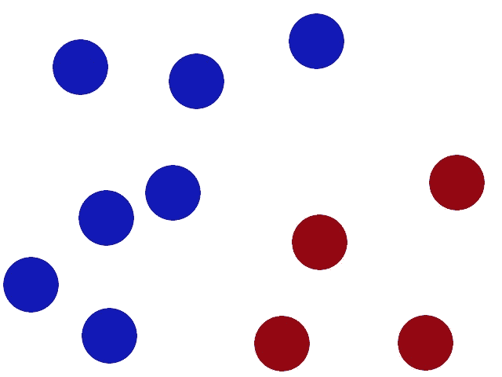
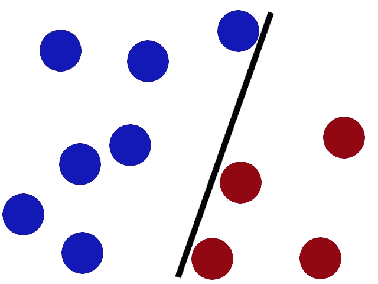
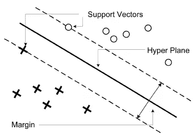
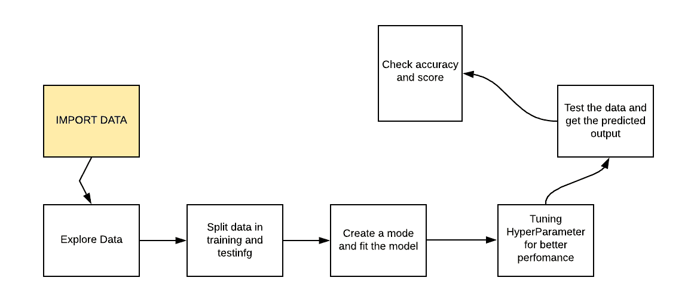

# 什么是支持向量机？

> 原文：<https://medium.com/analytics-vidhya/what-is-support-vector-machine-dd3e7cac9dd1?source=collection_archive---------29----------------------->

假设你在纸板上有很多红色和蓝色的点。



同一平面上的不同点

我们被要求在这两个点之间放一根棍子，这样它就能把具有不同颜色的两个点分开。



在两个不同的点之间添加一个木棒。

现在我们可以很容易地将左边的点分为蓝色，右边的点分为红色。

但是过了一会儿，一个聪明的人来了，他把所有的要点以一种很难分类的方式放在一起，这可能是不可能的！

世界上没有一根棍子能让你很好地分开这些球，所以你会怎么做？你掀翻桌子！把球抛向空中。这时，凭借你天才的功夫，你抓起一张纸，塞进两个球之间。

等等，我们可以把它分类，但是我们得到了一条曲线。那么我们能做些什么呢？我们该如何解决这个问题呢？？？

希望我们的成员中有一个叫谢尔顿·库珀(哇哦)…

一个天才的头脑，和其他人相比，他生活在一个不同的思维状态和维度中。所以他想出了在更高维度中想象平面的想法…

后退一步，你会发现你看到的是一个三维立方体的一面。在这个立方体中，你可以很容易地在某个地方放置一个简单的平面纸板来分隔红色和蓝色的点(因为它们在不同的深度


回到 SVM 的想法，这取决于在三维空间中发现纸板的属性比在二维空间中简单得多。一个简单的三维平面在二维看起来会像一条弯弯曲曲的线。

所以这里的要点是数据和棍子

一个分类器，最大间隙技巧优化，把翻转表核和纸片称为超平面。

# SVM

SVM 与分析用于分类和回归分析的数据的学习算法相关联。它包括寻找超平面(2D 中的线、3D 中的平面和更高维度中的超平面)。更正式的说法是，超平面是 n 维空间的 n-1 维子空间，它以最大的裕度最好地分隔了两类点。本质上，这是一个受约束的优化问题，其中最大限度地提高了利润，同时又满足完美分类数据的约束条件(硬利润)。

超平面和在超平面任一侧的主点(对于所有不同的类)之间的间隔是确定计算是关于其分组选择的比例。差距越大，我们就越能确定 SVM 做出了正确的选择。超平面是一个子空间，它的维数比其周围空间的维数小一。如果空间是三维的，那么它的超平面就是二维平面。

SVM 与其他分类算法的不同之处在于，它选择的[决策边界](https://en.wikipedia.org/wiki/Decision_boundary)最大化了与所有类的最近数据点的距离。SVM 不仅仅是找到一个决策边界；它找到了最优的决策边界。



最佳决策边界是离所有类的最近点具有最大余量的边界。最大化决策边界和点之间距离的决策边界最近的点称为支持向量，如上图所示。支持向量机的决策边界称为最大间隔分类器，或最大间隔超平面。

SVM 的核心思想是找到一个最大边际超平面(MMH ),它能最好地将数据集划分成类。

**SVM 仁**

核的用途是将低维空间转换成高维空间。将系统连接成离散系统是用来分离不可分离的数据。

所以有三种内核:

1.  线性核
2.  多项式核
3.  径向基核

**线性核**:线性核可以作为任意两个给定观测值的正态点积。两个向量之间的乘积是每对输入值的乘积之和。

```
K(x, xi) = sum(x * xi)
```

多项式内核:多项式内核是线性内核的一种更一般化的形式。多项式核可以区分曲线或非线性输入空间。

```
K(x,xi) = 1 + sum(x * xi)^d
```

这里 d 是多项式的次数。

**径向基核:**径向基函数核是支持向量机分类中常用的一种流行的核函数。RBF 可以在无限维空间中映射一个输入空间。

```
K(x,xi) = exp(-gamma * sum((x – xi^2))
```

gamma 是一个参数，范围从 0 到 1。较高的 gamma 值将完全符合训练数据集，这会导致过度拟合。Gamma=0.1 被认为是一个很好的默认值。

**制作模型的步骤:**



**SVM 的优势:**

与朴素贝叶斯算法相比，SVM 分类器提供了良好的准确性并执行更快的预测。它们还使用较少的内存，因为它们在决策阶段使用训练点的子集。SVM 工作得很好，有清晰的分离边界和高维空间。

**SVM 的劣势:**

SVM 不适合大型数据集，因为它的训练时间很长，而且与朴素贝叶斯相比，它在训练中需要更多的时间。它对重叠类的处理很差，而且对使用的内核类型也很敏感。

**SVM 模型的应用:**

*   文本和超文本分类
*   图像分类
*   识别手写字符
*   生物科学，包括蛋白质分类