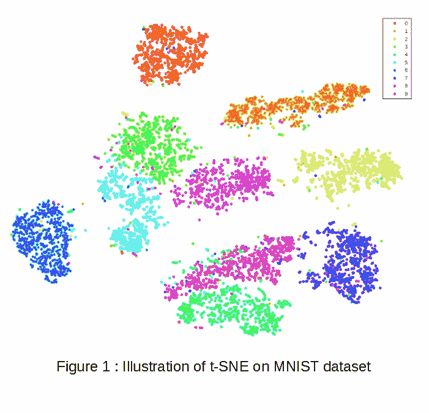
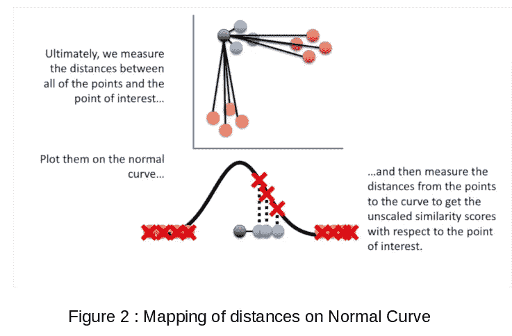
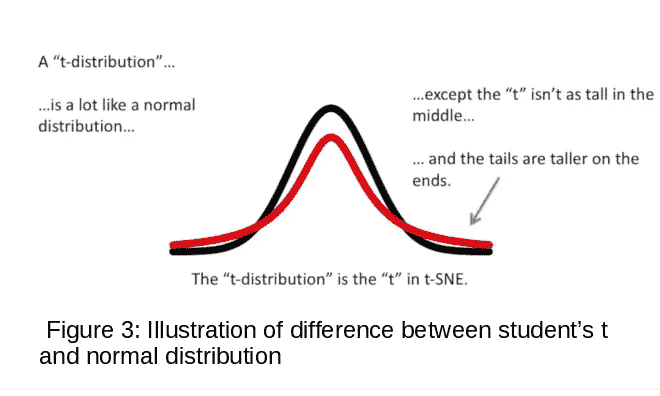

# 什么是 SNE 霸王龙？

> 原文：<https://medium.com/analytics-vidhya/what-is-t-sne-37bfb920e431?source=collection_archive---------6----------------------->

t-SNE(t-分布式随机邻居嵌入)是一种通过在二维或三维地图中给定每个点的位置来可视化高维数据的技术。该技术是随机邻居嵌入(SNE)变化，更容易优化，并产生明显更好的可视化。

其他几种技术可以用于可视化高维数据，如 [PCA](/swlh/what-is-pca-c311321eb528) ，这是一种线性技术，专注于保持不同数据点的低维表示相距较远。对于位于低维非线性流形上或附近的高维数据，通常更重要的是保持非常相似的数据点的低维表示尽可能接近，这对于线性映射通常是不可能的。t-SNE 能够捕捉高维数据的大部分局部结构，同时也揭示全局结构，例如在几个尺度上集群的存在。图 1 显示了 t-SNE 在由手写数字图像组成的 MNIST 数据集上的使用。

来源:使用 t-SNE 可视化数据，Laurens van der Maaten 和 Geoffrey Hinton 的研究论文

它首先将数据点之间的高维欧几里德距离转换成表示相似性的联合概率。例如，高维数据点 xj 与 xi 的相似性是联合概率 pji。 **pji 可以被解释为，如果在正态(高斯)分布下，按照概率密度的比例挑选邻居，则 xi 将挑选 xj 作为其邻居的概率。**对于附近的点，pji 将是高的，而对于相距较远的数据点，pji 将是无穷小的。图 2 显示了距离是如何被映射为正态曲线上的概率的。

来源:“StatQuest: t-SNE，解释清楚”Youtube

现在对于低维对应物，例如高维数据点的 yi 和 yj，xi 和 xj，可以计算类似的联合概率 qji。因为在高维空间中，我们使用正态分布将距离转换为概率，在低维地图中，我们可以使用比正态分布具有更重尾部的概率分布，将距离转换为概率。这允许高维空间中的适度距离被地图中的大得多的距离忠实地建模，结果，它消除了地图点之间的不必要的吸引力，这表示适度不相似的数据点(**拥挤问题**)。**在 t-SNE 中，我们采用学生 t 分布**作为低维地图中的重尾分布。图 3 说明了正态分布和 t 分布之间的区别。

来源:“StatQuest: t-SNE，解释清楚”Youtube

如果映射点 yi 和 yj 正确地模拟了高维数据点 xi 和 xj 之间的相似性，则联合概率 pji= qji。因此， **t-SNE 的目标是找到一种低维表示，使 pij 和 qji** 之间的不匹配最小化。

在 t-SNE 的计算中，一个参数被称为**‘困惑’，**，它可以被解释为有效邻居数量的**平滑度量，其典型值在 5 到 50 之间。**

参考资料:使用 t-SNE 可视化数据，Laurens van der Maaten 和 Geoffrey Hinton 的研究论文。