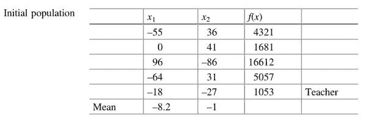
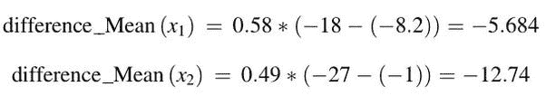
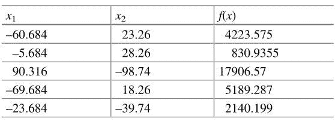
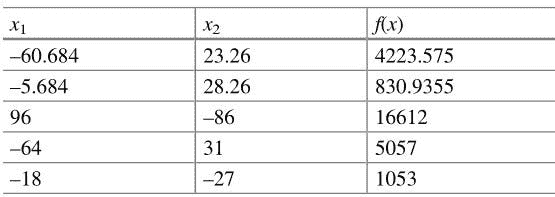
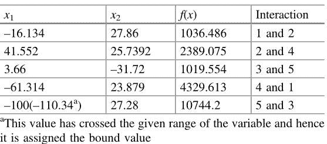
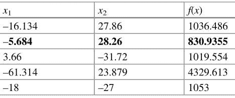
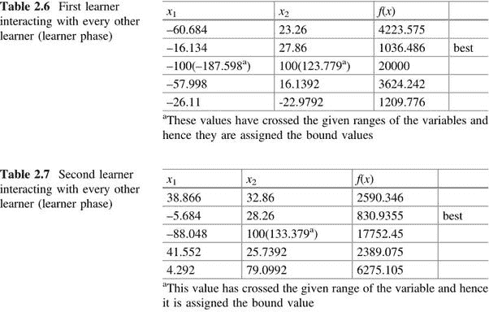
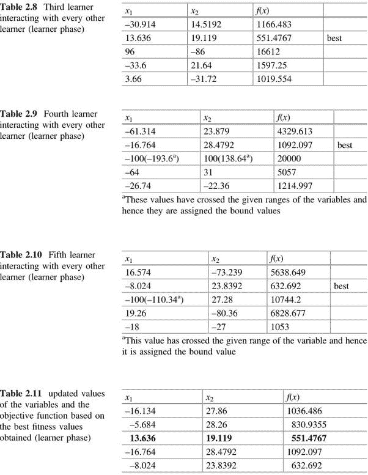

# 什么是基于教学学习的优化算法？

> 原文：<https://medium.com/analytics-vidhya/what-is-teaching-learning-based-optimization-tlbo-algorithm-b368098339e8?source=collection_archive---------4----------------------->

从标题来看，你已经足够好奇，想了解一下这个漂亮的优化算法。

所以，让我给你解释一下。

*   **什么是优化算法？**

获得目标函数的最优值(最大值或最小值)的逐步过程被称为**优化算法**。

从遗传算法到粒子群优化算法，有很多算法可以根据问题的类型来选择。

*   什么是 **TLBO** 算法？

这是一种算法，它基于一个教师对一个班级中的学习者的输出的影响。老师努力工作，让一个班的所有学生都受到教育。然后，学习者与自己互动，进一步修改和提高他们获得的知识。

有时，当我们需要优化一个问题时，通常我们会选择一个随机优化算法，该算法包含一些需要微调的参数，以便帮助我们以更少的工作量和时间尽快找到全局最优值。比如在 **PSO 算法中，**我们需要*惯性权重* (W)和*加速系数* (c1 和 c2)作为我们的参数。为了得到更好的结果，我们需要将*惯性权重* (W)取在 **0.4** 到 **0.9** 之间，如果我们取 c1 > c2，那么它有利于**全局最优**，而 c1 < c2 有利于**局部最优**。

但是 TLBO 算法不需要任何算法特定的参数，如 PSO 算法中的 W、c1、c2。

1.  **理论**

在这个算法中，我们取一个类 ***(Population，P)*** ，其中有特定数量的学习者 **(L)** 和主题 ***(优化问题的决策变量)*** ，他们将从老师那里收集知识。有两种学习模式

*   穿越师 ***(师相)***
*   通过与其他学习者的互动 ***【学习者阶段】***

学习者在考试中的结果(适应性)是我们需要的值，我们只在教师阶段和学习者阶段每次都保持最好的结果。

2.**工作**

为了理解优化算法的效率，我们采用一些测试函数并相应地执行全局优化。让我们以 ***球函数*** 为测试函数来试着理解这个算法。我们将采用一个测试函数来最小化这个优化问题。

**测试功能** —球面功能

**决策变量的范围:-** xi 在-100 和 100 之间

我们有 5 名学生和 2 个科目。

因此，学习者= 5，决策变量= 2。

根据我们的决策变量，目标函数或测试函数变成 x1 + x2。

*   **教师阶段**

在上图中，您可以看到，我们已经获得了一个包含 5 名学习者和 2 名受试者的初始群体，或者实际上说，5 行 2 列，每个值都在前面提到的决策变量的域中(xi 在-100 和 100 之间)。我们通过将 x1 和 x2 的值放入我们的目标函数来计算适应值。然后我们在另一列 f(x)中列表。由于我们需要最小化函数，我们将从表中选择最佳适应度即 1053(比较 f(x)的所有值并选择最小值)并将其作为我们的老师。然后我们分别计算 x1 和 x2 的每列平均值为-8.2 和-1。

现在，我们需要通过以下公式计算每个受试者的差异均值

x1 的差均值= r1 * Tf *(老师的 x1-x1 的均值)

x2 的差均值= r2 * Tf *(来自教师的 x2-x2 的均值)

这里，r1 和 r2 是在 0 和 1 之间产生的随机数。Tf 是教学因子，可能是 1 或 2。我们取 r1 = 0.58，r2 = 0.49，Tf = 1。

因此，

现在，我们将 x1 的 DM 添加到 x1 列中的每个值，并将 x2 的 DM 添加到 x2 列中的每个值。之后，我们得到这个:-

在添加差异平均值后，我们检查 x1 和 x2 列的每个值是否在决策变量的域中。如果任何值违反了下限，即-100，那么我们将该值更改为-100，如果任何值违反了上限，即 100，我们将该值更改为 100。但是在上表中，我们看到没有违反，所以不考虑这个定界策略。在我们限制了这些值(如果有的话)之后，我们计算适合度并把它保存在另一列中，如上表所示。

我们的下一个任务是将每个学习者的新适应值与该学习者的旧适应值进行比较。我们保留比较后适合度值最小的特定学习者的 x1 和 x2 值。完成所有这些后，我们得到了这样一个表:-

现在，我们已经完成了这个算法的教师阶段。

*   **学习阶段**

在学习阶段，学习者将相互交流。有两种方法可以做到这一点，每种方法都有其优点和缺点。我们将在本帖中讨论这两种方法。

*   **第一种方法**

在这种方法中，每个学习者可以与任何其他随机的学习者互动。假设学习者 1 和学习者 2 相互作用，然后我们看看这两者之间谁的适应度更好。知识转移将从最适合的开始。在这种情况下，与学习者 1 相比，学习者 2 的适应度更好。因此，知识转移将从学习者 2 转移到学习者 1。

现在，我们通过以下公式计算学习者 1 的 x1 和 x2 的新值

L1 的新 x1 = L1 的当前 x1+R1 *(L2 的 x1-L1 的 x1)

L1 的新 x2 = L1 的当前 x2+R2 *(L2 的 x2-L1 的 x2)

这里，r1 和 r2 是在 0 和 1 之间产生的随机数。r1 取 0.81，r2 取 0.92。

接下来，我们做 L2 和 L4，L3 和 L5，L4 和 L1，L5 和 L3 之间的相互作用。在每种情况下，我们计算 x1 和 x2 的新值。我们将所有值排列在下表中:-

一旦我们在教师阶段或学习者阶段获得了 x1 和 x2 的新值，我们就应用边界策略。如果任何值违反了，我们将该值转移到各自违反的界限。您可以清楚地看到，当我们执行 L5 和 L3 之间的交互时，我们得到 L5 的新 x1 为-110.34，这违反了下限，即-100。因此，我们将该值更改为-100，以便它保持在我们的决策变量范围内。在定界之后，我们相应地计算适应值。

现在，我们将该学习者阶段的适合度与教师阶段的适合度进行比较，并且仅保留最佳的适合度值及其对应的 x1 和 x2:-

这完成了 TLBO 算法的一次迭代。在下一次迭代中，我们将这个表作为我们的初始人口表。然后经过教师阶段和学习者阶段。以这种方式，进行迭代，直到我们找到最小值，即 0(理论上)。

*   **第二种方法**

在这种方法中，每个学习者在学习阶段与其他学习者进行互动。例如，L1 与 L2、L3、L4 和 L5 互动。同样，L2 与 L1、L3、L4 和 L5 互动。诸如此类…

在所有的交互之后，我们必须选择每个学习者交互表的最佳适应度，并将其保存在另一个表中。那么只有我们可以说我们的算法经历了 1 次迭代。

这些是供您检查的输出表

既然我们已经讨论了这个算法的所有内容。

我刚刚告诉了你们我从这个算法中所理解的东西。这些图片摘自**拉维普迪·文卡塔·拉奥**的书。

作为参考，您可以遵循以下内容:-

[**讲授基于学习的优化算法及其工程应用**由 *Ravipudi Venkata Rao* 主讲。](https://www.springer.com/gp/book/9783319227313)

[**数学优化的测试函数**](https://en.wikipedia.org/wiki/Test_functions_for_optimization)