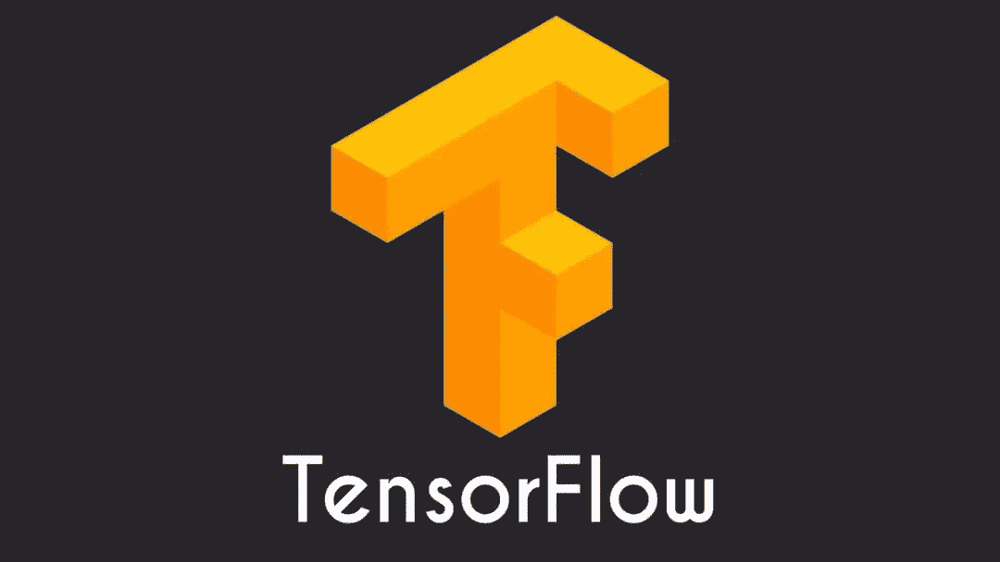

# TensorFlow 入门

> 原文：<https://medium.com/analytics-vidhya/what-is-tensorflow-9d09c1073b83?source=collection_archive---------23----------------------->

用于机器学习的端到端开源平台

**来源:**wired.com

在我们开始 TensorFlow 之前，我们需要知道什么是机器学习和深度学习技术。机器学习是人工智能的一种应用，它为系统提供自动化，其中机器或系统可以自行学习，并可以基于以前的经验进行改进，并且可以在没有外部编程的情况下完成…