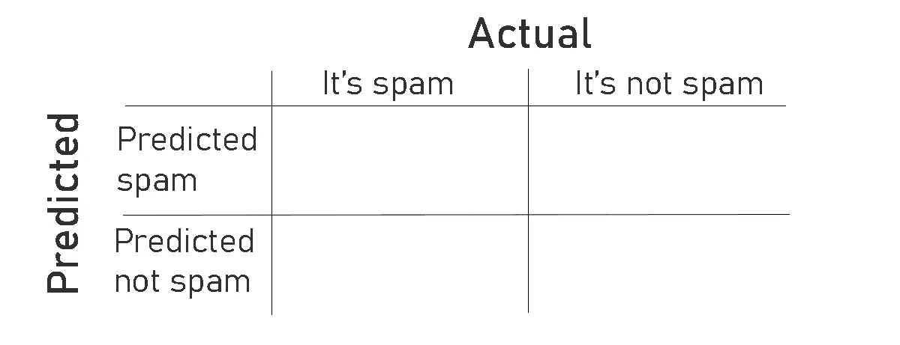
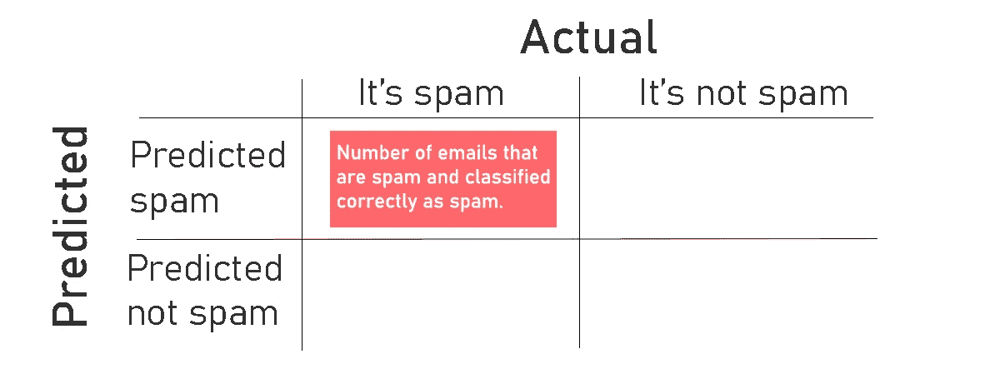
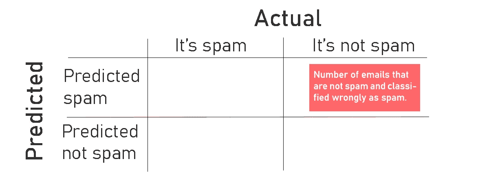
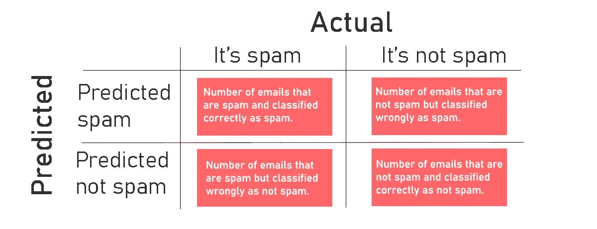
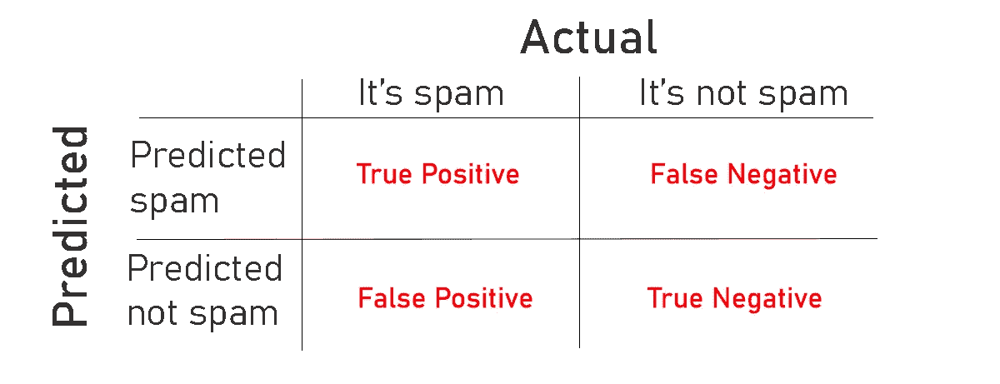
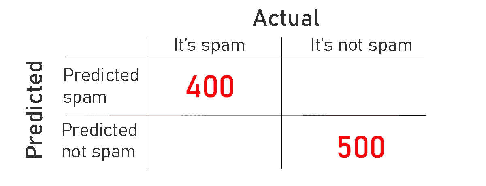
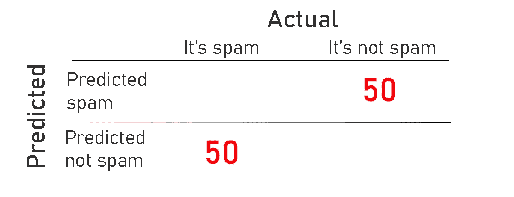
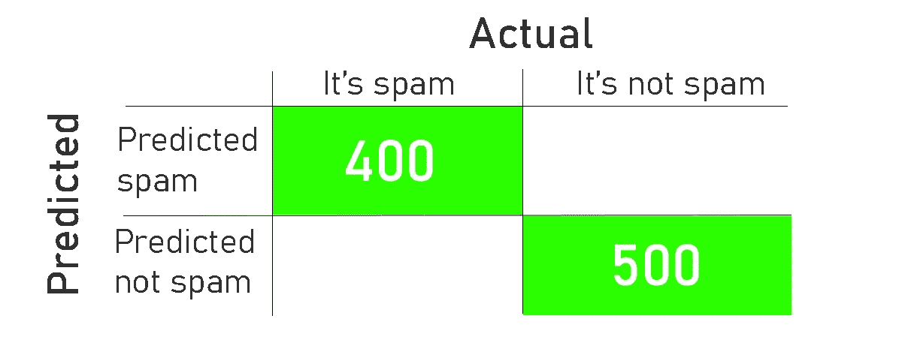
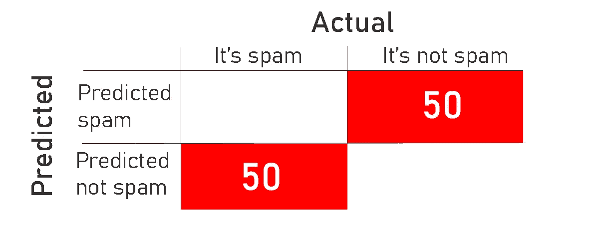

# 什么是混淆矩阵，如何使用它

> 原文：<https://medium.com/analytics-vidhya/what-is-the-confusion-matrix-and-how-to-use-it-6dd63fab33ed?source=collection_archive---------18----------------------->

## 混淆矩阵及其使用指南

由[坎瓦](https://www.canva.com)

# 混淆矩阵是什么？

在建立了机器学习模型之后，我们想知道我们的模型做得怎么样。模型能不能正确分类。我们通过使用混淆矩阵来做到这一点，混淆矩阵主要用于分类模型。为了更好地理解什么是混淆矩阵，让我们在这个例子中解释一下。

由[坎瓦](https://www.canva.com)

假设我们有 1000 封电子邮件的记录，我们希望应用机器学习方法来预测一封电子邮件是否是垃圾邮件。我们将这些记录分为训练和测试数据，然后我们用训练数据训练机器学习模型，然后，我们用测试数据测试我们的模型。

现在，我们需要知道我们的模型在测试数据上的表现。我们通过创建混淆矩阵 *NxN 来做到这一点，这里的“N”*指的是标签的数量*；由于*我们只有两个类别，即*“垃圾邮件”*和*“非垃圾邮件”，*我们将有一个 2x2 的混淆矩阵。

这里，行表示模型预测值的数量，列表示输出的实际值。

按作者

# 如何使用混淆矩阵？

因此，在将分类模型应用于测试数据之后，我们将使用有多少电子邮件被正确分类为垃圾邮件来填充混淆矩阵。

在矩阵左上角的*中，我们输入当实际上是垃圾邮件时，模型预测为垃圾邮件的电子邮件数量。*

按作者

我们称左上角为*真正。*是真的，因为它被正确地分类为正——这里的正表示垃圾邮件，而负表示非垃圾邮件。

而对于右上角，它是*误报，*并且它是实际上不是垃圾邮件的电子邮件的数量，但是模型将其误预测为垃圾邮件。

按作者

对于左下角，它是假的*负数，*它是实际上是垃圾邮件的电子邮件的数量，但是模型错误地将其预测为不是垃圾邮件。最后，右下角是*真负值，*，它是实际上不是垃圾邮件的电子邮件数量，模型正确地预测它不是垃圾邮件。

按作者

例如，在这里，有 400 个真阳性，垃圾邮件被正确分类，500 个真阴性，非垃圾邮件被正确分类。

按作者

然而，在这里，该模型将 50 封不是垃圾邮件的电子邮件误归类为垃圾邮件，并将 50 封是垃圾邮件的电子邮件误归类为非垃圾邮件。

按作者

最后，绿色方框中对角线上的数字告诉我们模型正确分类的电子邮件的数量。

按作者

而下面红框中对角线上的数字告诉我们被模型错误分类的邮件数量。

按作者

# 你能从混淆矩阵中得到什么？

在我们填充矩阵之后，我们可以通过将上面绿色框中的数字相加并除以记录总数来计算*模型的精确度*。当我们有许多机器学习方法要应用时，混淆矩阵是有用的。我们想知道精确度最高的最佳方法，因此我们将为每种机器学习方法建立一个混淆矩阵，并选择最佳方法。

我希望你现在明白什么是混淆矩阵，以及它是如何工作的。

谢谢你。