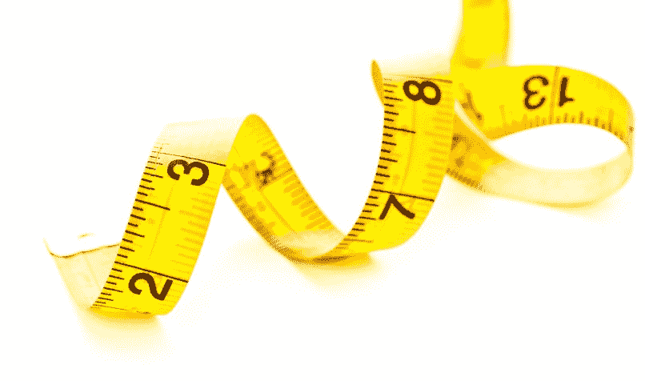
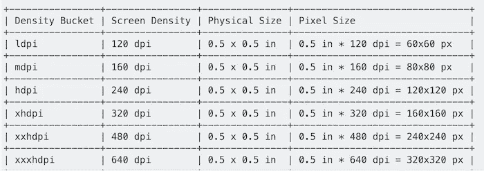
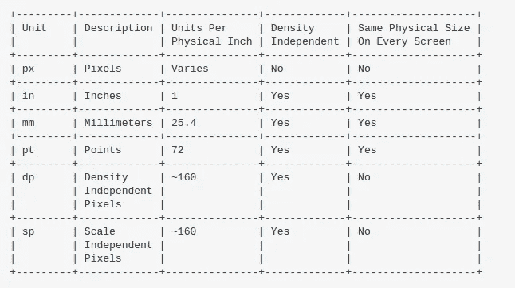

# 「px」「dip」「DP」「sp」有什么区别？

> 原文：<https://medium.com/analytics-vidhya/what-is-the-difference-between-px-dip-dp-and-sp-e4351fefa685?source=collection_archive---------0----------------------->

[https://www . inthe black . com/articles/2016/08/01/3-如何更好地衡量无形成果](https://www.intheblack.com/articles/2016/08/01/3-ways-to-get-better-at-measuring-intangible-results)

**PX(像素)** —对应屏幕上的实际像素。

**(英寸)** —基于屏幕的物理尺寸。

**mm(毫米)** —基于屏幕的物理尺寸。

**pt(磅)** —基于屏幕物理尺寸的 1/72 英寸。

**dp 或 dip(与密度无关的像素)** —基于屏幕物理密度的抽象单位。这些单位是相对于 160 dpi 屏幕而言的，因此一个 dp 是 160 dpi 屏幕上的一个像素。dp 与像素的比值会随着屏幕密度的变化而变化，但不一定成正比。注意:编译器接受“dip”和“dp ”,尽管“dp”与“sp”更一致。

**sp(可缩放像素或与缩放无关的像素)** —这类似于 dp 单位，但也根据用户的字体大小偏好进行缩放。建议您在指定字体大小时使用此单位，这样可以根据屏幕密度和用户偏好进行调整。注意，Android 文档在 sp 实际代表什么上是不一致的，一个文档说“比例无关像素”，另一个说“可缩放像素”。

了解 Android 中的密度独立性:

**屏幕尺寸**
实际物理尺寸，测量为屏幕的对角线。为了简单起见，Android 将所有实际屏幕尺寸分为四种通用尺寸:小、正常、大和超大。

**屏幕密度**
屏幕物理区域内的像素数量；通常称为 dpi(每英寸点数)。例如，与“正常”或“高”密度屏幕相比，“低”密度屏幕在给定的物理区域内具有较少的像素。为简单起见，Android 将所有实际屏幕密度分为六种广义密度:低、中、高、超高、超高和超高。

**方位**
从用户角度看屏幕的方位。这要么是横向的，要么是纵向的，这意味着屏幕的长宽比要么宽要么高。请注意，默认情况下，不仅不同的设备以不同的方向运行，而且当用户旋转设备时，方向也会在运行时发生变化。

**分辨率**屏幕上物理像素的总数。当添加对多屏的支持时，应用程序不直接使用分辨率；应用程序应该只关心屏幕尺寸和密度，正如广义尺寸和密度组所规定的那样。

**与密度无关的像素(dp)**
定义 UI 布局时应该使用的虚拟像素单位，以与密度无关的方式表示布局尺寸或位置。与密度无关的像素相当于 160 dpi 屏幕上的一个物理像素，这是系统为“中等”密度屏幕假定的基线密度。在运行时，系统根据实际使用的屏幕密度，根据需要透明地处理 dp 单元的任何缩放。dp 单位到屏幕像素的转换很简单:`px = dp * (dpi / 160)`。例如，在 240 dpi 的屏幕上，1 dp 等于 1.5 个物理像素。在定义应用程序的 UI 时，您应该始终使用 dp 单位，以确保在不同密度的屏幕上正确显示您的 UI

# **参考**

[https://developer . Android . com/guide/practices/screens _ support . html](https://developer.android.com/guide/practices/screens_support.html)

[https://material.io/design/layout/pixel-density.html](https://material.io/design/layout/pixel-density.html)