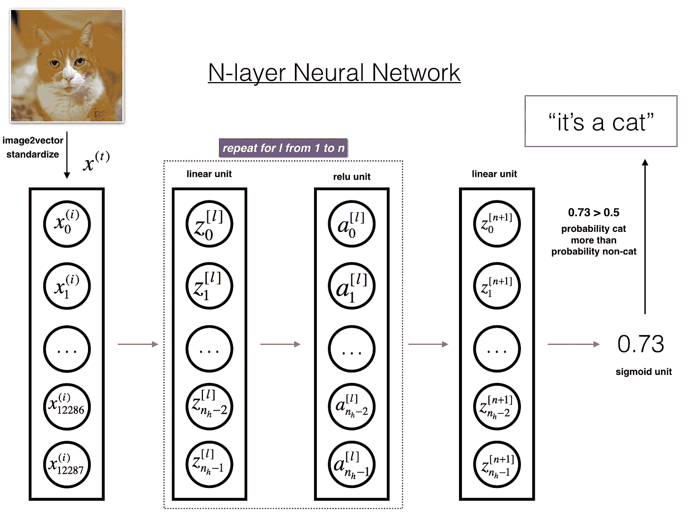

# 什么是深度学习？我如何使用深度学习在 Cat 分类器上构建一个小项目？

> 原文：<https://medium.com/analytics-vidhya/what-is-the-dl-how-i-built-a-small-project-on-cat-classifier-using-deep-learning-65e9184fb075?source=collection_archive---------26----------------------->

> “任何领域的专家都曾经是初学者……！!"

> 介绍

作为新冠肺炎疫情的现状，查洛塔尔科技大学并没有停止对学生成长的思考。他们为提高学生的技能提供了最好的机会，并提供了许多实习机会。所以我想探索和学习当前的趋势技术，这是一种人工智能。为此，我首先探索和搜索这项技术是什么，以及获得这项技能的学习途径是什么。在那之后，我开始学习由 deeplearning.ai 提供的专业课程。

> 人工智能

如今这个术语太流行了。让我们了解一下这项技术的一些基本情况。

**人工智能** ( **AI** )是计算机程序或机器思考和学习的能力。就像著名的 MCU 电影《钢铁侠》中的贾维斯。

人工智能的一些分支

因此，要成为一名人工智能开发人员，我们需要…

1.  获得编程和解决问题的技能
2.  数学——线性代数、微积分、概率
3.  学习编程语言，如 Python，Julia，R 等。
4.  机器学习算法

AI，ML，DL 的区别。

AI，ML，DL

> 关于深度学习的信息

# 定义

**深度学习**(也称为**深度结构化学习**)是更广泛的[机器学习](https://en.wikipedia.org/wiki/Machine_learning)方法家族的一部分，基于[人工神经网络](https://en.wikipedia.org/wiki/Artificial_neural_networks)与[表示学习](https://en.wikipedia.org/wiki/Representation_learning)。

这里是学习的三种类型

1.  [被监督的](https://en.wikipedia.org/wiki/Supervised_learning)
2.  [无人监管](https://en.wikipedia.org/wiki/Unsupervised_learning)
3.  [强化学习](https://en.wikipedia.org/wiki/Reinforcement_learning#:~:text=Reinforcement%20learning%20(RL)%20is%20an,supervised%20learning%20and%20unsupervised%20learning.)

这就是基本的信息，现在让我们开始，我如何利用疫情的时间来获得技能。

> 学习

所以首先，我从 coursera 开始了这门课程，它给了我关于神经网络和深度学习的信息。

## 人工神经网络中单个神经元的结构

单个神经元

让我们从工作开始..

输入:这是我们用来学习神经元的数据集

W(n):它是一个权重(在一个等式计算后得到)。

激活函数:在给定一个或一组输入的情况下，它定义该节点的输出。

Y(n):这是一个预测的输出。

同样，我们制作了一个有许多隐藏层的神经网络。

当我们将 m 个特征(输入)中的每一个乘以一个权重( ***w1，w2，…，wm*** )并将它们加在一起时，这就是点积:

点积

# 具有隐藏层的神经网络

神经网络的隐藏层实际上就是在输入层和输出层之间添加更多的神经元，在所有神经元实现之后，网络将看起来像这样:

隐层神经网络

# 激活功能

*它用于确定神经网络的输出，如是或否。它将结果值映射到 0 到 1 或-1 到 1 等之间。(取决于功能)。*

激活功能有两种类型-

1.  线性激活函数
2.  非线性激活函数

点击此处了解更多关于激活功能[的信息。](https://towardsdatascience.com/activation-functions-neural-networks-1cbd9f8d91d6)

# 向前和向后传球

**正向传递**是指从输入数据计算输出层的值的过程。…根据输出值计算损失函数。然后“**反向传递**是指使用梯度下降算法(或类似算法)计算权重变化的过程。

从[这里了解更多信息](https://towardsdatascience.com/coding-neural-network-forward-propagation-and-backpropagtion-ccf8cf369f76)

# 梯度下降算法

**梯度**下降**是一种先**后 **-** 阶**迭代**优化算法**为**寻找一个**局部**最小值**的一个**可微函数。为了使用梯度下降**、**找到**a**a 函数的局部最小值**，我们在当前点**采取与**的负**成比例的步骤**梯度**(或**近似**梯度**)**函数**。******

梯度下降

# 损失和成本函数

*以非常简单的方式，损失函数计算单个训练示例的误差；成本函数是整个训练集的损失函数的平均值。*

**梯度下降的成本函数**

价值函数

不要害怕。

所有的功能和算法不需要实现为代码，我们可以使用不同的 Python API，这对实现项目非常有用

> 用于 ML、DL 的 Python 库

*   TensorFlow，keras，spark，theano
*   scikit-学习，熊猫
*   等等。

> 关于项目

通过学习这门课程，我作为初学者做了一个小项目，给猫分类。

## 模型将如何识别猫。

这里，我们输入猫的图像作为输入，然后它将进入神经网络，最后神经网络检查并确定图像的概率，如果概率大于 0.5，则它识别为猫，否则它将识别图像为非猫。

神经网络的结构

## Img2Vec 表示

将图像转换成矢量。

将图像转换为矢量

## 我使用过的激活

我用来输出神经元的两次激活。

1.  热卢

输出范围— 0 至(无穷大)

relu 激活

2.乙状结肠的

输出范围—(-无穷大)至(无穷大)

乙状结肠激活

## 模型的轮廓

这里，首先我们初始化所有的参数。

然后在迭代次数时循环该模型，并更新网络的参数

最后，我们根据参数预测输出。

# 预言；预测；预告

最后我们输入一只猫的图像作为矩阵，然后它会预测输出。

> 用于编码

作为课程练习的一部分，我最初做了一些函数，这些函数在我的项目中是作为代码(用 python)实现的。

然后我根据上面的图片做了一个模型架构，对模型进行训练。

我已经从 coursera 下载了一个数据集的. h5 文件，其准确率为 70%

并以 **82.00%** 的准确率进行项目预测。

## 结果

模型的预测

## 结论

创造项目和学习的过程是令人敬畏的经历。我体会到让你的电脑智能化是多么困难。这是令人敬畏的技术，你潜得越深，你就越能到达你梦想的目的地。

GitHub 链接:

[https://github . com/AshishTrada/AshishTrada-cat-classifier-using-deep-learning-](https://github.com/AshishTrada/AshishTrada-cat-classifier-using-deep-learning-)