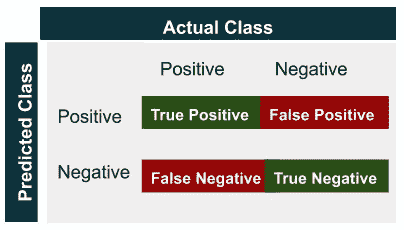
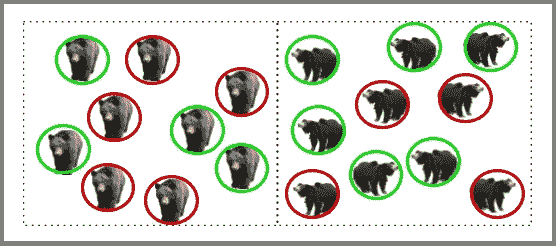
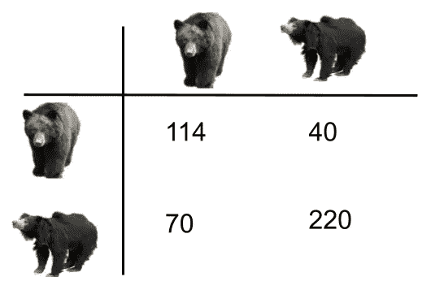

# 混淆矩阵及其派生度量在机器学习中的需求是什么？

> 原文：<https://medium.com/analytics-vidhya/what-is-the-need-of-confusion-matrix-and-its-derived-metrics-in-machine-learning-87b81cb4217?source=collection_archive---------11----------------------->

什么是混淆矩阵？其他指标是如何得出的？为什么这些指标很重要？

你好，读者们，
这是我“作为机器学习的绝对初学者所面临的挑战”系列的第二篇文章。如果你想了解偏差-方差权衡，那就去看看[这篇文章](/analytics-vidhya/a-guide-to-bias-and-variance-in-machine-learning-6ce618590513)，我试图用通俗的语言解释这个概念。

# **混乱矩阵**

有时候，外表可能具有欺骗性。
考虑一个场景:*我一直在研究我的分类模型，但我不确定我的模型表现如何，我正在寻找一种方法来了解我的模型是否正确地对数据进行了分类，或者它是否与数据集混淆并对其进行了错误的分类。*
在这样的场景中，混乱矩阵开始发挥作用。混淆矩阵得名于这样一个事实，即它使得识别分类模型是否变得混乱变得更加容易。对于分类模型，混淆会导致错误识别数据，从而进一步降低性能。

混淆矩阵是用于评估分类模型的方阵(NxN)。这里 N 表示用于分类的类的数量。混淆矩阵将实际类别与预测类别进行比较，从而给出模型性能的整体视图。

图片来源:作者

我将使用一个分类模型来解释真阳性、真阴性、假阳性和假阴性，该分类模型对熊是亚洲黑熊还是树懒熊进行分类。

亚洲黑熊和树懒熊的分类

一个分类模型 M1 将亚洲黑熊和树懒熊分类。下图描述了模型 M1 执行的分类。以绿色突出显示的目标类(亚洲黑熊和树懒熊)表示模型 M1 正确地识别了目标类，而以红色突出显示的目标类表示模型错误地识别了目标类。

亚洲黑熊和树懒熊的分类

**阳性病例**:被归类为亚洲黑熊
的熊**阴性病例**:未被归类为亚洲黑熊的熊**，即被鉴定为树懒熊的熊。因此亚洲黑熊代表积极的一类，而懒熊代表消极的一类**

True Positive:预测类被正确分类为实际类。基于上述例子，亚洲黑熊被正确地识别为亚洲黑熊。

误报:预测类与实际类不同。例如，模特 M1 错误地将树懒熊识别为亚洲黑熊。

真否定:预测类被正确分类为实际类，即树懒熊被正确分类为树懒熊。

假阴性:预测类别与实际类别不同，即树懒熊被错误地识别为亚洲黑熊。

假设我们有一个包含 444 个数据点的数据集。下图显示了在数据集上拟合分类模型 M1 后的混淆矩阵。

真阳性(TP) : 114 只亚洲黑熊被正确归类为亚洲黑熊。
真阴性(NP): 220 只树懒熊被正确归类为树懒熊。
假阳性(FP) : 40 只树懒熊被错误归类为亚洲黑熊。
假阴性:70 只亚洲黑熊被错误地归类为树懒熊。

这些信息有什么用？
一旦我们有了 TP、NP、FP 和 FN 的计数，我们就可以导出评估分类模型所需的指标。

**准确度**:该指标传达了正确预测的比例
准确度= (TP+TN)/(TP+TN+FP+FN)
基于上面显示的混淆矩阵，
准确度=(114+220)/(114+220+40+70)= 0.75
M1 模型的准确度为 75%，即模型在预测熊为亚洲黑熊时准确度为 75%。

**精度:**传达正确识别的阳性案例，即当模型 Ml 预测熊为亚洲黑熊时，模型正确的频率是多少？
精度= TP/(TP+FP)
精度= 114(114+30)= 0.74
M1 的精度为 74%，即当 M1 模型将一只熊分类为亚洲黑熊时，其正确率为 74%。

**回忆**:正确识别的实际阳性病例比例，即模型正确识别的亚洲黑熊比例？
召回率= TP/(TP+FN)
召回率= 114/(114+70)= 0.619
M1 的召回率为 61.9 %，即它正确识别了 61.9%的亚洲黑熊。

**F1 分数**:传达精确度和召回率之间的平衡。虽然它经常不能确定精度是最大化还是召回，但它仍然被用来获得关于精度和召回的组合概念。F1 得分= 2*精度*召回/(精度+召回)
F1 得分= 2 * 0.74 * 0.619/(0.74+0.619)
F1 得分=0.67

这些指标可用于评估任何分类模型的性能。瞧啊。现在你知道混淆矩阵的重要性了。我希望这篇文章对你有帮助。