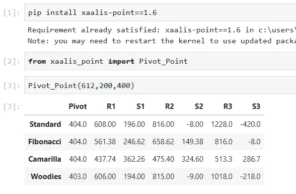

# 枢轴点是什么，如何在 Python 编辑器上下载我的包来快速计算它？

> 原文：<https://medium.com/analytics-vidhya/what-is-the-pivot-point-and-how-you-can-download-my-package-on-your-python-editor-to-compute-it-c01cd9ef252b?source=collection_archive---------30----------------------->

## 关于支点及其在交易中的重要性的概述。


## **导入**

在这篇文章中，我想与你分享我对一个领域的热情，这个领域需要很好的金融工具知识和直觉思维，以便处理问题和抓住机会。

通常，金融市场中的一些决定超出了你的技术知识的能力，拥有一种直觉的态度会有所不同。这是交易中最吸引我的特点。

今天我要讲一个重要的交易概念，叫做支点。我会给你一个关于它的概述，以及你如何在你的 Python 编辑器上下载我的包以便快速计算它。

但是，在开始分析 Pivot Point 的技术方面之前，让我向你介绍一下看涨和看跌的概念。这两个术语对于理解什么是支点以及它是如何工作的非常重要。

在金融市场中，熊市和牛市这两个词强调了特定的市场情绪和投资者对市场价格发展的预期态度。

事实上，在股票市场价格上涨的情况下，我们有一种看涨的情绪。相反，在价格下跌的情况下，普遍的情绪被称为看跌。

我们可以说，交易者的看涨行动是“做多”和购买股票。相反，看跌意味着通过出售股票来“做空”。

## 第一部分:什么是支点，为什么它在交易中如此重要？

那么，熊市和牛市是如何与支点联系在一起的呢？

支点是技术交易者用来确定整体市场趋势的一个流行指标。有几种方法来计算支点的指标，在下一部分，我将谈到使用的主要公式。

支点指标通常被定义为价格图表上的水平支撑线和阻力线，如下图所示。

术语“支撑位”代表一个价格点，在给定的时间段内，资产很难跌破该价格点。


范围条形图

在技术分析中，我们可以用不同的指标来表示支撑位，或者简单地用一条线连接各个时期的最低点。

所以，这个水平显示了哪里会有过剩的买家。这可能是因为许多人已经看到，该股已经从这些水平向上，或在这个水平的股票有一个低的基本价格。

作为交易者，你会在股票下跌到支撑位时买入，在股票跌破支撑位时卖出。

相反，阻力位代表一种资产在所考虑的时期内难以超过的价格点。我们可以通过画一条连接高点的线在图表中显示阻力位。

阻力位表明哪里会有过剩的卖家。这可能是因为该股之前已经从这个水平向下转了，或者许多人认为它的基本面是昂贵的。在这种情况下，当股票上涨至阻力时，你将卖出，当股票突破阻力时，你将买入。

我们可以说，交易者识别阻力和支撑位的目的是选择他们买入或卖出股票的时机。这样他们就能知道入口和出口。此外，交易者可以使用阻力位作为风险管理工具。

## 第二部分:背后的主要公式是什么？

现在我们可以看看计算支点指标的最常见公式。如果这是你的第一次交易，不要担心，支点公式比你想象的要简单。

这个公式称为标准公式，您可以在下图中观察到它。如你所见，有六个指标。


无论如何，在谈论指标之前，了解 H、L 和 C 的值很重要，其中:

*   H =前一交易日的最高价格
*   L =表示前一交易日价格的低值
*   C =表示收盘价的收盘值

指标 R1、R2 和 R3 是阻力位。相反，S1、S2 和 S3 是支撑位。两组级别都使用 PP(轴心点)作为计算的一部分。支点计算为 H、L 和 c 值的平均值。

其他重要的公式有斐波那契，卡玛里拉和伍迪。对于这些公式，在下一部分，我将向您展示如何在您的 Python 编辑器上下载我的包，以便轻松地计算它们。

## 第三部分:在 Python 编辑器上下载我的包的一些说明

我向您展示了下载我的包和运行该函数的步骤，方法是在函数 Pivot_Point 中只引入 H、L 和 C 这三个值作为输入。

下面你可以观察一下你要做的事情。通过这种方式，您可以获得带有不同指示器的表格。

```
- pip install xaalis-point==1.6

- from xaalis_point import Pivot_Point

- Pivot_Point(H,L,C)
```

在下图中，您的输出将如何的一个例子。



## 结论

我认为交易对数据分析师来说是一个巨大的挑战，因为在这个领域，光有分析头脑和技术知识是不够的。

例如，支点的指标在交易中非常有用，但你也需要快速决策的能力，有时你作为数据分析师的直觉可以发挥作用。

直觉可以帮助你在数据中看到原创和成功的可能性。

关于我的软件包 xal is-point 的更多详细信息，你可以访问我的 GitHub 简介[这里](https://github.com/moryba/Xaalis-point-Package)。

有点好奇:xaalis 这个名字在我的母语沃洛夫语中是钱的意思。

我们也可以在我的[电报群**数据科学新手群中取得联系。**](https://t.me/DataScienceForBeginners)