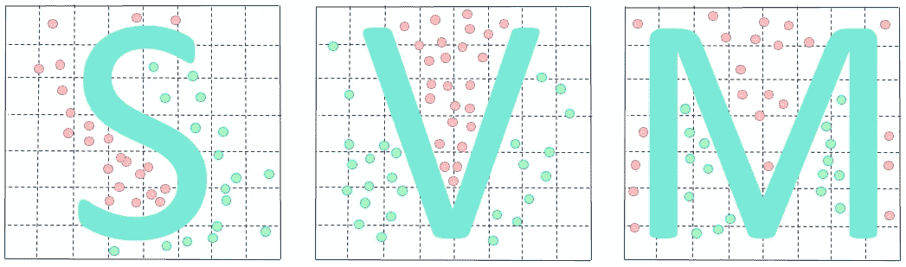
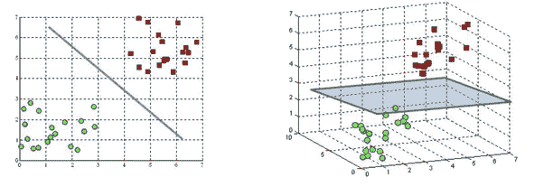
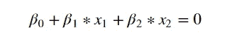
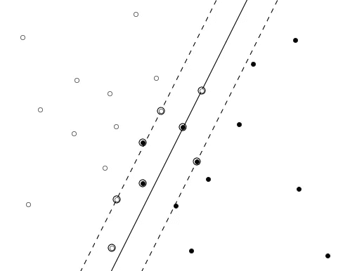
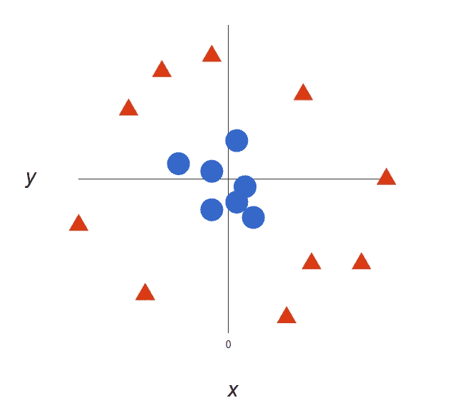
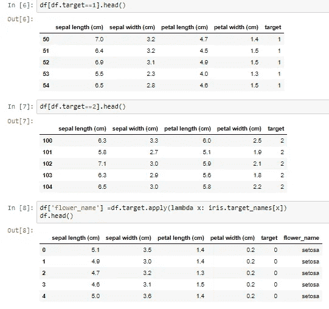
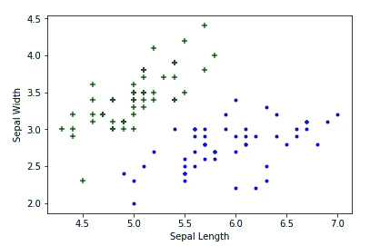
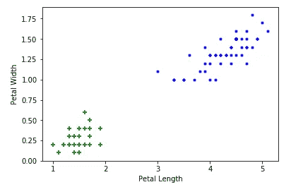

# 基于 Python 的支持向量机(SVM)

> 原文：<https://medium.com/analytics-vidhya/what-is-the-support-vector-machine-svm-dc89207c011?source=collection_archive---------14----------------------->

本文包括八个部分:

1.  什么是支持向量机？
2.  关于超平面。
3.  它是如何在线性可分中工作的
4.  它是如何在线性不可分中工作的
5.  支持向量机(SVM)的优势
6.  支持向量机(SVM)的缺点
7.  支持向量机的应用(SVM)
8.  支持向量机用 **Python 用**(**T3 用代码**)

# **什么是支持向量机**算法？

支持向量机(SVM)是一种有监督的机器学习算法。这可用于**分类**和**回归**目的。

它使用一种叫做内核技巧的技术来转换你的数据，然后基于这些转换。它在可能的输出之间找到一个最佳边界。简而言之，它执行一些极其复杂的数据转换，然后根据您定义的标签或输出计算出如何分离您的数据。

在线性 SVM 中超平面的学习是通过使用一些线性代数来转换问题来完成的，这超出了 SVM 简介的范围。

一个强有力的见解是，线性 SVM 可以用任何两个给定观测值的内积来重新表述，而不是观测值本身。两个向量之间的内积是每对输入值的乘积之和

它们在**分类、数字预测和模式识别** **任务**中特别有效

# 超平面

***n 维欧氏空间中的超平面是该空间的平坦的 n-1 维子集，它将该空间分成两个不相连的部分。***

**超平面 2D & 3D**

**示例**

这条线是我们的一维欧几里得空间(也就是说，假设我们的数据集位于一条线上)。现在在这条线上选一个点。这一点把这条线分成两部分。线是一维的，而点是零维的。所以一个点就是这条线的超平面。

对于二维，我们看到分隔线是超平面。类似地，对于三维，具有二维的平面将 3d 空间分成两部分，因此充当超平面。因此，对于一个 n 维空间，我们有一个 n-1 维的超平面把它分成两部分

超平面在数学上可以写成二维的

对于二维的

# 线性可分情况

我们假设一个二元分类。SVM 的直觉是在两个类的中间放一个超平面，使得到最近的正面或反面例子的距离最大化。

SVM 判别函数具有以下形式

**f(x) = w > x + b**

线性可分的

# 线性不可分

在线性可分的情况下，SVM 试图找到使裕度最大化的超平面，条件是两个类都被正确分类。但在现实中，数据集可能永远不会线性分离，所以超平面 100%正确分类的条件永远不会满足。

线性不可分

SVM 通过引入两个概念来处理非线性可分情况:**软余量**和**核技巧。**

*   **软边距:**尽量找一条线分开，但容忍一个或几个分类错误的点
*   **内核技巧:**尝试找到一个非线性的决策边界

回想一下，在线性可分(或软边界)的情况下，SVM 算法的工作原理是找到一个使边界最大化的分离边界，即边界和最接近边界的点之间的*距离*。这里的距离是边界和最近点之间通常的直线距离。这被称为[欧几里德距离](https://en.wikipedia.org/wiki/Euclidean_distance)以纪念古代伟大的几何学家。要注意的一点是，这个过程产生的分离边界是一条直线，如图 5 所示，这并不总是有效的。其实大多数情况下不会。

# **支持向量机(SVM)的优势**

1.  SVM 既可以用来解决**分类**问题，也可以用来解决**回归**问题。SVM 用于分类问题，而 **SVR(支持向量回归)**用于回归问题。
2.  **高效处理非线性数据:** SVM 可以使用内核技巧高效处理非线性数据。
3.  它在决策函数中使用训练点的子集(称为支持向量)，因此它也是内存高效的。
4.  SVM 适合极端情况下的二元分类。
5.  数据的微小变化不会对超平面以及 SVM 产生很大影响。所以 SVM 模型是稳定的。
6.  SVM 在高维空间更有效。
7.  当我们不知道数据的时候，SVM 是非常好的。或者我们可以说。，如果你正在处理**不平衡的数据**，那么 **SVM 是好的。**
8.  它在维数大于样本数的情况下是有效的。
9.  超平面仅受支持向量的影响，因此异常值的影响较小。
10.  类可分时的最佳算法。

# **支持向量机(SVM)的缺点**

1.  选择一个合适的核函数(来处理非线性数据)不是一件容易的事情。这可能会很棘手和复杂。在使用高维核的情况下，你可能会产生太多的支持向量，这会大大降低训练速度。
2.  对于较大的数据集，需要大量的时间来处理。
3.  SVM 的算法复杂度和内存需求非常高。您需要大量内存，因为您必须将所有支持向量存储在内存中，并且这个数字会随着训练数据集的大小而急剧增长。
4.  由于支持向量分类器通过将数据点放在分类超平面的上方和下方来工作，因此没有对分类的概率解释。
5.  在重叠类的情况下，它不能很好地执行。
6.  与决策树不同，SVM 模型很难被人类理解和解释。
7.  当数据集具有更多噪声时，即目标类别重叠时，SVM 执行得不是很好。

# **支持向量机的应用(SVM)**

1.  几乎所有使用人工神经网络的应用。
2.  手写识别。
3.  乳腺癌诊断。
4.  文本和超文本分类。
5.  数字图像隐写术的检测。

# 蟒蛇皮 SVM

 [## abhijeetap/Support _ Vector _ Machines _ with _ python

### permalink dissolve GitHub 是超过 5000 万开发人员的家园，他们一起工作来托管和审查代码，管理…

github.com](https://github.com/Abhijeetap/Support_Vector_Machines_with_python/blob/master/svm.ipynb) 

df[df.target==1]。头部()

df[df.target==2]。头部()

df['花 _ 名']= df . target . apply(lambda x:iris . target _ names[x])
df . head()

plt.xlabel('萼片长度')
plt.ylabel('萼片宽度')
plt.scatter(df0['萼片长度(厘米)']，df0['萼片宽度(厘米)']，color="green "，marker= '+')
PLT . scatter(df1['萼片长度(厘米)']，df1['萼片宽度(厘米)']，color="blue "，marker = ' ')

感谢您的阅读。如果您有任何反馈，请告诉我。

# 我关于机器学习算法的其他帖子

 [## 用 Python 实现随机森林算法

### 在本文中，我们将探索著名的监督机器学习算法“随机…

medium.com](/analytics-vidhya/random-forest-algorithm-with-python-7ccfbe9bcb47)  [## 基于 Python 的 k 近邻算法(KNN)

### 本文包括六个部分:

medium.com](/@abhi.pujara97/k-nearest-neighbors-algorithm-knn-with-python-e570f6bb8aed)  [## 用 Python 实现朴素贝叶斯算法

### 本文包括五个部分:

medium.com](/@abhi.pujara97/naïve-bayes-algorithm-with-python-7b3aef57fb59) 

**快乐学习！！！**

**快乐编码:)**

别忘了拍手拍手拍手…

