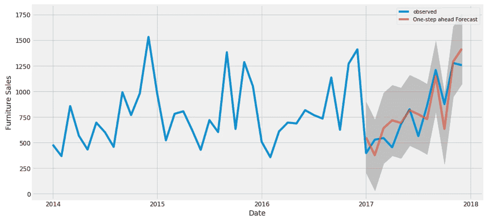
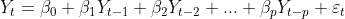
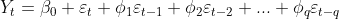
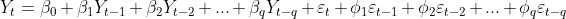

# 什么是时间序列预测？

> 原文：<https://medium.com/analytics-vidhya/what-is-time-series-forecasting-97c10a99a830?source=collection_archive---------33----------------------->

在本文中，我们将讨论一种算法，它可以帮助我们分析过去的趋势，并让我们专注于接下来要展开的事情，因此这种算法就是时间序列预测。

**什么是时间序列分析？**

在这个分析中，你有一个变量——时间。时间序列是在特定时间间隔相等的一组观察值。它用于根据以前观察到的数据点预测未来值。

**这里有一些使用时间序列的例子。**

1.  商情预测
2.  了解过去的行为
3.  计划未来
4.  评估当前的成就。

**时间序列的组成:**

1.  **趋势:**让我们通过例子来理解，假设在一个新的建筑区域，有人现在开了一家五金店，而建筑工程正在进行，人们会购买五金店。但建设完成后，购买硬件的人会减少。所以有时候卖高然后卖低，这叫做上升趋势和下降趋势。
2.  季节性:每年年底，由于圣诞节的缘故，巧克力的销量都很高。这种相同的模式每年都会发生，但趋势却并非如此。季节性在相同的时间间隔重复相同的模式。
3.  **不规则:**也叫噪音。当一些不寻常的事情发生，影响到规律性，例如，有一个多年一遇的自然灾害，比如说它被洪水淹没，所以人们在这段时间购买更多的药品。这是没有人预测到的，你也不知道会有多少销量。
4.  **周期性:**它基本上是重复的上下波动，所以这意味着它可以持续一年以上，所以它没有固定的模式，它可以随时发生，很难预测。

**时间序列的平稳性:**

如果 Y 在时间 t[p(Yt)]的边际分布与任何其他时间点相同，则称一个序列是“严格平稳”的。这意味着序列 Yt 的均值、方差和协方差是时不变的。

但是，如果均值和方差为常数，且两点的协方差 Cov(Y1，Y1+k)=Cov(Y2，Y2+k)=const，则称一个序列为“弱平稳”或“协方差平稳”，它只依赖于滞后 k，而不显式依赖于时间。

**不同的时序流程:**

*   **白噪声:**一个序列如果本质上是纯随机的，就叫白噪声。这种时间序列的散点图不会显示任何模式，因此预测这种序列的未来值是不可能的。
*   **自回归模型:**AR 模型是其中 Y(t)依赖于它自己的过去值 Y(t-1)，Y(t-2)，Y(t-3)等的模型。AR 模型的一种常见表示形式是 AR(p)模型，它依赖于 p 的过去值，称为 AR(p)模型。

AR(p)模型

*   **移动平均模型:**移动平均模型是当 Y(t)依赖于遵循白噪声过程的随机误差项时的模型。移动平均模型的一种常见表示，其中它依赖于其白噪声分布的过去值的 q，称为 MA(q)模型。

MA(q)模型

*   **自回归移动平均模型:**这是一种混合的 AR 和 MA 模型，称为 ARMA(p，q)。它依赖于 p 它自己的过去值和 q 白噪声分布的过去值。这样更准确。

ARMA(p，q)模型