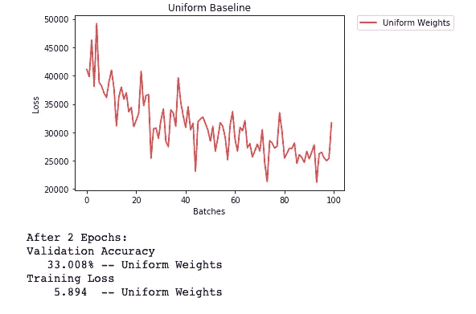

# 什么是迁移学习和权重初始化？

> 原文：<https://medium.com/analytics-vidhya/what-is-transfer-learning-weight-initialization-a997d83963bb?source=collection_archive---------6----------------------->

欢迎大家！这是我在一个月内完成*深度学习纳米学位*的旅程中的第七篇文章！我已经完成了该学位总共六个模块中第三个模块的 46%。今天的话题包括对*CNN*、*转移学习*的更深入的了解，以及一点关于*权重初始化*的利弊。


转移学习

# 第 8 天

我们要讨论的第一课是“**迁移学习**”。

# **迁移学习**

对于 ML 从业者来说，从头开始编写模型并不总是有效的，即形成下降模型架构、层的大小、功能等。工程师经常做的一件事就是迁移学习。它是什么，是我们使用一个预先构建的模型，并根据我们的需求对其进行优化和更改。

例如，如果我们想要构建一个花分类器，我们可以使用一个 [VGG 模型](https://pytorch.org/hub/pytorch_vision_vgg/)。主要原因是，我们可以使用一个训练好的模型并改变一些参数来获得所需的答案，而不是制作一个新模型并从头开始训练它。*的好处*？让我们回顾一下*培训*一个模特实际上是做什么的。我们初始化一些随机权重，稍后会详细介绍。执行历元、前馈和反向传播，并更新权重。所以，如果我们采用一个预先构建的模型，它会有权重实际上是为一个任务训练的，而不仅仅是随机数。因此，我们将能够很容易地操纵他们做我们想要的工作。

你可能会问如何操纵它们。让我们更详细地讨论一下这些层实际上做了什么。假设我们采用人脸分类模型，它的架构是有 3 个隐藏层。这些层所做的是，第一层总是寻找最简单的模式，即直线，这就是这一层的范围。第二层负责保存比直线更复杂的图案信息，例如圆或椭圆等。最后一层是负责最复杂信息的层，即眼睛、嘴巴、鼻子等。我们从中了解到的是**第一层总是简单的，具有一般信息**和**隐藏的层越多，模型可以得到的模式就越复杂**。

> 迁移学习包括采用预先训练的神经网络，并使神经网络适应新的不同的数据集。


隐藏层保存信息示例

## 那好吧。

问题是，当我们导入一个预构建的模型时，我们不会保留所有的层。让我们讨论迁移学习的类型。

## 训练最后几层

在这种类型中，我们导入一个模型。保留一些第一层，用我们新做的层替换最后一层。然后，我们保持从模型中导入的第一个层不变，不改变它们的权重，只训练我们包含的层。这可以减少大规模训练模型所需的时间。我们为什么要训练这些？嗯，第一层包含基本信息，因此可以使用，但在深层，复杂性增加，主要模式出现。因此，我们更改这些层，因为我们希望我们的模型能够对我们的需求进行分类，而不是根据它以前构建的内容进行分类。因此，我们训练层保持我们想要的数据。然后这个练习，根据我们的需要训练模型。

## 查找调谐

它与上层模型相同，它导入先前训练的模型并使用其早期层，并用新构建的层替换其深度学习，但这里的不同之处在于，我们训练所有层，新制作的层以及导入的层。这是为了获得更准确的结果。为什么我们只对随机重量做这个？同样，这些都有一定的工作权重，我们只需要稍微改变一下，就可以让它工作，而不会浪费大量的计算能力，这是从随机权重开始的。以前的权重和新的权重之间总是存在某种相对性，因此更容易达到。

## 我们面对的是什么？

现在让我们讨论一些不同的可能性。

## -新数据很少

如果新数据集很小并且与原始训练数据相似:

*   切掉神经网络的末端。
*   添加与新数据集中的类数量相匹配的新完全连接图层。
*   随机化新的完全连接层的权重
*   冻结预训练网络的所有权重。
*   训练网络以更新新的全连接层的权重。

## -小数据集，不同的数据

如果新数据集很小并且不同于原始训练数据:

*   除了靠近网络开始处的一些预训练层之外，切掉所有层。
*   向剩余的预训练层添加与新数据集中的类别数量相匹配的新的完全连接层。
*   随机化新的完全连接层的权重。
*   冻结预训练网络的所有权重。
*   训练网络以更新新的全连接层的权重。

## -大型数据集，相似的数据

如果新数据集很大并且与原始训练数据相似:

*   移除最后一个完全连接的图层，并替换为与新数据集中的类数量相匹配的图层。
*   随机初始化新的全连接层中的权重。
*   使用预训练的权重初始化其余的权重。
*   重新训练整个神经网络。

## -大型数据集，不同的数据

如果新数据集很大并且不同于原始训练数据:

*   移除最后一个完全连接的图层，并替换为与新数据集中的类数量相匹配的图层。
*   用随机初始化的权重从头开始重新训练网络。
*   或者，您可以使用与“大型且相似的”数据案例相同的策略

*转移话题*到此结束。

# 重量初始化

在使用预训练模型时，我们可以从现有的最佳权重开始，但除此之外，我们至少需要从某个地方开始。这在某种程度上，在决定模型的输出和精度方面，起着重要的作用。让我们举一些例子。所有的例子都是为时尚 MNIST 数据集训练的模型。

> `*Fashion-MNIST*` *是* [*Zalando*](https://jobs.zalando.com/tech/) *的文章图片的数据集——由 60000 个样本的训练集和 10000 个样本的测试集组成。每个示例都是 28x28 灰度图像，与 10 个类别的标签相关联。我们打算将* `*Fashion-MNIST*` *作为原始* [*MNIST 数据集*](http://yann.lecun.com/exdb/mnist/) *的直接替代，用于基准机器学习算法。它共享训练和测试分割的相同图像大小和结构。——*[*来自 Github*](https://github.com/zalandoresearch/fashion-mnist)

## 零权重

在这种情况下，我们将权重向量的所有元素初始化为零，认为从中性开始会有好处，并且零是概率集的下限。

## 一维砝码

在这种情况下，我们将所有元素初始化为 1，这是概率的上限。

产量？


权重= 0 和 1

这里发生了什么？我们认为这些是中性值，因此最容易训练。当权重等于零时，梯度变得相同，这样想，所有的值都相等，因此，梯度相同。因此，在执行反向传播时，神经网络很难选择需要改变的节点。当权重为 1 时呢？在这种情况下，梯度是相同的，因此，网络很难选择需要改变的节点。这些都是非常大的概率，模型很难让它们回到应有的位置。

> 使用一致的权重会使反向传播失败。

## 均匀分布

在这种情况下，权重从我们提供的集合中选择任意数字的概率相等。我们从连续分布中挑选。为什么？以避免重复的重量。使用的语法如下。请注意，这里的*数字*是要生成的数值的数量。

```
#Uniform Distribution
np.random.unfiorm(low_bound, high_bound, number)#Setting Weights between 0 and 1, 'm' being the name of classifier
m.weight.data.uniform_(0.0, 1.0)
```



均匀分布

我们可以看到，使用均匀分布更好，但我们可以做得更好。

## 一般规则

设置神经网络中的权重的一般规则是将它们设置为接近零，但不要太小。好的做法是在[−𝑦，𝑦]的范围内开始你的重量，其中𝑦 = 1/√𝑛.让我们以 y = 0.5 为例。


一般规则

看到这样的结果，我可以说我们正朝着正确的方向前进。最后一次。

## 正态分布

与均匀分布不同，[正态分布](https://en.wikipedia.org/wiki/Normal_distribution)更有可能选择接近其平均值的数字。正态分布的平均值应为 0，标准偏差为𝑦 = 1/√𝑛.它的语法如下。

```
np.random.normal(mean, standard_deviation, Shape_of_output)
```


正态分布

我们可以看到正态分布优于一般规律&均匀分布，但是不要搞错了，这个结果只是在这个数据集的情况下。并且根据所使用的数据集，不同的初始化会更好。

> 该层的节点/输入越多，初始化必须越小。是成反比的。权重应该居中到零。

> 权重初始化发生一次，在模型创建时和训练之前。具有良好的初始权重可以使神经网络接近最优解。这使得神经网络能够更快地找到最佳解决方案。

这就是我今天能做的。今天的话题很有趣，可以了解它们如何让从业者的生活更轻松。渴望进入“狗品种分类器”项目。下一集再见！