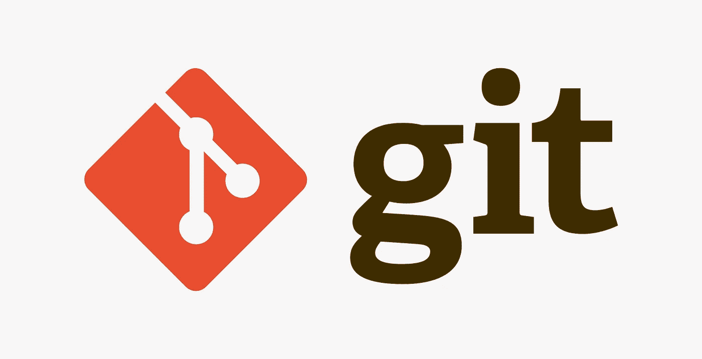
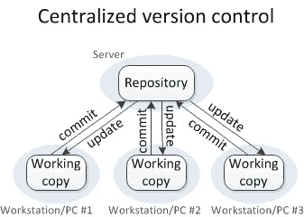
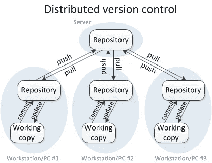
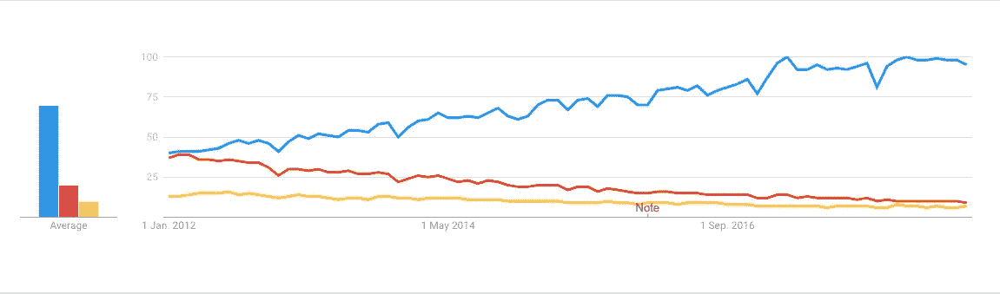

# 什么是版本控制工具？探索 Git 和 GitHub

> 原文：<https://medium.com/analytics-vidhya/what-is-version-control-tool-explore-git-and-github-e8c4e719bc05?source=collection_archive---------2----------------------->

Git 是一个免费的开源分布式**版本控制系统工具**，旨在快速高效地处理从小到大的项目。Git 拥有大多数团队和个人开发者需要的功能、性能、安全性和灵活性。
**根据 Git 的创造者:**
Git 简单易学，占用空间小，性能快如闪电。它比 Subversion、CVS、Perforce 和 ClearCase 等配置管理工具具有更便宜的本地分支、方便的中转区和多工作流等特性。它是由 Linus Torvalds 在 2005 年创建的，用于开发 Linux 内核。

# ***为什么 Git 会出现？***

每当开发人员设计和开发任何应用程序时，通常会在不同的站点开发该软件的多个版本，因为他们会同时进行更新和错误修复。bug 通常只出现在某些版本中，我们已经看到开发人员因为 bug 转移回以前的版本，然后他们发布带有 bug 修复的新版本软件。因此，为了定位和修复错误，能够检索和运行软件的不同版本以确定问题发生在哪个版本是很重要的。同时开发软件的两个版本也是必要的:例如，一个版本修复了错误，但是没有新的特性，而另一个版本在主干上开发了新的特性。因此，我们需要维护适当的文档和配置文件以及更新的源代码。这个过程也称为版本控制、修订控制或源代码控制。
对组织和控制版本的逻辑方法的需求几乎与写作的历史一样悠久，但是当计算时代开始时，版本控制变得更加重要和复杂。因此，让我们退后一步，学习所有关于版本控制系统(VCS)。

# ***版本控制系统(VCS):***

版本控制系统(VCS)可以定义为软件配置管理的一个组成部分，它记录对一个文件或一组文件的更改，以便将来可以调用。然而，版本控制的主要用途是**跟踪变更**
版本控制系统主要基于一个概念，即跟踪目录或文件中发生的变更。根据版本控制系统的不同，这可能从知道文件已更改到知道文件中已更改的特定字符或字节。
VCS 有两种类型:

*   集中式版本控制系统(CVCS)
*   分布式版本控制系统(DVCS)

**集中式版本控制系统(CVCS)** 使用中央服务器存储所有文件，实现团队协作。它在单个存储库上工作，用户可以直接访问中央服务器。

上图中的存储库表示一个中央服务器，它可以是本地的，也可以是远程的，直接连接到每个程序员的工作站。
每个程序员都可以用存储库中的数据提取或者**更新**他们的工作站，或者可以修改存储库中的数据或者**提交**。每个操作都是直接在存储库上执行的。尽管维护一个单一的存储库看起来很方便，但是它有一些主要的缺点。其中一些是:

*   它在本地不可用；这意味着您总是需要连接到网络才能执行任何操作。
*   由于一切都是集中的，在任何情况下，中央服务器崩溃或损坏将导致整个项目的数据丢失。

**分布式版本控制系统(DVCS)** 不一定依赖中央服务器来存储项目文件的所有版本。

在分布式 VCS 中，每个贡献者都有主存储库的本地副本或“克隆”，即每个人都维护他们自己的本地存储库，其中包含主存储库中存在的所有文件和元数据。
从上图可以看出，每个程序员都自己维护着一个本地存储库，它实际上是中央存储库在他们硬盘上的拷贝或克隆。他们可以不受任何干扰地提交和更新他们的本地存储库。
他们可以通过名为“ **pull** ”的操作用来自中央服务器的新数据更新他们的本地存储库，并通过名为“ **push** ”的操作从他们的本地存储库影响对主存储库的更改。
分布式 VCS 给了我们以下优势:
所有操作(除了 push & pull)都非常快，因为该工具只需要访问硬盘，而不是远程服务器。因此，您并不总是需要互联网连接。

*   提交新的变更集可以在本地完成，而不需要操作主存储库上的数据。一旦您准备好了一组变更集，您就可以一次将它们全部推入。
*   由于每个贡献者都有项目存储库的完整副本，如果他们想在影响主存储库中的变更之前获得一些反馈，他们可以彼此共享变更。
*   如果中央服务器在任何时候崩溃，丢失的数据可以很容易地从贡献者的任何一个本地存储库中恢复。

# 为什么是 Git？

Git 是一个分布式版本控制工具，它通过为开发高质量软件提供数据保证来支持分布式非线性工作流。Git 为前面提到的用户提供了所有分布式 VCS 设施。Git 存储库很容易找到和访问。当您体验下面提到的特性时，您会知道 Git 与您的系统是多么的灵活和兼容:

*   **免费开源:** Git 是在 GPL(通用公共许可证)开源许可下发布的。它是完全免费的，而且是开源的，你可以根据自己的需要修改源代码。
*   **速度和离线:**由于你不必一直连接互联网来执行所有的操作，它完成所有的任务真的很快。你只需要访问互联网就可以把文件从工作存储库拉到你的本地存储库，然后你就不需要互联网来使用 Git 了。修改完成后，您可以验证更改，然后当您可以访问互联网时，您可以将文件推送到工作存储库中。
*   **可伸缩:** Git 是非常可伸缩的。虽然 Git 代表了一个完整的存储库，但是存储在客户端的数据非常少，因为 Git 通过无损压缩技术压缩了所有的巨大数据。即使将来合作者的数量增加，Git 也能处理这种变化。
*   **可靠:**因为每个贡献者都有自己的本地存储库，所以在系统崩溃时，丢失的数据可以从任何本地存储库中恢复。你的所有文件都会有备份。
*   **安全:** Git 使用 SHA1(安全散列函数)来命名和标识其存储库中的对象。
*   **支持非线性开发:** Git 支持快速分支和合并，并包含可视化和导航非线性开发历史的特定工具。
*   **轻松分支:**使用 Git 进行分支管理非常简单。创建、删除和合并分支只需几秒钟。特性分支为您的代码库的每次更改提供了一个隔离的环境。
*   **分布式开发:** Git 给每个开发人员一个整个开发历史的本地副本，并且变更从一个这样的存储库复制到另一个。这些变更作为附加的开发分支被导入，并且可以以与本地开发分支相同的方式被合并。
*   **与现有系统和协议的兼容性:**存储库可以通过 http、ftp 或 Git 协议在普通套接字或 ssh 上发布。Git 还有一个并发版本系统(CVS)服务器仿真，它支持使用现有的 CVS 客户端和 IDE 插件来访问 Git 存储库。Apache SubVersion (SVN)和 SVK 库可以直接用于 Git-SVN。

像 Git 这样的工具支持开发和操作团队之间的交流。当您开发一个有大量协作者的大型项目时，在项目中进行更改时，协作者之间的交流非常重要。Git 中的提交消息在团队交流中起着非常重要的作用。我们部署的零碎东西都存在于 Git 这样的版本控制系统中。为了在 DevOps 中取得成功，您需要在版本控制中拥有所有的通信。因此，Git 在 DevOps 的成功中起着至关重要的作用。

# Git 与其他 vct 相比:

与市场上的其他版本控制工具相比，Git 更受欢迎，比如 Apache Subversion(SVN)、Concurrent Version Systems(CVS)、Mercurial 等。因为上述优点。
您可以通过下面从 *Google Trends* 收集的图表，按时间比较 Git 与其他版本控制工具的兴趣:

来自谷歌趋势的数据

在大公司中，产品通常由分布在世界各地的开发人员开发。为了实现它们之间的通信，Git 是解决方案。使用 Git 进行版本控制的公司有:脸书、雅虎、Zynga、Quora、Twitter、易贝、Salesforce、微软等等。

感谢您阅读文章。请在下面分享您的意见和反馈。