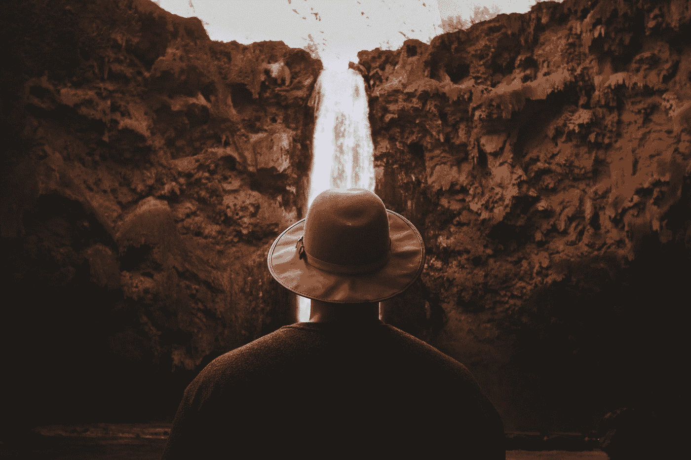

# 什么是瀑布模型，什么时候适用？

> 原文：<https://medium.com/analytics-vidhya/what-is-waterfall-model-and-when-is-it-applicable-cd53cf30a48d?source=collection_archive---------6----------------------->

> 瀑布模型及其适用性

杰里米·毕晓普在 [Unsplash](https://unsplash.com?utm_source=medium&utm_medium=referral) 上的照片

在直接进入瀑布模型之前，让我们看一个例子。如果你去一个欣赏瀑布景色的地方，你可以看到水在陡峭的山上从上到下落下。瀑布模型的概念类似于自然瀑布。在典型的瀑布模型中，它的步骤是自上而下执行的…