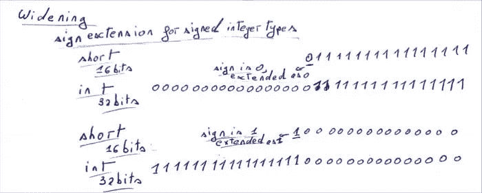
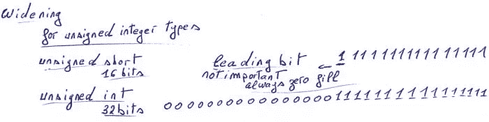
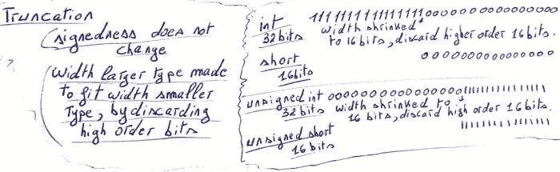
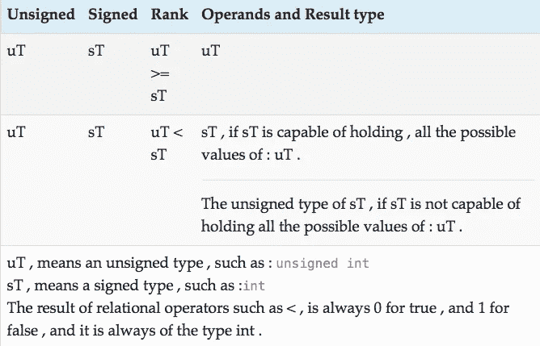

# 什么是不同 C #算术数据类型之间的扩大、截断、提升和转换？

> 原文：<https://medium.com/analytics-vidhya/what-is-widening-truncation-promotion-and-conversion-between-the-different-c-arithmetic-eb35f1ef1054?source=collection_archive---------24----------------------->

C 语言 *中的 ***算术数据类型为*整数类型，如`int`或`unsigned long`，浮点类型，如 `float`或 `long double`。***

# 整数类型的转换

## 什么是加宽？

加宽*仅将*应用于[有符号](https://twiserandom.com/data-structure-and-algorithms/what-is-a-signed-integer/)和[无符号](https://twiserandom.com/data-structure-and-algorithms/what-is-an-unsigned-integer/)整数类型。不适用于其他类型，如`float`或`double`。

加宽不是从有符号转换到无符号，或者从无符号转换到有符号，而是扩展整数类型的有符号性，从较小的类型扩展到较大的类型，因此从较少的位数扩展到较大的位数。整数类型的 ***有符号性不改变*** 。

***对于有符号类型*** ，加宽是通过所谓的:`sign extension`完成的。如果有符号类型的值为负，则通过用值`1`填充新位来扩展它，如果有符号类型的值为非负，则通过用`0`填充新分配的位来扩展它。



***对于无符号类型*** ，新分配的位用`0`填充



## 什么是截断？

截断 ***只发生在*** 整数类型，当从一个较大的整数类型传递到一个较小的整数类型时，例如，当从`int`传递到`char`或从`unsigned int`传递到`unsigned char`时，具有相同符号。

无论是有符号的还是无符号的，通过丢弃位于较小类型宽度之外的较大类型的位，较大类型被*定制为* ***适合较小类型*** ，仅保留较低阶位。



如上所述，截断仅保留有限数量的位， ***在将*** 从浮点类型转换为整数类型或在浮点类型之间转换时不会发生。
从浮点类型转换为整数类型时，小数部分被丢弃，浮点类型位不适合整数类型宽度，但浮点类型从浮点表示转换为整数表示。

## 整数转换程序

整数类型的转换， ***包括*** 首先执行扩大或截断，然后重新解释位。因此首先执行截断或加宽。截断或加宽 ***不会改变字体的符号性*** ，字体只是为了适应更大或更窄的宽度，具有相同的符号性。
在执行了加宽或截断之后，目标宽度中得到的位仅**被*重新解释为属于*** 新的整数类型，即目标类型。

***这个规则*** 唯一的例外，就是当转换为`_Bool`类型时，任何非零值都转换为`1`，而任何零值都转换为`0`。

解释了整数类型的转换是如何发生的之后，让我们先解释整数`rank`、**、*的概念，然后再解释何时发生到另一个整数类型*、**的转换。

## 什么是等级？

***C 中每个整数类型都有一个秩*。**

*的`unsigned`和`signed`整数类型* ***不分符号*** ，具有相同的等级。例如`int`和`unsigned int`，具有相同的等级。

整数类型的 ***等级*** 顺序如下:

```
_Bool < signed char < short < int < long < long long
```

上面概述的任何标准整数类型的秩大于任何实现定义的 的 ***秩，具有相同的宽度。***

[*char*](https://twiserandom.com/c/what-is-char-signed-char-unsigned-char-and-character-literals-in-c/) *和* `*signed char*`整数类型，具有相同的秩。

一个 [枚举](https://twiserandom.com/c/what-is-an-enum-in-c/)类型的 ***秩等于它的赋值实现，定义的整数类型。***

## 整数提升

整数类型，其中 ***具有比`int`小的*** ，每个都被提升为`int`类型，如果`int` 类型可以表示其所有可能的值，或者在其他情况下被提升为`unsigned int`类型。

当 运算符期望其操作数之一是算术类型时，秩小于`int`， ***的整数类型被提升。C #中的算术类型是整数或浮点类型。这种运算符的一个例子是减法运算符`-`，或者一元否定运算符`-`。***

整数提升，不是整数如何转换成另一种类型， ***是当*** 一个整数转换成另一种类型，在这种情况下是因为它的秩比`int`低。

```
unsigned char x = 1;
signed char y = -x;
/* 
x , is an unsigned char type , 
  it has a rank lower than int .
The unary negation operator is 
  used , as such x must be promoted . 
An int on 32 bits systems , have a 
  typical width of 32 bits , as such 
  it can store all the possible values
  of an unsigned char , which is limited
  to only 8 bits . As such the target
  promotion type is an int .
Now that the target type is decided , 
  which is an int , it has a larger
  width than an unsigned char , as
  such widening must be performed . 
Widening does not change  signedness ,
  so the unsigned char is widened to an
  unsigned int , by using zero fill . 
The resulting value is 1 ,  and has a bit 
  representation of : 
  00000000000000000000000000000001
The resulting bits , are interpreted as if , 
   as being of the type signed int , and the
   negation operator is applied .
The result of the negation operator is -1 , 
   which , has a bit representation of :
    11111111111111111111111111111111
The value is to be stored in a signed 
  char type , both int and signed char ,
  have the same signedness , as such 
  truncation is applied .
The width of a signed char type is 
  8 bits , as such the leading 24 bits 
  are discarded , and the result is : 
  11111111 , which is equal to -1 . */
```

## 函数调用或返回值

当进行函数调用时，一个 ***参数是整数类型*** *，不同于目标参数的整数类型*，发生类型转换。

变元被 ***转换为参数类型*** ，首先被截断或加宽到相同的宽度，然后重新解释目标参数类型的位。

```
#include<stdio.h>void trivialFunction( unsigned int val){
  if( val == 4294967295){
    printf( "%u is equal to 4294967295\n" , val);
  }
  else{
    printf( "%u is different from 4294967295\n" , val);}}int main( void){
  signed char x = -1 ;  
  trivialFunction( x);
  unsigned char y = x ;
  trivialFunction( y);}/* Output
4294967295 is equal to 4294967295
255 is different from 4294967295
*//*
In the first call to trivialFunction , 
  the passed argument is of type signed 
  char . trivialFunction expects its 
  argument , to be of the type unsigned 
  int , as such the argument must be 
  converted .
First widening to the same width of 
  unsigned int takes place . 
x is a signed char , as such it is 
  widened to a signed int , by sign
  extension . The value of x is -1 , 
  and it has a bit representation of 
  11111111 . The resulting value is -1 ,
  and it has a bit representation of 
  11111111111111111111111111111111 .
This bit pattern , is next reinterpreted
  as an unsigned int , so
  11111111111111111111111111111111 ,  
  as an unsigned int , has a value of 
  4294967295 . This is why trivialFunction
  prints : 4294967295 is equal to 4294967295The variable y , has a type of unsigned 
  char . It is assigned the value of x , 
  which is a signed char .
Both x , and y have the same width , as such 
  no widening occurs , only the bits of x ,
  are reinterpreted as being unsigned .
The bits of x , has a value of -1 , which is 
  11111111 , when reinterpreted as unsigned ,
  this yield the value of 255 . 
Next trivialFunction is called with y , 
  as a parameter . 
Widening occurs  , because y is an unsigned 
  char , and the function parameter is an 
  unsigned int . It is done by using 
  zero fill . 
Hence the value of 1 which has a bit 
  representation of 11111111 , is widened 
  to the value 255 which has a bit 
  representation of : 
  00000000000000000000000011111111 
The function prints : 
  255 is different from 4294967295 
*/
```

当函数的返回值 ***不同于其返回类型*** 时，返回值被转换为函数的返回类型。

## 分配和初始化

当使用`=`运算符对整数变量执行 ***赋值或初始化*** 时，如果要赋值的表达式属于不同的整数类型，则会发生整数转换。

```
unsigned char x = 1 ; 
/*
1 is an integral literal ,  it is 
  of the type int . 
The type int has a typical width 
  of 32 bits , while an unsigned 
  char has a typical width 
  of 8 bits .
The bits of the int type 
  00000000000000000000000000000001
  are reinterpreted as  being the 
  bits of an unsigned int type . 
  The result is :
  00000000000000000000000000000001 
The unsigned int value is truncated to 
  8 bits , and the value gotten is 
  00000001 , which is assigned to 
  the unsigned char x .*/
```

***关于整数文字量*** 类型的进一步信息，可以查看这篇[文章](https://difyel.com/c/literal/integer-literals-in-c/)。

## 算术运算符

当 ***使用以下运算符*** 之一时，将发生整数转换。

```
* / % + -  
/* 
Multiplication , division , 
  modulos , addition , 
 subtraction  .*/< <= > >= == !=  
/*
 Relational less , less or equal , 
  larger , larger or equal , 
  equal , not equal .*/& ^ | 
/* 
Bitwise and , xor , or .*/?: 
/* 
The Ternary operator expression , 
  must return a value of a specific 
  type , the second and third operand , 
  are converted to a same type . */+=  -=  *=  /=  %=  &=   ^=  |=  
/* operate and assign operators  */
```

在这些操作符的情况下， ***一个普通的类型*** 为必须确定的操作数和结果。这是按照下表的指定来完成的。



```
int si = -1 ; 
unsigned int ui = 0 ;ui = ui + si ; 
/*
int , and unsigned int , have the same 
  rank , one is signed , and the other 
  is unsigned , as such both operands , 
  must be converted to the unsigned int 
  type , and the result of the operation ,
  is of an the unsigned int type . 
ui is unsigned , so no conversion is 
  necessary . 
To convert si , to the unsigned int type , 
  and since both si and ui have the same 
  width , the bits of si , which are 
  11111111111111111111111111111111 ,
  are kept as is , they are only reinterpreted
  as belonging to a signed type , so now
  they have a value of 4294967295 . 
The addition is performed , and the result 
  of the addition operation , is as such :
  4294967295 + 0 = 4294967295 , and is
  of the type unsigned int . 
ui is of type unsigned int , as such 
  no conversion is necessary , and the 
  result of 4294967295 is stored in ui .
*/long long lli = -1 ; 
ui = lli + ui ; 
/*
lli is of the type long long , 
  it has a higher rank than 
  unsigned int . long long 
  can hold all the values of 
  unsigned int , as such , 
  both operands must be of
  the type long long . 
lli is of the type long long , 
  so no conversion is necessary . 
ui is an unsigned int , it has 
  a bit representation of 
  11111111111111111111111111111111
  it is first extended to unsigned 
  long by using zero fill . 
  0000000000000000000000000000000011111111111111111111111111111111
  After that , the gotten bits are 
  reinterpreted as being of type 
  long long . The gotten value , is 
  the same as the value of ui , which 
  is 4294967295 .  
The addition is  performed between , 
  the two long long integer types , and 
  the result is -1 + 4294967295 , which
  is equal to 4294967294 , and is of 
  the type long long .
ui is of the type unsigned int , the result
  which is of the type long long  must 
  be converted to unsigned int  .
It is first converted to unsigned long long , 
  the bits pattern does not change ,  so it remains 
  0000000000000000000000000000000011111111111111111111111111111110 .
  Now that is is of the type unsigned long long , 
  it is truncated to the type of ui , which is 
  unsigned int , and it has the format : 
  11111111111111111111111111111110  , 
  and a value of : 4294967294 .
*/long int li  = -1 ; 
li = li + ui ;
/*
ui is an unsigned int , whereas li
  is a long int . A long int has 
  a higher rank than an unsigned 
  int . Assuming that on this machine , 
  both long int and unsigned int have
  a width of 32 bits , this means 
  that long int is not capable of 
  representing all the possible values 
  of the unsigned int type , as such 
  the operands , and the result 
  must be of the unsigned long type . 
li bits are kept as is , and only
  reinterpreted as being of the 
  type unsigned long , as such li 
  will have the value of 4294967295 .
ui is converted to unsigned long , by 
  widening. unsigned int , and unsigned long 
  have the same width , as such the bits
  of ui remains the same , 
  11111111111111111111111111111110 .
Adding 4294967295 + 4294967294 = 
  8589934589 . The result is of 
  the type unsigned long , it cannot
  fit the width of the unsigned 
  long type , which has a max 
  value of 4294967295 , as such 
  overflow has occurred . 
  The modulo of the result , with
  regards to 2 to the power of 
  the number of bits ,
  of the unsigned long type is taken . 
  This is equal to 
  8589934589 % 4294967296 = 
    4294967293 , which is 
  11111111111111111111111111111101 
The result must be stored in li , 
  li is of the long type , the gotten
  value is of the type unsigned long , 
  the bits are kept as is , and the 
  result is only reinterpreted as being 
  a signed long , as such the value 
  of li is -3 . 
*/
```

对于*有符号和无符号整数类型的溢出*信息，可以查看[这篇](https://twiserandom.com/data-structure-and-algorithms/what-is-a-signed-integer/)和[这篇](https://twiserandom.com/data-structure-and-algorithms/what-is-an-unsigned-integer/)文章。

## 演职人员

`***Explicit***` ***转换发生在*** 中，使用铸造运算符:`(Type) expression`时。例如，显式地将`int`文字`1`转换为`long`类型

```
(long) 1
```

当使用 cast 运算符时，这个 ***称为*** `explicit`铸造，所有其他情况的转换，都称为`implicit`铸造。

# 浮点类型的转换

## 从一种浮点类型转换到另一种浮点类型

每个[浮点型](https://twiserandom.com/data-structure-and-algorithms/what-is-a-floating-point-number/)，都有不同的[量程和精度](https://twiserandom.com/c/what-is-a-float-double-long-double-and-a-floating-point-literal-in-c/)。因此，当将 ***从具有较高*** 精度和范围的浮点类型传递到具有较小精度和范围的浮点类型时，可能会发生精度损失、下溢或上溢。

```
double dbl = 16777217 ;
float fl = dbl ; 
/*
Loss of precision , fl value is
  16777216 .*/dbl = 1.2e-50 ; 
fl = dbl ; 
/*
Underflow occurs , the behavior 
  is implementation defined , 
  in this case , fl has a value 
  of 0 .*/dbl = 3.4e100;
fl = dbl ;
/*
Overflow occurs , the behavior 
  is implementation defined , 
  fl has a value 
  of positive infinity */
```

当从具有较小范围和精度的浮点类型**传递到具有较高范围和精度的浮点类型*时，不会发生精度损失、下溢或上溢。精度和范围保持不变。*

```
*float fl = 1.099511627776e12f;
double dbl = fl ; 
/*
precision and range are 
  preserved , dbl has a 
  value of :
  1.099511627776e12f , 
  which is 2 to the 
  power 40 .*/*
```

## *从浮点类型转换为整数类型*

*将浮点类型转换为整数类型的过程， ***可以认为是*** ，就好像，首先将数字转换为十进制记数法，然后丢弃小数部分，然后用其[有符号](https://twiserandom.com/data-structure-and-algorithms/what-is-a-signed-integer/)或[无符号表示法](https://twiserandom.com/data-structure-and-algorithms/what-is-an-unsigned-integer/)来表示。*

```
*double dbl = 1.3f; 
unsigned char uc = (unsigned char) x ;  
// uc is equal to 1dbl  = -1.3f;
uc = dbl  ; 
// uc is equal to 255*
```

*如果浮点数 ***太大而不能用整数类型表示*** ，那么这种行为不是由 C 标准定义的，而是由实现定义的。*

```
*double dbl = 3.4E30 ;unsigned long ul  = dbl ; //ul is equal to 0
unsigned int ui  = dbl ; //ui is equal to 0
unsigned char uc  = dbl ; //uc is equal to 0long li  = dbl ; //li is equal to -9223372036854775808
int si  = dbl ; //si is equal to -2147483648
signed char sc  = dbl ; //sc is equal to 0*
```

## *从整数类型转换为浮点类型*

*将整数类型转换为浮点类型时， ***整数值始终可以用*表示**，但可能会损失[精度](https://twiserandom.com/c/what-is-a-float-double-long-double-and-a-floating-point-literal-in-c/#Floating_point_precision)。*

```
*int si = 16777216 ; 
float fl = si ;  // fl is equal to 16777216si = 16777217 ; 
float fl = si ; // fl is equal to 16777216*
```

## *转换发生在什么时候？*

*当涉及浮点类型时， ***转换发生*** ，当进行函数调用，且传递的实参与函数形参的类型不同，或当函数的返回值与其返回类型不同时。*

*当执行浮点变量、赋值和初始化时，也会发生这种情况。最后，当使用算术运算符时，或者当使用显式强制转换(如`(float) 1.0`)显式完成时，会出现这种情况。*

## *浮点类型的等级*

*一个浮点类型的秩，*是* ***总是高于*** 一个整数类型的秩，所以一个整数类型，总是被转换成浮点类型。*

*至于浮点类型，它们有以下*等级*:*

```
*float < double < long double*
```

*如果一个算术运算， ***涉及两个不同秩的浮点类型*** ，则秩较低的浮点类型转换为秩较高的浮点类型。*

*涉及浮点类型的运算的结果 的 ***类型与排序算法确定的类型相同。****

## *浮点类型提升*

*与整数类型提升一样，在执行算术运算时，浮点类型 ***可以提升*** ，成为具有更高精度和范围的类型。*

*这是 ***不要与*** 混淆转换是如何发生的，或者在哪个秩中执行，涉及浮点类型的算术运算，它总是使用较高的操作数秩来执行。*

****推广规则，在*** 宏`FLT_EVAL_METHOD`中定义，在`float.h`表头中定义。*

*如果`FLT_EVAL_METHOD`被设置为`0`，那么算术运算以最宽操作数的类型完成，所以如果两个操作数都是`float`，算术运算使用`float`类型完成，所以不发生提升。*

*如果`FLT_EVAL_METHOD`被设置为`1`，则通过将操作数提升为`long double`来执行算术运算，如果任何操作数是`long double`类型，否则操作数被提升为`double`类型，即使两个操作数都是`float`类型。*

*如果`FLT_EVAL_METHOD`被设置为`2`，则通过将操作数提升为`long double`类型来执行算术运算。*

*如果`FLT_EVAL_METHOD`设置为`-1`，则行为未定义。*

**原载于 2020 年 12 月 23 日*[*https://twiserandom.com*](https://twiserandom.com/c/what-is-widening-truncation-promotion-and-conversion-between-the-different-c-arithmetic-data-types/)*。**