# 什么是世界幸福指数？

> 原文：<https://medium.com/analytics-vidhya/what-is-world-happiness-index-f5744490701f?source=collection_archive---------11----------------------->

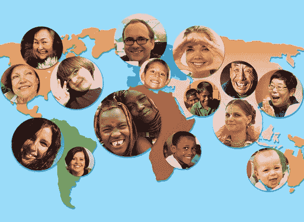

《世界幸福指数》是根据 156 个国家的公民对自己的幸福程度对这些国家进行排名的全球幸福指数。

《世界幸福报告》是联合国可持续发展解决方案网络的年度出版物。它包含了一些文章，以及根据受访者对自己生活的评价而进行的国民幸福度排名，这份报告还与各种生活因素相关联。

下一个问题是“如何计算 156 个不同国家的幸福指数？”

国民幸福排名是基于坎特里尔阶梯调查。全国范围内具有代表性的受访者样本被要求想出一个阶梯，对他们来说最好的生活可能是 10，最差的生活可能是 0。然后他们被要求在 0 到 10 的范围内给自己目前的生活打分。

该报告将结果与各种生活因素联系起来。

如果你想要完整的**代码或数据集**点击这个链接:[https://www . ka ggle . com/DG tech/world-happy-with-basic-visualization-and-EDA](https://www.kaggle.com/dgtech/world-happiness-with-basic-visualization-and-eda)

**哪些参数或因素用于计算一个国家的总体排名(根据幸福指数进行的国家排名)？**

*   分数:2015 年通过向被抽样的人提出问题来衡量的一个指标:“在 0 到 10 的范围内，你如何评价你的幸福，其中 10 是最幸福的。”
*   人均 GDP:GDP 对幸福指数计算的贡献程度。
*   健康预期寿命:预期寿命对幸福指数计算的贡献程度
*   做出生活选择的自由:自由对幸福分数计算的贡献程度。
*   对腐败的认知:对腐败的认知对幸福得分的贡献程度。
*   慷慨度:慷慨度对幸福分数计算的贡献程度。

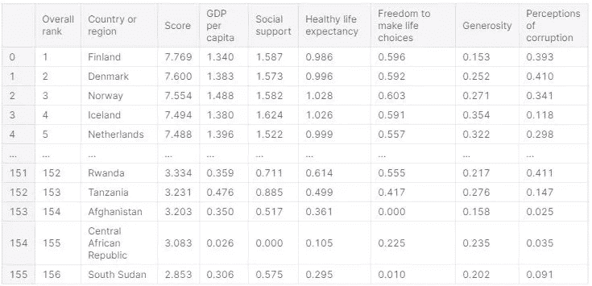

世界幸福 2019 数据集

在数据中，只有“国家”出现在文本中，所有其他特征都是数字。让我们来计算平均值、标准差、五个分位数等…

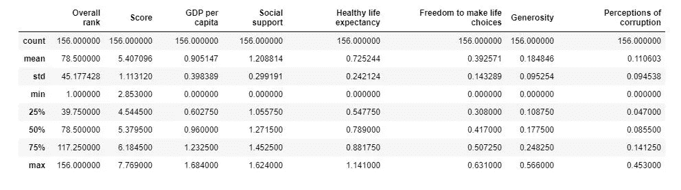

数字数据的统计学

**幸福分数是如何分配的？**

正如你在下面看到的，幸福指数的值在 2.85 和 7.76 之间。所以没有一个国家的幸福指数高于 8。

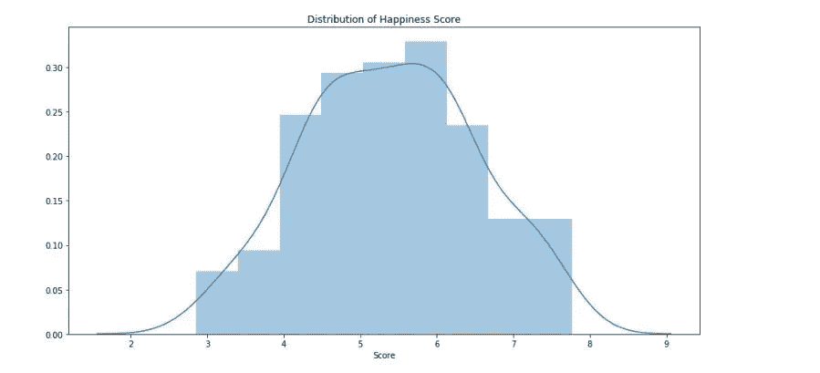

幸福分数的分布

# 让我们看看不同特征与幸福指数之间的关系。

**1。人均国内生产总值**

*   人均国内生产总值(国家经济)与幸福指数之间存在强正相关关系。
*   因此，如果一个国家的人均 GDP 高于幸福指数，那么这个国家的幸福指数也可能会更高。

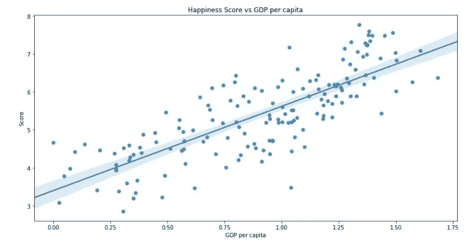

幸福指数与人均 GDP(经济)

# 十大高 GDP 国家(经济体)

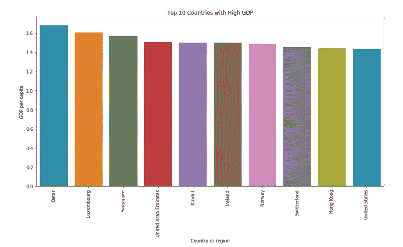

GDP 最高的 10 个国家

**2。对腐败的看法**

对腐败的看法的分布是正确的，这意味着对腐败有高度看法的国家很少。这意味着这个国家的大部分地区都存在腐败问题。

# 众所周知，腐败是世界面临的一个大问题。

> 腐败是一种癌症:这种癌症会侵蚀公民对民主的信念，削弱创新和创造力的本能；已经吃紧的国家预算，挤出了重要的国家投资。它浪费了整整几代人的天赋。它吓跑了投资和工作。- [乔·拜登](https://www.brainyquote.com/authors/joe-biden-quotes)

**腐败会对幸福得分产生怎样的影响？**

*   对腐败的看法数据高度扭曲，难怪数据的线性关系很弱，但正如你在散点图中看到的，大多数数据点在左侧，大多数对腐败看法较低的国家的幸福指数在 4 到 6 之间。
*   感知得分高的国家幸福得分也高，在 7 分以上。

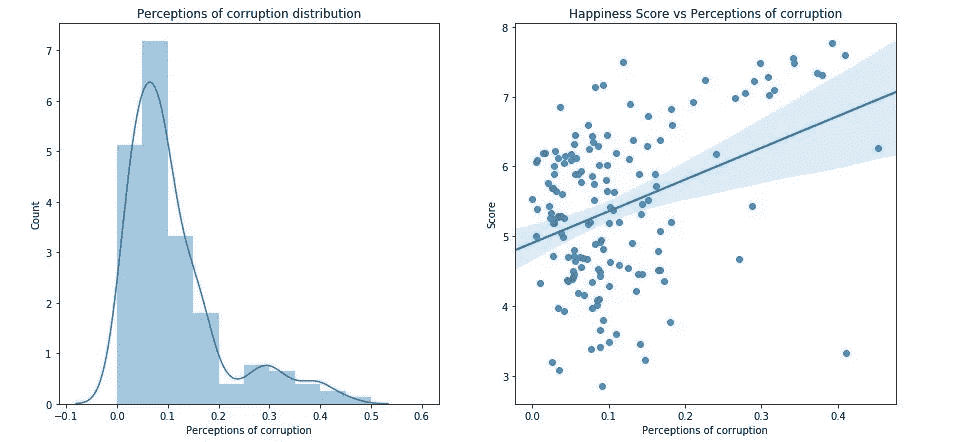

# 腐败程度最高的 10 个国家

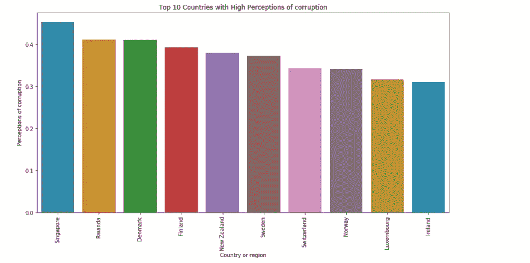

**3。健康预期寿命**

> 有健康就有希望，有希望就有一切。 **-** *阿拉伯谚语*

*   健康的预期寿命与幸福指数有很强的正相关关系。
*   因此，如果一个国家的预期寿命很高，那么它的幸福指数也会很高。这是有道理的，因为任何健康长寿的人显然是幸福的。
*   如果我健康长寿，我也会很开心。**你说什么？**

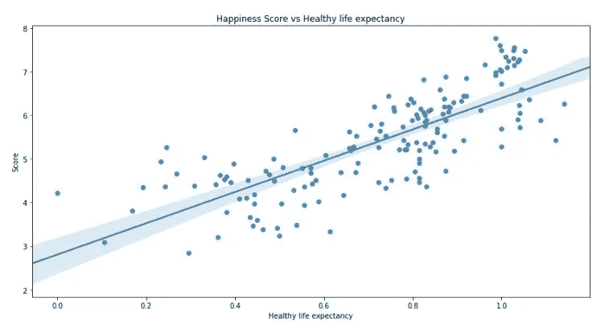

# 健康预期寿命最高的 10 个国家

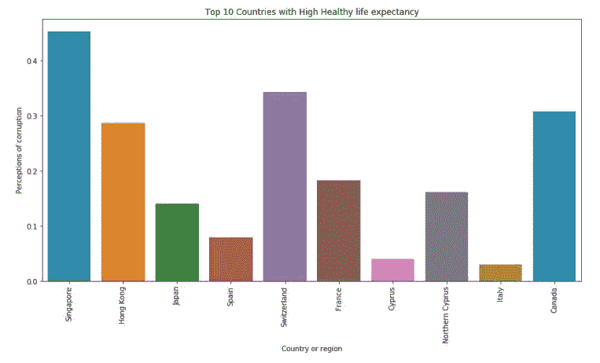

**4。社会支持**

> 当一个人落魄时，一盎司的帮助胜过一磅的说教。爱德华·g·布尔沃-利顿

*   国家的社会支持与幸福得分也有很强的正相关关系。
*   此外，与快乐分数的关系需要很强，因为你在社交上帮助得越多，你就越快乐。

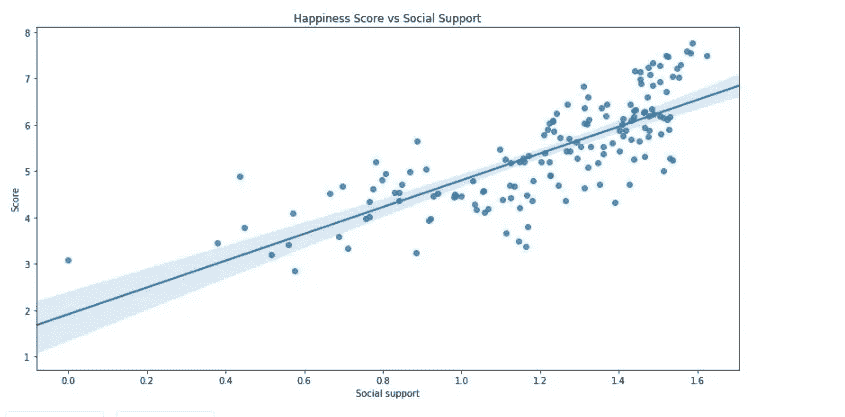

# 社会支持度最高的 10 个国家

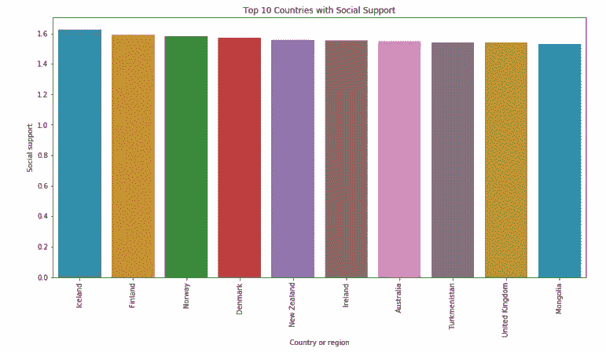

**5。做出人生选择的自由**

> 我们是生活的创造力量，通过我们自己的决定而不是我们的条件，如果我们认真学习做某些事情，我们可以完成这些目标。—斯蒂芬·柯维

*   做出生活选择的自由与幸福得分呈正相关。这种关系是有意义的，因为你会有更多的自由来决定你的生活，你会更快乐。

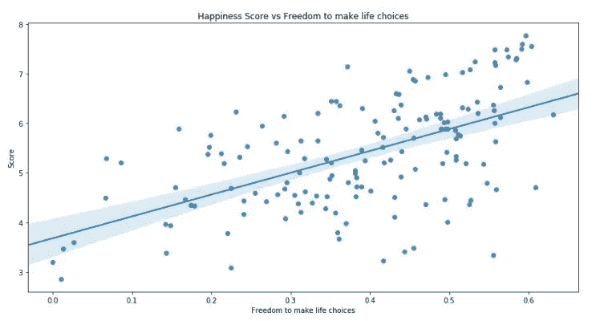

# 生活选择自由度最高的 10 个国家

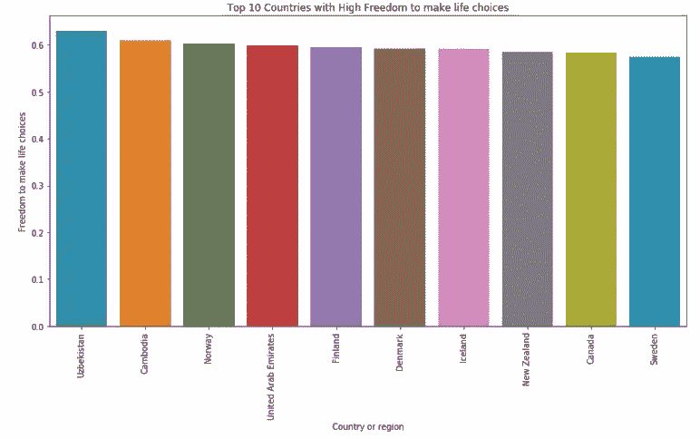

6。慷慨

慷慨与幸福分数的线性关系很弱。突然我们脑海中出现了一个问题，

为什么慷慨与幸福指数不是线性关系？

慷慨度评分基于向全球非营利组织捐赠最多的国家。不慷慨的国家并不意味着他们不快乐。

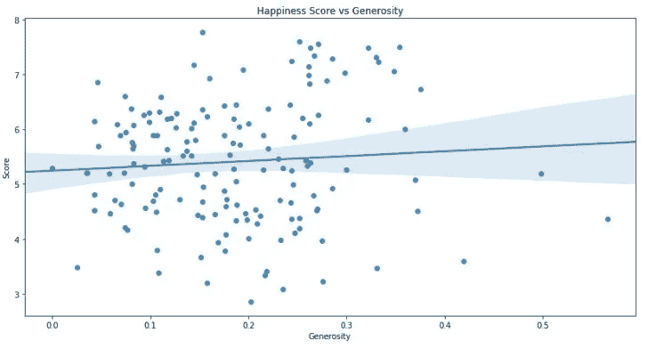

# 十大慷慨国家

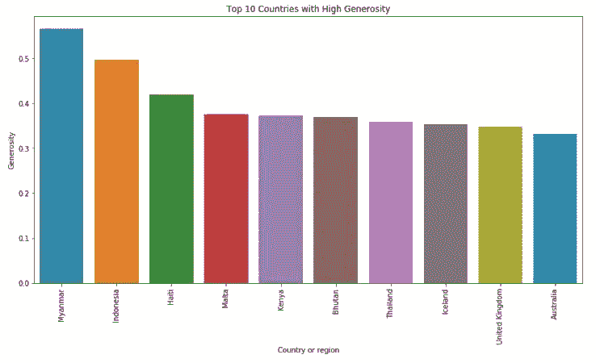

# 一个功能如何与另一个功能相关联？

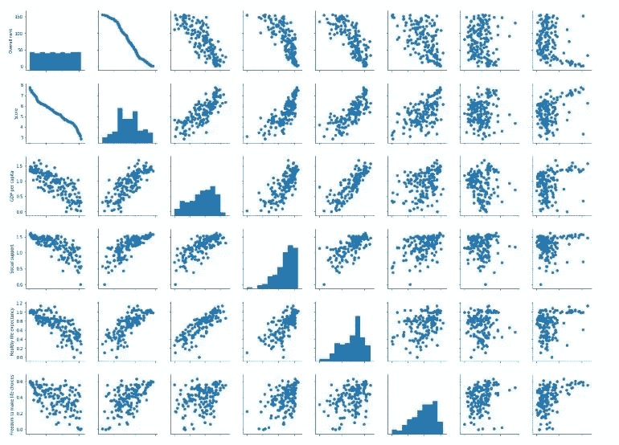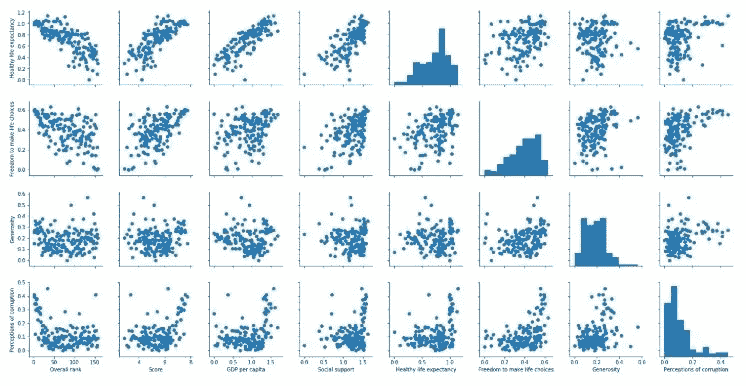

下面的热图显示了特征之间的相关性。

幸福得分与以下因素高度相关

> **人均 GDP>社会支持=健康预期寿命>做出人生选择的自由>对腐败的看法**

幸福得分与慷慨程度没有太大关联。

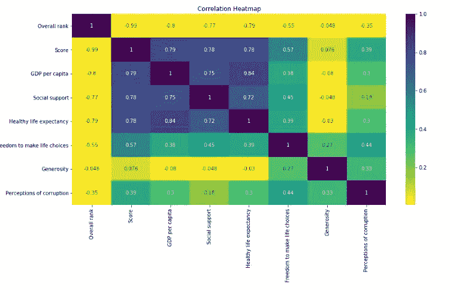

# 幸福指数最高的 10 个国家

所以**芬兰 是世界上最幸福的国家。**

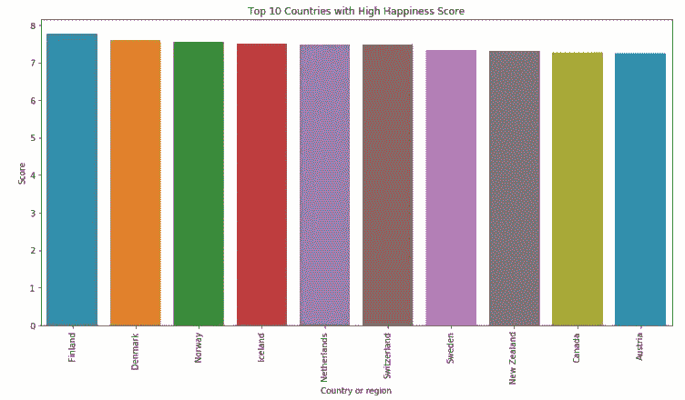

**目前，芬兰政府正在考虑采用一种新的理念，即每周只工作 4 天(更多详情，请点击** [**此处**](https://www.theguardian.com/money/shortcuts/2020/jan/06/finland-is-planning-a-four-day-week-is-this-the-secret-of-happiness) **)。难怪芬兰是世界上最幸福的国家。这个想法需要在所有国家都适用，你说呢？😆**

你可以在上面看到世界十大幸福国家，他们的幸福得分没有太大差别。

现在我们来比较一下幸福感前 5 名的国家各有什么特点。

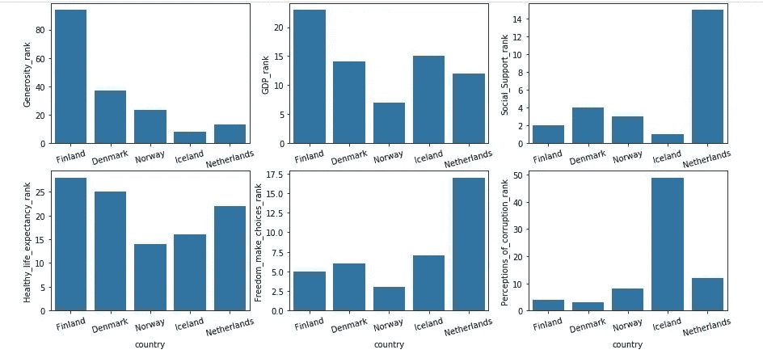

如上图所示，幸福指数排名第一的国家**芬兰**比其他 4 个国家 ***慷慨程度高，GDP 和健康预期寿命*** 。

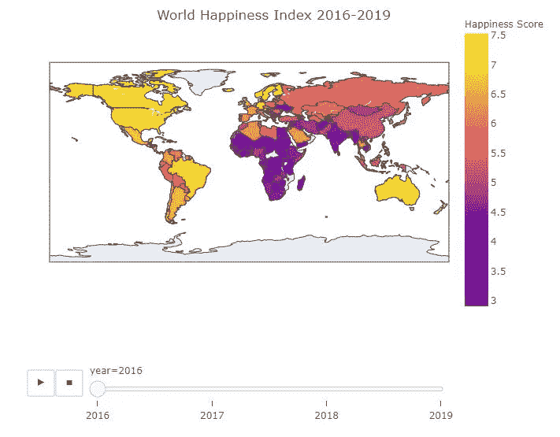

要在地理地图上显示 2016 年至 2019 年的幸福指数，请点击这里:[https://www . ka ggle . com/DG tech/world-happiness-with-basic-visualization-and-EDA](https://www.kaggle.com/dgtech/world-happiness-with-basic-visualization-and-eda)

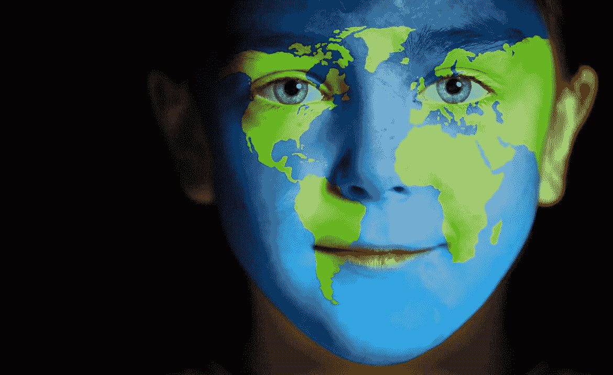