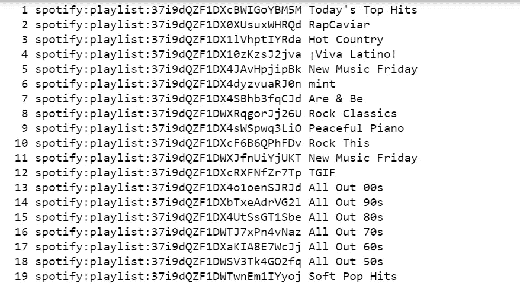
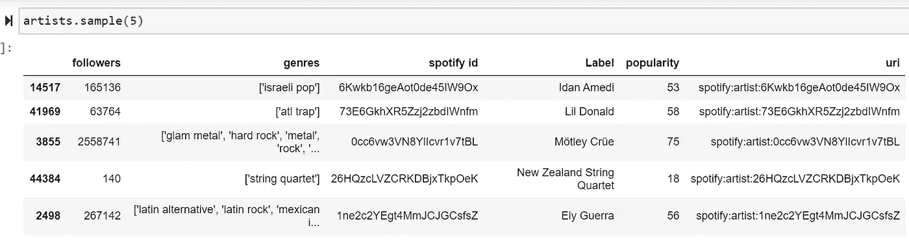
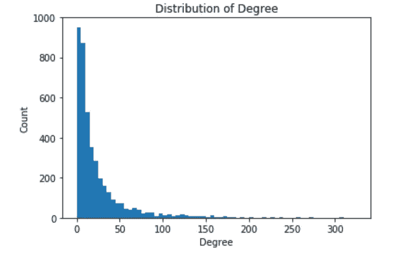
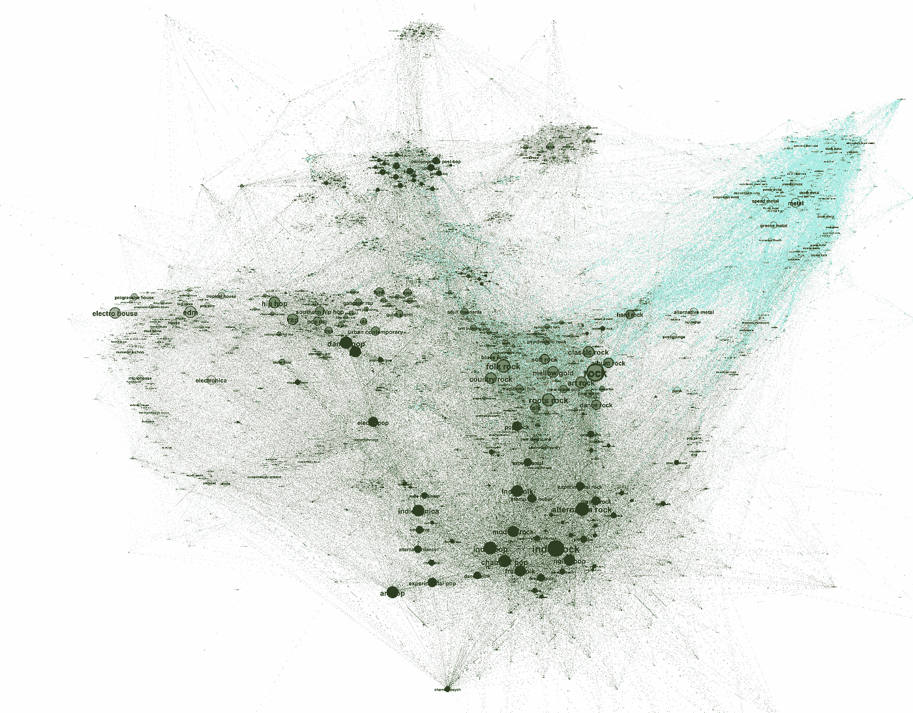
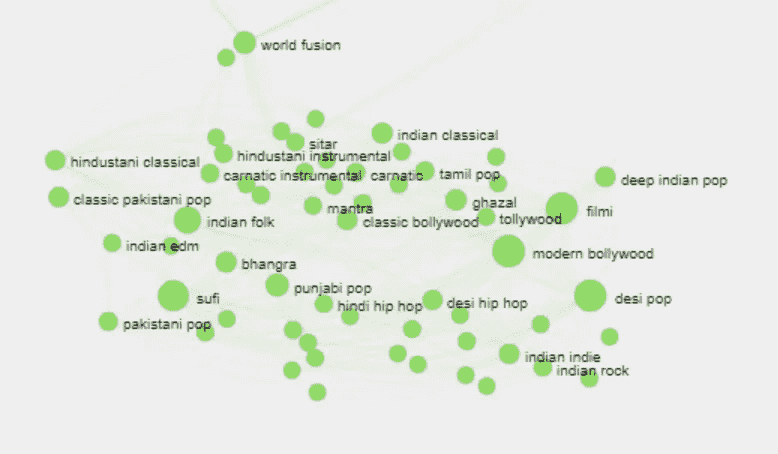
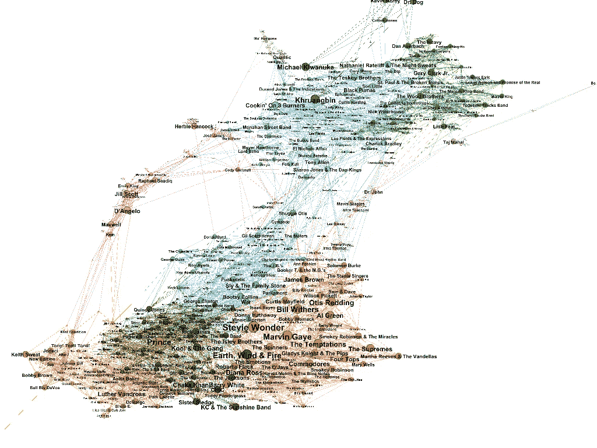
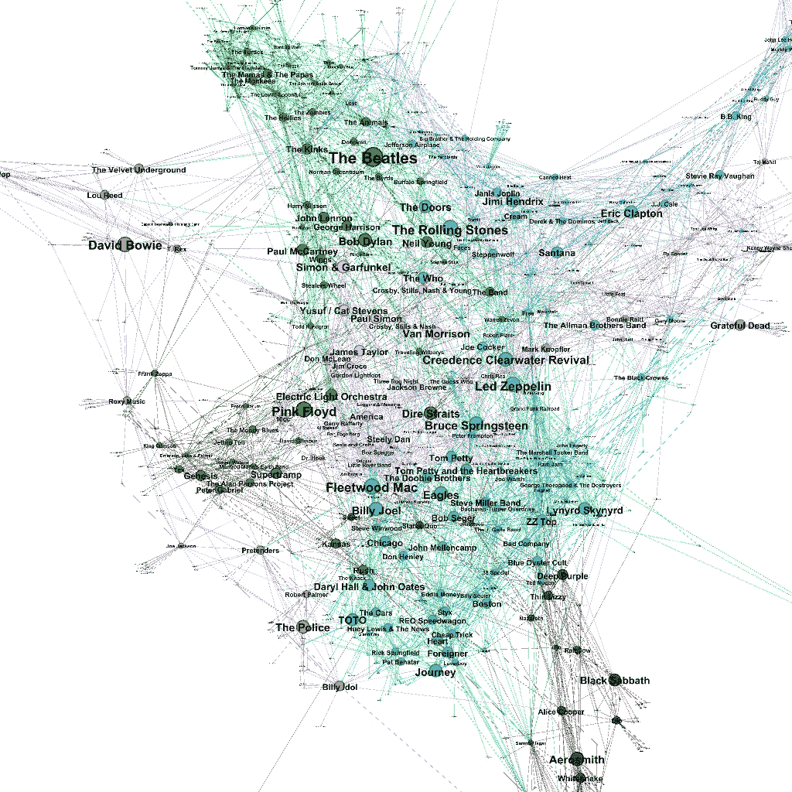

# 你听哪种音乐？—探索 Spotify 的流派网络

> 原文：<https://medium.com/analytics-vidhya/what-kind-of-music-do-you-listen-to-exploring-the-network-of-spotifys-genres-56d188201a07?source=collection_archive---------5----------------------->

Spotify 是当今世界上最常用的音乐流媒体平台之一。它拥有世界上最大的数字音乐收藏，并采用各种算法对其数据进行标记、量化和分类，以用于其推荐算法。换句话说，它是有趣数据的金矿。Spotify 有自己的[开发者 API](https://developer.spotify.com/documentation/web-api/) 和一个相应的 [python 库](https://spotipy.readthedocs.io/en/2.12.0/#)，非常容易使用并且有据可查。我对其数据库中每个艺术家的流派标签特别感兴趣，并希望使用这些数据来探索不同流派之间的关系，并尝试检测潜在的流派社区。

对于这个分析，我使用来自 Spotify API 的数据，并使用 [iGraph 包](https://igraph.org/python/doc/igraph.Graph-class.html) Python 来提取和分析数据。我还使用 [Gephi](https://gephi.org/) ，一个开源的图形可视化软件来可视化和分析流派网络。这篇文章涵盖了分析的高层次概述，包括最有趣的发现。有关代码和网络测量的详细信息，请参考此处的代码。[https://github.com/manasahariharan/Genres-Network](https://github.com/manasahariharan/Genres-Network)

最终的互动网络在这里(最好在笔记本浏览器上观看):[https://manasahariharan.github.io/Spotify-Artists-Network/](https://manasahariharan.github.io/Spotify-Artists-Network/)

# 数据

所以第一个问题是，我如何从 API 中抽取足够大的艺术家样本？Spotify 不会在一个命令中给出所有艺术家的数据。我需要知道艺术家的名字或 id 来检索他们的信息。因此，为了获得我们的数据，我需要一个艺术家姓名或 id 的列表，该列表应该是无偏见的，它不能只涵盖一个特定的流派或时代。有很多方法可以获得这个样本，我对 spotify 自己的任何播放列表(由 spotify 而不是任何个人用户创建的播放列表)中包含的歌曲进行了采样，并收集了所有这些歌曲的艺术家的数据。

Spotify 创建的播放列表示例——Spotify 迄今已创建了超过 1400 个播放列表。

我还使用了 spotify 上的相关艺术家功能。该函数为我们提供的任何艺术家提供多达 20 个相关艺术家作为输入，这样，我就能够增加我的样本大小，并拥有 85283 个独特艺术家的数据。对于这些艺术家中的每一位，数据集包括他们的 Id、姓名、关注者数量、受欢迎程度(由 Spotify 的算法计算的指标)，以及一系列表明他们所属流派的标签。

艺术家数据集示例

这个流派列是我们进行分析所需要的。由于每个艺术家通常属于多个流派，我们可以使用这个专栏来建立一个共现矩阵。这个矩阵将告诉我们任何两个流派一起出现的频率。共生矩阵通常非常稀疏。我们的数据集有 4174 个流派标签(你能相信世界上有这么多流派吗！)所以我们的共现矩阵有 4174 行和列。请记住，由于这只是 spotify 数据的一个样本，这不是 spotify 中存在的所有风格标签， [Every Noise at Once](http://everynoise.com/) 是一个收集和采样所有风格数据的项目，估计到目前为止 spotify 中有 4422 个标签。

# 了解和可视化网络:

使用 Python 中的 iGraph 包，我建立了一个网络，其中每个流派都是一个顶点，每次两个流派被分配给同一个艺术家时都有一个边。我还分配了**的边权重**，所以如果“嘻哈”和“说唱”都用来描述 100 个艺术家，那么连接“嘻哈”和“说唱”的边权重将为 100。具有较高权重的边可以被理解为这两种风格彼此更密切相关。下面是学位在我的流派网络中的分布，以及其他关于这个网络的基本数据。这是现实世界网络中非常标准的度分布，大多数顶点的度都很低，只有极少数顶点的度很高，这就是所谓的枢纽。在 jupyter 的笔记本中进一步研究了其他变量，如介数中心性和页面等级。

由于网络的规模很大，实际的网络很难用 iGraph 和 Python 来可视化，因此我使用了 Gephi，这是一个开源的图形可视化平台，可以处理非常大的图形，并有插件来创建一个基于我的网络的交互式网站。我使用加权度来决定节点的大小，并应用社区检测算法来尝试和检测我们的图的潜在社区结构。节点根据它们被分配到的社区进行着色。

该图的布局是 ForceAtlas2，这是一种 gephi 布局，它将节点视为电荷，它们在一起出现的次数越多，就越相互吸引。因此，如果两个节点彼此相距很远，我们可以假设它们彼此没有什么共同点，反之亦然。此图分辨率有限，要查看完整的互动网络，请点击[此处](https://manasahariharan.github.io/Spotify-Artists-Network/):

# 图表中的见解

乍一看，似乎社区检测算法已经做了相当不错的工作。如果我曾经想要一个更简单的分类系统来进一步分析艺术家，我可能会使用社区 id 来代替单独的流派标签。这将减少我的数据集中唯一类别的数量，使进一步的分析更加容易。

在一个集群中有**摇滚**及其所有衍生，最大的节点大小表示来自各种流派的艺术家被置于摇滚的保护伞下。考虑到[摇滚已经死了](https://www.vice.com/en_us/article/a3aqkj/rock-is-dead-thank-god)，这让我有点惊讶。但这是有意义的，这不是一个近期艺术家的数据库，这是一个追溯到一个世纪前的艺术家的集合，摇滚是最持久的音乐运动。

接下来我们有**流行**、**独立音乐**、**另类摇滚**和其他流行艺术家，他们不会轻易归入主要流派。Hip-hop、rap 和它们的衍生音乐自成一类，还有一些早期的影响流派，如 funk、soul 和。考虑到过去几十年它们对我们文化的影响，它们的节点大小如此之小令人惊讶。这可能是因为说唱和嘻哈比摇滚流派更新，因此数据量较小，也可能是采样错误，这意味着，Spotify 的播放列表(这是该数据样本的来源)可能更多地关注摇滚和流行音乐，而不是说唱和嘻哈，这可能值得调查，如果是真的，Spotify 需要转移重点，让所有社区和流派的艺术家获得同等的关注。

我们也有金属在它自己的集群中，朋克和另类金属在一个集群中。**电子音乐**被分成 2 个集群。据我所知，一种是锐舞类电子音乐，另一种是电梯音乐。**拉丁音乐**也有自己的集群，**爵士乐**及其衍生产品也是如此。这些只是主要的集群。每个国家的主要流派似乎都有自己的小群体，如法国嘻哈、韩国流行、日本流行、比利时独立摇滚等。当然，我特别感兴趣的一类音乐是印度/南亚音乐，其中有一些非常奇怪的流派。

图中是印度音乐集群的主要节点，但在同一个集群中也分组了新时代的流派，如愈合、psychchill、全速、萨满、进步精神恍惚(是的，根据 spotify，这些是实际的流派)。当然了。为什么我会感到惊讶？

在这种情况下，这里只是 Spotify 中怪异流派的一个例子:泡泡糖舞、密室逃脱、摇摆不定、忍者、深度精神病患者、牛仔(？！)

# 艺术家网络

为了更深入地研究数据集，我还想创建一个艺术家网络，使用 spotify 前面提到的相关艺术家功能作为边(如果艺术家 A 成为艺术家 B 的相关艺术家，那么就会有边)，艺术家作为节点。然而，即使 Gephi 也不能处理一个有 80k 节点的网络，所以我决定在流派网络的上下文中查看艺术家的子集。

我挑选了两个早期流派的例子，它们影响了很多新艺术家，我观察了所有被贴上该流派标签的艺术家，看看他们是如何相互联系的。在两个网络中，艺术家的节点大小根据他们的 spotify 追随者的数量来决定，颜色由用于流派网络的相同社区检测算法的结果来指示(三个网络的模块性在 0.7 的范围内)。与流派网络不同，这些网络是有方向的，这意味着每个边缘都有一个方向。如果艺术家 A 在艺术家 B 的前 20 个相关艺术家中，那么边缘将从 B 到 A，反之亦然。

## 惊恐

放克起源于 20 世纪 60 年代，是布鲁斯、灵魂乐、节奏蓝调等音乐类型的融合，它本身也影响了今天的许多艺术家。像《王子》、《史蒂夫·旺德》、《大地》、《风与火》这样的经典作品是这一流派的核心，但我们也有一些像 Khruangbin 和 Gary Clark Jr .这样的新艺术家，他们并不是严格意义上的恐惧，但却深受这一流派艺术家的影响。

放克艺术家相关网络

## 经典摇滚

这里的社区结构似乎很松散，但我们看到橙色集群是 60 年代和 70 年代更具实验性(酷)的家伙，蓝色集群是更倾向于布鲁斯的艺术家，绿色基本上是披头士和乐队，粉色集群是经典摇滚中更安静的一面，橄榄绿是更吵闹的一面。但不确定平克·弗洛伊德在它的邻居中做了什么。

# 最终注释

严格地说，这是一个没有人真正需要的分析，我做这个只是因为我很无聊。但这太有趣了，尤其是在我们周围一片混乱的时候，走进所有这些与音乐有关的兔子洞，一路上了解网络。希望这对你也有用/有趣。实际上，我最终挖掘的数据比我在这次分析中使用的还要多，所以如果你想到我可以用音乐曲目和艺术家的数据做任何其他分析，请告诉我！