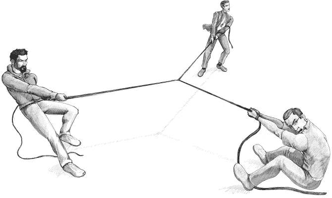
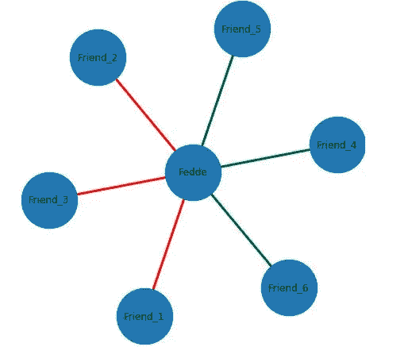
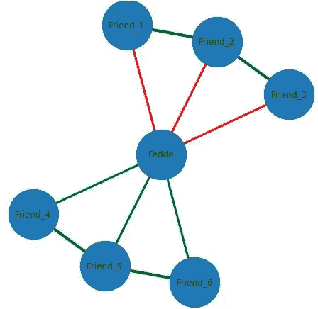
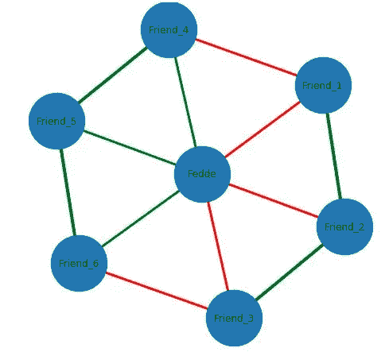
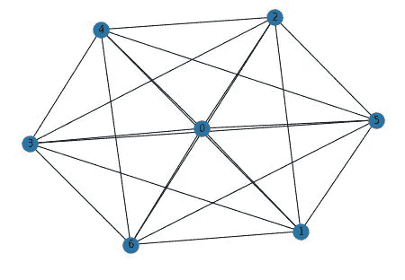
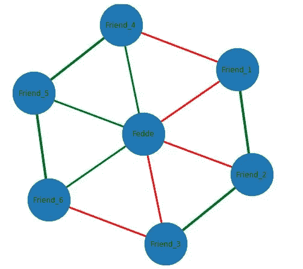
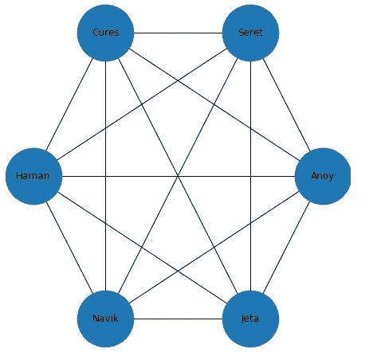
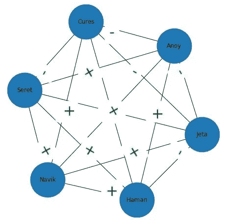
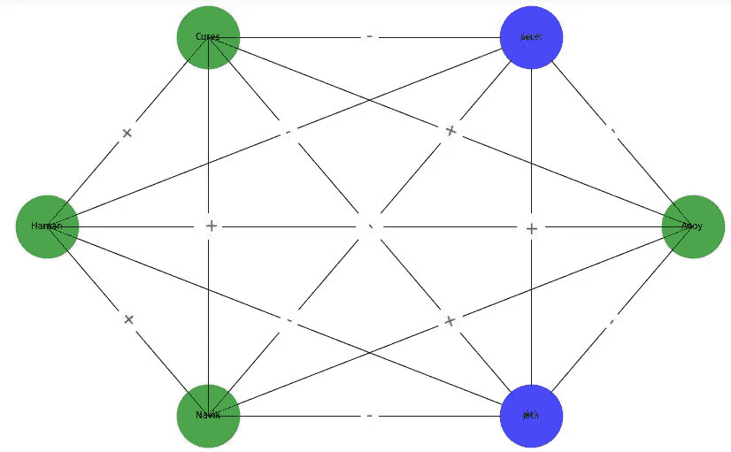

# 人群之间存在什么样的结构平衡？

> 原文：<https://medium.com/analytics-vidhya/what-kind-of-structural-balance-exists-between-group-of-people-338086fab8f8?source=collection_archive---------12----------------------->

这是上一章的延续[。请在你阅读这篇博客之前浏览一遍，否则你会发现很难理解这篇文章。](/@mvschamanth/understanding-positive-and-negative-relationships-with-respect-to-social-network-concepts-4a729590e995)

正如我们之前与三个人讨论的所有可能的情况。那么，如果我们的网络中有三个以上的人，那么 ***稳定的网络或稳定的关系是什么样子的呢？***

# 理解场景的几个例子

## 例 1:三个打架的人正在参加一场拔河比赛。

图一:三个人之间的拔河比赛

假设三个人在一个拔河游戏中打架(*【Anoy】**【Seret】**【Cures】*)。

最终变成***混乱***。这场战斗还在继续…，这种情况没有解决办法。

**但是，当两个人组成一个团队，与其他人作战**

图 2:两个人组队对抗第三个人

当两个人组成一个团队，和第三个人对抗，那么两个团队中的一个团队会赢(这是一个稳定的情况)。也就是说，就像“Seret”和“Cures”组成一个团队，对抗“Anoy”一样。

直觉思维，这与[上一章](/@mvschamanth/understanding-positive-and-negative-relationships-with-respect-to-social-network-concepts-4a729590e995)中的情况 2 相同。

## 例 2:四个人在参加拔河比赛。

想象四个人*“Anoy”、“Seret”、“Cures”*、*“Jeta”*。这四个人在玩“拔河”。所有人之间将再次出现混乱，因为如果四个人都试图同时玩并赢，这个游戏将永无止境。

如果**【Seret】*组成如图 2 右图所示的**一队**，然后与*【Anoy】**【Jeta】(还没组队的)*竞争，那么和上面的例子一样(三个队在战斗，战斗中仍然会有**混乱**)。*

**

*图 3:三个人组成一个团队，与其他对手战斗*

*所以，这里理想的情况(稳定的情况)是，四个人组成两队(以任何方式)战斗——**一队**中的*【Anoy】【Jeta】【Seret】*和**中的*【治愈】*另一队**(or)*【Anoy】*和****一队***【治愈】****

*那么，**从这两个例子可以推断出什么？** *(略想一秒)。**

> *在任何特定的情况下，战斗总是发生在两个队之间*

*即使摔跤场上有 10 个人(基于我们的 ***“敌人的敌人是朋友”*** 场景)，这 10 个人都会组成两个不同的队伍，互相对战。*

# ***一群人中稳定的关系***

**稳定关系*借助 [***平衡定理***](https://en.wikipedia.org/wiki/Balance_theory) 形成或定义。我将尝试用一个例子来解释它，而不是用完整的证据来解释。*

## ***平衡定理举例***

**

*图 4 : 6 个“费德”的朋友*

*让我们为这个叫*【费德】*的男孩找 6 个朋友。他与其中三人有**正关系**(*朋友 _4，朋友 _5* & *朋友 _6* )和**负关系**与其他三人(*朋友 _1，朋友 _2* & *朋友 _3* )。*

*在[上一章](/@mvschamanth/understanding-positive-and-negative-relationships-with-respect-to-social-network-concepts-4a729590e995)中我们已经看到，三个人之间的**稳定关系**是当所有关系都为正的时候*&***当两负一正关系存在的时候*** 。**

**那么，通过使用这些概念，让我们来看看这 6 个人之间是如何存在三角稳定关系的？**

****

**图 5:6 个人和“费德”之间稳定的三角关系**

**在 ***图-5*** 中，可以清楚地看到，所有的三角关系都是稳定的(如右边的*【费德】*)，每个三角网络中有两个负关系和一个正关系，这表明一方的朋友之间的友谊，即使他们与*【费德】**【费德】*有一些争执，但都是正关系，这表明一方的人与【之间的关系**

**N 现在，为了建立这个完全连接的网络，我们需要创建与每个节点的连接——为了实现这一点，在“朋友 _4 和朋友 _1”之间应该存在什么类型的关系(三角关系在“朋友 _1”、“朋友 _4”和“Fedde”之间)。**

****

**图 6:6 个人和“费德”之间稳定的三角关系**

**很简单，应该是 ***负关系*** (由于*稳定关系*存在，如果**要么所有关系都是正的，要么两负一正关系**)。**

**从**图-5** 中还可以清晰的观察到，那个 **(** *'朋友 _1 '，【朋友 _2'* 和'*朋友 _3'* **)** 是一个团队， **(** *'朋友 _4 '，【朋友 _5'* 和*'朋友 _6'* **)** 是另一个团队。从图 5 和图 6 可以推断出，**

> **网络中一组节点内的连接**为正**连接**，两组**节点和**之间的连接**为负**。********

**S 表网络中一群人存在**当且仅当 ****

********

**图 7:稳定(左)所有连接都是正的，而(右)如果网络内连接是正的，网络间连接是负的**

> ****网络中所有**的**连接**都是**正**。**
> 
> *****或*****
> 
> **“网络中一组的节点内的连接**为正**连接**，两组**的节点间的连接**为负**”。******

# **用一个例子理解结构平衡**

**我们假设，IT 创业公司有六个人*(“Anoy”、“Haman”、“Navik”、“Jeta”、“Seret”、“Cures”)*。**

****

**图 8:人与人之间的联系数量**

**因为只有六个人，所以每个人都会互相认识。因此，所有六个人之间可能的联系数量是 20，即 6C3=20(顺序无关紧要)。**

**很常见的是，一个公司里的所有人都不会和其他人有积极的关系(彼此之间会有一些消极的关系)，如图 9 所示。**

****

**图 9:六个人关系不稳定。**

****' — '** 符号表示*负关系*， **'+'** 符号表示*正关系。***

**如果创业公司里有 ***完全不稳定关系*** ，那么*那家公司就很难很好的运转。但是，慢慢地(随着时间的推移),公司中的关系会变得稳定，如下图所示***

****

**图 10:六个人之间的稳定关系**

***‘治愈’，‘Anoy’，‘哈曼’，‘纳维克’*在公司形成**一组**，用*绿色表示。***

***【Seret】**【Jeta】*组成**公司的另一个群体**，用*蓝色表示。***

**如上所述*两个绿节点之间的连接(* ***网内连接****正**’*和“*绿节点与蓝节点之间的连接(* ***网间连接*** *)正* ***负***’。**

# **结论**

**即使上面所有的概念都是和不到 7、8 个人讨论的。同样的推论和条件对网络中任何数量的人都成立。**

**为了更长时间地维持网络中的联系，人群中应该存在稳定的关系。**

**我要感谢 Sudarshan Iyengar 教授给我们上了一堂关于社交网络的精彩课程。**

**任何对理解 python [中所有讨论的概念感兴趣的人都可以参考这里。](https://github.com/chamanthmvs/Social-Networks-with-Python/blob/master/Structural%20Balance%20between%20group%20of%20people.ipynb)**