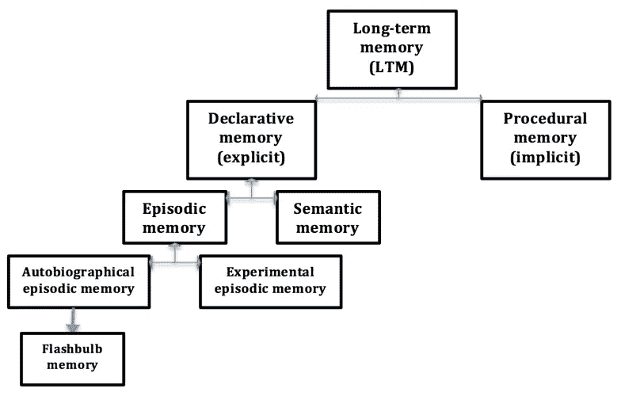
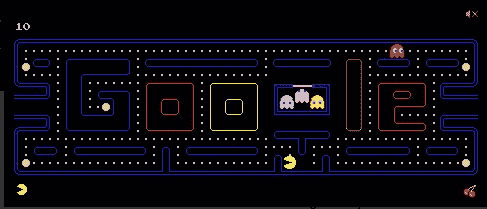

# 智能代理需要哪些学习系统？来自 DeepMind 的评论(1)

> 原文：<https://medium.com/analytics-vidhya/what-learning-systems-do-intelligent-agents-need-reviews-from-deepmind-81c486050660?source=collection_archive---------17----------------------->

## 补充学习系统第 1 部分:慢速和快速学习系统

> 记忆是智能代理需要时检索的数据或信息。检索和存储记忆的能力是智能代理的特征之一。根据互补学习系统(CLS)的理论，一个智能代理实现了两个学习系统——一个在大脑皮层用于慢速学习，一个在海马体用于快速学习。在深度人工神经网络中的学习可以被认为是在新皮层中的缓慢学习。训练深度神经网络是数据低效的，即使深度神经网络是强大的。DeepMind 发布的一篇文章回顾了 CLS，并提出该理论可能有助于解决这个问题。

## 长期记忆

[https://S3-eu-west-1 . Amazon AWS . com/tutor 2u-media/subjects/psychology/study note-images/episodic-memory-1 . png？mtime=20150812123512](https://s3-eu-west-1.amazonaws.com/tutor2u-media/subjects/psychology/studynote-images/episodic-memory-1.png?mtime=20150812123512)

陈述性(或显性)记忆是可以有意识地检查和回忆的记忆，而程序性(或隐性)记忆通常不能有意识地回忆它们。

外显记忆可以细分为**情景记忆**和**语义记忆**。

**情景记忆**是对可以明确陈述的事件(时间、地点、关联情绪和其他情境知识，即谁、什么、哪里、为什么)的记忆。

> 比如“抚摸特定猫咪的特定记忆”。

**语义记忆**是我们一生积累的一般知识(事实、想法、意义、概念)的记忆。

> 例如，“什么是猫”

> 情景记忆是关于我们生活中发生的**经历和具体事件**，而语义记忆是关于**常识**。

# 补充学习系统(CLS)

> “有效的学习需要两个互补的系统:1。位于新大脑皮层，作为逐渐获得关于环境的结构化知识的基础；2.以海马体为中心，允许快速学习个别项目和经历的细节”[1]

在 CLS 理论中，上述两种记忆在两种不同的学习系统中起着重要的作用。

## 缓慢学习——逐渐获得结构化的、概括的知识

第一种在新大脑皮层中实现的学习系统，通过慢慢改变这个区域内的联系，逐渐建立起结构化的知识(概念、常识)。

ImageNet 数据集中不同对象的图像集合:[http://karpathy . github . io/2014/09/02/what-I-learn-from-competing-against-a-conv net-on-ImageNet/](http://karpathy.github.io/2014/09/02/what-i-learned-from-competing-against-a-convnet-on-imagenet/)

我们可以在训练多层人工神经网络时观察到这种缓慢的学习。通过向多层神经网络展示带有标签的数百万不同物体的图像(例如，汽车、飞机、男人、女人、狗、猫……)。网络中的连接权重逐渐更新**。训练后，每一层都成为一个特征提取器，可以从其输入中产生这个抽象特征的表示。**

**例如，头发、眼睛、嘴、耳朵可以从下面图像的输入中提取为激活模式，并且网络能够正确地将该图像分类为人脸…**

****

**[https://www . theolivepress . es/Spain-news/2019/10/04/revealed-the-Spanish-products-us-press-Donald-trump-wants-hit-with-huge-25-taxes/](https://www.theolivepress.es/spain-news/2019/10/04/revealed-the-spanish-products-us-president-donald-trump-wants-to-hit-with-huge-25-taxes/)**

**抽象的、可概括的知识——语义记忆，存储在训练后的神经网络的连接权值中。语义记忆是健壮和强大的，但是它需要成本。**语义记忆的获得只能是缓慢的。****

**首先，每种体验只代表环境中的一个样本。由于信息的不完整性，来自单个样本的更新信号被认为是错误的。**

****

**[https://www . the wildlife diaries . com/all-wild-cat-species-and-where-to-find-them/](https://www.thewildlifediaries.com/all-wild-cat-species-and-where-to-find-them/)**

**例如，我们知道有许多种类的猫，并且“猫”的概念应该对不同品种的猫的外观变化具有鲁棒性。通过输入特定类型的猫的图像而产生的连接权重的更新不能太大，因为该猫的图像不能代表所有类型的猫。只有从大量样本中汇总少量更新才能产生更准确的更新。**

**第二，这些联系是相互依赖的。每个连接的最佳调整取决于所有其他连接的值。在学习的初始阶段，大多数连接权重不是最优的。指定如何改变连接权重以优化表示的信号将是噪声和微弱的。这减缓了最初的学习。**

## **快速学习—快速适应特定项目事件**

**通过暴露于数千个样本，大脑在海马体中实施了一个不同的学习系统，而不是缓慢地改变新皮层中的连接权重。这种学习系统支持关于单个项目的信息的快速和相对个性化的存储。这种能力对于学习的初始阶段至关重要。**

**我们来考虑一下经典游戏《吃豆人小姐》！**

****

**谷歌吃豆人你就知道了！**

**你可以试着用下面的链接来玩这个游戏！**

 **[## 玩吃豆人涂鸦-谷歌搜索

### 为吃豆人 30 周年而涂鸦。谷歌主页，2010 年 5 月 21 日。

www.google.com](https://www.google.com/search?q=play+pacman+doodle)** 

**在你玩了一会儿之后，你会发现把你的小吃豆人留在鬼魂附近是非常危险的。如果吃豆人被鬼吃了，你将失去一条命。即使你以前玩过吃豆人女士，你也能知道在第一次遇到鬼魂后，你应该立即避开鬼魂。**

**CLS 表明，事件的最初储存在海马体的次区域。这种存储帮助我们快速利用这种“被鬼吃掉”的经历，这种经历会产生巨大的负面回报。**

**海马体的亚区域(CA3，DG)被认为负责**模式分离**和**模式完成**。模式分离使我们能够区分相似的事件，模式完成使我们能够仅从部分信息中提取特定的记忆。**

**你可以在新大脑皮层的投射后找到海马区内部机制的更详细描述。**

**海马区的激活模式具有更大的**稀疏性**。这意味着该区域内的激活模式对重叠较少的事件进行编码(不同的事件)。场景记忆存在于海马体中。**

## **快速和慢速学习——构建人工智能的一般框架**

**快慢学系统并不是完全独立的。他们一起工作来支持高效和一般化的学习。语义记忆是可概括的知识。智能代理可以用它来模拟环境的复杂性(例如物理学中的概念)。然而，对于一个代理来说，获取这种可归纳的知识需要很长时间。一个智能代理必须接触大量的经验，才能真正理解一些健壮的、可概括的东西。**

**当你需要快速适应某些任务时，情景记忆是至关重要的。我们可以从上面的例子(吃豆人女士)中看到，意识到“吃豆人被鬼吃了会导致很大的负面奖励”这一事件对于更快地获得更高的分数是至关重要的。单个事件可以从海马体中存储和检索。代理可以使导致灾难性结果的行为无效。这可能是建立数据高效人工智能的关键。**

**有趣的是，情景记忆的提取和储存依赖于大脑皮层投射的激活模式。大脑皮层中的激活模式取决于该区域内的连接权重。连接权重通过缓慢的交错学习来调整。因此，**快速学习系统实际上依赖于慢速学习系统**。这是棘手的部分。它们是相辅相成的。**

**我们将在接下来的几篇文章中继续描述这个补充系统。**

## **参考**

** [## 语义记忆

### 这篇文章需要心理学专家的关注。具体问题是:这里提出的很多主张都是…

en.wikipedia.org](https://en.wikipedia.org/wiki/Semantic_memory)  [## 情节记忆

### 情节记忆是对自传体事件的记忆(时间、地点、相关的情感和其他上下文…

en.wikipedia.org](https://en.wikipedia.org/wiki/Episodic_memory)  [## 情节、程序和语义记忆|心理学| tutor2u

### LTM 可以分为陈述性记忆(可以有意识地检查和回忆的显性记忆)和…

www.tutor2u.net](https://www.tutor2u.net/psychology/reference/episodic-procedural-and-semantic-memory)  [## 智能代理需要哪些学习系统？补充学习系统理论更新

### 我们更新了互补学习系统(CLS)理论，该理论认为智能主体必须具有两种学习能力

deepmind.com](https://deepmind.com/research/publications/what-learning-systems-do-intelligent-agents-need-complementary-learning-systems-theory-updated)**