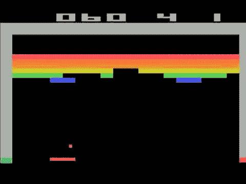
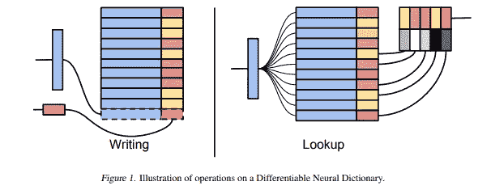

# 智能代理需要哪些学习系统？来自 DeepMind 的评论(2)

> 原文：<https://medium.com/analytics-vidhya/what-learning-systems-do-intelligent-agents-need-reviews-from-deepmind-8ec901de9d70?source=collection_archive---------22----------------------->

## 补充学习系统第 2 部分:学习系统级巩固后避免遗忘

> 我们知道有两种学习系统。但是为什么我们需要两个独立的学习系统呢？在这篇文章中，我们将通过重播来解释海马体对新体验的缓慢整合的作用。这为我们解决在训练人工神经网络时我们称之为“灾难性遗忘”的问题提供了见解。CLS 提出的新体验的快速适应和缓慢整合机制也为设计智能主体的体系结构提供了启示。

 [## 智能代理需要哪些学习系统？来自 DeepMind 的评论

### 补充学习系统第 1 部分:慢速和快速学习系统

medium.com](/@alchemistHK/what-learning-systems-do-intelligent-agents-need-reviews-from-deepmind-81c486050660) 

新皮质学习可以产生强大的、可概括的概念。人工神经网络被认为是生物大脑中新皮层的机器版本。生物大脑是一种通用的学习机器。例如，人类在其一生中可以不断地学习各种任务。当他们需要执行任务时，他们可以回忆起以前学过的任务。人类可以进行**持续学习**。这是一般智力的标准之一。然而，众所周知，现在的人工神经网络存在一个叫做**的问题，即灾难性遗忘**，这使得神经网络无法实现连续学习。

# 灾难性遗忘

“灾难性遗忘”是当一个人试图训练一个人工神经网络时观察到的一种效应，这个人工神经网络以前在一个特定的任务上训练过另一个任务。例如，在数百万张猫的图像上训练的神经网络可以擅长对不同类型的猫进行分类。如果你想用同一个模型对不同类型的狗进行分类，然后用狗的图像再次训练这个模型，这个模型可能会“忘记”如何对猫进行分类的一切！

在新任务的训练之后忘记先前学习的任务的问题是由于新任务的样本对连接权重的干扰太多。连接权重的更新打破了先前学习的知识。

这是训练人工神经网络中众所周知的现象。人工神经网络缺乏稳定性。这是人工神经网络和生物神经网络的不同部分之一。

这就是稳定性-可塑性的困境。连接权重更新太多导致学习不稳定。神经网络会忘记以前学过的东西。然而，神经网络在连接权重更新太少的情况下什么也学不到。

# **海马体中新体验的储存**

为了避免灾难性的遗忘，新的经历不需要很快整合到大脑皮层。海马体提供了一个储存新经验的地方。然后，智能代理可以根据存储在海马体中的经验采取/避免高回报/负回报行为。一方面，代理可以根据收集的经验快速适应环境，尽管这些经验(情景记忆)是不可概括的。另一方面，新的经历可以从新皮层的语义记忆中分离出来。这可以避免灾难性的遗忘，而代理人正在作出快速的推理，以适应环境。

# 系统级整合

CLS 理论提出的双系统架构有效地利用了两个组成系统中每一个的互补属性，允许新信息快速存储在海马体中，然后慢慢整合到新皮质代表中。这被称为“系统级整合”。

来自谷歌搜索“突破艺术”的结果

情节记忆太具体了。智能代理需要形成更强大语义记忆。例如，捕捉'球'、'砖块'、'移动桨'的概念比仅仅记住屏幕上每个场景的所有像素值要好得多。这就是代理人如何更聪明、更稳健地做决定，因为用这些概念做决定要容易得多。

## 从海马到大脑皮层的经验回放

海马在新皮层中起着重要的知识巩固作用。它可以作为视频播放器播放。它会不断地向大脑皮层回放经历。大脑皮层中的连接权重可以在回放过程中慢慢更新。通过慢慢吸收海马体回放的经历，可以形成新的语义记忆。

## 重演的经验证据

这种“重放和巩固”可以在生物大脑中找到。在不活动(如睡眠)期间记录的数据，其中海马神经元表现出大的不规则活动(LIA)模式，不同于在活动状态期间观察到的活动模式。在 LIA 状态期间，从 CA3 开始的同步放电产生锐波波纹(SWRs ),并传播到新皮层。SWR 反映了新体验的重新激活。当动物处于特定位置时，对应于神经活动的位置细胞的连续放电暗示了经验的重放。

# 人工智能代理可能需要类似的设计

CLS 提出了生物大脑的双系统。在构建人工智能代理方面，拥有一个类似的 CLS 版本可能是件好事。Deepmind 提出了一些架构，其中包含了与海马类似的组件。经验证明，这些架构在 Atari 2600 上玩各种游戏都很成功。

DQN 的神经网络

比如深度 Q-learning 中的“经验重放”，在整合深度学习和强化学习方面取得了突破。实施重放缓冲器，其向神经网络提供最近经验的存储和重放机制。重放缓冲大大稳定了人工智能体中神经网络的训练。

类似海马功能的查找表

另一个例子是神经情节控制中的“可微分神经字典”。**这种设计模仿了海马体在看到特定事件后快速存储经验和记住相应行动奖励的功能。**这支持了人工智能体的自适应行为和更快的学习。

# 参考

 [## 智能代理需要哪些学习系统？补充学习系统理论更新

### 我们更新了互补学习系统(CLS)理论，该理论认为智能主体必须具有两种学习能力

deepmind.com](https://deepmind.com/research/publications/what-learning-systems-do-intelligent-agents-need-complementary-learning-systems-theory-updated)  [## 通过深度强化学习实现人类水平的控制

### 一个人工智能体被开发出来，它可以直接从电脑上学习玩各种经典的 Atari 2600 电脑游戏

www.nature.com](https://www.nature.com/articles/nature14236)  [## 神经事件控制

### 摘要深度强化学习方法在广泛的环境中获得了超人的性能。这样的…

deepmind.com](https://deepmind.com/research/publications/neural-episodic-control)  [## 灾难性干扰

### 灾难性干扰，也称为灾难性遗忘，是人工神经网络倾向于…

en.wikipedia.org](https://en.wikipedia.org/wiki/Catastrophic_interference)