# 线性预测和相关性:发展中国家现在和未来五年最需要什么

> 原文：<https://medium.com/analytics-vidhya/what-least-developing-countries-need-the-most-now-and-five-years-down-the-road-7f62b3c36ab1?source=collection_archive---------35----------------------->

由 Faith Tammy Wong 撰写

男孩在黑暗中用一盏石蜡灯学习。照片:2009 年泰勒·魏德曼

9 岁的 Shadreck 的父亲在他出生前就去世了，他的母亲最近因艾滋病并发症去世了。他们和他的两个兄弟，一个 11 岁，一个 13 岁，现在和他们的祖父母住在一个狭窄的泥房子里。每天清晨破晓前，他和他的兄弟们光着脚艰难地爬上岩石顶峰，起泡的双脚在被太阳烤焦的道路上蹭来蹭去寻找水源。有时需要一至三个小时，他们才能找到一个小小的泥坑，与村民和牲畜分享。然后，他们回去帮助他们的祖母佐拉耕作，然后前往一个挤满了 49 名学生的小教室上课，其中一半以上的学生将在九年级结束时辍学。Shadreck 不得不与另外 4 名学生共用一本破旧的教科书，尽管他们已经上学 3 年了，但几乎不能组成简单的句子。太阳落山时，他的一天就结束了，除非他能找到一小块石蜡来点亮家里的灯，并与其他村里的孩子玩一两局游戏。

Shadreck 和他的家人是生活在全球贫困线以下的 4.22 亿非洲人的一部分，非洲大陆经常遭受能源危机，经济增长缓慢，医疗和教育系统刚刚起步。目前，非洲 54 个国家中有 33 个被列为最不发达国家，这些国家的人均国民总收入低于 1230 美元，社会经济发展水平低。据世界银行估计，[撒哈拉以南非洲国家每年停电时间从 50 小时到高达 4600 小时不等，消费者需要支付高达每千瓦时 53 美分的电费，](https://qz.com/africa/1431213/africas-electricity-shortages-have-health-and-economic-costs/)这是世界平均电价的两倍。此外，[全球 3400 万艾滋病毒阳性患者中有 69%生活在撒哈拉以南非洲](https://www.avert.org/global-hiv-and-aids-statistics)，五分之一的非洲女性在 19 岁前怀孕。

这些现象与世界其他地区最不发达国家的情况相似，尽管没有非洲那么严重。尽管如此，民众仍能深刻感受到衰退的经济及其脆弱的国家基础设施的涓滴效应，他们对执政党管理不善的不满恰当地反映在最新的《世界幸福报告》的调查结果中。根据 2020 年的数据，45 个最不幸福的国家中有 32 个来自最不发达国家，其中大约一半来自非洲。

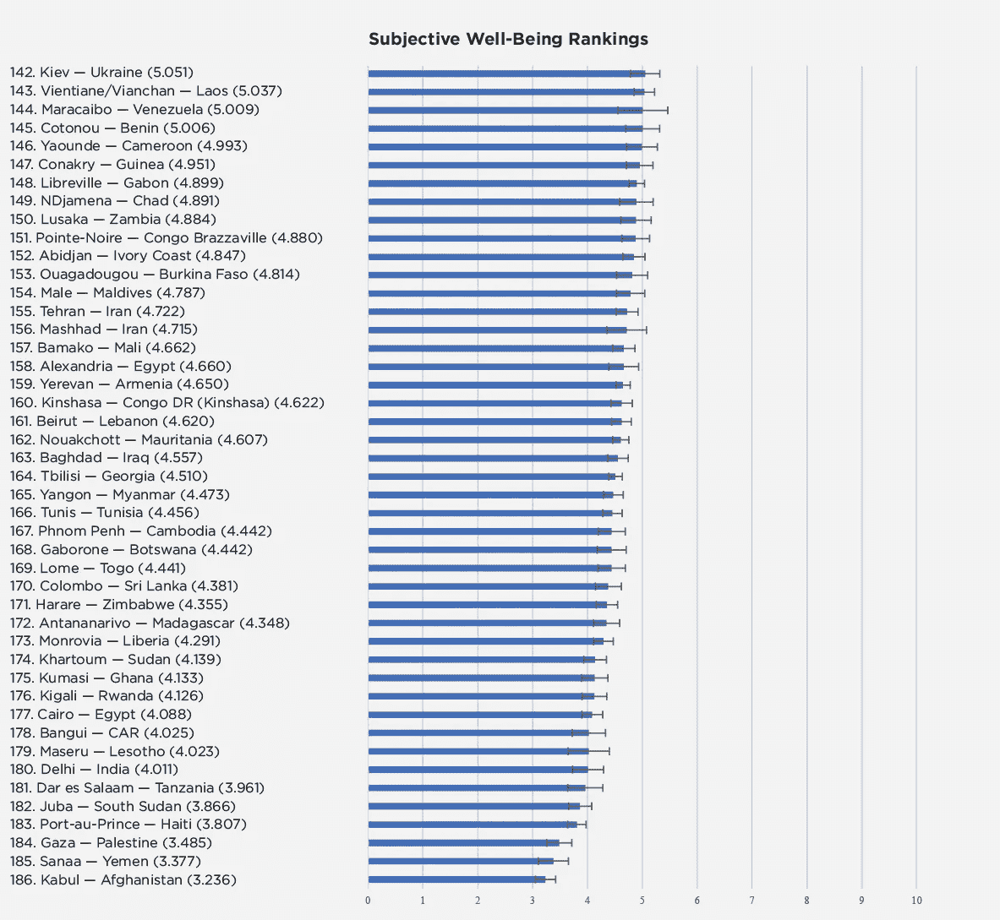

世界上最不幸福的 25 个国家。来源:2020 年世界幸福报告

随着幸福越来越被许多政策制定者视为衡量公共政策有效性的重要标准，平民之间的集体分歧表明政府在实施能够提高公民福利的政策方面的失败。考虑到最不发达国家的总人口预计将从 2018 年的 10 亿增加到 2030 年的 13 亿，是世界平均人口增长速度的两倍以上，这一点尤其令人担忧。再加上新冠肺炎等全球不确定性的增加，可能会严重削弱农业和制造业密集型经济体的能力，公共政策中现有的漏洞可能会像滚雪球一样，演变成一系列其他问题，可能危及该国的稳定。

最不发达国家的政府认识到了这些问题，并在过去几年中提出了刺激未来经济的增长政策。根据《2020 年非洲经济展望》,已经出现了从私人消费向投资和出口的逐渐转变，并且正在采取措施提高教育的数量和质量，并使教育政策与不断变化的劳动力市场需求保持一致。然而，还需要做更多的工作，使最不发达国家为不断变化的地缘政治格局和未来的挑战做好准备。

因此，发展中国家的政治家们必须解决眼前的紧迫问题。然而，这些问题往往是多方面的，可能在因果关系上相互关联。例如，互联网浏览率低可能是由电力供应不足造成的，而经济增长缓慢可能是由能源短缺造成的。在这种情况下，政府不应该仅仅依靠财政或货币政策来刺激经济，而应该考虑投资于有利于能源的政策，这样可以一次解决多个问题。此外，引导足够的资源将问题扼杀在萌芽状态，可能是比分散资源、同时解决许多问题更有效的解决方案。

*那么，是否存在一个困扰大多数发展中国家、需要迅速解决的共同根源？为了改善经济和人民的福祉，各国需要注意的最重要的因素是什么？*

出于对这些问题的好奇，盖洛普世界民意测验用来评估个人幸福水平的六个因素被用于评估，并从那里展开。

***《世界幸福报告》及其局限性***

《世界幸福报告》用一个坎特里尔阶梯来衡量一个人对自己生活的满意度:*0 到 10 分，0 分是你能想象到的最糟糕的生活，10 分是最好的，你会给自己目前的生活打几分？*

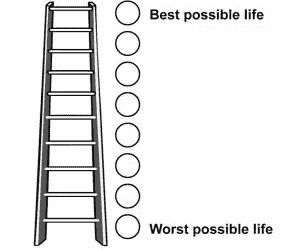

坎特里尔梯。来源:ResearchGate

它在六个不同的因素上重复同样的问题——国内生产总值水平、预期寿命、社会支持、自由和腐败，并采用每个部门的总价值来确定公众对国家在该领域表现的满意度。

尽管数据是跨多个领域收集的，但每个类别中的子领域对个人幸福水平的影响比其他领域更大。例如，经济增长不仅仅是根据一年中产出的多少来衡量的，还要根据其通货膨胀水平和就业率来衡量。一个国家可能有相对较高的人均 GDP，但也有极高的失业率。在这种情况下，仅靠人均 GDP 不足以解释公众对一个国家经济表现不佳的不满。

此外，还有一些国家发展指标可能没有被纳入世界幸福调查，但可能对一个平民的生活产生站不住脚的影响。家庭用电和青少年生育率等指标可能会让我们更全面地了解最不发达国家面临的挑战。

为了量化一个国家发展指标对另一个指标的影响，计算了它们之间的相关值。还确立了三项标准来确定一项指标对最不发达国家的重要程度，即:

所述指标与生命阶梯之间的相关值。

该指标与其他指标的相关值。

该指标相对于 5 年后其他指标的变化幅度和方向。

考虑到所有这些指标，能够推动一个国家增长的最重要的指标必须具有高相关值，因此其本身与生活阶梯以及其他指标之间具有强有力的关系，如果保持不变，它需要在未来 5 年内记录一条显著负的趋势线。

***数据采集和过滤***

2006 年至 2018 年的 14 个不同国家指标的数据，这些数据来自《世界幸福报告》、世界银行开放数据目录和《我们的数据世界》。他们的相关值是每年在一个 14 乘 14 的矩阵中计算的(总共 13 个矩阵)。

自由度、慷慨度和通货膨胀率等不如其他指标重要的指标最终被过滤掉，代之以更有可能产生更大相关值的其他指标。以下是最终确定的变量列表:

艾滋病毒流行率百分比(总计)

用上电的人口百分比

青少年生育率

儿童死亡率

救生梯

对数人均国内生产总值

使用互联网的人口百分比

小学入学率%

总出生率(每千人)

总预期寿命

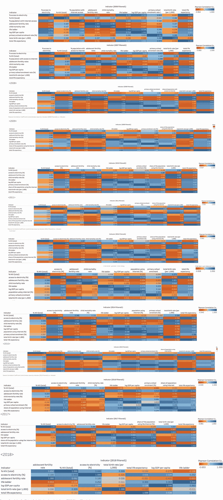

2006-2018 年不同国家发展指标的相关矩阵，已完成并汇编。来源:自制，Tableau。

然后进一步简化指标，以调查 14 种关系(6 种与人生阶梯相关，8 种指标之间)，并根据计算值的大小和一致性进行选择。多年来一直有较暗方块(因此幅度较大)的关系，以及那些显示出较大波动或呈下降趋势变得更糟的关系，被选择出来，而不是其他关系。

***数据可视化和预测***

绘制了衡量国家发展指标与生活阶梯的相关值以及国家发展指标之间的相关值的线图。结果产生了几个有趣的发现:

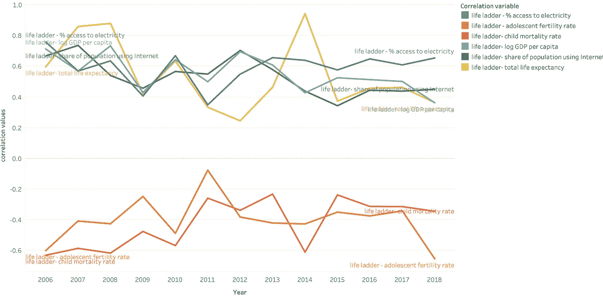

显示生活阶梯和其他国家发展指标之间相关值的线图。来源:自制，Tableau。

*国家发展指标——生活阶梯:*

1.  在寿命阶梯和总预期寿命之间有一种很强但也很不一致的相关性。

该曲线在有重大疫情爆发的年份达到峰值——在 2007 年至 2008 年期间，是[艾滋病毒疫情感染了 250 多万人，导致 210 万人死亡](https://www.who.int/mediacentre/news/releases/2003/prunaids/en/)，2014 年是埃博拉疫情激增，西非处于全球健康危机的中心。这意味着公众，尤其是在那些年，将能够缓解和遏制疾病传播的强有力的医疗保健措施视为他们幸福水平的一个特别重要的因素。

尽管曲线具有波动性，但医疗体系改革对于帮助这些国家发展抵御能力和能力以度过未来疾病爆发至关重要。像最近爆发的新冠肺炎疫情这样的流行病不分肤色，不分国界。据世卫组织估计，截至上周六，非洲大陆 54 个国家中的 46 个国家共发现 3924 例感染和上升病例

再加上人口的快速增长，如果没有关键的基础设施和及时的医疗设施，医院和医护人员可能不得不承受医疗供应短缺的冲击，而他们可能没有准备好面对这种局面。

**2。生活阶梯曲线——人均对数国内生产总值的%和使用互联网的人口的生活阶梯——几乎是相同的，这有力地表明了因果关系的可能性。**

除了在很大程度上提供不受限制的娱乐，互联网还具有巨大的潜力，可以通过以下方式促进经济生产率的增长:

*   降低商品和服务生产和分销过程中的交易成本，从而使数据密集型行业(如金融服务和医疗保健)降低生产成本。
*   改善公司内部或与供应链中其他公司的调度和信息共享，从而使他们能够更有效地管理供应链，减少库存浪费。
*   消费者更多地接触国际出口市场，从而增加国内和国际公司之间的竞争，迫使国内公司提高生产效率，生产接近规模经济的产品。
*   提高营销效率和更高的消费可能性。

[由于发展中国家只有 35%的人口能够接入互联网(而发达经济体的这一比例约为 80%)](https://www.worldbank.org/en/topic/digitaldevelopment/brief/connecting-for-inclusion-broadband-access-for-all)，必须加大对智能基础设施的投资力度，以提高生活水平，进而提高民众的满意度。联合国国际电信联盟(ITU)秘书长赵认为，发展中国家现在最需要的是:

> “最不发达国家在政府的坚定承诺下，认识到数字技术对国家发展的重要性，并在开明的政策和监管行动的支持下，包括发展技能的步骤，可以实现普遍和负担得起的互联网接入，”

政府可以通过让宽带消费变得更加实惠来实现这一目标，这反过来又可以带来新的商业机会以及医疗保健和金融服务的改善。

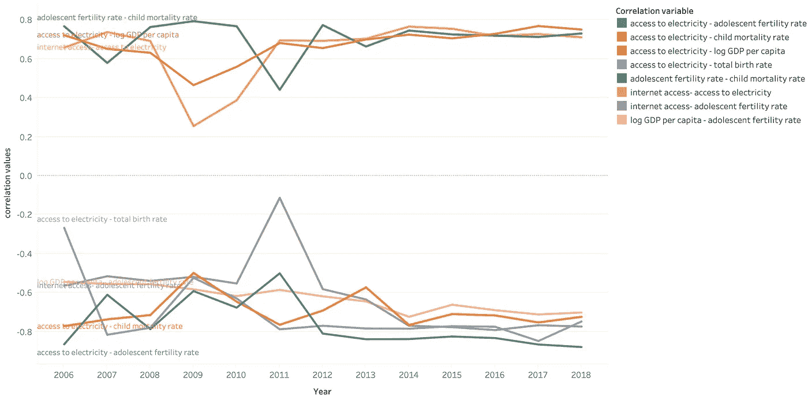

显示国家指标之间相关值的折线图。来源:自制，Tableau。

*国家发展指标——国家发展指标:*

1.  **这些曲线表明，用电、上网和青少年生育率之间有很强的一致性。**

尽管电或互联网接入与青少年生育率之间没有直接联系，但人们认为增加前两者的使用可以通过以下方式降低青少年怀孕率:

更多地接触互联网，从而检索与计划生育和节育有关的信息，

在这些地区创造更多的就业机会，有可能使更多的人摆脱贫困，从而增加生孩子的机会成本。

**2。电力供应线——青少年生育率和电力供应线——儿童死亡率之间有很强的一致性。**

互联网浏览水平的提高意味着有更多的年轻母亲可以上网搜索如何照顾孩子的建议，更多的工作机会意味着年轻女性能够更好地赚钱和抚养子女。

我们还对这两个图表进行了预测，以预测这些变量在未来 5 年内会发生什么变化:

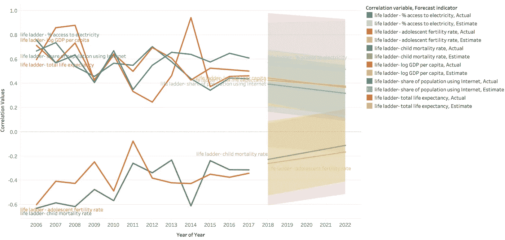

人生阶梯预测图-国家发展指标。来源:自制，Tableau

*国家发展指标——人生阶梯:*

用电满意度、网络使用率、人均国内生产总值对数和预期寿命预计将下降，互联网使用率在所有指标中下降幅度最大。

青少年生育率和儿童死亡率方面的生活不满意度有望下降。

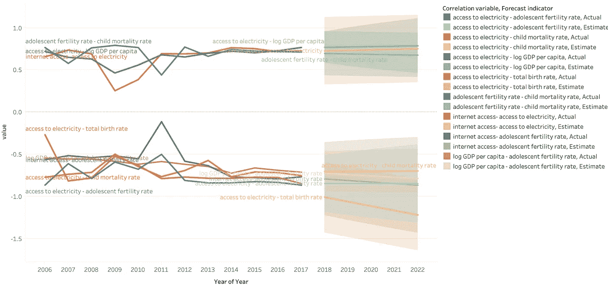

国家发展指标预测图-国家发展指标。来源:自制，Tableau

*国家发展指标——国家发展指标:*

大多数变量预计将保持不变，但预计用电和总出生率之间将出现急剧下降(从而出现更强、更负的相关性)。

这是意料之中的，因为根据国际能源署的估计，到 2030 年，撒哈拉以南非洲地区用电人口将从目前的 45%增加到 65%。

***气泡图—一次查看一个国家***

经过整理和比较的数据表明，有三个关键变量对最不发达国家的可持续发展至关重要——接入互联网的人口百分比、人均国内生产总值和青少年生育率。尽管以前收集的数据是人均 GDP 的对数，但人均 GDP 是衡量一个国家经济增长的更好的代表。数据来自世界银行。

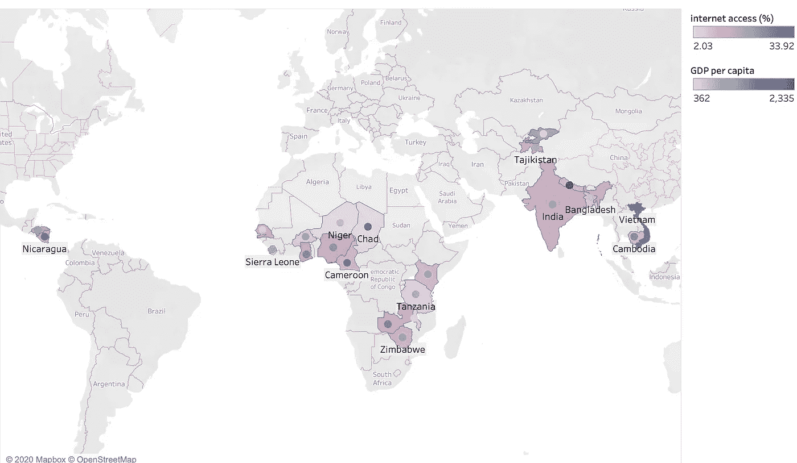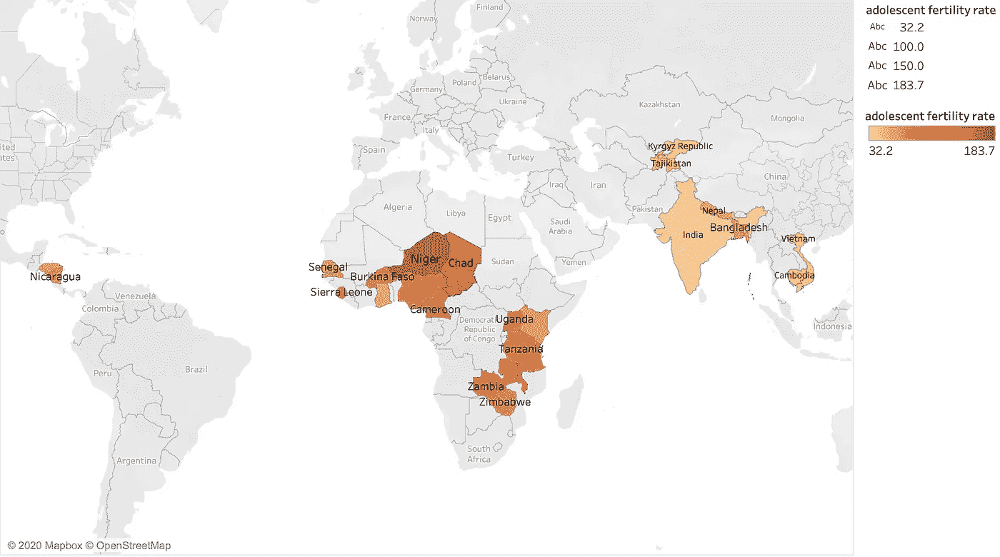

此外，以地图形式显示数据表明，国家之间的数值存在差异。这意味着不同的国家可能需要关注不同的领域，与其他国家相比，一些国家可能需要更多地关注这些指标。因此，收集了这三个变量的汇总原始数据，并以气泡图的形式表示出来，以显示每个国家相对于其他国家的个别表现:

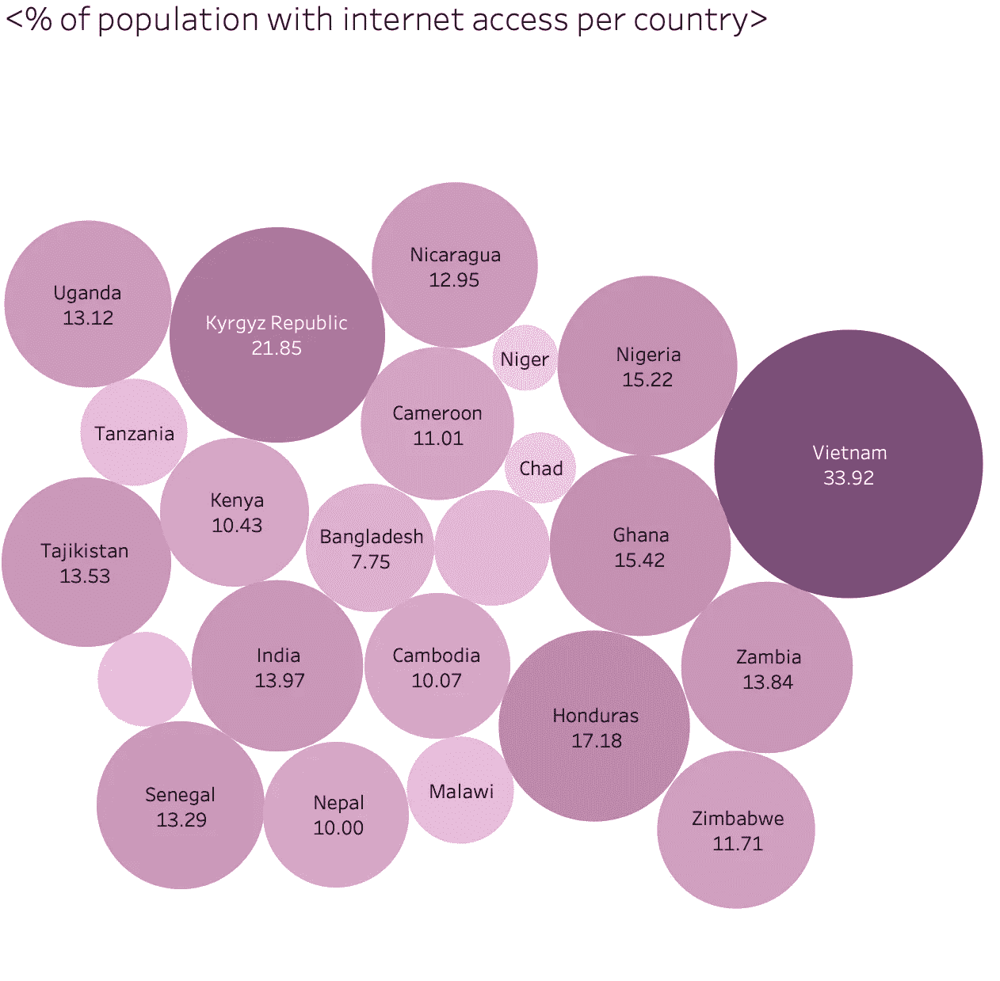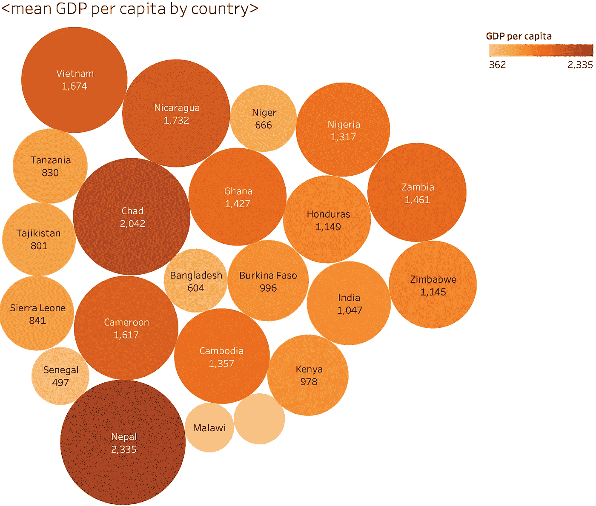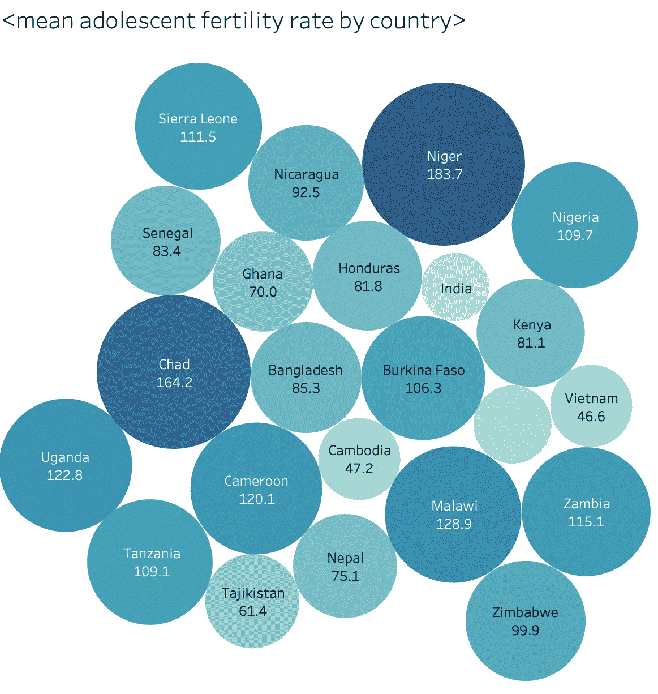

可视化显示:

越南的互联网接入率最高，为 33.92%，而乍得和尼日尔是最低的国家之一。

尼泊尔的人均 GDP 最高，为 2335 美元，而马拉维的人均 GDP 最低。

尼日尔的青少年生育率最高，为千分之 183.7，而印度是最低的国家之一。

因此，这些问题在尼日尔最为严重和令人担忧，该国在所有三个部门中一直排在最后或接近最后。

***这对最不发达国家意味着什么——前进***

在前进的道路上，有三条真知灼见可以借鉴。首先，如果进步可以用曲线的形式来衡量，那么不同的国家在这一点上处于曲线的不同部分。一些国家更接近摆脱贫困，实现全民教育和医疗保健，而其他国家在实现这一目标之前仍有许多工作要做。不同的国家也有不同的事情需要努力，例如，洪都拉斯可能是互联网普及率和经济增长最高的国家之一，但它在最不发达国家中少女怀孕的发生率相当高。

其次，各国在正面解决问题之前，需要更多地了解问题本身。这意味着认识到问题本身的根本原因是什么，并提出纠正措施，以便手头的问题可以得到有效解决，并且在可预见的未来不会出现与根本原因相关的其他问题。

最后一个观点实际上是以一种认识的形式出现的，即改善全球贫困，实现普遍享有医疗保健和教育等基本人权不仅仅是第三世界的问题，而是第一世界的问题。正如比尔·克林顿所说，

> “我们生活在一个完全相互依赖的世界里，这意味着我们无法逃避彼此。我们如何应对艾滋病，部分取决于我们是否理解这种相互依存关系。这不是别人的问题。这是每个人的问题。”

全球化的到来和边界的放宽使得劳动力和贸易流动增加，从而更容易将溢出效应带到世界其他地区。因此，作为人类同胞，我们有共同的责任走到一起，创造一个没有贫困和排斥的世界，一个人人享有尊严的世界。