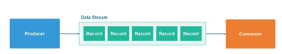
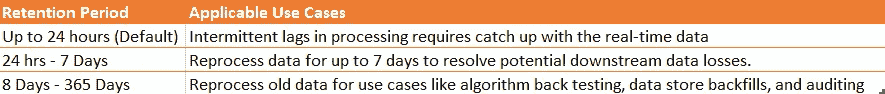

# 是什么让亚马逊 Kinesis 数据流对流媒体有用？

> 原文：<https://medium.com/analytics-vidhya/what-makes-amazon-kinesis-data-streams-useful-for-streaming-d097a68d33de?source=collection_archive---------16----------------------->

> **当您需要在数据生成时快速将数据从源系统或应用程序(生产者)中移出，并且等待数据批处理/累积不是一个选项时，请考虑数据接收需求。**

以下是在各种运营(后台办公室、IT 等)中经常出现的一些场景..).您很可能在寻找一种数据接收解决方案，在任何处理、转换步骤和存储、实时指标和分析之前处理流数据，或者需要导出更复杂的数据流以供进一步处理。

*   日志处理和分析—可以连续添加到数据流中的系统和应用程序日志，可在几秒钟内进行处理。这是避免在任何服务器故障期间丢失日志所必需的(生产者)。
*   实时控制面板—实时提取指标并生成报告。
*   实时数据分析:对点击流、日志、社交媒体源运行实时流数据分析，使您能够在几分钟内获得洞察力。

对于上面提到的和类似的用例，**亚马逊 Kinesis 数据流(KDS)** 服务变得有用。它每秒钟从数百个来源连续捕获数据的能力使其适用于网站点击流、数据库事件流、金融交易、社交媒体源、It 日志和位置跟踪事件。您可以构建自定义应用程序，在几秒钟内处理或分析传入的流数据，以满足特殊需求。它有以下显著特征——

*   ***可扩展*** *—每个 KDS 流都可以通过增加分片数量来进行扩展，以满足容量需求。*
*   **—跨三个* [*可用性区域*](https://docs.aws.amazon.com/AWSEC2/latest/UserGuide/using-regions-availability-zones.html#concepts-availability-zones) *同步复制数据，提供高可用性和数据持久性。**
*   ****实时数据流*** *—数据在< 70 毫秒内可用于消费应用，如 S3、Lambda 或 Kinesis 数据分析。**

*IaaS 的大部分方面，如基础架构、存储、网络和以期望的吞吐量水平传输数据所需的配置，都由 KDS 管理。它消除了为您的数据流提供、部署、持续维护硬件、软件或其他服务的痛苦。。但是，Kinesis 数据流并不是一项完全托管的服务。*

## *数据流解决方案的组件*

1.  ***数据生产者—** 不断向您的数据流添加数据。你可以通过*腐肉和腐肉* *操作、亚马逊 Kinesis 生产者库(KPL)或亚马逊 Kinesis 代理*向亚马逊 Kinesis 数据流添加数据。*
2.  ***数据流** —要设置数据流，您可以使用 AWS 控制台或 *CreateStream* 操作。*
3.  ***数据消费者** —使用亚马逊 Kinesis 应用程序(消费者)从您的数据流中读取和处理数据，使用亚马逊 Kinesis 数据分析、亚马逊 Kinesis API 或亚马逊 Kinesis 客户端库(KCL)。*

**

## *KDS 解决方案的构建模块*

*   ***碎片—** 是 KDS 的基本吞吐量单位。创建数据流时，需要预先计划和估计来决定和配置所需的碎片数量。通过 Amazon Kinesis 数据流或 Cloudwatch 可以监控分片级别的指标。*
*   ***记录** —是存储在亚马逊 Kinesis 数据流中的数据单位。记录由序列号、分区键和数据 blob(由源系统生成的数据和不可变的字节序列)组成。*
*   ***分区键—** 用于将记录隔离并路由到数据流的不同片段。在将数据添加到 KDS 之前，源应用程序会指定一个分区键。*
*   ***序列号** —是每条记录的唯一标识符。当数据生产者调用*腐败记录*或*腐败记录*操作向亚马逊 Kinesis 数据流添加数据时，序列号由亚马逊 Kinesis 分配。同一分区键的序列号通常会随着时间的推移而增加；*腐败记录*或*腐败记录*请求之间的时间间隔越长，序列号就越大。*
*   ***亚马逊 Kinesis Producer 库(KPL)** —这是一个易于使用且高度可配置的库，可以帮助你将数据放入亚马逊 Kinesis 数据流中。KPL 提供了一个简单、异步、可靠的接口，使您能够以最少的客户端资源快速实现高生产者吞吐量。*
*   ***Amazon Kinesis 代理—** 是一个预构建的 Java 应用程序，它提供了一种简单的方法来收集数据并将其发送到您的 Amazon Kinesis 数据流。您可以在基于 Linux 的服务器环境(如 web 服务器、日志服务器和数据库服务器)上安装代理。该代理监视某些文件，并不断向数据流发送数据。*
*   ***重共享—** 是使用一系列碎片分割或合并来扩展数据流的过程。在分片中，一个分片被分成两个分片，这增加了数据流的吞吐量。在分片合并中，两个分片合并成一个分片，这会降低数据流的吞吐量。这一步是必需的，因为分片容量不会随着自动缩放而改变。*
*   ***亚马逊 Kinesis 客户端库(KCL)** —是一个预构建的库，帮助构建亚马逊 Kinesis 应用程序，用于读取和处理来自亚马逊 Kinesis 数据流的数据。它让您专注于业务逻辑，并处理几个复杂的问题，例如适应数据流量的变化、对流数据进行负载平衡、协调分布式服务以及处理具有容错能力的数据。*
*   ***增强扇出** —是 Kinesis 数据流消费者的可选功能。增强的扇出允许开发人员通过向每个流消费者提供其自己的读取吞吐量来扩大流消费者(从流中实时读取数据的应用程序)的数量。它在消费者和碎片之间提供了 2mb/秒的逻辑吞吐量管道。这允许客户扩展并行读取数据流的用户数量，或者允许以 200 ms 的速度传输数据，同时保持高性能。KCL v2.x 负责用户的自动注册，并支持增强的扇出。注册后，所有注册的使用者都将拥有自己的逻辑增强型扇出吞吐量管道。消费者使用 *SubscribeToShard* API 来检索这些吞吐量管道中的数据。*

## *构建流式解决方案时的重要设计考虑事项*

*   ***产生的数据大小** —数据 blob(Base64 编码前的数据有效负载)的最大大小为 1 兆字节(MB)。*
*   ***保留期** —默认保留期为 24 小时，可以增加以满足如下所述的特定要求。*

**

*   ***决定 KDS 吞吐量的方法(供应期间的初始容量规划)——**KDS 的吞吐量是碎片的函数。在初始配置期间提前确定碎片数量以及在运行期间由于流容量的变化而需要的任何更改(使用重新碎片化)非常重要。*

> ***作为基线，一个碎片提供 1MB/秒的数据输入、2MB/秒的数据输出和每秒 5 个事务/API 调用的读取能力。一个 shard 每秒可以支持多达 1000 条 PUT 记录。***

*要计算所需的碎片容量，可遵循以下步骤—*

1.  **估计写入数据流的记录的平均大小，单位为千字节(KB)，四舍五入到最接近的 1 KB。**
2.  **估计每秒写入数据流的记录数。**
3.  **决定 Amazon Kinesis 应用程序并发和独立于数据流使用数据的数量。**
4.  **以 KB 为单位计算传入写入带宽(D = A*B)**
5.  **计算以 KB 为单位的传出读取带宽(E = D * C)**
6.  **计算碎片数量(F = Max ( D/1000，E/2000))**

## *何时使用 KDS 而非其他 AWS 服务？*

*由于亚马逊 Kinesis 数据流和亚马逊 SQS 在一些功能上的相似性，人们经常会混淆这两种服务。然而，这些服务本质上是不同的，适用于完全不同的用例集。以下几点有助于发现差异—*

***亚马逊 Kinesis 数据流***

*   *当将相关记录发送到同一个记录处理程序很重要时，这很有帮助。为了前任。计数、聚合、平均等..使用 MapReduce*
*   *维护记录的顺序。为了前任。按照时间戳保持日志条目的顺序。*
*   *多个应用程序并发使用相同流的能力。*
*   *几小时后以相同顺序消费记录的能力。*

***亚马逊 SQS***

*   *当跟踪单个工作项很重要时，很适合使用。为了前任。Amazon SQS 跟踪队列中工作项目的确认/失败，因此应用程序不必维护持久的检查点/游标。亚马逊 SQS 将删除已确认的消息，并在配置的可见性超时后重新发送失败的消息。*
*   *单个消息延迟(最长 15 分钟)或调度。*
*   *在读取时动态增加并发性/吞吐量。例如，您有一个工作队列，并希望添加更多的读者，直到积压被清除。*
*   *利用亚马逊 SQS 的透明扩展能力，无需您提供任何配置说明。*

*这篇文章所写的内容是个人学习和经验的集合。要分享任何反馈或意见，请使用 Medium platform 上的鼓掌/回应功能。也可以通过 [Linkedin](http://www.linkedin.com/in/niwrattikasture) 联系我。*