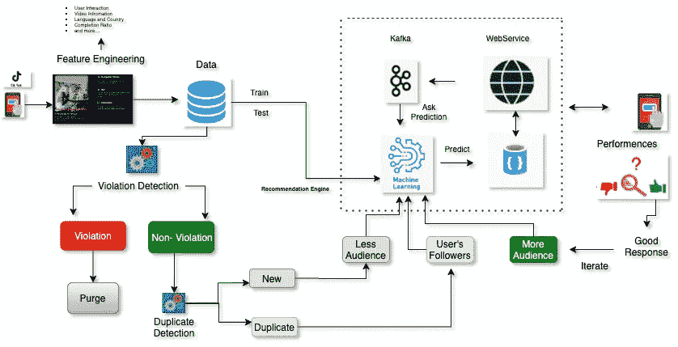

# 是什么让抖音推荐系统如此强大？

> 原文：<https://medium.com/analytics-vidhya/what-makes-tiktok-recommendation-system-so-powerful-c72ea4fb1fea?source=collection_archive---------16----------------------->

抖音内容流

抖音是最受欢迎的短格式移动视频应用程序，在这里你可以真实地创建和分享，发现世界，并与他人联系。当你阅读的时候，你的手机上可能有抖音的应用程序。如果你碰巧下载了这个应用程序，你不需要像其他社交媒体一样注册观看视频，你必须在那里创建一个帐户。