# 是什么让“XGBoost”如此极端？

> 原文：<https://medium.com/analytics-vidhya/what-makes-xgboost-so-extreme-e1544a4433bb?source=collection_archive---------1----------------------->

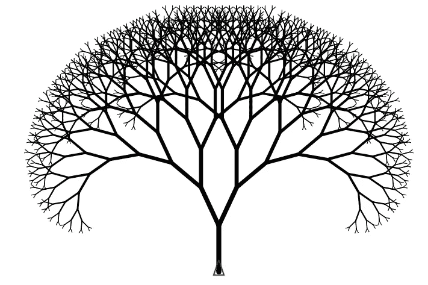

# 介绍

有没有问过“XGBoost”是怎么工作的？，或者说“XGBoost”与梯度增强有何不同？，甚至是 python 中的一个简单例子。如果你在正确的地方。“Xgboost”是可用于列表数据的最强大的机器学习工具之一。它在学习非线性决策边界方面的效率和性能使它成为工业界和学术界的主要工具。**那么是什么让这个算法如此特别** **？**。

写这篇文章是为了回应我在试图回答这个问题时遇到的挫败感。不要误解我的意思，网上有很多关于这个主题的资源，但是没有一个简单地解释了为什么“XGBoost”如此特别，以及它与梯度增强有何不同。

为了充分检验自己对算法的理解，我决定用 Python 从头实现“XGBoost”。因此，本文将尝试解释学习过程以及在复制“XGBoost”的核心组件时获得的知识。包括我认为有用的外部资料和一个简单的数字示例，说明算法是如何工作的。

本质上，“XGBoost”建立在梯度推进的基础上，通过引入正则化来对抗过度拟合以及许多其他的添加。人们甚至可以争辩说，将“XGBoost”命名为**正则化梯度增强**会更合适，因为这是其成功的最关键的方面之一。为了全面理解“XGBoost ”,有必要首先理解它背后的思想。因此，本文将首先解释回归树、梯度推进以及“XGBoost”本身。

*   回归树
*   梯度推进
*   XGBoost

# 回归树

回归树是一种简单的机器学习模型，可用于回归任务。与线性模型不同，决策树能够捕捉特征和目标变量之间的非线性交互。基于树的模型还具有高度可解释性的额外好处，因为该模型是通过对特征值使用简单的**是/否**逻辑条件对数据进行**递归划分**而构建的。然而，它们也有一些缺点，回归树是出了名的不稳定，这意味着如果你以最轻微的方式扰乱你的数据，你可能会得到一个完全不同的树结构。回归树也容易过度拟合数据，并且缺乏坚实的原则性概率框架，这使得它们无法具有有用的特征，例如置信区间、后验概率等。

**精确贪婪(**计算每个分裂点值 **)** 回归树模型的基本伪代码如下:

1.  创建根节点。
2.  遍历每个要素，找到最大化某些分割标准的最佳分割值。
3.  检查是否满足任何停止标准，如果满足，则停止构建树，否则继续构建另一个节点。

我链接了一个由 Josh Starmer 制作的精彩视频，他比我更清楚地解释了这个过程，所以如果你不明白回归树是如何在引擎盖下工作的，我真的建议你观看这个视频。因为理解这些基本算法实际上意味着理解更复杂的算法。

这个视频完美地展示了回归树的分裂寻找过程。然而，它并没有真正涵盖用于防止过度拟合的树约束。回归树具有四个主要标准，在训练时用于影响树结构，这些标准包括树深度、节点数或叶数、每次分裂的观察数和最小改进，下面给出了对其的解释。

1.  **树的深度**，树的深度指的是树的层数，因为更深的树更有可能超过数据，因此人们通常设置深度约束。更深的树更复杂，因此更短的树是首选。一般来说，最好的结果是 4-8 层。
2.  **节点或叶子的数量**这是不言自明的，非常类似于深度参数，但是因为深度是分层的，所以它是对称的，而这个约束是不对称的，会导致不平衡的树结构。
3.  **每次分割的观察数量**在可以考虑分割之前，对训练节点处的训练数据量施加最小约束。
4.  **增益的最小改善**是一个约束条件，它需要一个阈值改善值，用于将任何新的分割添加到树中。

**树修剪**也是一种用于减轻过度拟合影响的技术。但是，它是在培训后应用的，并使用一个度量标准，如**成本复杂性修剪。**这个方法在树中迭代，去除叶子节点，直到只剩下根节点。对于每个树结构，它定义了一个分数，该分数不仅考虑了树预测的准确性，还考虑了其结构的复杂性。

# 经典梯度推进

梯度推进是一种机器学习算法，可用于分类和回归问题。它从许多弱预测器(通常是“**回归树**”)中创建一个集成模型，这些回归树以逐级方式添加，每个新树关注前一个树的错误。这种侧重于以前错误的加法方法实质上是将这些弱学习者转化为单一的强预测者。

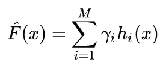

最终预测是所有(M)棵树的总和，这些树由收缩因子λ加权

我发现有一个概念非常有助于获得梯度推进的直觉，那就是根据梯度下降来思考问题。我基本上是在总结 Nicholas Hug 写的一篇精彩的博文，这篇博文将链接到这里。

简单回顾一下梯度下降是如何应用于简单的普通最小二乘估计量的。如果我们取损失函数梯度的负值，这将基本上引导我们到函数的最小值，也就是我们的最佳模型。大多数模型(如 OLS)在模型超参数(如斜率/截距)上使用梯度下降来寻找最优解。

图像显示线性回归的梯度下降。图片来源于 http://alykhantejani.github.io

这可以用数学方法表示如下，我们的损失函数定义为残差平方和:

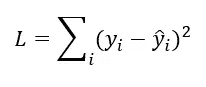

残差平方和

为了最小化损失函数，我们取损失函数相对于斜率和截距的导数，并且将该值的负值加到由某个学习速率缩放的斜率权重上，以实现更精确的模型。这个过程被重复直到收敛。

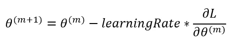

更新的斜率和等效方程也用于计算新截距，除了损失函数的导数是关于截距的。

那么我们为什么要在乎呢？，这和梯度增强有什么关系？。如果你注意到残差平方和是用预测本身来表示的。如果我们对预测本身求导并迭代更新预测本身，会发生什么？。

使用梯度下降更新预测

这是天才之举，但有一个**致命缺陷**我们无法用这种方法做出任何预测，因为我们需要 Y 的真实值来计算损失并更新我们的预测。不要担心，这就是顺序回归树(弱学习者)出现的地方。因此，在每次迭代中，我们将训练一棵回归树来预测这些梯度，而不是用梯度的真实值来更新我们的预测。因此，允许我们对看不见的数据点进行预测。

不幸的是，我们还没有完成，因为负梯度只给出了这一步的方向。需要进一步努力来确定在该方向上的步长(pm)。最流行的方法是线搜索，我就不一一赘述了，因为有人已经有了[在这里](https://towardsdatascience.com/boosting-algorithm-gbm-97737c63daa3)。简而言之，我们可以用树来写损失函数，做一些数学运算，我们最终得到一个等式，来衡量树结构的质量，关于最小化损失函数。

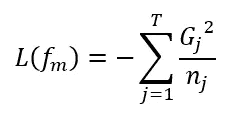

Gj 是叶中梯度的总和，nj 是该叶节点中样本的数量，T 是树中叶节点的数量

由于创建每一个树结构是不切实际的，我们可以重新安排这个函数以最小化树的每一层的损失。这是一个比仅仅使用回归树的内部机制来拟合残差好得多的方法。

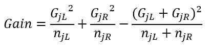

GL 和 nl 是梯度的总和，d 分别是分裂左侧的样本数，GR 和 nR 是相同的，但在右侧是相同的。

这是梯度提升背后的核心思想，这种算法的伪代码如下:

**梯度增强伪代码**

1.该算法首先进行初始预测，使下面的等式最小化。如果任务是回归，那么这个等式归结为使用我们的目标列的平均值作为我们的初始预测。然而，如果我们关注分类，那么我们的初始预测将使用我们的目标变量的对数概率。

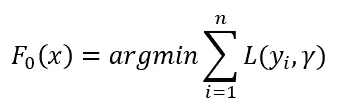

2.接下来，我们需要计算损失函数相对于我们预测的负梯度。然后训练回归树来估计这个梯度，以便预测看不见的值。

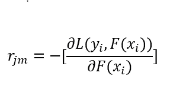

3.现在我们有了回归树结构，我们仍然需要为每个叶节点找到一个值，它将最小化下面的总和。同样，这看起来很复杂，数学是！但是当你对γ求导，并把这个方程设为 0，就能找到最佳叶值。
它本质上告诉我们，叶节点中的平均值是回归的最优值。

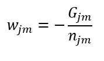

4.这个新的回归树现在被添加到初始预测中，通过一些收缩因子(学习率)进行缩放。然后，计算该新模型的负梯度，并对特定数量的助推轮重复整个过程。

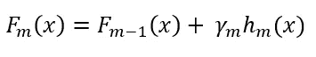

所有这些可能看起来相当复杂，但实际上却令人惊讶地易于管理。我不会做一个手动渐变的例子，因为网上有很多可用的资源。比如这个由 Statquest 制作的视频系列，我强烈推荐观看它，以直观地了解这种算法在实践中是如何工作的。

虽然这一系列视频雄辩地描述了梯度推进的过程。如果你注意了上面的内容，你会注意到几乎所有的在线资源都使用了一种天真的方法来提升。也就是说，他们只使用一个简单的回归树，它有自己的内部分割度量来拟合残差。

因此，他们没有使用定义的损失函数来构建树，而是简单地使用一些标准度量来生长树，这些度量与手头的问题没有直接联系。然而，这只是一个微不足道的修正，因为我们只是简单地替换增益度量，并以不同的方式对叶值求和，但过程本身保持不变。在我的 GitHub 库上，我实现了一个简单的方法，并遵循了 Friedman 的模型“梯度推进机器”。

# Python 中的渐变提升从零开始

就我自己的理解，我已经在 python 中使用 Numpy 和 Pandas 实现了用于分类和回归的梯度推进。我不会建议任何人认真使用这个算法。更确切地说，这是一个上面所有数学应用的演示。如果你对代码更熟悉，希望能帮助你更好地理解这些材料。因为你可以解构算法的各个部分，用它来搞清楚每件事到底是如何工作的。

上述伪代码的实现

实施以上链接的视频系列

# XGBoost

XGBoost 由 T. Chen & C. Guestrin 于 2016 年开发，被描述为“优化的分布式梯度增强库，旨在高效、灵活和可移植”。该算法与经典的梯度推进相比有几个显著的改进，特别是:

*   牛顿推进
*   正规化
*   处理缺失值
*   加权分位数草图
*   定制损失函数
*   并行处理

**牛顿助推**

正如你现在已经知道的，它实现了一个梯度推进框架，使用回归树作为弱学习器加上一些额外的创新。正如我们在上面所看到的，梯度推进的经典实现可以从梯度下降的角度来看，其中行进方向由成本函数的负梯度提供
，步长由线搜索提供。这是“XGBoost”与经典 boosting 算法的第一个主要区别，因为“XGBoost”是基于“ [Netwon Rhapson 方法](https://en.wikipedia.org/wiki/Newton's_method_in_optimization)”构建的。因此，它不只是计算梯度并跟随它，而是使用二阶导数来收集更多信息，以更好地逼近最大下降的方向(在损失函数中)和步长。如果我们使用梯度下降，我们在每次迭代中更新我们的点 x(i ),如下所示:

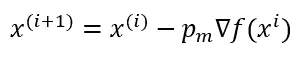

倒三角形是梯度，pm 是步长

然而，当使用“牛顿法”时，x(i)更新如下:

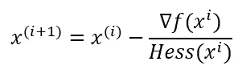

其中“Hess”是指损失函数的 Hessian 或二阶导数。这种新的更新考虑了二阶信息
,这将给出对最高下降方向的更精确的估计，这将允许模型以更快的速度收敛，并且由于 hessian 在许多损失函数(例如均方误差)中是恒定值，因此它在计算上是廉价的。这是你会在我的代码中注意到的第一个主要变化，因为回归树现在不是简单地拟合预测损失函数的负梯度，而是负梯度和 hessian。

**损失函数的泰勒展开式**

为了使用牛顿提升，我们使用泰勒展开根据梯度和 hessian 重写当前估计周围的损失函数。由于我们使用树来拟合数据，这可以进一步简化为树的叶值的总和。

Tm 是树中叶子的数量，Gjm 和 Hjm 是梯度的和，hessian 是区域 aka 叶子的和，Wjm 是叶子权重的和。右手边指的是正则项

这成为我们对新树的优化目标。这个定义的一个重要优点是损失函数值只取决于 Gi 和 Hi。这就是 XGBoost 支持定制损失函数的方式。

**模型复杂度**

“XGBoost”的通用性和准确性很大程度上可以归因于它对模型复杂性的关注。而以前的梯度升压模型只关注改善杂质/增益。“XGBoost”应用各种调整技术来避免过度拟合。XGBoost 将树的复杂性定义为:

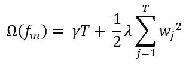

其中 T 是叶子数， **γ** 是关于终端节点数的惩罚项， **α** 和 **λ** 分别用于 **L1** 和 **L2** 正则化。Wj 是所有叶子重量的总和。

最后，由于树中的 L1 正则化被应用于*叶分数*而不是像回归中那样直接应用于特征，所以它实际上用于减少树的深度。此*将*减少预测性较差的特征的影响，但它不像回归中 L1 正则化(Lasso)可以将特征的贡献设置为零那样严重。类似于 Elasticnet，L1 和 L2 在 XGBoost 中一起使用。L1 正则化将惩罚预测性较低的特征，而 L2(岭)用于进一步惩罚较大的叶子分数，而不会对预测性较低的特征产生巨大影响。

**结构得分**

在使用泰勒展开重新公式化树模型之后，我们可以写出关于第 t 棵树的损失函数:

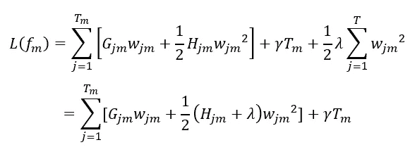

由于树结构是固定的，我们可以对叶子重量求导，以找到最佳叶子重量值，就像我们对梯度增强所做的那样。

如果我们在根据下一个树结构近似损失函数之前将这个最佳值插回到等式中。这也可以被视为新树的结构质量的度量，类似于我们之前在回归树中看到的成本复杂性树修剪。其中值越小，树结构在最小化损失方面越好。

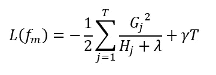

**学习树形结构**

现在我们有了一种方法来衡量一棵树有多好，我们可以构建每一种可能的树结构，但这是非常低效和不切实际的。相反，XGBoost 一次优化一个级别。这可以通过用上述等式表示潜在分裂的增益来实现。因此，我们使用损失函数来构建由模型复杂度控制的树

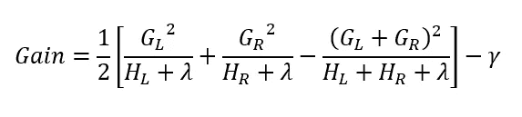

GL 和 HL 是分割左侧叶值上的梯度和 hessian 值之和，GR 和 HR 是分割右侧叶值上的梯度和 hessian 值之和。

这个公式可以分解为 1)新左叶上的分数 2)新右叶上的分数 3)原始叶上的分数 4)附加叶上的正则化。我们在这里可以看到一个重要的事实:如果增益小于γ，我们最好不要添加那个分支。hessian 在最优叶值方程的分母中的作用有点模糊。然而，如果我们使用 RMSE 损失函数，它的二阶导数本质上是样本数。因此，黑森标准化给我们的是平均叶重。在对数损失分类的情况下，这就有点复杂了。最佳叶值实质上转化为叶的 Z 分数，更多信息请看[这里](https://github.com/dmlc/xgboost/issues/2483)。此外，这种推导与陈天琦撰写的论文一致，并对应于方程 7。然而，为了简单起见，他去掉了对应于 L1 正则化项的阿尔法项。为了得到完整的推导，我推荐访问这篇[文章](https://towardsdatascience.com/boosting-algorithm-xgboost-4d9ec0207d)。

**加权分位数草图**

为了找到连续要素的最佳分割，需要对数据进行排序并将其存储在内存中。这是处理大型数据集时的一个问题。为了解决这个问题，使用了一种寻找近似分裂点的新方法。

基于特征分布的百分位数提出候选分割点。连续要素被分入基于候选分割点分割的桶中。例如，如果您有一个包含 100 个排序值{1，2，3，…100 }的要素，我们可以计算 10 个 10 分位数分割点{10,20,30⋯,90}中每个点的增益，并获得分布的良好近似值。“XGBoost”中的 eps 值就是这么做的。“XGBoost”仅在分割点比最后一个分割点多∾EPS **N*个点时考虑分割点。如果在上面的例子中 eps=0.01，那么你将得到 100 个分割点，大于其他点的{1%，2%，…，99%}。“Xgboost”在“总和变化大于 eps，但当前点下的点数比上一个点大 eps 时”不考虑新的拆分。

如果您的特征值相似，那么它们之间就没有真正的点分割，相反，您希望分割数据集的错误部分。这就是权重发挥作用的地方，我们用麻布作为权重，来表示预测的错误程度。所以现在第一个 10 分位数将不是大于 10%点的第一个点，而是大于 10% hessian 值的第一个点。

**处理缺失值(稀疏感知)**

与以前的算法不同，每个节点不仅有一个分裂点，确定样本是过滤到左边还是右边，而且还有一个基本的总方向。这个方向在 XGBoost 中被预定义为向左，这意味着任何缺失值(NAs)都被过滤到左边，因为逻辑语句不能应用于缺失值。

但是，如果您使用数据集中包含的 NAs 训练 XGBoost，那么模型将自动学习最佳方向，将它们发送到左侧或右侧。它首先用左侧的所有 NA 值计算每个分裂点的增益，然后用右侧的 NA 值计算增益。选择哪个分裂点最小化最大化增益，并设置方向。在预测时，任何未知值将在该特定节点通过该方向传递。我们可以这样做，因为即使特征值丢失，我们也不用它来计算增益，我们需要的只是梯度和 hessian 值。该计算如下所示:

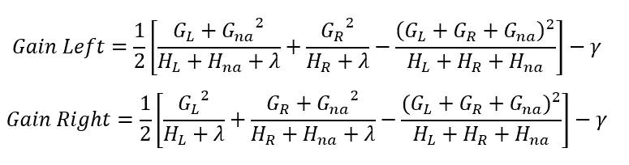

因此，增益是用左边和右边的 nas 的梯度和 hessian 的和来计算的

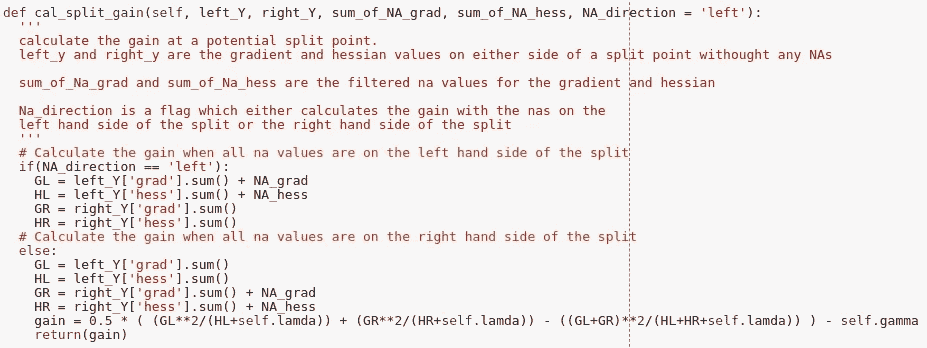

这是它的代码

# 因素

XGBoost 包含了各种各样的超参数，其中一些相对于标准的回归树来说相当神秘，因此我将尽力解释它们。

**磅秤 _ 位置 _ 重量**

在处理不平衡的数据集时，这是一个非常有用的参数。我个人已经在一个真实的应用程序中使用了它，并取得了巨大的成功。通常，该参数应设置为多数类与少数类的比率。我通常使用该函数来计算比例位置权重因子，尽管与任何其他参数一样，建议进行某种优化/调整以获得最大精度。

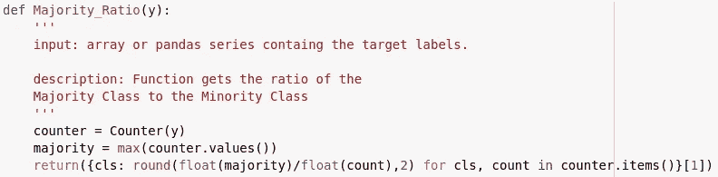

我只能假设这个参数如何影响模型，因为在实际的论文或文档中没有提到它。假设我们有一个不平衡的数据集，其中 90%的负样本和 10%的正样本。该算法可以向上采样，这意味着它将重复正例 9 次，以使其成为一个平衡问题。然而，我认为，该模型建立了一个在 1/9 的阴性样本上训练的模型集合，因为它允许更容易地交叉验证结果。然后，将每个模型的输出汇总在一起，以创建更准确的结果。

**最小儿童体重**

该参数控制模型的复杂性。它被描述为一个孩子所需的最小体重总和。如果树分区步骤导致实例权重之和小于 min_child_weight 的叶节点，则构建过程将放弃进一步的分区。”

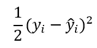

均方误差

对于使用均方误差的回归，相对于预测的二阶导数简单地为 1。所以当你得到一个节点的 hessian 和时，它基本上等于这个节点的样本数。而对于二元逻辑，每个点的 Hessain 看起来像:

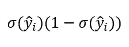

logloss 的 hessian sigma 字符代表 sigmoid 函数

让我们对这个方程有个直觉，如果我们有一个全是 1 的纯节点(要么只有 1，要么只有 0 ),那么所有的预测都会很大，所以所有的 hessian 项都接近于 0。如果节点仅包含零，则类似的逻辑成立。所以本质上，min_child_weight 是为了避免过度拟合，一旦达到一定的纯度，就停止树的进一步分裂。

**预计到达时间**

步长收缩用于防止过度拟合。在每个提升步骤之后，我们将使用 eta 来衡量新基础学习者对预测的贡献。这个参数或多或少相当于学习率。

**伽玛**

该参数还防止过度拟合，并且存在于增益(结构分数)的计算中。因为这是从增益中减去的，所以它本质上设置了最小增益量以在节点中进行分割。

**子样本**

“XGBoost”将对用于在特定提升步骤中训练单个树的训练实例的比率进行子采样。将其设置为 0.5 意味着 XGBoost 将在增长树之前随机采样一半的训练数据。这将发生在每棵树上，因此每棵树将在不同的数据样本上训练，这减少了方差，因为它减少了对训练样本中某些值的依赖。colsample 和 subsample 都基于随机森林的思想。

**Colsample**

该参数基于与子样本相同的思想，即通过对数据的不同部分进行训练来减少模型的方差。与行采样不同，XGBoost 对列进行采样有三种方式

*Colsample_bytree:* 为此，我们在数据的相同子样本上构建整个树

*Colsample_bylevel:* 在每个树级别/深度，我们将只考虑使用列的子样本。因此，对于构建的树的每一层，该子样本都将改变。

*Colsample_bynode:* 这是最细粒度的级别，因为每个节点将被约束使用不同的数据子集。

*Colsample_by:* 所有你要使用的以上所有采样方法的组合。例如，具有 64 个特征的组合{'colsample_bytree':0.5，' colsample_bylevel':0.5，' colsample_bynode':0.5}将在每次分割时留下 8 个特征可供选择。

**λ**

关于权重的 L2 正则化项。增加该值将使模型更加保守。

**阿尔法**

关于权重的 L1 正则项。增加该值将使模型更加保守。

**草图 _eps**

该参数用于分位数加权 sketch 或“近似”树方法，大致转换为(1 / sketch_eps)个箱。如果它是 0.1，我们有 100 个例子，那么我们将只计算 10 个点的增益。

**树形方法**

指用于以分层方式构建树的算法。

*精确:*指精确贪婪，将为每列的每个分割点计算增益。从而给出最准确的结果。

*近似:*这等同于上述的加权分位数草图算法。

*Hist:* 是一种超快速直方图优化近似贪婪算法，灵感来自 lightgbm 中使用的方法。

**最大增量步长**

这个参数可以用于极不平衡的类问题。正如我们在上面对于 min_child_weight 所看到的，如果叶节点几乎是纯的，这将会发生(当我们具有非常不平衡的类时),则叶权重值变得非常大，因为 hessian 将趋向于零，并且因为它在权重等式的分母上将趋向于无穷大:

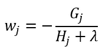

因此，尽管将权重值乘以 eta/学习率以在严重的类不平衡的情况下停止过度拟合，但这还不够。max_delta_step 所做的是在应用 eta 校正之前引入“绝对”正则化来限制权重。就我个人而言，我从未在这个参数上取得过巨大成功，并且从经验中发现 scale_pos_weight 因子给出了更好的结果。

# **“XG boost”手动**

抱歉，这是很多复杂的数学，但我认为这是有益的，包括它，并有一些关于算法背后的理论的知识，而不是省略它。我知道这些数学看起来很可怕，但实际应用起来并不复杂。为了向您证明这一点，我将通过在一个玩具数据集上手工进行所有计算，来展示“XGBoost”是如何工作的。

首先，我们将从玩具数据开始，我们的目标是根据年龄和性别这两个特征来预测是否有人玩电子游戏。数据看起来像这样:

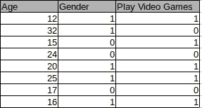

“XGBoost”首先对每个样本数据点进行 1 的初始预测。

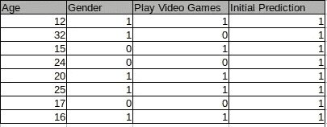

这被用作算法的起点。理论上，我们可以从这里的任何值开始，事实上，梯度提升从目标变量的对数概率开始，作为其初始预测。在我看来这是一个更好的初步预测。使用这个预测，现在可以计算我们的损失函数相对于我们的预测的负梯度和 hessian，以便构造我们的第一棵树。但首先，我们需要使用 sigmoid 函数将初始预测值 1 转换为概率值，因为在树内部，我们使用的是逻辑损失函数，我们所有的值都是对数概率。

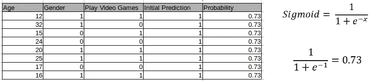

要使用 sigmoid 函数，我们只需通过该函数传递我们对每一行的初始预测。使用这些新计算的概率，我们现在可以计算数据集中每一行的负梯度和 hessian。这也是一个简单的过程，我们只需要用我们的行概率替换方程中的 p，用目标变量替换 yi，在这种情况下，如果一个人玩视频游戏。

现在，我们可以开始构建我们的树了。在这个例子中，我选择了伽马值、λ值和学习率值分别为 0、1 和 0.4。将使用精确的贪婪方法来构建树，其中在每个分裂点计算增益。因此，对于特征中的每个值，我们将把低于或等于其自身的数据过滤值分割到左侧，而将任何大于其自身的值分割到右侧。如果你不确定创建回归树的步骤，我强烈建议你回到起点，观看回归树视频。无论如何，我们将从根节点开始。

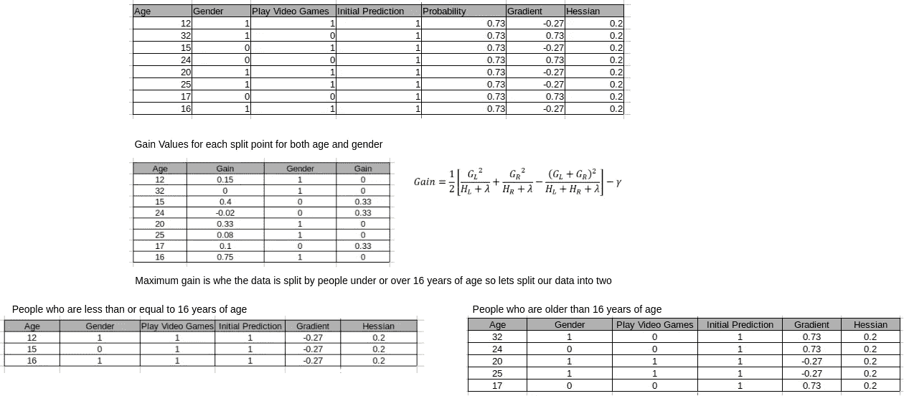

从上面我们可以看到，第二个表存储了两个特征上每个分割点的所有增益值。为了计算特定分裂点的增益，我们使用表格右侧的等式。让我们以 24 岁时的潜在分裂为例，计算结果如下。我们将获取左侧所有小于或等于 24(绿色)的 hessian 和梯度的总和，并计算右侧所有大于 24(红色)的 hessian 和梯度的总和。下面是计算该特定分裂点的增益所需的计算。该等式基本上比较了分裂节点或不分裂节点的好处。减法部分也是γ，用于设置我们希望分裂发生的最小阈值。在这种情况下，增益为负，因此我们不会在这个值上进行分割。

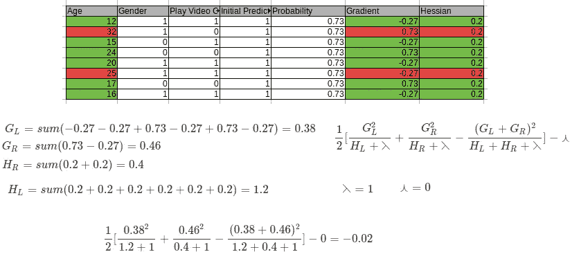

因此，在对每个可能的分裂重复这一计算后，我们可以看到我们的第一个分裂点将在 16 岁，因为这个值具有最大的增益值。该节点被一分为二，创建两个新节点，即 16 岁或 16 岁以下的人和 16 岁以上的人。我们可以看到左边的分裂或者那些 16 岁或 16 岁以下的人都玩电子游戏。这意味着这是一个纯节点，没有必要在这里进行任何进一步的分割，因为它们都将具有负增益值。因此，我们将重点放在进一步分裂的右手边。

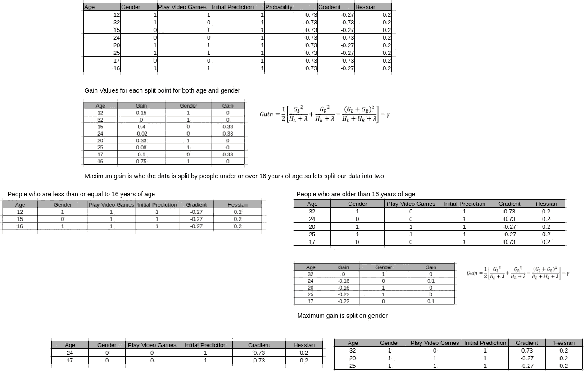

现在计算新节点内每个分裂的增益。最大增益由性别给出，因此我们将基于性别对 16 岁以上的人应用另一个分裂。同样，左边的节点是纯的，不需要进一步分割，而右边的节点可以从外观上再分割一次。

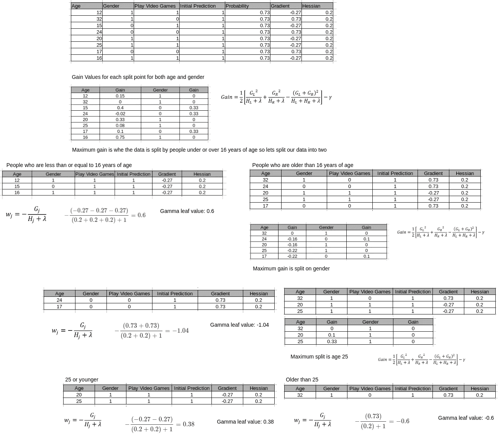

现在我们已经完成了分裂，如果你注意到我们已经计算了叶子的值，我们的树就已经构建好了。使用所提供的等式，我们基本上只是对叶节点中的梯度求和，然后除以 hessian 加上常数λ之和。在我看来，这种表格格式看起来有点乱，所以我将清理它，并以树形结构的形式显示它。

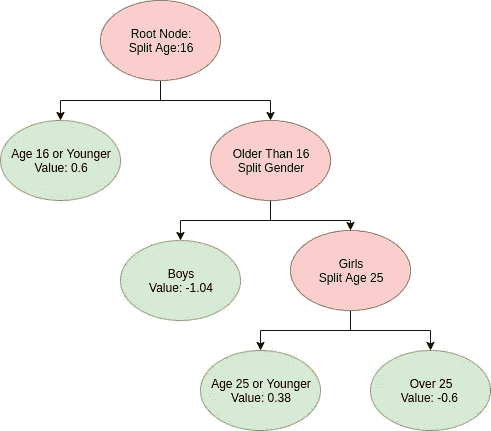

这是我们的第一棵树，我们现在将使用它来更新我们的初始预测，叶节点中的值也是对数概率形式，我们将这些值乘以 0.4 的学习率。我们的样本落入哪片叶子将是它们的更新值。我们的新预测将会是这样的。

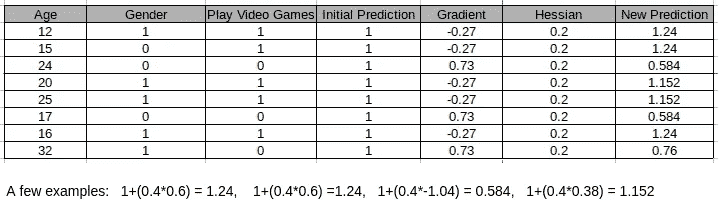

我们已经完成了第一轮助推，现在有了新的预测。为了继续，我们将再次进行完全相同的过程，将我们的最新预测转换为概率，并计算新的负梯度和 hessian 值

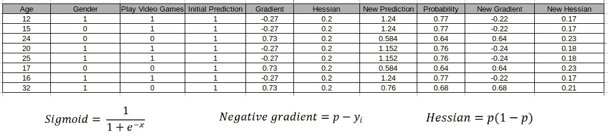

**第二棵树**

现在我们有了梯度和 Hessian 的新的更新值，我们可以再次使用与之前完全相同的过程来拟合树结构。

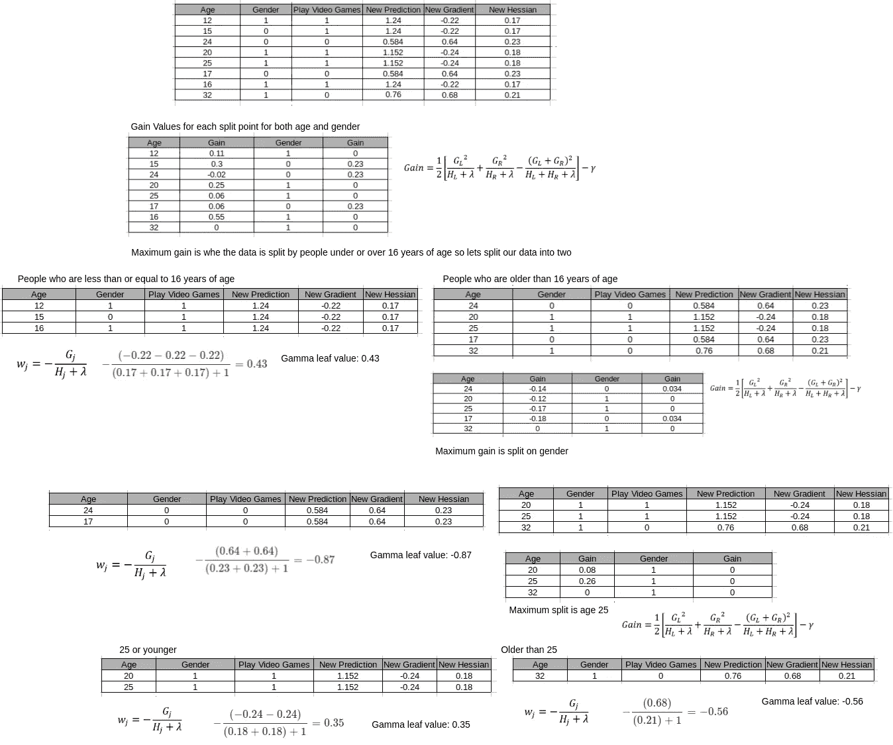

这看起来又很乱，所以我会用这个来代表我们的新树。其中红色表示拆分节点，绿色表示叶节点。

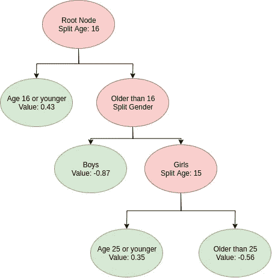

我们现在用这棵树来做预测，并把它加到我们之前的预测中。我们的样本落入哪片叶子将是它们的更新值。

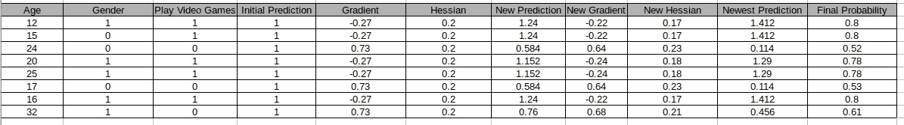

就这样，我们手动完成了两轮助推。总而言之，这就是我们所做的。首先，我们对整个数据集做了一个 1 的初始对数概率预测。通过使用 sigmoid 函数将该预测转换成概率，我们能够计算出相对于我们初始预测的负梯度和 hessian。然后，我们从这两个量构建了一个回归树，并从上面的等式计算了我们的叶节点值。这棵树然后被用来更新我们最初的对数优势预测。然后，对我们新的更新后的对数几率预测重复这一过程，进行两轮强化。这个简单的例子希望有助于展示“XGBoost”背后的主要机制，只是指出这个例子缺少加权分位数草图和稀疏意识拟合，以使这个例子更加连贯。

# 从头开始用 Python 实现

这是使用 Numpy 和 Pandas 编写的“XGBoost”的 python 实现，它是根据我的理解开发的，我不推荐使用它，但可以随意解构它，希望它可以使一些概念变得更加具体。此示例不包括稀疏感知拟合(处理 NA 的能力)，因为我认为这是算法的一个更新颖的方面，任何好的管道都应该在数据到达模型之前处理缺失数据。

# 结论

我希望你喜欢这篇文章，它回答了你关于“XGBoost”的一些问题。如果这个帖子得到了积极的反馈，那么我甚至会考虑为 Catboost 创建类似的东西。如果你有任何疑问或任何不清楚的地方，请随时提问。这个[链接](https://github.com/Ekeany/XGBoost-From-Scratch)将把你带到代码所在的 Github 仓库。

# 参考材料

1.  【https://arxiv.org/pdf/1603.02754.pdf 号
2.  [https://xgboost . readthedocs . io/en/latest/tutorials/model . html](https://xgboost.readthedocs.io/en/latest/tutorials/model.html)
3.  [https://machine learning mastery . com/gentle-introduction-gradient-boosting-algorithm-machine-learning/](https://machinelearningmastery.com/gentle-introduction-gradient-boosting-algorithm-machine-learning/)
4.  [https://www.youtube.com/user/joshstarmer/videos](https://www.youtube.com/user/joshstarmer/videos)
5.  [https://machine learning mastery . com/gentle-introduction-gradient-boosting-algorithm-machine-learning/](https://machinelearningmastery.com/gentle-introduction-gradient-boosting-algorithm-machine-learning/)
6.  http://cican17.com/an-overview-of-boosted-trees/
7.  [https://towards data science . com/boosting-algorithm-GBM-97737 c 63 DAA 3](https://towardsdatascience.com/boosting-algorithm-gbm-97737c63daa3)
8.  [https://towards data science . com/boosting-algorithm-xgboost-4d 9 EC 0207d](https://towardsdatascience.com/boosting-algorithm-xgboost-4d9ec0207d)
9.  [http://nicolas-hug.com/blog/gradient_boosting_descent](http://nicolas-hug.com/blog/gradient_boosting_descent)
10.  [https://cengiz.me/posts/extreme-gradient-boosting/](https://cengiz.me/posts/extreme-gradient-boosting/)