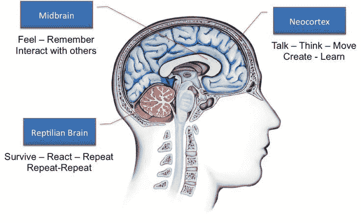
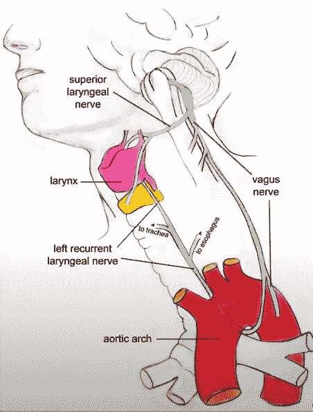
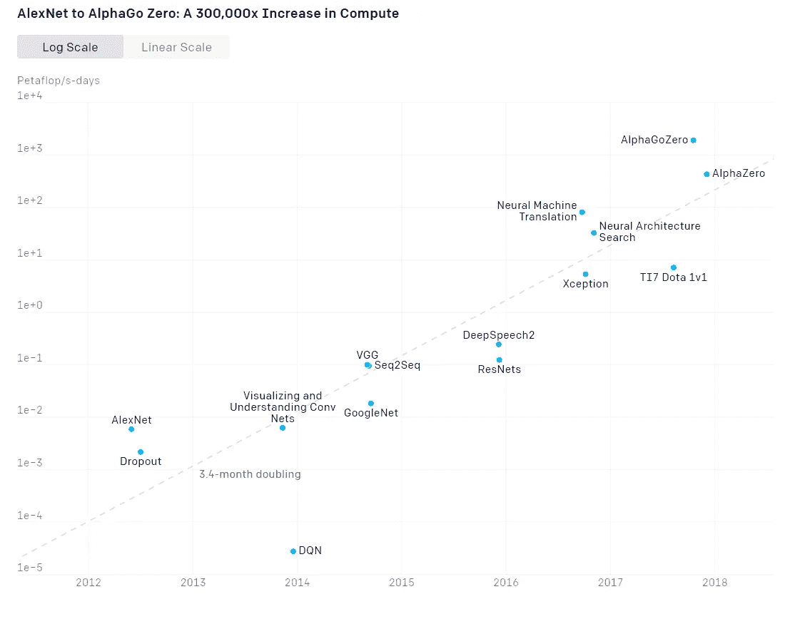

# 构建人工智能可能需要什么

> 原文：<https://medium.com/analytics-vidhya/what-might-be-required-to-build-an-artificial-general-intelligence-c89e9ccd9ad8?source=collection_archive---------23----------------------->

新加坡赛博朋克城

## 为了达到这个目标，我们需要什么样的知识和突破？AGI 人有多聪明？

不要担心，这篇文章不是关于 AGI 将如何接管世界或者人类将如何与 AGI 融合。而是我认为实现它需要什么。这个帖子只是我在读了一些书和看了一些关于 AI 的精彩视频后的一个思想实验。这是我对 AGI 的看法，肯定不正确，但希望这篇文章能引发读者的思考。

假设我们要建造一个 AGI，我们需要什么样的知识和突破才能实现它。AGI 人有多聪明？你可能会问，为什么这很重要？仅仅因为一个远高于人类的高智能生物将极大地改变人类，不管是好是坏，我们的生活和社会将会改变，永远不再是原来的样子。那么我们如何衡量一个 AGI，我们能给这个智慧生物一个比较的尺度吗？也许比阿尔伯特·爱因斯坦或斯蒂芬·霍金聪明 100 倍？

也许只是 1x 山谬·里维？你令人惊叹。

# AGI 人有多聪明？

我看过的令人兴奋的视频之一是尼尔·德格拉斯·泰森谈论智能物种将会是什么样子。我推荐看下面他的视频。

> 看看我们人类最近的亲戚是黑猩猩。我们和黑猩猩有大约 99%的相同 DNA。毫无疑问，任何人都会认为人类比黑猩猩聪明得多，因为我们可以建造飞往火星的火箭，粉碎原子。另一方面，黑猩猩做不到这些。然而我们在 DNA 上有大约 1%的差异，我们和黑猩猩的区别就在于这 1%的差异。现在想象一个比我们大 1%的智慧物种，我们人类甚至没有理解的能力。任何由这种高智能物种完成的简单工作(如乘法，儿童诗)，整个人类在一千年内都无法理解。

令人兴奋的是，感受一下 AGI 的智慧会是什么样子。

想象一下教黑猩猩 15 * 0 = 0 或者理解《一闪一闪小星星》。黑猩猩已经被测试理解和做简单的一位数加法。但是他们将很难理解 0 的概念，并且将数字乘以几百对他们的大脑来说太难处理了。儿童诗怎么样？这对我们来说看起来很容易，但这是一个 NLP 问题。他们需要理解句子结构和单词的意思。词语将与我们世界的事物或行为相关联。黑猩猩可以做手势，识别一系列符号，但用符号来代表天空中的闪光，并在夜空中凝视星星时思考星星，这可能仍然是一个漫长的进化过程。他们的大脑还没有进化到能够理解这些信息的程度。同样，如果一个 AGI 人有 1%的智力差异，我们可能要经历许多世纪的进化才能理解他们。

 [## 猴子会做数学

### 这看起来像一个标准化的测试问题:是左边两个数字的总和还是右边的单个数字…

www.sciencemag.org](https://www.sciencemag.org/news/2014/04/monkeys-can-do-math) 

# **大脑皮层的基本介绍**

大脑的简单解剖

人类大脑中的新皮层约占大脑体积的 76%，它将从我们还是婴儿开始持续发育，直到我们 26 岁。它位于我们大脑的顶层，大约 2-4 毫米厚，包含 6 层，大约有一张大餐巾的大小。令人惊讶的是，新皮层仅在哺乳动物中发育，而在其他物种中没有。新大脑皮层拥有最先进的功能，我们也可以说是它让我们变得聪明，让你变得聪明。它为我们提供了感官知觉、空间推理、社会情绪处理、记忆、学习能力等。

如果我们从大脑中随机取出大脑皮层切片，放在显微镜下观察，无论从哪里切下，细胞切片看起来都是一样的。有了这个发现，我们估计我们做的所有事情，视觉、听觉和语言技能等都使用相同的细胞结构来完成这些任务。这告诉我们，我们人类可以执行的所有复杂任务都可以用相同的细胞结构来处理和解决。

新大脑皮层被分成几个区域，并通过一束穿过白质神经纤维连接在一起。这创建了一个逻辑链接，同时形成了一个层次结构，允许感觉在不同的层次上被处理。由于感官数据来自眼睛和耳朵，这种层次结构将在到达大脑顶层时生成更通用的抽象表示。

**复制人类智能**

你可能会想，为什么不把大脑完全复制到硅芯片上，这样我们就能得到一台智能机器。但我认为这是行不通的。我相信我们不需要完全复制人脑的功能来创造 AGI。但是我们需要大脑的基本机制*神经动力学*类似于飞机的空气动力学来创造智能机器。我们不需要拍打翅膀和羽毛来创造飞行器。我们需要的是推力和阻力来使飞机升空。

扑翼飞行器

# 机器应该如何学习

**1。世俗和终身学习**

我们的学习之旅始于生命的早期，人类在怀孕的最后三个月或三个月发展听力。婴儿可以在母亲的子宫内听到声音，并对母亲的声音和子宫外的对话做出反应。经测试，到了第三个三个月的时候，婴儿已经能够识别母亲的声音，并能够以心率的增加来回应母亲的声音，这表明当母亲说话时，他们更加警觉。

我们的大脑不断接收来自我们的感官、视觉、听觉、触觉、嗅觉、四肢运动等的输入。这些都是连续的数据，因为我们的大脑处理它们，做出预测，并从反复试验中学习。就像婴儿如何学习爬行和走路。

通过上面的例子，我确信我们的大脑正在以一种时间的方式学习，并且在一连串的动作中是连续的。这绝对不是分批学习，也不是以训练和预测的方式分两个阶段进行。我们在不断训练和预测的同时，反复加强突触的激活，直到我们可以下意识地做到这一点，而无需实际思考。*(举一个语言方面的例子，一个双语者经常会先弹出本国语单词，然后他们再想到那个单词的翻译。)*

目前的深度学习方法呢？我们确实有持续学习算法。像 RNN，强化学习(RL)，DeepMind 的 DQN 他们有一些相似的通过时间表征的学习。但我们仍然需要数百小时甚至数年的训练，才能让这个模型表现得像人类一样好。DeepMind 的 Deep Q-Networks (DQN)花了 900 个小时才学会玩雅达利游戏《冻伤》，AlphaStar 花了 200 年才打败星际争霸 2 的精英人类玩家。如果这些人工智能能够像人类一样学习，而不需要在知道这是个坏主意之前把车开下悬崖数千次，那该多好。因此，为了让机器与我们的环境集成，我们需要一种 RL(时态)类型的学习算法，同时以少量学习的方式进行学习，以便它们对现实世界中不断变化的事件做出反应。

 [## 婴儿能识别子宫里听到的旋律

### 婴儿出生前三周听到的旋律会让他们在出生后一个月再次听到时心跳变慢…

www.livescience.com](https://www.livescience.com/13067-sounds-heard-womb-affect-baby-heart-rate.html) 

一个实现模型快速收敛的思路关于上述问题我们可能需要着眼于终身学习。**终身学习**是一种让机器**不断学习**、**积累过去学习的知识**、**利用**帮助未来学习和解决问题的思想。我认为这是一个重要的里程碑，为了实现 AGI，我们需要跨越这个里程碑。当实现终身学习时，我们可能会减少在新任务中训练模型所需的时间。当新事物出现在现实生活中时，学习新事物也是很灵活的。而不需要重新训练整个模型来适应出现的新情况。

**2。拥有记忆**

对于一个人来说，保持长期记忆需要我们不断重复这三个过程，**注意、编码、提取。** **注意力**指保持专注于一项任务，以计划和规范我们的思想和行动。在我们的工作记忆(短期记忆)中有了任务之后，我们就可以**将它们编码**到长期记忆中。最后，**检索**简单地说就是回忆起之前我们花时间编码的信息。我们对这些信息检索得越多，我们对它们的记忆就越强，或者我们可以说，回忆它们花费的精力就越少。

有时候我们会在不知不觉中立刻记住一些事件，这叫做**内隐记忆**。隐性记忆(情节性的)通常发生在与独特事件相关的地方，比如我们的初吻，与某个特别的人的浪漫时刻，甚至去牙科诊所拔智齿。这种类型的记忆不需要我们重复去编码它们。你有没有感觉到在这样的时刻，时间和平常有很大的不同？

在当前的机器学习中，我们让 LSTM 使用门来控制记忆过程，所有这些信息都以权重的形式存储。它们工作得非常好，尤其是在 ELMo、BERT 和 ULMFiT 等使用 Transformer 架构的语言模型上。但是用权重来存储记忆和我们自己的记忆是非常不同的。我们创造的新记忆不会破坏我们大脑中储存的其他记忆，顶多我们会忘记它们，或者回忆起来时它们成了埋藏物。但我们不会破坏记忆，让它们完全不同。举个例子，当我们学习不同的任务时，我们不会看到公共汽车，但会把它们当成鸵鸟。对于机器学习，我们需要一种方法来存储新学习的任务，但不影响其他权重。它应该形成一个新的“*突触连接*而不影响其他。

这是一个我们称之为**灾难性遗忘**的案例，当深度学习系统在接受新任务训练后忘记了之前所学的内容时，就会发生这种情况。在一个例子中，当你已经在任务 A 上训练了一个模型，并且使用相同的权重来学习新的任务 B 时，那么你的模型忘记了关于任务 A 的学习信息

**我们为什么会忘记？**

理查德·莫里斯做了一个 TED 演讲，涉及到了关于遗忘的话题。遗忘是我们大脑的一个必要机制，这让我们的大脑在一段时间内捕捉信息，以确定哪些值得保留，哪些不值得。因为不重要的信息将从你的大脑中卸载，这防止我们用不必要的信息使我们的记忆超载。就机器学习而言，我们可能需要一个在头脑中设计工作记忆和长期记忆的架构。重要信息应该储存在长期记忆中，而在训练期间，应该储存在工作记忆中。

【https://www.youtube.com/watch?v=vNyZmSg92HI 

人类失去细节性短期记忆，转而支持其他认知功能。

如果你对以上实验感兴趣，可以点击下面的链接观看[心灵力场 S3。E1 由 Vsauce](https://www.youtube.com/watch?v=ktkjUjcZid0) 。

**3。建模世界**

当婴儿出生时，他们将开始了解这个世界，并参考他们所看到的东西。他们将在 9 个月大的时候开始学习重力。如果一个玩具漂浮在空中而不落下，如果你欺骗他们，婴儿会被吓到。它们形成了世界的**期望模式**和对象之间的**关系。**这些预期模式和对象之间的关系成为我们生活的一部分，我们的大脑会下意识地对预期的结果做出预测，当这些预期模式被打破时，我们会感到震惊并变得警觉。

你不仅会感受到期望的巨大差异，还会感受到期望模式的细微变化。想象一下，你正在打开你家的门，你像往常一样施加同样的力量，但是这一次它向后砰地关上了。当你打开门时，你立即注意到门不知何故变得更轻了，并下意识地预测门会因为你施加的力度而向后砰然关上。

> 如果你不知道你不知道的东西，你就无法学习。

当前的机器学习没有在对象之间形成任何关系，并且它们很难识别它们预测中的异常。拿一个图像分类任务来说，一个学习猫狗的模型。当给他们一张仓鼠的分类图像时，他们不能输出“我不知道这是什么”。是的，你可以争辩说我们可以使用异常检测技术来识别仓鼠。但是这些技术是“手动编码”的，模型并不知道异常是什么。只有通过一些参考，一些可以比较的东西，一台机器才能发现差异，并问为什么它与它的模型预测不同。

**4。一般学习结构**

有一个通用的学习结构

我认为为了到达 AGI，我们可能需要实现的另一个想法是在人工神经元上有一个通用的学习结构。这个想法来自一本名为《论智力》的书，这本书解释说，我们的新大脑皮层从头到尾都有相似的结构，即使你在不同的位置切开它们。这可能是大脑的一个重要特性。具有单一结构，能够学习不同类型的输入，如图像、音频、文本、时间信息、对象关系和推理。

而不是每个任务都有一个结构。我们能不能设计这样一种方式，让机器学习解决给定问题所需的内容？想象一下，有一个通用的神经元设计可以完成所有这些任务，并形成完成这些任务所需的新连接。这与我们灵活处理困难情况的大脑非常接近。它将允许机器通过学习来创建一个潜在的新设计。比如有能力为自然语言处理、图像和它们之间的关系建立联系。

**5。基于物种进化**

> **什么是进化？**是达尔文对物种起源和变异的解释，适者生存的选择。它是一种强大的解释力，在很长一段时间内起作用。**(来自 GPT2 的解释)**

进化不是一个有效的过程，事实上，如果你想一想，它是浪费的，进化是基于试错法，通过选择适者生存，同时过滤掉一部分人口。引用理查德·道金斯*“进化是可悲的浪费，它从根本上建立在浪费的基础上，但另一方面，它确实产生了巨大的结果。”*

[摘自莱克斯·弗里德曼和理查德·道金斯的人工智能播客# 87](https://www.youtube.com/watch?v=5f-JlzBuUUU)

理查德·道金斯给出了一个进化没有效率的例子，这个例子可以在我们的身体中找到。我们的身体喉部神经是一种进化上特别糟糕的设计，它是一种连接到我们喉部(发声器官)的神经。它从大脑开始，但这条神经并不直接通向声带，它穿过胸部，绕过动脉，回到喉部。我们不是唯一一个有这种缺陷设计的人，长颈鹿的喉部神经环绕胸部，迂回约 1.8 米。虽然进化不是有效的，但它是我们知道的唯一被证明可以导致智能实体的方法。

多主体协同适应有一天可能会产生极其复杂和智能的行为

与生物进化不同，数字进化可以加速进化过程。以 OpenAI 项目为例，通过在许多并行实例中运行代理来模拟捉迷藏环境，代理可以实现复杂的智能行为。如果一个智能体可以重写它的代码或者重新连接它的神经元来改进它自己会怎么样。与生物智能相比，数字智能可以成倍增长，仅仅几个月的努力就可以轻松超越人类智能。

进化可能是解答莫拉维克悖论的一瞥

莫拉维克悖论讨论了围绕所有人工智能发展的现象，在这些现象中，实现模仿人类专家完成“艰难”任务(国际象棋、围棋、绘画和音乐)的专用计算机比用 1 岁儿童的技能建造一台机器要容易得多。高级推理比低级无意识认知需要更少的计算。

> *“让计算机表现出成人水平的性能相对容易[……]，而让它们掌握一岁儿童的技能却很难或者不可能。”* **【汉斯·莫拉维克】**

在人工智能模拟中使用通过强化学习(RL)的进化，可以建造一台机器来行走和堆叠玩具积木，就像 1 岁的孩子正在学习做的一样。OpenAI 还有另一个项目，通过在虚拟环境中模拟解决魔方来证明灵巧性，可以转移到现实世界中。这表明莫拉维克悖论有可能被克服，但也就是说，计算的需求也呈指数增长。从 2012 年的 AlexNet 到今天，计算量增加了 30 万倍。

[30 万倍计算量提升！](https://openai.com/blog/ai-and-compute/)

虽然这是反直觉的，但高级推理需要更少的计算。相比之下，看看我们发生高认知的大脑，我们的新皮层比我们原始的小脑密度低(估计 200 亿对 1200 亿神经元)。这可能意味着创建 AGI 的主要瓶颈可能不是计算上的，而是算法上的。

 [## 避免莫拉维克悖论在五年内解决 AGI

### OpenAI 的 Ilya Stuskever 是“暴力计算”是你的全部”这一观点的最杰出倡导者之一

medium.com](/intuitionmachine/near-term-agi-should-be-considered-as-a-possibility-9bcf276f9b16) 

**6。情感计算**

> 情感计算是对能够识别、解释、处理和模拟人类情感的系统开发的研究。

最后，我相信这是 AGI 应该有的最后润色。计算感情和情感的能力。我相信这是至关重要的，因为我们不想要一台冷冰冰的、没有感觉也不表达感情的机器。想象一下，你正在与 Alexa 交谈，但这个版本的 Alexa 不同，它能够通过你的语调检测压力水平，并知道你正在要求从亚马逊购买礼物。知道自己的压力水平异常高，已经忘记了结婚纪念日。它没有向你展示你正在寻找的东西，而是建议你应该在附近的花店购买鲜花，这些花店可以在接下来的 2 小时内送货上门。它会感觉像一个真正有用的私人助理。

记得他吗？现在想象一下他能让你生气的更聪明的方法。

情感计算可以提供迎合你当前需求的情感上下文服务。尽管这看起来很可怕，但如果操作得当，情感计算有可能挽救一条生命。我们谈到的词可能是相同的，但围绕这些词的语气却有很大的不同。这也可能是机器在采取行动之前需要考虑的一条重要信息。即使机器不能真实地表达感情，但仅仅通过提供模拟的反应就能给用户带来舒适。

情感计算、情感、隐私和健康

**7。智能 vs 意识**

智慧和意识之间有很多争论。在我看来，我们不需要意识来创造智能机器，我们有活生生的例子，如狗、海豚和猴子。他们当然有自我意识和知觉，但他们肯定没有人类聪明。所以我们可能会创造一个没有意识的智能机器。意识可能不是智力的自然属性。

也许有些问题属于海森堡测不准原理的范畴，我们越想测量或确定它，它就变得越不确定。意识可能属于这一类，与阻止我们获得真相和逃离矩阵的量子力学联系在一起。

聚集人类最优秀的智慧来讨论 AGI 的话题。

哇哦。我们终于坚持到了最后，这是我迄今为止最长的帖子之一。再次感谢你走到最后。让我们希望能在有生之年看到 AGI 回来，在黑墙后面看到你。

“在动态的环境中，一切都在变化。限制你的是你保持自我的努力。”