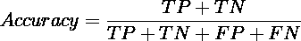
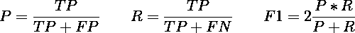
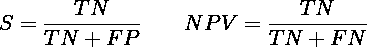
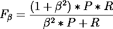
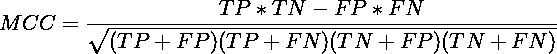

# 没人告诉你的二进制分类度量

> 原文：<https://medium.com/analytics-vidhya/what-nobody-tells-you-about-binary-classification-metrics-4998574b668?source=collection_archive---------8----------------------->

您很可能知道(或至少听说过)评估分类器的指标，如准确度、精确度、召回率和 f1 值。但是，您是否知道有些类型的问题是他们没有指出的？还有，你已经了解 MCC，NPV，或者特异性了吗？我也很长时间不知道这些度量，因此我已经错过了评估一些分类器。因此，在本文中，我们将看到:

*   **对最受欢迎的指标的简单明了的解释**——这样你就不会再对它们有疑问了；
*   **何时使用，主要是不使用每个指标**
*   **评估分类器的最推荐指标是什么**

准备好了吗？加油…

# 准确(性)

准确性是目前最流行的衡量标准。基本上，它表示在给定的数据集中，所有类别中有多少预测是正确的。虽然精确度被高度采用，但当数据集不平衡时，它并不十分适合。

举个例子，假设我们有一个数据集，其中的标签是男人/女人。还有，让我们考虑 80%的样本是女性，只有 20%是男性。如果你的模型只预测女性，那么它的准确率会轻松达到 80%。这同样适用于多类分类。例如，想象一个动物数据集，40%是狗，50%是狗。同样，如果你的模型只学习区分狗和猫，准确率将达到 90%。

因此，**只有当您的数据集达到平衡时，准确性才能被视为有效的指标**。换句话说，当类分布(be 2 或更多)有些均匀时。就个人而言，我不喜欢准确性，因为这种假设很难在现实世界的数据中发生。

# 精确度、召回率和 F1 值(或 F 值)

*   **回想一下**:你的模型相对于正类有多准确？即:**“给定阳性样本，有多少预测是正确的？”**
*   **Precision** :当你的模型预测正类时，你有多信任它？即:**“给定正面预测，有多少是正确的？**

除了分类问题，精确度和召回率对于检测问题非常有用。例如，假设我们有一个检测人脸的模型。改变以前的定义，精度和召回将被定义如下:

*   回忆一下:“给定被标记的人脸，模型检测到了多少？”
*   **精度**:“给定预测人脸，有多少是真实人脸？

举个实际的例子，假设我们有一个有 10 张脸的图像。现在，让我们假设一个模型返回 5 个检测，其中 3 个是真正的人脸(TP ), 2 个是不正确的。在这种情况下，我们的召回率为 30%(10 个检测到的人脸中有 3 个)，精确度为 60%(5 个正确预测中有 3 个)。

那么，**f 值(或 f1 值)的目的是什么？**假设在这个相同的图像中，另一个模型返回 2 个检测，并且它们是真实的人脸。在这种情况下，召回率为 20% (2/10)，准确率为 100%(所有检测都是真实人脸)。召回率 30%准确率 60%的模型和召回率 20%准确率 100%的模型哪个好？

为了帮助这个决定，**我们使用 f 值**。**它代表了精确和回忆的调和含义**。为什么是谐波？因为与算术平均相比，**要提高 f1-score，精度和召回率都必须更高**。

当你的积极类比消极类更重要时，这些指标是合适的。如果你仔细看看公式，精度和召回不考虑真正的负面影响(TN)。**他们只关心阳性样本**。这并不总是好的。

在检测问题中，就像例子中一样，它完全有意义。想一想:在一个检测问题中，如何定义真否定(TN)？除了难以定义，真正的否定没有太大意义。一种算法能很好的检测出不感兴趣的物体？至少，令人困惑…

另一方面，**在一些分类问题中，负类比正类**更相关。对于这种情况，我们有 NPV 和特异性。

# 阴性预测值(NPV)，特异性

指标特异性和 NPV 等同于召回率和精确度，但是对于负类:

*   **特异性**:你的模型相对于负类有多准确？即:**“给定阴性样本，有多少预测是正确的？”**
*   NPV :当你的模型预测负类时，你有多信任它？即:**“给定负面预测，有多少是正确的？**

正如我之前所说的，**当消极类在实践中比积极类更重要时，这些度量标准是有用的**。例如，假设我们有一个分类问题，我们想知道一个病人是健康的(阳性)还是有病的(阴性)。或者如果我们想知道某些信用卡交易是真实的(正面的)还是欺诈的(负面的)。在这些情况下，您必须计算 NPV 和特异性。此外，我们可以根据这些指标快速调整 F 值。

# f-β

F-beta 是 f1 的推广。这个公式有一个衡量召回率的项，它比精确度更重要。我们可以看到，当**β= 1**时，我们有 f1 的原始公式——分数。

另一个典型值是**β= 2**，生成 F2-分数。在这种情况下，我们认为**召回的权重高于精度**。也就是说，对于分类器来说，好的召回率比精确度更重要。**当我们希望确保分类器更好地识别阳性类别时，这很有用，即使它可能会产生更多的假阳性**。在前面的检测示例中，我们的检测器会尝试检测尽可能多的真实人脸，但可能会返回更多的误报(不是真实人脸的检测)。

请注意，我们可以很容易地修改 f-beta，分别用 NPV 和特异性来代替精度和召回率。

# 马修斯相关系数

我决定以后再写 MCC，因为**是我最喜欢的指标。我总是在我处理的分类问题中计算 MCC**。你想知道为什么吗？

首先，因为 **MCC 是一个考虑二元分类(TP，TN，FP，FN)所有可能性**的度量。其次， **MCC 对不平衡数据集具有鲁棒性**。最后，**MCC 的结果是一个介于-1 和 1 之间的归一化系数，可以直接解释**。换句话说:

*   **-1** :你的 MCC 越接近-1，你的分类器越差，也就是说，分类器产生的错误比正确的结果多。
*   **+1** :另一方面，越接近+1，你的分类器就越好。
*   **0** :当系数接近零时，MCC 告诉我们分类器正在预测最频繁的类别。

> 不管你的问题是不平衡的还是你的正/负类的重要性，MCC 都是评估你的分类器结果的一个好的和公平的度量。

# 综上

*   **只有当你的类分布均匀时才使用精度**。尽管如此，也要计算(或优先考虑)其他指标。
*   当你的正面类比负面类更重要时，计算精度、召回率和 F 值。使用 F-measure 来决定两个或更多分类器。
*   **当负类更相关时，使用 NPV 和特异性**。
*   **有了 F-beta，就可以平衡精度和召回**(甚至 NPV 和特异性)。
*   **始终计算 MCC** 。该指标对不平衡的数据集是稳健的，它的系数是可解释的，并且给你的分类器一个更好的感觉。

就是这样。我希望你喜欢它。如果这篇文章对你也有帮助，请给点掌声👏👏。关注我在媒体上更多这样的职位。您也可以在以下位置查看我的作品:

*   [Github](https://github.com/arnaldog12)
*   [领英](https://www.linkedin.com/in/arnaldo-gualberto/)
*   [个人网站](http://www.arnaldogualberto.com/)

