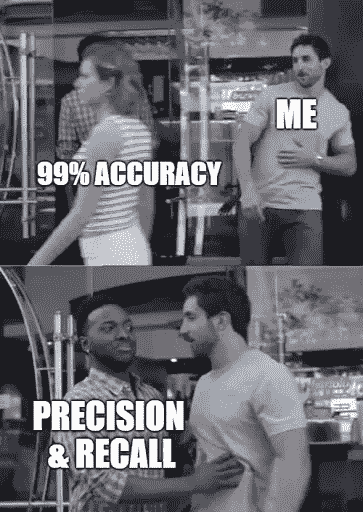
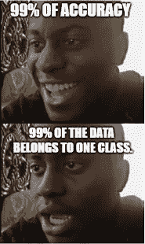

# 精确度、召回率、F1 分数和准确度能告诉你什么？

> 原文：<https://medium.com/analytics-vidhya/what-precision-recall-f1-score-and-accuracy-can-tell-you-fe1eab1ada5a?source=collection_archive---------19----------------------->

# 毫无疑问，要评估您的分类算法，您必须考虑准确性。但是，准确性就是一切吗？

# 首先，什么是准确性？

准确度是正确预测的数量除以预测的总数。

> a**ccuracy = correct _ preds/all _ preds。**

想象一下，在一个由 90%的狗图像和 10%的猫图像组成的数据集上测试一个模型，如果它给你的所有预测都是狗，会怎么样？你很容易得到 90%的准确率，即使准确率很高，这仍然是一个很差的模型。

> **准确性告诉你你的模型总体表现如何。但是，它没有给出详细的信息。**

# 真正的积极与真正的消极

**真正**是模型*正确*预测*正*类的结果。

**真负**是模型*正确*预测*负*类的结果。

# 假阳性对假阴性

**假阳性**是模型*错误地*预测*阳性*类别的结果。

**假阴性**是模型*错误地*预测*阴性*类别的结果。

# 精确

精度是模型预测为正时的准确程度。

> **精度=真阳性/(真阳性+假阳性)**
> 
> 低精度意味着误报率很高。

# **召回**

召回率是实际阳性的多少比例被正确分类？

> **召回=真阳性/(真阳性+假阴性)**
> 
> 低召回率意味着高漏报率。

# **F1 得分**

F1 是对模型准确性的总体衡量，它结合了精确度和召回率。

> **F1 = 2 *(精度*召回)/(精度+召回)**
> 
> **F1 分高意味着你的假阳性低，假阴性低。**

# **结论**

1 -当每个类中的观测值数量相等时，精度适用于平衡数据集，这在现实问题中并不常见。

2 -当误报的成本很高时，精确度很重要。

3 -当假阴性的成本很高时，召回很重要。

4 - F1 评分同时考虑了查准率和查全率。