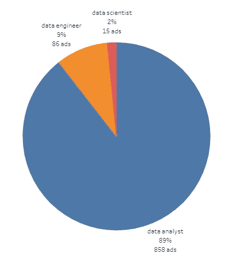
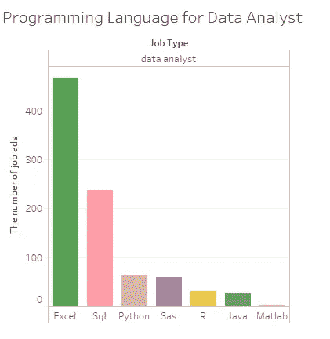
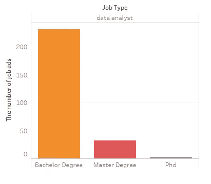
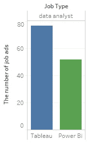
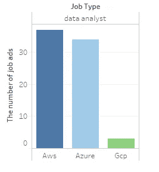
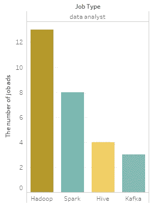
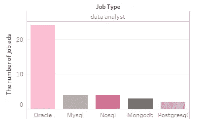

# 在悉尼做一名数据分析师需要什么技能

> 原文：<https://medium.com/analytics-vidhya/what-skills-are-required-to-be-a-data-analyst-in-sydney-c491283a4744?source=collection_archive---------19----------------------->

最近，我对数据分析产生了浓厚的兴趣。看了 Medium 上的一些帖子，我决定做一些项目来取乐。我注意到 Medium 上关于数据分析师/数据科学家的职位主要集中在美国/印度市场，因为这些国家有很多职位。我没有看到任何人对澳大利亚市场做了一些调查(你好，也是来自澳大利亚的读者)，尤其是在悉尼。

这篇文章是写给想在悉尼从事数据相关工作的初学者的，目的是给你一些指导。但请记住，这些数据会有偏差，因为所有数据都是从一个求职网站(seek)用自己的搜索引擎收集的。

我使用 Python 中的关键字搜索功能来查找某个子串，即搜索关键字“Python”是否存在于招聘广告的文本中。这意味着它可能会错过工作中提到的一些技能，因为程序将无法获得这些技能。

# 职位需求:

在悉尼，大部分与数据相关的工作都是数据分析师。令人惊讶是，也没有多少数据工程师需要。这可能是因为软件工程师、数据开发人员没有包括在样本中，因为所有样本都使用关键字“数据工程师”过滤掉了。我认为这值得在另一篇致力于数据工程师的文章中进一步研究。

与数据分析师相比，数据科学家是更高级的角色，因此我们可以看到，对这一角色的需求明显低于数据分析师。

因此，根据上述结果，我想说，如果你对 IT 或数据科学毫无经验，那么尝试找一份数据分析师的工作将是你在悉尼从事数据相关职业的一个很好的切入点。因此，下面的结果将侧重于成为数据分析师所需的技能。

# 所需的编程语言:

令人惊讶的是，悉尼的公司并不要求他们的申请人是 Python 大师，但他们确实希望他们的申请人知道如何使用 excel 和 SQL 命令，尤其是 excel，所以我要说学习如何使用 excel 解释数据和知道如何在 Excel 中创建宏是非常重要的。MATLAB 是数据科学家的常用工具，但在数据分析师就业市场上却不那么受欢迎。

# 要求的教育水平:

由于数据分析师更多的是数据相关工作的入门级工作，所以没有多少人需要硕士或博士学位。数据分析师招聘广告中提到最多的是学士学位。

有趣的是，在样本中，只有四分之一的人明确要求学位。这似乎表明雇主会要求应聘者具备一定的技能，而不仅仅是拥有学位。所以，如果你没有学位，也不要气馁。

# 所需的可视化工具:

Tableau 仍然是最受欢迎的可视化工具，而微软的 Power BI 稍微落后一些。

# 所需的云供应商:

学习和理解云服务并不是成为数据分析师的真正要求，但如果你已经掌握了上面提到的工具，并希望比你的竞争对手更有优势。学习这些东西总是好的，因为在你的职业生涯中，迟早你会开始使用这些云服务之一。对于数据分析师来说，亚马逊和微软似乎同样受欢迎，AWS 略微领先 Azure。我看到一些帖子说，GCP 可以很好地为个人做的小项目。但如果你想被一家公司录用，我会说在 AWS 和 Azure 之间选一个就好了。

# 所需的大数据工具:

虽然大数据在典型的数据分析师工作中不是必需的，但由于招聘广告中提到了大数据，所以了解你需要哪些其他技能来打动你的员工是很好的。Hadoop 和 Spark 脱颖而出。这并不奇怪，因为 Hadoop 和 Spark 是两个最受欢迎的大数据框架。

# 需要特定的 RDBMS:

对于 data analyst，虽然要求您知道如何使用 SQL，但使用哪种 RDBMS 并不重要。在 800 多份招聘广告中，只有 43 份提到了他们的名字。但如果真的需要选一个，我会说在 Oracle 和 MySQL 之间选一个。它们都是由 Oracle 开发的。MySQL 是免费开源的，Oracle DB 对有限的 RAM 和 CPU 是免费的。无论如何，它们都是可以互换的，因为它们都使用 SQL 来查询数据。

# 资源:

如果你感兴趣，这里有我的 [**Tableau 练习册**](https://public.tableau.com/views/DataRelatedJobsinSydney/JobRolesinDemand?:language=en&:display_count=y&:origin=viz_share_link) 的链接。

我还在 [**GitHub**](https://github.com/Common-Man-2077/SEEK_Job_Ads_Data_Scrapper#seek_job_ads_data_scrapper) 上分享了我用于从 Seek 获取工作信息的代码。

这是我做的第一个数据分析项目。我知道我还有很多方面可以改进。如果你有任何建议，请在评论中发表。我们很快会再见的。

# 未来研究/代码修改:

1.  了解数据工程师及其技能要求
2.  调查澳大利亚的地区(如维多利亚州、昆士兰州)是否以及如何影响数据分析师、数据科学家和数据工程师之间的比例

# 参考资料:

1.  [https://towards data science . com/I-was not-get-employed-as-a-data-scientist-so-I-seek-data-on-who-c 59 AFD 7d 56 f 5](https://towardsdatascience.com/i-wasnt-getting-hired-as-a-data-scientist-so-i-sought-data-on-who-is-c59afd7d56f5)
2.  https://towards data science . com/know-what-employees-expected-for-a-data-scientist-role-in-2020-65ad 68553 C4