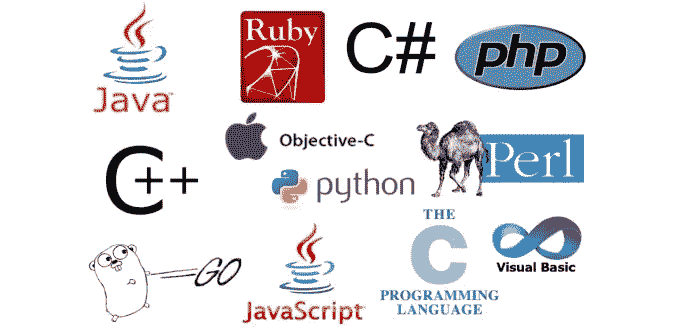
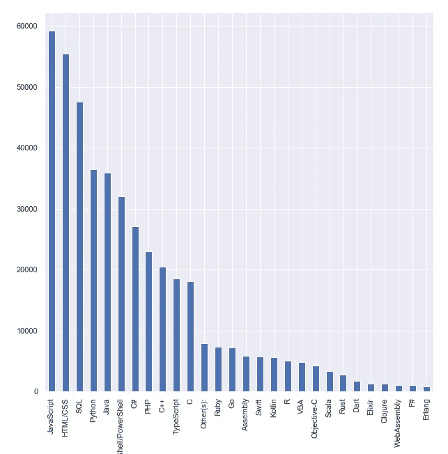
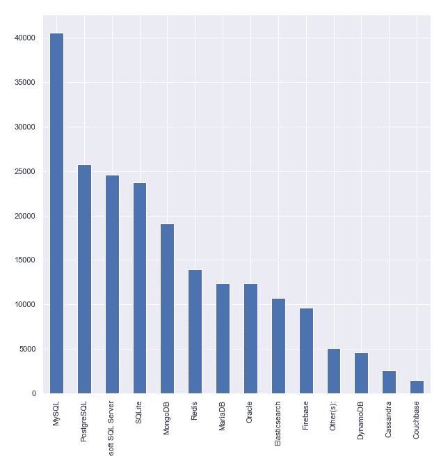
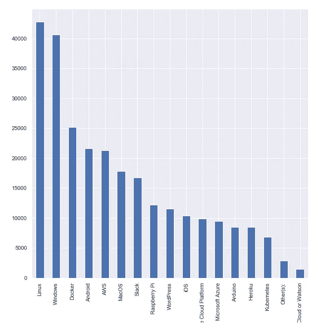
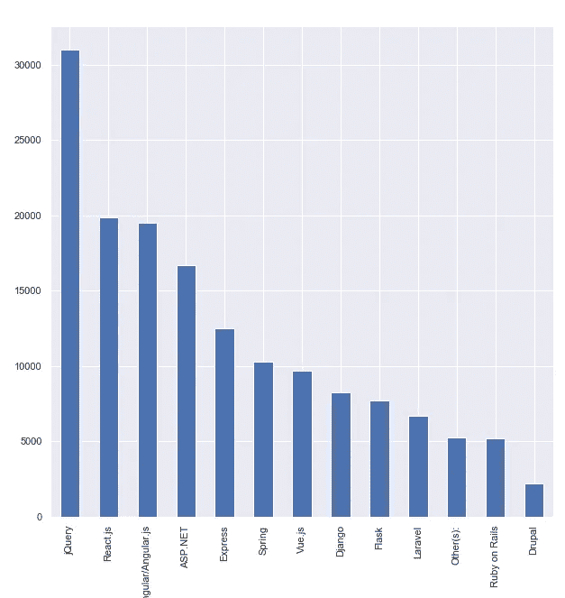
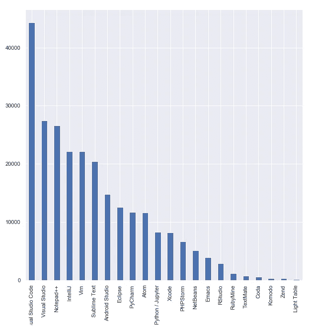
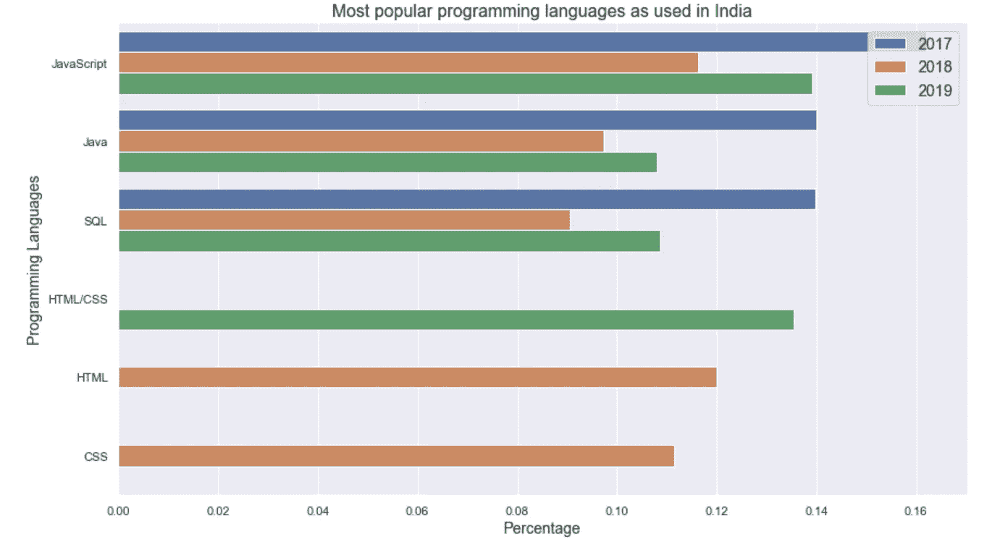
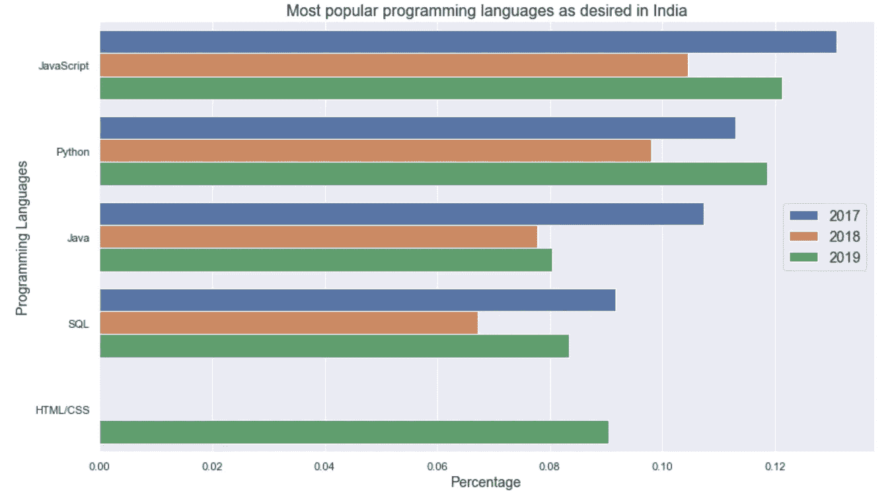
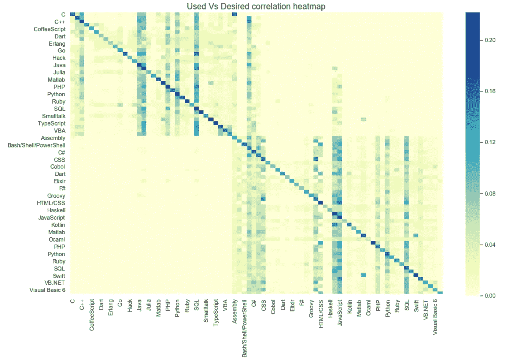
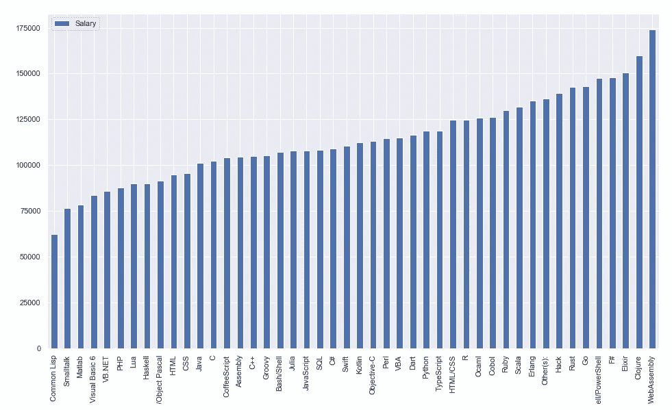

# 2020 年，我们应该学习(并帮助我们赚取)哪些技术和语言？

> 原文：<https://medium.com/analytics-vidhya/what-technologies-and-languages-should-we-learn-and-help-us-earn-in-2020-2adfa5716a5c?source=collection_archive---------24----------------------->

使用 stack overflow 2017 年、2018 年和 2019 年年度开发者调查数据进行的数据分析。

图片来源:[http://webartma . com/WP-content/uploads/2018/06/programming-language . jpg](http://webartma.com/wp-content/uploads/2018/06/programming-language.jpg)

# 介绍

我就是这样一个在软件行业呆了 15 年的人。身处世界上最具活力的行业之一，我见证了几起几落，在相当多的技术领域工作过，当然，也和我的朋友无数次地讨论过这个话题。然而，为什么我们不能再一次讨论一下这个行业的趋势呢？

然而，本文试图以稍微不同的方式回答这个问题。这里肯定不是我想的那样。确切地说，答案取决于世界各地的人们对 T2 的看法。

因此，从由 [Stackoverflow](https://stackoverflow.com/) 进行的[年度开发者调查](https://insights.stackoverflow.com/survey/)中选择数据似乎是恰当和明智的。Stackoverflow 通过他们的调查，每年收集来自全球 170 多个国家的 80，000 多份回复。因此，对这些数据的分析应该能够捕捉到行业的趋势。

# 2019 年全球最常用的编程语言、数据库、平台、框架和工具有哪些？

在这里，我正在检查 2019 年以来的全球数据。

让我们看看…

2019 年常用语言

2019 年常用数据库

2019 年常用平台

2019 年常用框架

2019 年常用的开发环境

正如我们自己所看到的，

a.**最常用的 5 种编程语言、标记语言和脚本**是 JavaScript、HTML/CSS、SQL、Python、Java

b.**最常用的五大数据库**是 MySql、PostgreSql、Microsoft SQL Server、SQLite、MongoDB

c.**最常用的五大平台**是 Linux、Windows、Docker、Android 和 AWS

d.**最常用的 5 个框架**分别是 jQuery、React.js、Angular.js、ASP.NET、Express

e.**最常用的五种开发工具**是 Visual Studio 代码、Visual Studio、Notepad++、IntelliJ、Vim

此外，几乎没有更多值得注意的趋势。

Web 技术，例如 JavaScript、jQuery、React.js 等。与 Java 或 C++等服务器端语言相比，更受欢迎。

Visual Studio 是最受欢迎的开发工具。然而，微软的任何语言都不在最常用的五种编程语言之列。

到目前为止，我们已经看到了全球趋势。然而，因为我来自印度，所以开发印度市场似乎也是谨慎的。

# 印度最流行的编程语言是什么？

在这里，我正在检查印度过去三年的数据，也就是说，从 2017 年到 2019 年。

在印度， **JavaScript，Java，SQL，HTML/CSS** 在业界相当流行。正如我们所看到的， **python** 也正在非常迅速地流行起来。

正如相关热图中的斜线所示，人们希望继续学习他们在工作中使用的语言。

此外，热图矩阵的左上角和右下角显示，使用特定领域编程语言的人通常希望学习与该领域相关的编程语言。例如，从事 C 语言工作的人可能会学习 C++，反之亦然。

# 每种编程语言平均挣多少工资？

这无疑是我们职业生涯中有趣的一面。财务方面有时确实会影响我们的选择。

在这里，我正在检查过去 3 年的全球数据，这意味着从 2017 年到 2019 年。

平均工资与语言图

这个情节挺有意思的，是不是？从收入的角度来看，这个特殊的情节指向了“最好拥有”的利基技能。

**收入前 5 的**分别是 WebAssembly、Clojure、Elixir、F#、Bash/Shell/PowerShell。

无论是在全球还是在印度，最常用或最受欢迎的语言都不在收入最高的 5 种语言之列。事实上，超过 50%的语言的平均工资高于 JavaScript。

事实上，不太为人所知或使用的语言可能会获得更高的薪水。

# 结论

我们已经看到了技术和工资方面的全球趋势。在印度市场，我们也看到了当地语言趋势。

如果我们已经在研究这些热门或小众技术，那么我们可以在 2020 年愉快地继续这样做。

否则，正如人们所说的“迟到总比不到好”，我们可以随时拉起袜子，尝试重新训练自己。

# 参考

来自 Stackoverflow 的年度开发者调查

[Github 储存库](https://github.com/tanmoybanerjee2003/dataScience/tree/master/Project4)包含用于这些分析的 Jupyter 笔记本