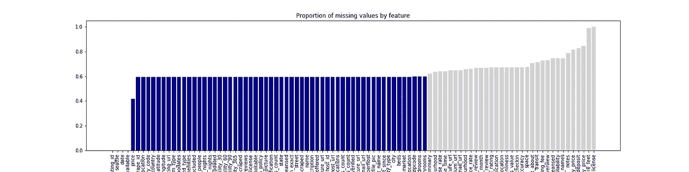
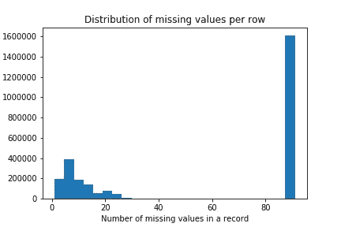
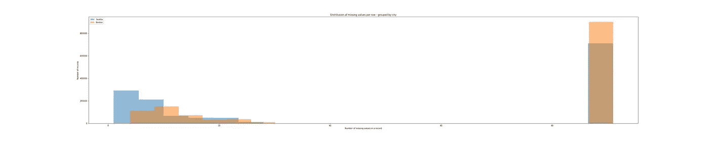
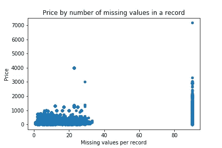
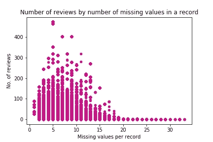
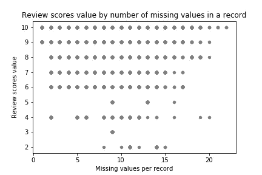
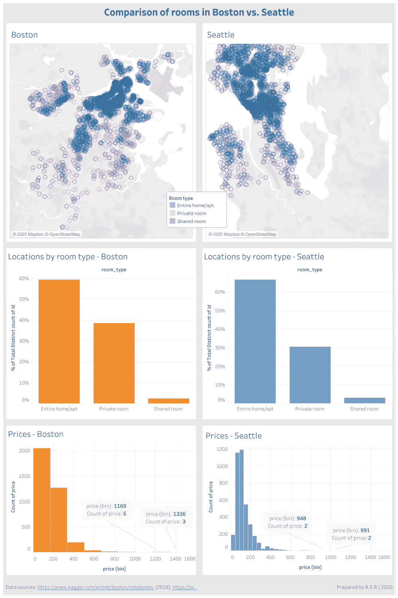
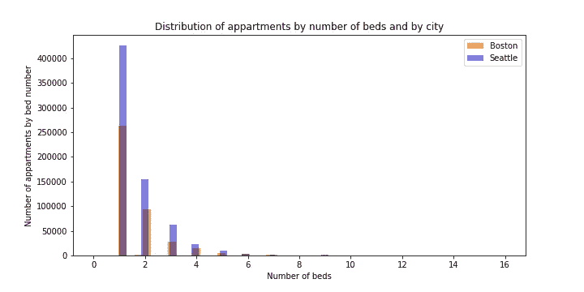
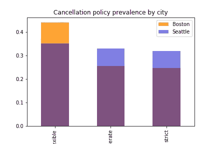
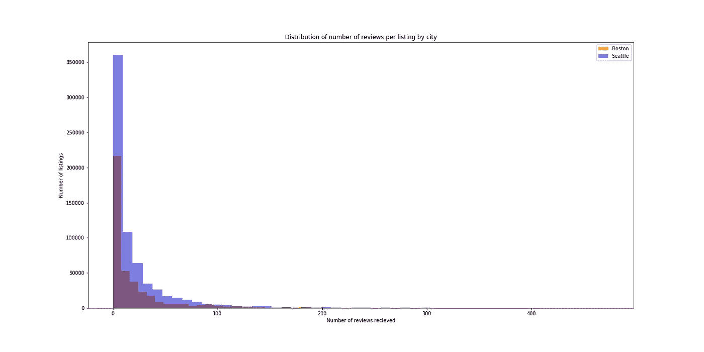

# 数据的缺失能告诉我们关于 Airbnb 的什么

> 原文：<https://medium.com/analytics-vidhya/what-the-absence-of-data-can-tell-us-about-airbnb-36895129ecce?source=collection_archive---------16----------------------->

## 通过信息量、住宿类型和价格对波士顿和西雅图 Airbnbs 进行数据驱动的比较

图片由作者通过 Freepik 和 Pixabay 基于[西雅图](https://www.freepik.com/premium-photo/seattle-cityscape-early-monring-autumn_4224396.htm)和[波士顿](https://pixabay.com/photos/boston-usa-america-travel-holidays-1921731/)的照片制作

# *为什么相关？*

在我的家乡布达佩斯，一个中欧国家的首都，正在出现一场关于更严格控制短期住宿租赁的公开辩论。一方面，主要由 Airbnb 推动的不断扩大的短期租赁市场被认为是房屋价格大幅上涨的主要驱动因素。因此，它导致了当前的房地产危机。另一方面，短期内以更高的价格出租公寓/房间是中上层阶级的一个重要收入来源——至少可以这么认为，这是基于一些利益相关者的强烈反对。

“从街道到公寓——而不是进监狱”。布达佩斯限制短期租房的示威游行。照片由 Júlia Halász 通过 [444.hu](https://kepek.444.hu/2019/10/06/airbnb-takarodj-a-lakhatas-alapjog-a-berloi-generacio-tuntetett-budapesten)

由于负责任的政策决定需要对要监管的领域和所考虑措施的影响分析有充分的了解，因此对所掌握的数据进行总体评估可能是分析的合理起点。然而，Airbnb 还没有发布布达佩斯房源的数据。为了至少评估 Airbnb 收集和有时分享的数据的性质，我求助于其他城市的可用数据集。

我重点回答了以下几个问题:

> ***1。有哪些关于出租公寓的信息被分享*** ？不同城市的可用信息集是否存在重大差异？
> 
> **2。** 主持人分享更多 信息是否有利于 ***？***
> 
> ***3。*** 两个相似城市的 报价有显著的 ***差异吗？***

# 哪些数据可用，哪些数据缺失？

我利用了 Kaggle 管理的两个美国城市的 Airbnb 数据:马萨诸塞州的波士顿和华盛顿州的 T2。

在相应的数据集中，涵盖了三个领域:

*   **列表**:提供住宿的描述以及平均点评分数
*   **评论**:带有唯一评论者 id 的详细评论
*   **日历**:按列表显示每天的价格和可用性

我决定把重点放在上市数据上，因为事实证明这足以让我有一个大致的了解。

列表数据集中总共有 95 个可用特征(波士顿的 3 个附加特征到西雅图的 92 个)，评论集中有 5 个附加特征，日历集中有 3 个附加特征。去掉波士顿的 3 个额外要素后，最终的联合数据集由 95 个要素和 2，704，024 条记录组成。51.55%的记录属于西雅图，而 48.45%属于波士顿。数据集的构成相对平衡。

数据集中所有要素的缺失值所占的比例(保留用于以后分析的部分)用蓝色标记

虽然 Airbnb 收集和分享的功能范围很广，但大多数功能仅在不到一半的记录中可用。每个记录只有 95 个特征中的 **4 个可用。除了“Seattle”(标记记录的来源)这一附加特性之外，只有列表 ID、日期和可用性是完全完整的，如上图所示。**

按每条记录缺失值的数量划分的记录数

在 270 万条记录中，大约有一半只包含一半特征的值(见上文)。

在两个城市之间，每个记录的缺失值的分布有明显的差异。例如，西雅图数据集中的**比例较大，其中**包含每条记录的**全部或**几乎全部特征**(在下面的直方图中用蓝色标记)。相比之下，波士顿数据集(下面用橙色标记)显然有更多几乎没有填写任何值的记录。**

按每条记录缺失值的数量分布记录-橙色表示波士顿，蓝色表示西雅图

> ***1。***
> 
> →总而言之，**西雅图列表的记录平均包含比波士顿列表更广泛的信息**。虽然没有进一步分析潜在原因，但这些原因可能包括主持人的不同专业程度、潜在客人感兴趣的不同体验以及客人的不同反馈意愿等。

# 值得分享 Airbnb 上的所有信息吗？

我计算了每条记录中缺失数据的数量，并将其与可以算作主机正面结果的输出进行了比较:

*   更高的价格——即使只有在住宿最终被客人租用的情况下，这对主人才有好处
*   更多的评论——假设更多的评论意味着住宿被租得更频繁
*   更好的复习成绩。

价值缺失的程度和相应的价格没有清晰的模式。有趣的是，最高价格属于几乎不包含任何信息的列表。

相比之下，收到的评论数量显示出与每条记录缺失值的数量之间的某种关系，尽管只是直观地观察。超过 cca 的记录**。** **35 个特征缺失**(出 cca。95) **没有收到任何评论**。然而，在 Airbnb 上填写每一个标题来获得创纪录的评论数量似乎并不重要。

如果不考虑 Airbnb 点评的评分机制，对于缺失值超过 25 个左右的房源，似乎**没有点评分数。在 Airbnb 平台上填写大多数标题当然不能保证避免差评(平均得分值为 2/10)。**

> 2.
> 
> →几乎不可能收到很多功能缺失的列表的评论**。但是，我们不知道数据集中缺少某些要素的原因是什么。即，这些值可能从平台本身中丢失或者仅在数据检索中丢失。**

# **西雅图和波士顿的 Airbnb 优惠有什么大的区别吗？**

**观察波士顿和西雅图不同类型房间的地理分布，可以评估出一些差异:**

*   **西雅图的包间比例比波士顿小(约 30%比 40%)。**
*   **在波士顿的情况下，整栋房屋/公寓的可用性更集中在市中心，而在西雅图的情况下，不太集中在市中心。**
*   **对波斯顿来说，私人房间在城市的外围区域最为普遍，而对西雅图来说，外围区域有类似数量的完整住宅/公寓和私人房间。**

****

**[点击此处进入交互式 Tableau 仪表盘](https://public.tableau.com/shared/8T2GCW24T?:display_count=y&:origin=viz_share_link)**

*   **就价格而言，波士顿似乎比西雅图更贵——就最贵的房间(1336 美元对 991 美元)和 200-400 美元价格区间的报价数量而言(见上图)。**

****

**西雅图为所有床号类别提供了更多的房间。各城市的类别比例没有明显差异。**

****

**波士顿比西雅图提供更大比例的灵活取消政策的房间。**

****

**在波士顿和西雅图之间，不同列表收到的评论数量的分布没有明显差异。**

> *****3。*****
> 
> **→波士顿和西雅图的 Airbnb 报价之间的主要差异是**不同类型房间的地理分布、私人房间的比例以及价格**。**

# **下一步是什么？**

**为一个正在考虑短期租赁新法规的城市评估 Airbnb 数据，可能有助于决策者了解短期租赁实践的数量、时间和地理分布以及房地产构成。尽管此类数据只能支持对该领域的部分了解，但它可以为其他信息来源提供附加值，如官方房地产登记、一次性调查或公开听证会。**

**因此，对于与布达佩斯打交道的监管机构来说，从 Airbnb 或抓取特定领域的共享经济/短期租赁平台请求本地数据是一个相当大的步骤。**