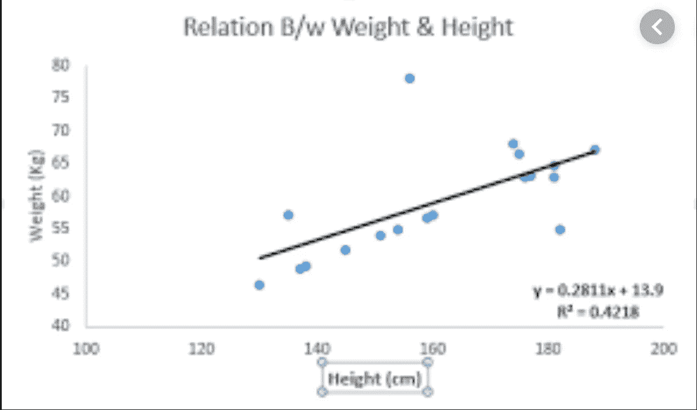
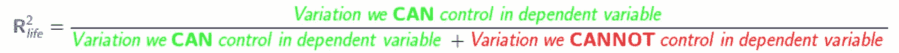
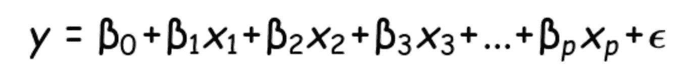
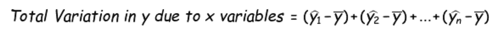
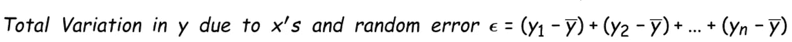
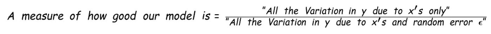

# 数学对 2019 年的生活、努力和失败的预测…

> 原文：<https://medium.com/analytics-vidhya/what-the-math-says-about-life-effort-and-failure-in-2019-2a8ef4df0ce6?source=collection_archive---------20----------------------->

随着这一年(或者更戏剧性的是“十年”)接近尾声，你可能会问自己，过去的一年/十年对你来说是积极的还是消极的。一堆低谷可能会浮现在脑海中，让你沮丧，只有在你感到欢欣鼓舞的时候(希望不止几个)才能得到安慰:你可能成绩很差，被梦想中的学校/实习/工作拒绝，或者错过了升职机会。你甚至可能被一个浪漫的兴趣所忽略！同样，你可能找到了新的激情(对我来说是舞蹈、瑜伽/健身)，达到了一个里程碑(毕业)，甚至在未知的领域开始了新的冒险(对我来说是研究生院/芝加哥)。尽管有积极的一面，你可能会发现自己一直纠结于所有的“失败”。

然而，我想和你分享一个更具分析灵感的看待成功的方法——使用回归的统计技术。

“现代”在 2019 年前后的回归

我们大多数人都熟悉回归模型——通过点拟合直线，希望预测未来——我们的穴居人祖先可能在他们永无止境的寻找下一个野牛群的过程中尝试过这种活动。

回归模型约公元前 10，000 年

在评估回归模型的'*'*成功程度时，我们经常使用一种叫做 R 的度量标准(如下图所示)，而**更喜欢 R 较高的模型，而不是 R 较低的模型。**

R 如何应用到生活中？

这是有哲学倾向的穴居人的笑点:

> 在生活中(就像在回归中一样)，我们不应该衡量我们成功/失败的频率(“y”因变量)，我们应该尝试最大化我们的 R 值:“使用我们控制的因素，我们能够影响多少因变量？”

这如何适用于我们在生活中的某个时刻都做过的事情(和害怕的事情)**——准备考试？**

我们应该根据*我们能够控制的变量中有多少是我们实际控制的*，而不是根据我们考试的分数来决定我们是成功还是失败:

*   我们是否花了足够的时间阅读课本？**(可以控制)**
*   我们至少试着解决了一些家庭作业的问题了吗？**(可以控制)**
*   我们没有在演讲厅的前排睡着吗(就像我经常做的那样)？**(能控制** —这个值得商榷)；)
*   我们走的是安全路线而不是危险路线吗？**(可以控制)**
*   教授决定在考试中问的问题有多难？**(无法控制)**
*   其他人的表现如何？**(无法控制)**
*   上课路上是否下雨，你的计算器是否出现故障**(无法控制)**

在这十年即将结束之际，我想给你们留下这样一条信息:一个人的成功/失败与他能够影响他所控制的因素的程度成正比，而不是他的最终结果。所以，在生活中要经常增加你的 R。:)

— — — — — — — — — — — — — — — — — — — — — — — — — —

数学上复杂的穴居人的(可选)统计脚注。回归故事分为四个要点:

*   我们试图用独立变量(今天的温度、天空中的云量、附近的草量等)来*预测一个因变量*(牛群中野牛的数量)*。)*
*   我们假设世界以如下方式运行:

y 是因变量(牛群中野牛的数量)；β是固定的，x 是可变的独立变量(阳光、温度等)。);吱吱叫的“e”是一些随机的量

*   只有一些“高等生物”(神圣实体、外星人等)*知道真正的β值是什么*，随机的‘e’项将取什么值，并以此来决定一群中有多少头野牛。不幸的是，那些高等生物并不特别同意与我们分享这些价值观。幸运的是，我们部落的牧师/萨满/德鲁伊能够使用一些魔法并估计测试版。
*   因为因变量会因为两个原因而变化:(1)x 值的变化；(2)“e”项的变化，一个强模型应该能够将*“y 变量中尽可能多的变化归因于 x 变量中的变化”*。数学上:

上面有一条线的 y 是 y 的平均值，上面有一个“帽子”的 y 是我们用 x 变量预测的值

上面没有帽子的 y 是因变量的实际值，上面有一条线的 y 是 y 的平均值(和前面一样)

这个数字越高，我们的 bison 预测模型就越有用(称为 R 或决定系数)