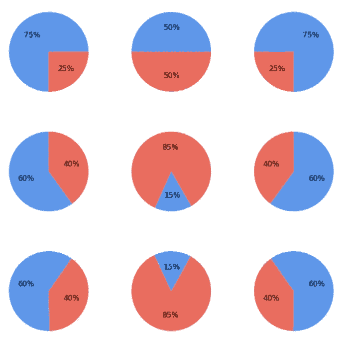

# 绘制饼图时需要考虑什么

> 原文：<https://medium.com/analytics-vidhya/what-to-consider-when-drawing-pie-charts-9aec93bc540b?source=collection_archive---------35----------------------->

## 探索饼图及其在数据可视化中的位置

饼状图—作者图片

你可能听过很多不使用饼图的理由。缺乏精确性、难以阅读的角度、可扩展性限制和油墨比例是最常提到的一些问题。