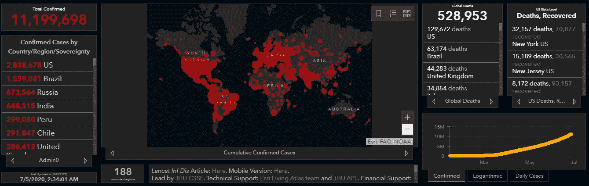
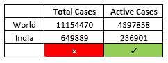
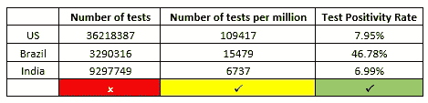
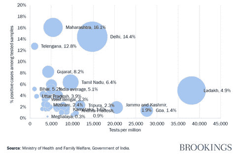
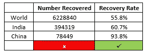
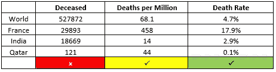
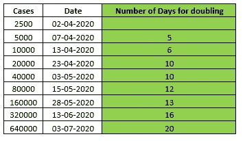
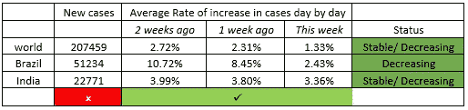
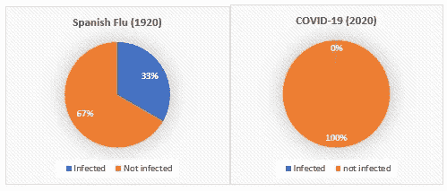

# 从这些数字中能看出什么？

> 原文：<https://medium.com/analytics-vidhya/what-to-see-in-those-numbers-3160d25576f9?source=collection_archive---------18----------------------->

约翰·霍普斯金·新冠肺炎跟踪仪表板的快照

数字是稳健的，但也有很大的欺骗性。它们旨在让我们摆脱词语的歧义，并提出令人信服的理由来加强任何论点。他们可以说一千件事。这完全取决于我们选择如何看待它们。从政治家到会计师，每个人都用数字来传播他们的观点。你可以让这些号码说任何你想说的话——你也可以选择听你想听的东西。

在当前冠状病毒危机的背景下，数字的这种属性是高度焦虑的来源。这篇文章旨在对这些数字提供一些见解，以引起更多的理性和更少的恐慌——阐明什么该关心，什么不该关心。

***例数***

所有显示新冠肺炎统计数据的网站都以“总病例数”为第一计数。除了灌输恐惧，这个参数没有任何用处。**活动性病人**要隔离治疗**会传播疾病**。更有意义的是跟踪一个国家/地区活跃病例的变化，而不是病例总数。

***测试***

我们经常根据国家进行的测试数量对它们进行排名。同样，这没有意义。检验检测是否合理的一个方法是该国每百万人口中检测的数量。然而，这对像印度这样人口众多的国家来说是一个挑战。无论测试增加多少，**每百万测试次数**都需要很长时间来提高。因此，只要这个数字持续大幅上升，就是进步。

**测试环境中最合适的指标是测试阳性率**，即每 100 个测试样本中测试阳性的样本数。如果此指示器处于选中状态，则病毒处于选中状态。当然，这是假设被测试的是正确的人群。例如，如果政府决定检测与病毒直接接触的人(医务人员、患者的接触者等)。)，阳性率可以提供准确的图像。但是如果另一个政府决定测试除他们之外的所有人，那就不准确了。根据阳性率，巴西可能成为第一个实现群体免疫的国家。

图片来源:[布鲁金斯](https://www.brookings.edu/)和[印度卫生和家庭福利部](https://www.mohfw.gov.in/)

这里有一张图是印度的邦级分类。像特伦甘纳邦、马哈拉施特拉邦和德里这样的邦非常令人担忧。他们进行了低数量的百万分之一测试(由于人口)，他们的测试阳性率要高得多。如果没有适当的缓解措施，局势可能会失控。

**复苏和死亡**

康复病人的数量没有任何意义，但是**康复率**是衡量疫情进程的最关键指标之一。这是被**感染的**人痊愈的百分比。回收率的提高意义重大。显而易见，接近 100%的治愈率标志着我们对抗病毒的胜利(如果人们正在死亡，我们不可能达到 100%的治愈率)

同样，死亡人数只会给旁观者带来焦虑。百万分之死亡人数是一个更好的指标，但这可能被掩盖了。同样，人口是使用这一指标的一个不利因素。因此，最好的参数是**死亡率**——死于该疾病的受感染人口的百分比。法国的死亡率最高，每 100 名感染人群中有 17 名患者死亡(*这可能意味着法国没有进行充分的检测——高死亡率可能意味着更脆弱的人群或阳性病例识别不足*)。卡塔尔的死亡率最低，每 1000 名感染者中有 1 人死于该病毒。

**加倍率**

检查疾病传播的最关键指标之一，**倍增率**。新冠肺炎是一种传染性疾病。双倍率意味着一个感染者将病毒传播给另一个感染者的速度。倍增率的增加非常令人放心。牢记在心；它不是线性的(从 10 增加到 20 并不等于从 20 增加到 30)

**每天新增病例**

随着各国放松封锁，我们看到大多数地方的病例激增。这些数字可能看起来很吓人，但要寻找的指标是病例数量的每日增长率，即与前一天相比新病例数量的百分比变化。只要它在减少或稳定，病毒就在控制之中(因为它是一种传染病)。上升的速度令人担忧，因为这是失去控制的迹象。

**在印度搬运-床和更多**

根据 2011 年世卫组织统计，印度每千人拥有 0.7 张病床，相当于印度总病床数约 100 万张。医院病床的最高占用率约为 80%，这意味着有 20 万张病床处于闲置状态。在 240 万活跃冠状病毒病例和 75%的患者在家康复的情况下，仅通过使用标准过剩产能，印度仍有约 140 万张床位的杠杆作用(这仍处于 2011 年的水平——过去几年取得了很大进展)。到目前为止，印度一直在平衡恢复病例和新病例的数量。这是曲线变平的标志——仍然不是平的。如果这种平衡持续下去，就有更大的胜算。

一个大问题 -在全国范围内，这可能看起来在控制之中，但在地区层面，一些地方正处于困境之中。当医院人满为患的视频从意大利传出时，它集中在伦巴第(米兰)地区。同样，像印度的德里和孟买这样的大都市已经面临这个问题。医院人满为患，当局开始感到无能为力。再加上一些州政府使用“较少的测试意味着较少的案例”这样的策略，使得情况的处理更加复杂。

*引人注目的*——我们都听说了喀拉拉邦是如何处理这一局面的。然而，一个不被看好的大都市却很好地控制了病毒——本加卢鲁。印度的 IT 之都在接触追踪和使用分析控制传播方面非常有效。在早期，当局跟踪当地药店和药房，以找出谁在购买仿制药(如扑热息痛)并对其进行测试。在过去的几天里，本加卢鲁看到了从不同地方回来工作的人的涌入，因此，病例激增。然而，Bengaluru 的故事是了不起的。

*更多好消息:*印度现在能够每天进行大约 25 万次测试。它在生产个人防护用品方面已经变得自力更生(事实上已经过剩)。恢复率已超过 60%(世界上最快的恢复率之一)。

**与早期大流行的比较**

在过去的几个月里，我们看到了太多的社交媒体帖子对比过去几个世纪的大流行——这并不准确。在这几十年里，人类在医学、通讯和外交领域取得了长足的进步。要了解更全面的情况，请看下面的图表。令人欣慰的是，疫情仍未结束，数字可能会发生变化。然而，现在已经不是二十世纪了。准确地说，到目前为止，新冠肺炎感染了世界人口的 0.16%，我们可以控制这一数字。现在下结论还为时过早，因为第二波西班牙流感更加致命——CoVID 的第二波仍在预期之中。

为了**收尾**，我们需要记住，只有人类团结一致，才能战胜当前的冠状病毒危机。我们不能忘记，每个人都是第一次面对这个问题。领导人、政府、科学家、父母和千禧一代都是如此。犯错是可能的，决策也可能出错，但我们只有努力才能战胜它。我们可以通过保持谨慎，传播正确的信息，减少恐慌，压力和焦虑，互相支持来尽自己的一份力量。

> 让你想起三年级。**“团结则存，分裂则亡”——**虽然不忘保持社交距离，保持安全！