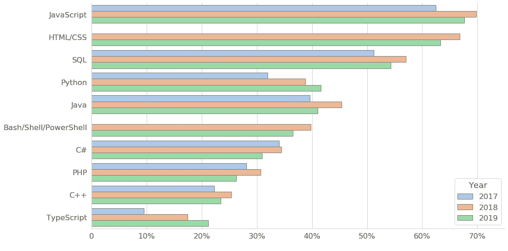
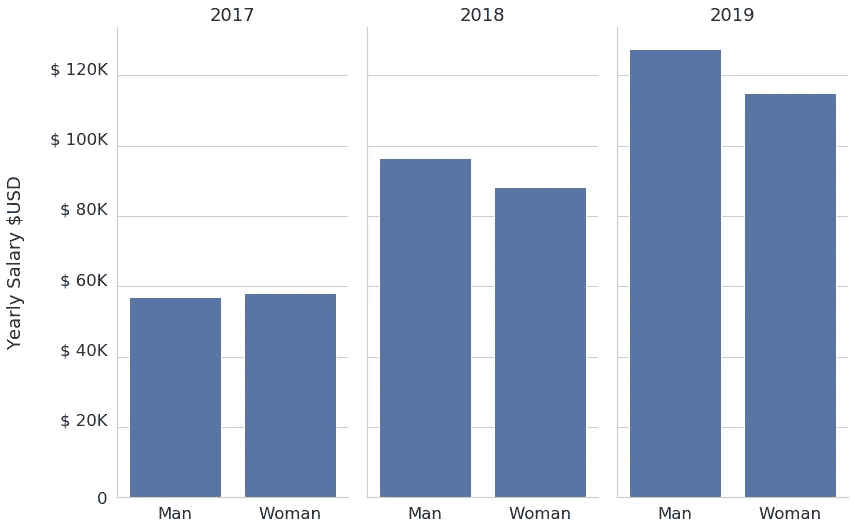
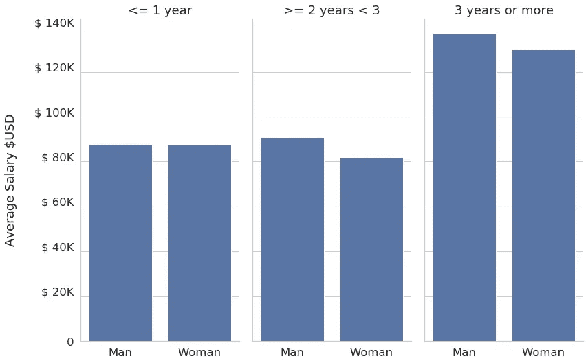
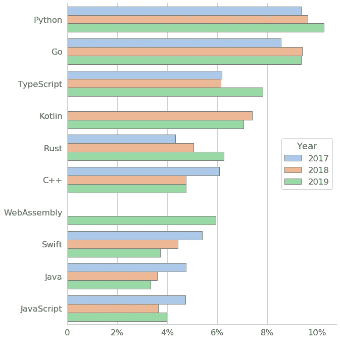
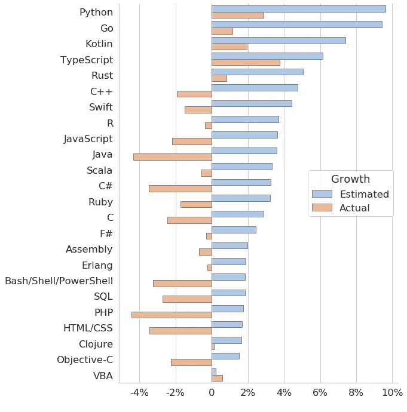

# 根据栈溢出开发人员调查，我们可以从技术中学到什么？

> 原文：<https://medium.com/analytics-vidhya/what-we-could-learn-about-technology-based-on-stack-overflow-developer-survey-da40583a47d3?source=collection_archive---------20----------------------->

从堆栈溢出[位置](https://insights.stackoverflow.com/survey/2019)

每到年底，我们都在想下一年我们要做什么，我们将开始学习哪些新技术。

在这篇文章中，我将分享过去三次堆栈溢出开发者调查的一些见解。也许有些东西会对你有所帮助，或者让你想起一个关于这个数据集的问题。

*   年度十大技术
*   平等:工资如何与性别相关？
*   学习新技术的愿望是一项技术在下一年发展的良好指标吗？

# 年度十大技术:

自 2017 年以来，超过 60%的受访者使用 JavaScript 工作。SQL 和 HTML 也起着必不可少的作用，超过 50%。

2019 年，前三大技术简单地向我们展示了网络是基础的东西。即使在今天，每分钟都有新的 JavaScript 框架诞生，JavaScript、HTML/CSS 和 SQL 仍然是 web 的基础，并将长期存在。

图 1:每年的顶级技术

还有，今年 Python 正式打败了 Java。差距很小，大约 41.6%的人使用 Python，而 41%的人使用 Java。

考虑到 Python 在机器学习和数据科学中的应用，这种增长并不令人惊讶。Java 仍然存在，而且将会存在很长一段时间，但是今年，它就不那么好了。

继 Java 之后，我们有了 Bash/Shell/PowerShell。同样，这并不奇怪，因为终端是构建、部署和其他开发任务的入口点。最后两件事是:PHP 的使用正在减少，而 TypeScript 的增长可能与其他使用 Typescript 的 web 框架有关，如 React 和 Vue。

# 平等:工资如何与性别相关？

无论我们谈论哪个国家或领域，平等都是一个挑战。可悲的是，在性别方面，我们无法详细分析。其他性别的回答很少，问的问题，允许多选。有些答案我们不能代表特定的性别，比如谁回答了“男性、女性、跨性别者、其他”。在这项分析中，我们只考虑男性或女性受访者。

考虑到所有的受访者，我们可以看到男女工资的差异。除了 2017 年，所有年份男性的平均工资都高于女性。但如果详细分析，2017 年的工资数据非常乱。这也是回答较少的一年:大约 25%的人回答了这个问题。最终只有 819 个女性的回答；这个带有一些异常值的事实可以解释今年的结果。

图 2:平均年薪和性别

另一个可能的形象是工资差距——与工作年限相关。

图 3:不同工作经验和性别的平均工资

在今年的调查中，一年或一年以下的开发人员，工资差距几乎为零。两年或者三年或者更久，这个差距更大。

# 学习新技术的愿望是一项技术在下一年发展的良好指标吗？

为了解决这个问题，我们考虑一种新技术，如果开发者在 2018 年回答希望在下一年使用该技术。

与去年相比，被引用次数最多的五大技术实际上都有所增长。2018 年，有 9.62%的人回应说有和 Python 合作的愿望。今年 Python 有约 2.86%的涨幅。TypeScript 和 Go 分别增长了 3.75%和 1.16%。

图 4:每年最受欢迎的 10 种语言

增长的总量有很大的变化。还有一个有趣的点:当预期增长高于 5%时，涨幅得到了确认。在许多情况下，当预测的增长超过 4%时，实际上技术在减少(HTML、Java 等等)。

图 5:考虑 2018 年和 2019 年的实际增长与估计增长

# 结论:

Python 似乎是一种很好的编程语言，和 web 技术一起学习。

仅仅通过这项研究很难精确衡量工资差距。最终的数据已经经过了一些归一化的步骤，存在一些由异常值引起的误差。在今年的研究中，我们可以看到男女之间的差异。按角色和国家进一步研究可能会改进我们的结论。

考虑到 2019 年的调查结果，预计 2020 年 Python (10.27%)、Go 9.35%、TypeScript (7.83%)、kot Lin(7.1%)、Rust (6.28%)和 WebAssembly (5.95%)将会增长。

***对于这个数据你还有其他问题吗？***

代码的链接可以在[这里](https://github.com/brunowdev/stackoverflow)找到。